# StockData.Net

**A comprehensive C# .NET wrapper for Yahoo Finance data with Model Context Protocol (MCP) server support for AI assistants.**

StockData.Net provides developers with a clean, type-safe interface to access financial market data. Use it as a standalone library in your .NET applications or deploy it as an MCP server to integrate Yahoo Finance data directly with GitHub Copilot, Claude, VS Code, and other AI assistants.

**Last Updated:** 2026-02-28

---

## Table of Contents

- [Key Features](#key-features)
- [Architecture Overview](#architecture-overview)
- [Project Status](#project-status)
- [Quick Start](#quick-start)
- [Installation and Setup](#installation-and-setup)
- [Deployment and Versioning](#deployment-and-versioning)
- [Add MCP Server to VS Code](#add-mcp-server-to-vs-code)
- [Usage Examples](#usage-examples)
- [Project Structure](#project-structure)
- [Testing](#testing)
- [Architecture & Design](#architecture--design)
- [Security](#security)
- [Features Overview](#features-overview)
- [Contributing](#contributing)
- [License](#license)
- [Disclaimer](#disclaimer)

---

## Key Features

- **📊 Comprehensive Financial Data**
  - Historical stock prices (OHLCV) with customizable periods and intervals
  - Real-time stock information and metrics
  - Financial statements (income statement, balance sheet, cash flow - annual & quarterly)
  - Options data (chains, expiration dates)
  - Holder information (institutional, mutual funds, insiders)
  - Analyst recommendations and upgrades/downgrades
  - Stock actions (dividends and splits)
  - Market news and articles

- **🤖 AI-Ready MCP Server**
  - Model Context Protocol (MCP) server for seamless AI assistant integration
  - Works with GitHub Copilot, Claude Desktop, VS Code, and compatible platforms
  - Exposes all financial data access through a standardized JSON-RPC interface
  - Perfect for building AI-assisted financial analysis tools

- **📦 Multi-Provider Architecture**
  - **StockData.Net Library**: Standalone, reusable wrapper around Yahoo Finance API
  - **MCP Server**: Separate layer for AI assistant integration
  - Use the library independently in any .NET application
  - Deploy the MCP server to enable AI access to financial data

- **💪 Built for Resilience**
  - Automatic Yahoo Finance session cookie and crumb token management
  - Comprehensive error handling with clear messaging
  - Async/await support for non-blocking I/O
  - Support for multiple data periods and intervals
  - Handles edge cases gracefully

- **🔒 Type-Safe & Secure**
  - Strong C# typing throughout
  - Dependency injection patterns
  - No exposed credentials or secrets in code
  - Follows security best practices for API key handling

---

## Architecture Overview

StockData.Net follows a **clean, layered architecture** separating concerns between the data access library and the MCP server integration:

```mermaid
graph TD
    A["AI Assistants & Applications<br/>(GitHub Copilot, Claude, VS Code, .NET App)"]
    B["StockData.Net.McpServer<br/>(Layer 2)<br/>• MCP Protocol Implementation<br/>• Tool Registration & Parameter Handling"]
    C["StockData.Net Library<br/>(Layer 1)<br/>• Yahoo Finance API Wrapper<br/>• HTTP Client Management<br/>• Data Models & Serialization"]
    D["Yahoo Finance Public API<br/>• Historical Data<br/>• Real-time Info & Quotes<br/>• Financial Statements & Options"]
    
    A -->|MCP JSON-RPC| B
    A -->|Direct Use| C
    B --> C
    C --> D
```



**Design Benefits:**
- ✅ **Separation of Concerns** - Library is independent of MCP protocol
- ✅ **Reusability** - Use the library anywhere without MCP dependencies
- ✅ **Testability** - Each layer can be tested independently
- ✅ **Maintainability** - Clear boundaries between functionality

---

## Project Status

| Aspect | Status |
|--------|--------|
| **Phase Completion** | ✅ Phases 1-3 Complete |
| **Test Status** | ✅ 82+ Tests Passing |
| **Security Grade** | ✅ A- Grade |
| **Build Status** | ✅ Compiling Successfully |
| **Documentation** | ✅ Comprehensive |

**Delivery Milestones:**
- ✅ Phase 1: Core library implementation with Yahoo Finance wrapper
- ✅ Phase 2: MCP server implementation with tool integration
- ✅ Phase 3: Comprehensive testing (unit, integration, MCP tests) and security review
- All tests passing with no warnings or errors

---

## Quick Start

Choose the integration method that best fits your needs:

### Option 1: Using as MCP Server with AI Assistants

**Perfect for:** Getting financial data access in GitHub Copilot, Claude, VS Code, etc.

1. **Clone and build the repository:**
   ```bash
   git clone <repository-url>
   cd FinanceMCP
   dotnet build
   ```

2. **Configure with VS Code:**
   
   Add to your VS Code `settings.json`:
   ```json
   {
     "github.copilot.chat.mcp.servers": {
       "yahoo-finance": {
         "command": "dotnet",
         "args": [
           "run",
           "--project",
           "<path-to>/StockData.Net/StockData.Net.McpServer/StockData.Net.McpServer.csproj"
         ]
       }
     }
   }
   ```

3. **Start querying in your AI assistant:**
   - "Get the stock price history for Apple over the last year"
   - "Show me Tesla's quarterly income statement"
   - "What are the analyst recommendations for Microsoft?"
   - "Get the options chain for SPY expiring on 2024-06-21 for calls"

### Option 2: Using the Library Directly in Your Application

**Perfect for:** Integrating financial data into your own .NET applications.

1. **Add reference to your project:**
   ```bash
   dotnet add reference <path-to>/StockData.Net/StockData.Net/StockData.Net.csproj
   ```

2. **Use in your code:**
   ```csharp
   using StockData.Net;
   
   var client = new YahooFinanceClient();
   var data = await client.GetHistoricalPricesAsync("AAPL", "1y", "1d");
   Console.WriteLine(data);
   ```

3. **See usage examples below for more code samples.**

---

## Installation and Setup

### Prerequisites

- **.NET 8.0 or higher** - Download from [dotnet.microsoft.com](https://dotnet.microsoft.com)
- **Internet connection** - For accessing Yahoo Finance API
- **Git** - For cloning the repository (optional)

Verify your .NET installation:
```bash
dotnet --version
```

### Clone the Repository

```bash
git clone <repository-url>
cd FinanceMCP
```

### Build the Solution

```bash
dotnet build
```

This compiles all projects:
- `StockData.Net` - Core library
- `StockData.Net.McpServer` - MCP server
- Test projects with 82+ tests

### Run the MCP Server

```bash
dotnet run --project StockData.Net/StockData.Net.McpServer/StockData.Net.McpServer.csproj
```

### Configuration

The MCP server can be configured via JSON configuration files. Example configuration structure:

```json
{
  "mcpServers": {
    "stock-data": {
      "command": "dotnet",
      "args": [
        "run",
        "--project",
        "path/to/StockData.Net/StockData.Net.McpServer/StockData.Net.McpServer.csproj"
      ]
    }
  }
}
```

---

## Deployment and Versioning

The project supports a simple **build → test → release** flow using GitHub Actions.

### Release Workflow

- Workflow file: `.github/workflows/release.yml`
- Trigger: push a Git tag starting with `v`
- Actions performed:
  - Restores, builds, and tests the full solution
  - Publishes self-contained single-file MCP server binary (`win-x64`)
  - Uploads zipped artifact
  - Creates a GitHub Release when the run is tag-based

### Versioning Policy

Use semantic version tags:

- **Stable (official):** `vMAJOR.MINOR.PATCH` (example: `v1.0.0`)
- **Preview (non-official):** `vMAJOR.MINOR.PATCH-(alpha|beta|rc).N` (example: `v1.1.0-rc.1`)

The release workflow automatically marks preview tags as pre-releases.

### Create a Stable Release

```bash
git checkout main
git pull
git tag v1.0.0
git push origin v1.0.0
```

### Create a Preview Release

```bash
git checkout develop
git pull
git tag v1.1.0-rc.1
git push origin v1.1.0-rc.1
```

### Deployment Approach

1. Download `StockData.Net.McpServer-{VERSION}-win-x64.zip` from GitHub Releases
2. Extract to a stable path: `C:\Tools\StockData.Net\`
3. Configure VS Code `settings.json` to point to the extracted binary
4. Restart VS Code and test in Copilot Chat

See [Deployment Guide](docs/deployment/DEPLOYMENT_GUIDE.md) for detailed instructions.

---

## Add MCP Server to VS Code

### Option 1: Using Released Binary (Recommended)

1. Download the latest release from [GitHub Releases](https://github.com/your-org/FinanceMCP/releases)
2. Extract to `C:\Tools\StockData.Net\`
3. Open VS Code `settings.json` and add:

```json
{
  "github.copilot.chat.mcp.servers": {
    "yahoo-finance": {
      "command": "C:/Tools/StockData.Net/StockData.Net.McpServer.exe",
      "args": []
    }
  }
}
```

4. Restart VS Code and test in Copilot Chat

### Option 2: Using Source Code (Development)

If you prefer to run from source:

```json
{
  "github.copilot.chat.mcp.servers": {
    "yahoo-finance": {
      "command": "dotnet",
      "args": [
        "run",
        "--project",
        "C:/path/to/FinanceMCP/StockData.Net/StockData.Net.McpServer/StockData.Net.McpServer.csproj"
      ]
    }
  }
}
```

Notes:

- On Windows, use the `.exe` from the `win-x64` release package.
- On Linux/macOS, point `command` to the extracted binary path.
- If you prefer source-based execution, keep using:
  - `command`: `dotnet`
  - `args`: `run --project StockData.Net/StockData.Net.McpServer/StockData.Net.McpServer.csproj`

---

## Usage Examples

### Example 1: Historical Stock Prices

```csharp
using StockData.Net;

var client = new YahooFinanceClient();

// Get last year of daily data for Apple
var historical = await client.GetHistoricalPricesAsync("AAPL", "1y", "1d");
Console.WriteLine(historical);

// Get last 6 months of hourly data for Tesla
var intraday = await client.GetHistoricalPricesAsync("TSLA", "6mo", "1h");
Console.WriteLine(intraday);
```

**Available Periods:** 1d, 5d, 1mo, 3mo, 6mo, 1y, 2y, 5y, 10y, ytd, max

**Available Intervals:** 1m, 2m, 5m, 15m, 30m, 60m, 90m, 1h, 1d, 5d, 1wk, 1mo, 3mo

### Example 2: Stock Information

```csharp
using StockData.Net;

var client = new YahooFinanceClient();

// Get comprehensive stock information
var stockInfo = await client.GetStockInfoAsync("MSFT");
Console.WriteLine(stockInfo);
```

Returns comprehensive data including market price, 52-week range, dividend yield, P/E ratio, and more.

### Example 3: Financial Statements

```csharp
using StockData.Net;
using StockData.Net.Models;

var client = new YahooFinanceClient();

// Get quarterly balance sheet
var balanceSheet = await client.GetFinancialStatementAsync(
    "GOOGL", 
    FinancialStatementType.QuarterlyBalanceSheet);
Console.WriteLine(balanceSheet);

// Get annual income statement
var incomeStatement = await client.GetFinancialStatementAsync(
    "MSFT",
    FinancialStatementType.IncomeStatement);
Console.WriteLine(incomeStatement);
```

**Available Statements:**
- `IncomeStatement` (annual)
- `QuarterlyIncomeStatement`
- `BalanceSheet` (annual)
- `QuarterlyBalanceSheet`
- `CashFlow` (annual)
- `QuarterlyCashFlow`

### Example 4: Options Data

```csharp
using StockData.Net;

var client = new YahooFinanceClient();

// Get available option expiration dates
var expirations = await client.GetOptionExpirationDatesAsync("SPY");
Console.WriteLine(expirations);

// Get options chain for specific expiration and type
var chain = await client.GetOptionChainAsync(
    "AAPL",
    "2025-03-21",
    OptionType.Calls);
Console.WriteLine(chain);
```

### Example 5: Holder Information

```csharp
using StockData.Net;
using StockData.Net.Models;

var client = new YahooFinanceClient();

// Get institutional holders
var institutional = await client.GetHolderInfoAsync(
    "AMZN",
    HolderType.InstitutionalHolders);
Console.WriteLine(institutional);

// Get insider transactions
var insiders = await client.GetHolderInfoAsync(
    "TESLA",
    HolderType.InsiderTransactions);
Console.WriteLine(insiders);
```

**Available Holder Types:**
- `MajorHolders`
- `InstitutionalHolders`
- `MutualFundHolders`
- `InsiderTransactions`
- `InsiderPurchases`
- `InsiderRosterHolders`

### Example 6: News and Market Information

```csharp
using StockData.Net;

var client = new YahooFinanceClient();

// Get latest news for a stock
var news = await client.GetNewsAsync("AAPL");
Console.WriteLine(news);

// Get general market news
var marketNews = await client.GetMarketNewsAsync();
Console.WriteLine(marketNews);
```

### Example 7: Analyst Recommendations

```csharp
using StockData.Net;
using StockData.Net.Models;

var client = new YahooFinanceClient();

// Get current recommendations
var recommendations = await client.GetRecommendationsAsync(
    "MSFT",
    RecommendationType.Recommendations);
Console.WriteLine(recommendations);

// Get upgrades and downgrades
var changes = await client.GetRecommendationsAsync(
    "GOOGL",
    RecommendationType.UpgradesDowngrades);
Console.WriteLine(changes);
```

### Example 8: Stock Actions (Dividends & Splits)

```csharp
using StockData.Net;

var client = new YahooFinanceClient();

// Get dividend and stock split history
var actions = await client.GetStockActionsAsync("JNJ");
Console.WriteLine(actions);
```

---

## Project Structure

```
FinanceMCP/
├── README.md                           # This file (comprehensive guide)
├── docs/
│   ├── architecture/
│   │   └── stock-data-aggregation-canonical-architecture.md
│   ├── features/
│   │   └── features-summary.md
│   ├── security/
│   │   └── security-summary.md
│   └── testing/
│       └── testing-summary.md
│
└── StockData.Net/
    ├── .gitignore
    ├── StockData.Net/                  # Core Library
    │   ├── Models/
    │   │   ├── FinancialStatementType.cs
    │   │   ├── HolderType.cs
    │   │   ├── OptionType.cs
    │   │   └── RecommendationType.cs
    │   ├── IYahooFinanceClient.cs      # Interface definition
    │   ├── YahooFinanceClient.cs       # Implementation
    │   └── StockData.Net.csproj
    │
    ├── StockData.Net.McpServer/        # MCP Server
    │   ├── Models/
    │   │   └── McpModels.cs
    │   ├── StockDataMcpServer.cs
    │   ├── Program.cs
    │   └── StockData.Net.McpServer.csproj
    │
    ├── StockData.Net.Tests/            # Unit Tests (25+ tests)
    │   └── StockData.Net.Tests.csproj
    │
    ├── StockData.Net.IntegrationTests/ # Integration Tests (26+ tests)
    │   └── StockData.Net.IntegrationTests.csproj
    │
    └── StockData.Net.McpServer.Tests/  # MCP Server Tests (31+ tests)
        └── StockData.Net.McpServer.Tests.csproj
```

**Key Directories:**
- **StockData.Net/** - Core library with Yahoo Finance wrapper
- **StockData.Net.McpServer/** - MCP protocol server for AI integration
- **Tests/** - Comprehensive test suites (unit, integration, server)
- **docs/** - Architecture, security, features, and testing documentation

---

## Testing

Comprehensive test coverage ensures reliability across all functionality:

### Test Summary

| Component | Tests | Status |
|-----------|-------|--------|
| StockData.Net.Tests (Unit) | 25+ | ✅ Passing |
| StockData.Net.IntegrationTests | 26+ | ✅ Passing |
| StockData.Net.McpServer.Tests | 31+ | ✅ Passing |
| **Total** | **82+** | **✅ All Passing** |

### Running Tests

**Run all unit tests (recommended for CI/CD):**
```bash
dotnet test --filter "TestCategory!=Integration"
```
Executes 57 unit tests in < 1 second.

**Run full test suite (including integration tests):**
```bash
dotnet test
```
Executes 82+ tests (slower due to real API calls).

**Run only integration tests:**
```bash
dotnet test --filter "TestCategory=Integration"
```

### Test Coverage Areas

- ✅ Historical price retrieval with various periods
- ✅ Stock information queries
- ✅ Financial statements (all 6 types)
- ✅ Options data (chains, expiration dates)
- ✅ Holder information (6 holder types)
- ✅ Analyst recommendations
- ✅ Stock actions (dividends, splits)
- ✅ MCP server tool registration
- ✅ Error handling and edge cases
- ✅ Parameter validation

For detailed testing documentation, see [docs/testing/testing-summary.md](docs/testing/testing-summary.md).

---

## Architecture & Design

The project implements a **clean, layered architecture** with clear separation of concerns:

### Design Patterns Used

- **Dependency Injection** - All services registered in IoC container
- **Interface Segregation** - Clear interface for client interaction
- **Single Responsibility** - Each class has one clear purpose
- **Async/Await** - Non-blocking I/O throughout
- **JSON-RPC 2.0** - Standard protocol for MCP server communication

### API Integration Strategy

- **Direct API Access** - Calls Yahoo Finance's public API endpoints
- **Session Management** - Automatic cookie and crumb token handling
- **Error Resilience** - Comprehensive error handling and retry logic
- **JSON Serialization** - Uses System.Text.Json for performance

### Endpoints Used

The library accesses these Yahoo Finance API endpoints:
- `query2.finance.yahoo.com/v8/finance/chart` - Historical prices
- `query2.finance.yahoo.com/v10/finance/quoteSummary` - Stock info & statements
- `query2.finance.yahoo.com/v1/finance/search` - News articles
- `query2.finance.yahoo.com/v7/finance/options` - Options data

For comprehensive architecture documentation, see [docs/architecture/stock-data-aggregation-canonical-architecture.md](docs/architecture/stock-data-aggregation-canonical-architecture.md).

---

## Security

### Security Measures

- ✅ **No Hardcoded Secrets** - API keys and credentials never stored in code
- ✅ **HTTPS Only** - All API communication encrypted
- ✅ **Session Token Management** - Secure handling of Yahoo Finance authentication
- ✅ **Input Validation** - All parameters validated before API calls
- ✅ **Error Handling** - Sensitive information excluded from error messages

### API Key Handling

This library accesses Yahoo Finance's **public API endpoints** which do not require API keys. All authentication is handled through Yahoo's public session management:

1. Automatic session cookie acquisition from `fc.yahoo.com`
2. Crumb token retrieval from Yahoo's `/v1/test/getcrumb` endpoint
3. Transparent cookie/crumb management - developers don't need to handle this

### Data Privacy

- Yahoo Finance data is public market data
- No personal or sensitive user information transmitted
- Suitable for use in production applications with standard HTTPS security

For detailed security analysis, see [docs/security/security-summary.md](docs/security/security-summary.md).

---

## Features Overview

### Core Capabilities

**Data Access:**
- 📈 Historical OHLCV data at multiple intervals
- 📊 Real-time stock quotes and metrics
- 💼 Financial statements (income, balance sheet, cash flow)
- 📋 Options chains and expiration dates
- 👥 Institutional and insider holdings
- 📰 Market news and articles
- 🎯 Analyst recommendations

**Integration Options:**
- 🤖 MCP server for AI assistants
- 📦 Standalone .NET library
- 🔧 Dependency injection support
- ⚙️ Async/await throughout

**Reliability:**
- ✅ 82+ comprehensive tests
- ⚠️ Automatic error handling
- 🔄 Resilient API communication
- 🛡️ Security best practices

For detailed feature documentation, see [docs/features/features-summary.md](docs/features/features-summary.md).

---

## Contributing

Contributions are welcome! Whether you're fixing bugs, adding features, or improving documentation, we appreciate your help.

### How to Contribute

1. Fork the repository
2. Create a feature branch (`git checkout -b feature/amazing-feature`)
3. Make your changes
4. Run tests to ensure nothing breaks: `dotnet test`
5. Commit with clear messages (`git commit -m 'Add amazing feature'`)
6. Push to your branch (`git push origin feature/amazing-feature`)
7. Open a Pull Request

### Areas for Contribution

- Additional data endpoints or financial metrics
- Performance optimizations and caching
- Rate limiting and circuit breaker patterns
- Enhanced error messages and logging
- Documentation improvements
- Test coverage expansion

---

## License

See the LICENSE file in the repository for details.

---

## Disclaimer

**This project is for educational and research purposes.**

- Always verify financial data from official sources before making investment decisions
- Yahoo Finance data is provided "as-is" without warranty
- The authors are not responsible for any financial losses incurred from using this software
- Use this library responsibly and in compliance with Yahoo Finance's terms of service

---

## Getting Help

- 🧪 Read [docs/testing/testing-summary.md](docs/testing/testing-summary.md) for test information
- 🏗️ Explore [docs/architecture/stock-data-aggregation-canonical-architecture.md](docs/architecture/stock-data-aggregation-canonical-architecture.md) for architecture details
- 🔒 Check [docs/security/security-summary.md](docs/security/security-summary.md) for security information
- ✨ Review [docs/features/features-summary.md](docs/features/features-summary.md) for feature details

---

**Happy coding! 📈🚀**
