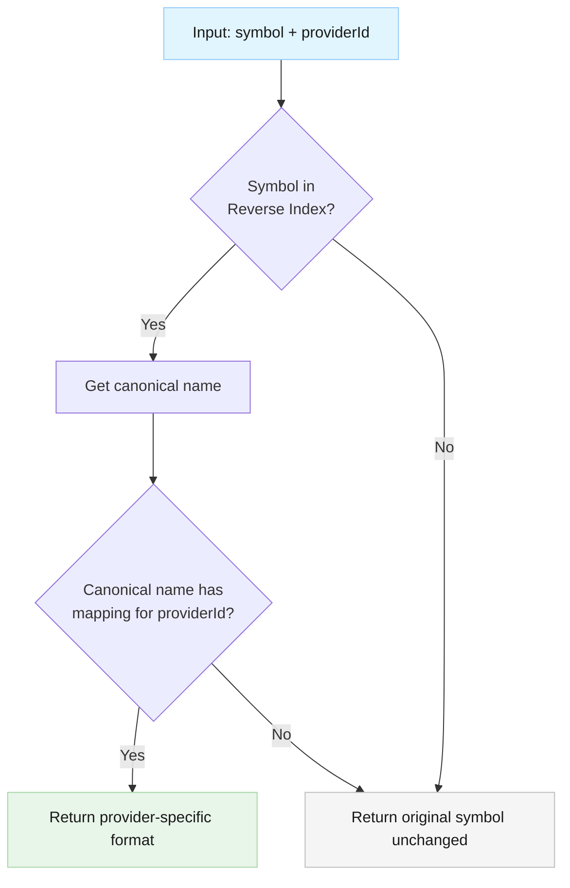
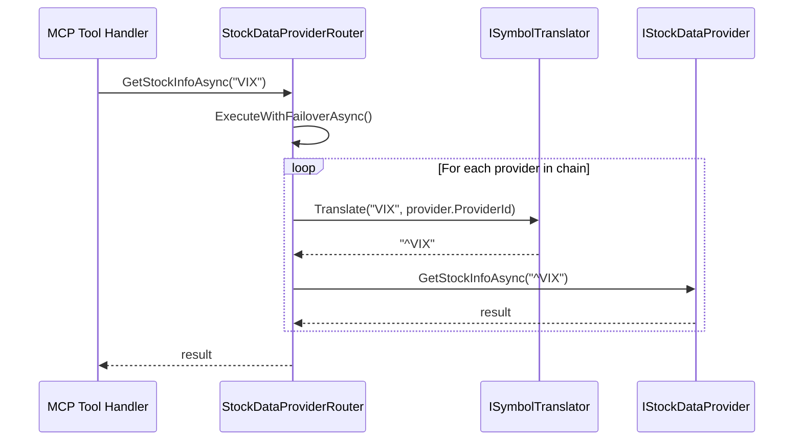
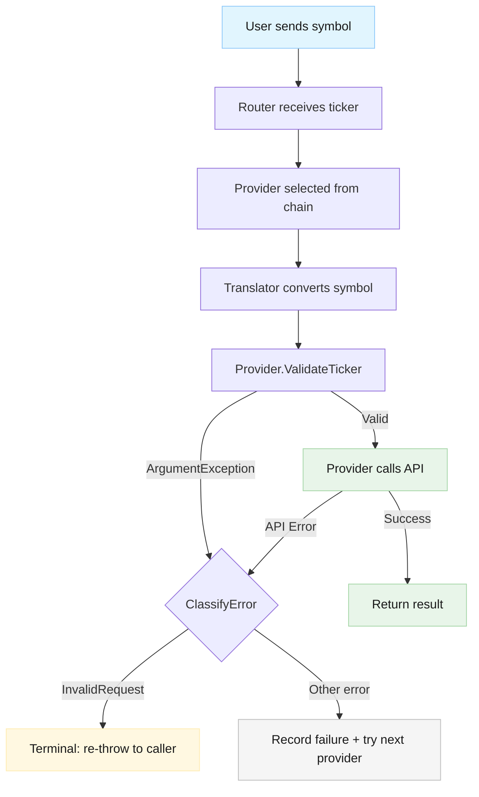
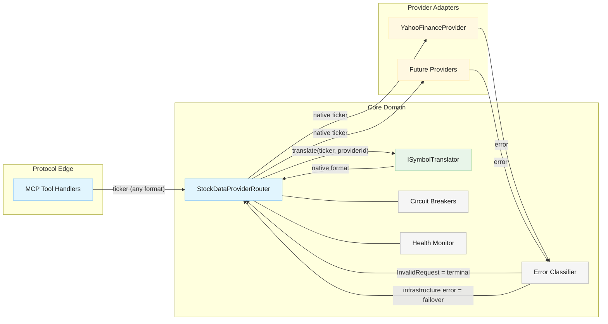

# Component: Symbol Translator

**Last Updated**: 2026-03-06
**Status**: Implemented
**Related Feature**: [symbol-translation.md](../../features/symbol-translation.md)
**Parent Architecture**: [stock-data-aggregation-canonical-architecture.md](../stock-data-aggregation-canonical-architecture.md)

---

## 1) Purpose

The Symbol Translator provides provider-aware symbol format conversion. It accepts market symbols in any recognized format (canonical bare names, Yahoo caret-prefixed, FinViz @-prefixed, etc.) and translates them to the native format expected by the target provider before API calls are made.

This component solves the problem that financial data providers use different symbol formats for the same security (e.g., VIX vs ^VIX vs @VX) and removes the burden of format knowledge from the caller.

---

## 2) Responsibilities

- Translate input symbols to target provider's expected format
- Maintain a two-level in-memory mapping dictionary (canonical symbol → provider → native format)
- Build and maintain a reverse index for fast lookup from any known format to canonical name
- Pass through unrecognized symbols unchanged (no validation — that is the provider's responsibility)
- Support case-insensitive lookups for user convenience
- Provide O(1) lookup performance via dictionary-based resolution

**Not responsible for:**

- Validating whether a symbol actually exists on a provider
- Routing decisions (handled by `StockDataProviderRouter`)
- Network I/O or external lookups
- Caching or persistence

---

## 3) Interface Definition

### ISymbolTranslator

Namespace: `StockData.Net.Providers`

| Member | Signature | Description |
| --- | --- | --- |
| `Translate` | `string Translate(string symbol, string providerId)` | Translates a symbol to the target provider's format. Returns the original symbol unchanged if no mapping exists. |

Design constraints:

- Synchronous — no I/O, pure dictionary lookup
- Thread-safe — the mapping dictionary is immutable after construction
- Null/empty input returns the input unchanged (defensive, but no exception)

---

## 4) Internal Structure

### SymbolTranslator (implements ISymbolTranslator)

Namespace: `StockData.Net.Providers`

The class maintains two internal data structures, both built at construction time and immutable thereafter:

**Canonical Mappings** — the authoritative source-of-truth dictionary:

| Key | Value |
| --- | --- |
| Canonical symbol name (e.g., `"VIX"`) | Dictionary of provider ID → native format (e.g., `{ "yahoo_finance": "^VIX", "finviz": "@VX" }`) |

**Reverse Index** — derived from canonical mappings for O(1) input resolution:

| Key | Value |
| --- | --- |
| Any known format (e.g., `"VIX"`, `"^VIX"`, `"@VX"`) | Canonical symbol name (e.g., `"VIX"`) |

Both dictionaries use case-insensitive string comparers (`StringComparer.OrdinalIgnoreCase`).

### Translation Algorithm



Steps:

1. Look up input symbol in reverse index → canonical name (or `null`)
2. If found, look up canonical name in canonical mappings → provider format for target `providerId`
3. If either lookup fails, return the original symbol unchanged

Both lookups are O(1) dictionary operations. Total overhead: two hash table lookups per call.

### Construction

At construction time, `SymbolTranslator` iterates through the canonical mappings and builds the reverse index by collecting:

- Each canonical name → itself
- Each provider-specific format → the canonical name

If a format string maps to multiple canonical names (collision), construction should throw to prevent ambiguous mappings.

---

## 5) Symbol Mapping Data

The canonical mappings are defined as a static, compile-time C# dictionary within `SymbolTranslator`. No external configuration files.

Phase 1 coverage:

| Category | Canonical Names | Yahoo Format |
| --- | --- | --- |
| US Market Indices | VIX, GSPC, DJI, IXIC, RUT, NDX, NYA, OEX, MID | ^VIX, ^GSPC, ^DJI, ^IXIC, ^RUT, ^NDX, ^NYA, ^OEX, ^MID |
| International Indices | FTSE, GDAXI, N225, HSI, SSEC, AXJO, KS11, BSESN | ^FTSE, ^GDAXI, ^N225, ^HSI, ^SSEC, ^AXJO, ^KS11, ^BSESN |
| Sector/Commodity | SOX, XOI, HUI, XAU | ^SOX, ^XOI, ^HUI, ^XAU |
| Volatility | VIX, VXN, RVX | ^VIX, ^VXN, ^RVX |
| Bond | TNX, TYX, FVX, IRX | ^TNX, ^TYX, ^FVX, ^IRX |

Future providers (e.g., FinViz) add their formats as additional entries in each canonical mapping without modifying existing entries.

---

## 6) Integration with StockDataProviderRouter

### Injection

`ISymbolTranslator` is injected into `StockDataProviderRouter` via constructor injection:

```csharp
StockDataProviderRouter(McpConfiguration, IEnumerable<IStockDataProvider>, ISymbolTranslator, ...)
```

The translator is an optional dependency with a default value of `null` to maintain backward compatibility. When `null`, no translation occurs (existing behavior preserved).

### Translation Point

Translation occurs **inside the router's per-method lambdas**, after the provider has been selected by the failover/aggregation loop but before the provider is called:



The lambda in each router method changes from:

```csharp
async (provider, ct) => await provider.GetStockInfoAsync(ticker, ct)
```

to:

```csharp
async (provider, ct) => await provider.GetStockInfoAsync(
    _symbolTranslator?.Translate(ticker, provider.ProviderId) ?? ticker, ct)
```

This ensures:

- Translation is provider-specific (each provider in the failover chain gets its own format)
- Translation happens at the correct architectural layer (after routing, before provider call)
- No changes to `ExecuteWithFailoverAsync` or `ExecuteWithAggregationAsync` internals
- Backward compatible: if no translator is injected, behavior is identical to today

---

## 7) Interaction with Validation and Error Handling

### Current Problem: Validation Errors Trigger Failover

Today, `YahooFinanceProvider.ValidateTicker()` throws `ArgumentException` for invalid tickers. The router's `ExecuteWithFailoverAsync` catches all exceptions generically and continues to the next provider. This means:

1. A caller error (bad ticker format) is treated as a provider infrastructure failure
2. The circuit breaker records a failure for a healthy provider
3. Failover is attempted with the same bad ticker, producing the same error on every provider
4. Health metrics are polluted with false failures

This contradicts the canonical architecture's error taxonomy, which lists `InvalidRequest` as a distinct category.

### Architectural Fix: Terminal Caller Errors

See [ADR-002: Validation Errors as Terminal Caller Errors](../decisions/adr-002-validation-errors-terminal.md) for the full decision record.

Summary of the fix:

1. Add `InvalidRequest` to `ProviderErrorType` enum
2. Map `ArgumentException` → `ProviderErrorType.InvalidRequest` in `ClassifyError`
3. In `ExecuteWithFailoverAsync`, treat `InvalidRequest` errors as terminal — do not continue failover, do not record as provider health failure
4. Re-throw the original exception immediately so the caller gets a clear error message

This fix is a prerequisite companion to symbol translation: with translation in place, most "wrong format" errors become impossible (the translator fixes the format), but truly invalid inputs (empty string, invalid characters) should still fail fast without polluting health metrics.

### Error Flow After Both Changes



---

## 8) Full Component Interaction Diagram



---

## 9) Performance Expectations

| Metric | Target | Mechanism |
| --- | --- | --- |
| Translation latency | < 1ms per call | Two `Dictionary.TryGetValue` calls (O(1)) |
| Memory footprint | < 10KB | ~30 canonical symbols × ~2 provider formats each |
| Thread safety | Lock-free | Immutable dictionaries after construction |
| Startup cost | Negligible | One-time reverse index build at construction |

---

## 10) Extensibility

### Adding a New Provider

To add support for a new provider (e.g., Google Finance):

1. Add the provider's format strings to existing canonical mapping entries
2. No changes to `ISymbolTranslator`, `SymbolTranslator`, or `StockDataProviderRouter`
3. The reverse index automatically picks up new format strings at construction

### Adding a New Symbol

To add a new symbol (e.g., a new index):

1. Add a new entry to the canonical mappings dictionary with all known provider formats
2. No structural changes required

### Phase 2: External Configuration (Future)

The current design uses compile-time C# dictionaries. A future phase could:

- Load mappings from a JSON configuration file
- Inject a different `ISymbolTranslator` implementation that reads from config
- The `ISymbolTranslator` interface does not need to change

---

## 11) Dependencies

| Depends On | Reason |
| --- | --- |
| None | Pure in-memory logic, no external dependencies |

| Depended On By | Reason |
| --- | --- |
| `StockDataProviderRouter` | Calls `Translate()` before dispatching to providers |

---

## 12) Testing Strategy Reference

See the Test Architect's testing documentation for detailed test plans. Key testability characteristics:

- `ISymbolTranslator` is mockable for router unit tests
- `SymbolTranslator` is independently testable with no external dependencies
- All translation scenarios (canonical→provider, provider→provider, pass-through, unknown) are deterministic and fast
