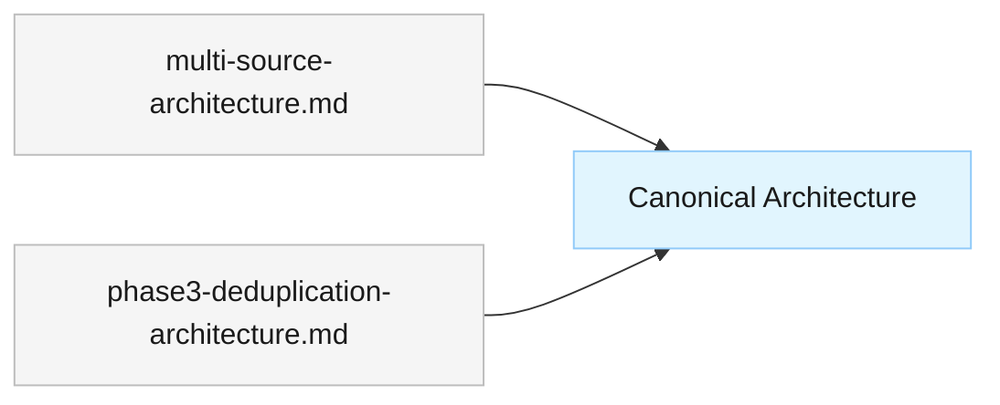

# ADR-001: Consolidate Architecture Documentation

<!--
  Template: docs/templates/architecture-decision-record.md
  Output directory: docs/architecture/decisions/
-->

## Status

Accepted

## Date

2026-02-28

## Context

The Stock Data Aggregation system accumulated multiple overlapping architecture documents during iterative development:

- `docs/architecture/multi-source-stock-data-aggregation-architecture.md` — original multi-provider architecture
- `docs/architecture/phase3-news-deduplication-architecture.md` — news deduplication additions

These documents contained duplicated content, divergent terminology, and inconsistencies in component descriptions and data flow diagrams. Maintaining multiple documents increased the risk of contradictions and made onboarding harder.

Additionally, the system's scope (single-process MCP server with ~10 core components) does not warrant separate component design documents in `docs/architecture/components/`. Inline component specifications within the canonical overview are sufficient and reduce cross-document maintenance burden.

## Decision

Consolidate all architecture documentation into a single canonical document:

- **Canonical document**: `docs/architecture/stock-data-aggregation-canonical-architecture.md`
- **Superseded documents**: The two prior documents listed above are superseded and should be removed.
- **Component specs**: Documented inline in the canonical overview (not in separate component files). The `Component Spec` column in the Components table references source code locations.
- **ADR directory**: Established `docs/architecture/decisions/` for recording future architectural decisions.

## Rationale

- **Single source of truth** eliminates contradictions between documents.
- **Reduced maintenance** — one document to update instead of three.
- **Inline component specs** are proportionate to the system's complexity (~10 components, single-process model).
- **ADR practice** preserves decision history that would otherwise be lost in document rewrites.

## Alternatives Considered

### Alternative 1: Keep Separate Documents with Cross-References

- **Description**: Maintain individual architecture documents and add cross-references between them.
- **Pros**: Preserves document history; smaller individual files.
- **Cons**: Cross-references drift; duplicated content remains; harder to get a complete picture.
- **Why rejected**: Maintenance cost outweighs benefits for a system of this size.

### Alternative 2: Separate Component Design Documents

- **Description**: Create individual `docs/architecture/components/[name].md` files per the template standard.
- **Pros**: Follows template convention exactly; isolates component details.
- **Cons**: 10+ small files with minimal content; increases navigation overhead; overkill for single-process system.
- **Why rejected**: System scope does not justify the overhead. Documented as intentional deviation in the canonical overview.

## Consequences

### Positive

- Single authoritative architecture reference for the project.
- Faster onboarding — one document covers the full system.
- Reduced risk of contradictory documentation.

### Negative

- Canonical document is longer than individual documents were.
- Inline component specs deviate from the template convention (documented as intentional).

### Risks

- If the system grows significantly (e.g., 20+ components), inline specs may become unwieldy. Mitigation: revisit this ADR and extract component docs if needed.

## Diagram (if applicable)

## Related

- **Canonical Document**: [Stock Data Aggregation Architecture](../stock-data-aggregation-canonical-architecture.md)
- **Template Used**: [Architecture Decision Record](../../templates/architecture-decision-record.md)
