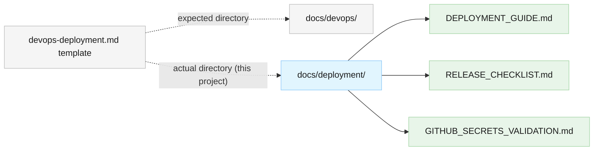

# ADR-002: Use `docs/deployment/` for Operational Runbooks

<!--
  Template: docs/templates/architecture-decision-record.md
  Output directory: docs/architecture/decisions/
-->

## Status

Accepted

## Date

2026-03-09

## Context

The `devops-deployment.md` template specifies `docs/devops/` as the output directory for DevOps and deployment documentation. However, the project stores its deployment-related documents in `docs/deployment/`:

- `docs/deployment/DEPLOYMENT_GUIDE.md` — Windows binary deployment runbook
- `docs/deployment/RELEASE_CHECKLIST.md` — release validation checklist
- `docs/deployment/GITHUB_SECRETS_VALIDATION.md` — CI/CD secrets validation runbook

These three documents are **operational runbooks** — step-by-step procedural guides for deploying, releasing, and configuring the system. They are not devops architecture documents (pipeline design, environment strategy, infrastructure-as-code decisions).

The template's `docs/devops/` directory is intended for broader devops architecture concerns. This project's deployment docs have a narrower, operational focus that warrants a distinct directory name.

## Decision

Retain `docs/deployment/` as the directory for operational deployment runbooks. Do not move these files to `docs/devops/`.

- **`docs/deployment/`** contains procedural runbooks: deployment steps, release checklists, secrets configuration.
- **`docs/devops/`** (if created in the future) would contain devops architecture: CI/CD pipeline design, environment strategy, infrastructure decisions — following the `devops-deployment.md` template.

This is an intentional deviation from the template convention, similar to how ADR-001 documents the intentional deviation of inline component specs instead of separate `docs/architecture/components/` files.

## Rationale

- **Semantic clarity**: "deployment" accurately describes operational runbooks; "devops" implies broader architectural scope (pipeline design, IaC, monitoring strategy) that these documents do not cover.
- **Existing references**: The GitHub Actions release workflow and the release checklist itself reference `docs/deployment/`. Renaming would require updating CI configuration and release notes templates.
- **Separation of concerns**: If devops architecture documentation is needed later, it can occupy `docs/devops/` without conflicting with the operational runbooks in `docs/deployment/`.
- **Precedent**: ADR-001 established the practice of documenting intentional template deviations proportionate to project scope.

## Alternatives Considered

### Alternative 1: Move Files to `docs/devops/`

- **Description**: Rename `docs/deployment/` to `docs/devops/` and update all cross-references.
- **Pros**: Matches the template convention exactly.
- **Cons**: Loses the semantic distinction between operational runbooks and devops architecture; requires updating the release workflow and in-document links; conflates two different documentation concerns into one directory.
- **Why rejected**: The documents are operational runbooks, not devops architecture. Conforming to the template naming would obscure their purpose.

### Alternative 2: Create Both Directories

- **Description**: Keep `docs/deployment/` for runbooks and also create `docs/devops/` for future devops architecture docs.
- **Pros**: Clean separation; template-conformant for architecture docs.
- **Cons**: Premature — no devops architecture docs exist yet. Creates an empty directory or forces unnecessary content.
- **Why rejected**: YAGNI. `docs/devops/` can be created when actual devops architecture documentation is needed.

## Consequences

### Positive

- Deployment runbooks remain in a directory that clearly communicates their operational purpose.
- No changes needed to CI workflows or existing cross-references.
- Future devops architecture docs (if needed) get their own dedicated directory.

### Negative

- `docs/deployment/` deviates from the template's expected `docs/devops/` output directory — this must be understood by contributors.

### Risks

- If devops architecture docs are created later, contributors might confuse `docs/deployment/` with `docs/devops/`. Mitigation: this ADR documents the distinction; each directory's documents self-identify their type.

## Diagram (if applicable)

## Related

- **ADR-001**: [Consolidate Architecture Documentation](adr-001-consolidate-architecture-documentation.md) — established the practice of documenting intentional template deviations
- **Template**: [DevOps & Deployment Template](../../templates/devops-deployment.md)
- **Deployment Docs**: [Deployment Guide](../../deployment/DEPLOYMENT_GUIDE.md) · [Release Checklist](../../deployment/RELEASE_CHECKLIST.md) · [GitHub Secrets Validation](../../deployment/GITHUB_SECRETS_VALIDATION.md)
