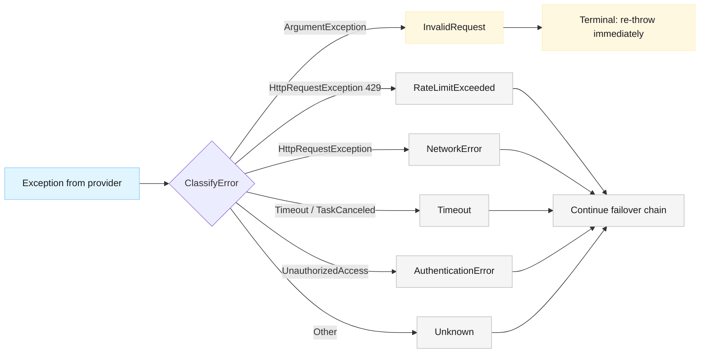

# ADR-002: Validation Errors as Terminal Caller Errors

**Date**: 2026-03-06
**Status**: Accepted
**Deciders**: Architecture team
**Related**: [Canonical Architecture §8 Error Taxonomy](../stock-data-aggregation-canonical-architecture.md), [Symbol Translator Component](../components/symbol-translator.md)

---

## Context

The `StockDataProviderRouter.ExecuteWithFailoverAsync` method catches all exceptions from provider calls and attempts failover to the next provider in the chain. This includes `ArgumentException` thrown by `YahooFinanceProvider.ValidateTicker()` when a ticker has invalid format (empty, too long, or contains invalid characters).

This creates several problems:

1. **Incorrect failover**: A validation error (caller mistake) triggers failover to the next provider, which will fail identically since the same invalid ticker is used
2. **Health metric pollution**: Each provider in the chain records a "failure" for what is actually a caller error, potentially tripping circuit breakers on healthy providers
3. **Misleading diagnostics**: The final `ProviderFailoverException` reports "all providers failed" when in reality no provider infrastructure failed — the input was invalid
4. **Inconsistency with architecture**: The canonical architecture's error taxonomy (§8) lists `InvalidRequest` as a distinct category, but the current `ProviderErrorType` enum does not include it and `ClassifyError` maps `ArgumentException` to `Unknown`

This issue is amplified when symbol translation is introduced: most format errors will be fixed by the translator, but truly invalid inputs (empty strings, illegal characters) should fail immediately with a clear message.

---

## Decision

Validation errors (`ArgumentException` from provider ticker validation) are classified as `InvalidRequest` and treated as **terminal** — they do not trigger provider failover and are not recorded as provider health failures.

### Changes Required

1. **Add `InvalidRequest` to `ProviderErrorType` enum** — aligns the code with the canonical architecture's error taxonomy

2. **Update `ClassifyError`** — map `ArgumentException` → `ProviderErrorType.InvalidRequest`

3. **Update `ExecuteWithFailoverAsync`** — after classifying an error as `InvalidRequest`, re-throw immediately without continuing the failover loop or recording a health failure

4. **Update `ExecuteWithAggregationAsync`** — same treatment: `InvalidRequest` is terminal, not a partial failure

### Error Classification After Change

---

## Consequences

### Positive

- Caller errors produce immediate, clear error messages instead of confusing "all providers failed" errors
- Provider health metrics are not polluted by caller mistakes
- Circuit breakers only trip on genuine infrastructure failures
- Aligns implementation with the canonical architecture's error taxonomy
- Reduces unnecessary API calls (no failover attempts with known-bad input)

### Negative

- Requires distinguishing which `ArgumentException` instances come from ticker validation vs. other sources. In the current codebase, provider methods are the only source of `ArgumentException`, so this is safe. If future code introduces `ArgumentException` for other reasons within the provider call path, those would also be classified as `InvalidRequest` — this is acceptable since `ArgumentException` semantically represents a caller error.

### Neutral

- Existing tests that expect failover on `ArgumentException` will need updating
- The `NotFound` terminal behavior (already in the canonical architecture) provides precedent for this pattern

---

## Alternatives Considered

### 1. Catch ArgumentException separately in each router method before calling ExecuteWithFailoverAsync

**Rejected**: Duplicates error handling logic across every router method. The classification belongs in the centralized error classifier.

### 2. Have the translator validate symbols and reject invalid ones before reaching providers

**Rejected**: Validation is the provider's responsibility (providers know their own format constraints). The translator's job is format conversion, not validation. Mixing these concerns would violate single responsibility.

### 3. Leave the current behavior and rely on the translator to prevent most validation errors

**Rejected**: The translator fixes format issues (VIX → ^VIX), but cannot fix fundamentally invalid input (empty strings, illegal characters). Those cases still need correct error handling.

---

## Relationship to Symbol Translation

This ADR is a companion fix to the symbol translation feature. Together they address the full spectrum of ticker input issues:

| Input Type | Handled By | Result |
| --- | --- | --- |
| `"VIX"` (bare canonical) | Symbol Translator | Translated to `"^VIX"` |
| `"^VIX"` (already correct) | Symbol Translator | Passed through unchanged |
| `"@VX"` (wrong provider format) | Symbol Translator | Translated to `"^VIX"` |
| `"AAPL"` (regular stock) | Pass-through | Passed to provider unchanged |
| `""` (empty) | This ADR fix | Terminal `InvalidRequest` error |
| `"!!!BAD"` (invalid chars) | This ADR fix | Terminal `InvalidRequest` error |
| `"XYZNOTREAL"` (valid format, doesn't exist) | Provider | Provider returns not found |
