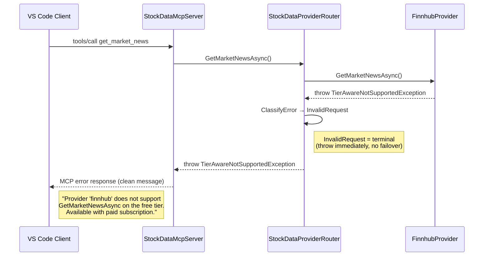
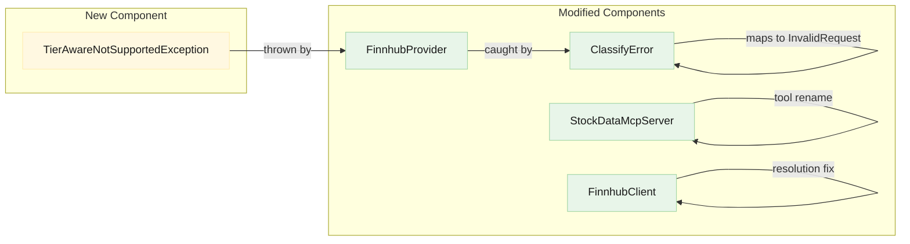
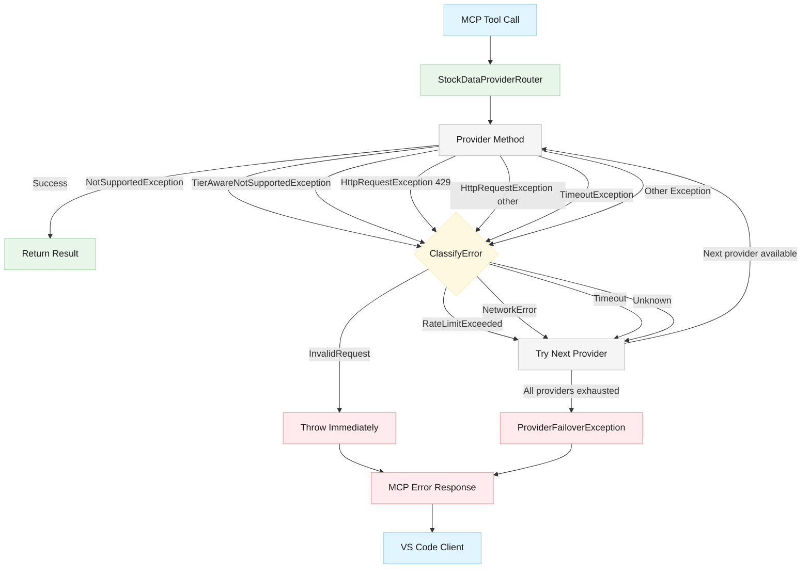
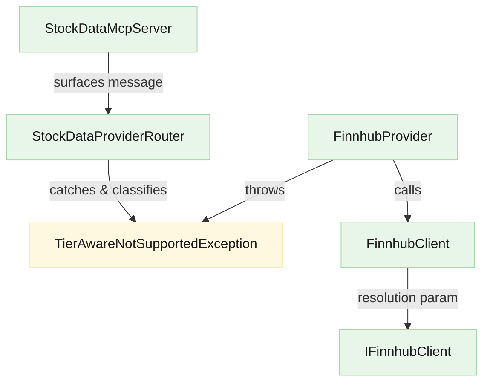

# Architecture: Enhanced MCP Error Handling and Provider Tier Awareness

## Document Info

- **Feature Spec**: [issue-17-mcp-error-handling.md](../features/issue-17-mcp-error-handling.md)
- **Canonical Architecture**: [stock-data-aggregation-canonical-architecture.md](stock-data-aggregation-canonical-architecture.md)
- **Status**: Draft
- **Last Updated**: 2026-03-09

## Scope

This document describes architecture changes for GitHub Issue #17. It covers error classification for `NotSupportedException`, tier-aware exception design, Finnhub `GetHistoricalPricesAsync` fix strategy, and the MCP tool rename from `get_yahoo_finance_news` to `get_finance_news`. For the full system architecture, see the [canonical architecture](stock-data-aggregation-canonical-architecture.md).

---

## 1. Problem: Current Error Flow (Broken)

When Finnhub throws `NotSupportedException`, the router's `ClassifyError` maps it to `ProviderErrorType.Unknown`, which triggers unnecessary failover. If all providers fail, a `ProviderFailoverException` is thrown with aggregated error data that VS Code's MCP client cannot parse.

```mermaid
sequenceDiagram
    participant VSCode as VS Code Client
    participant MCP as StockDataMcpServer
    participant Router as StockDataProviderRouter
    participant CB as Circuit Breaker
    participant Finnhub as FinnhubProvider
    participant Yahoo as YahooFinanceProvider

    VSCode->>MCP: tools/call get_market_news
    MCP->>Router: GetMarketNewsAsync()
    Router->>CB: CheckState(finnhub)
    CB-->>Router: Closed
    Router->>Finnhub: GetMarketNewsAsync()
    Finnhub-->>Router: throw NotSupportedException
    Router->>Router: ClassifyError → Unknown
    Note right of Router: Unknown triggers failover<br/>(should be terminal)
    Router->>CB: CheckState(yahoo)
    CB-->>Router: Closed
    Router->>Yahoo: GetMarketNewsAsync()
    Yahoo-->>Router: Success or Failure
    alt All providers fail
        Router-->>MCP: throw ProviderFailoverException
        MCP-->>VSCode: MCP error (aggregated)
        Note right of VSCode: "Cannot read properties<br/>of null (reading 'task')"
    end

    classDef blue fill:#e1f5fe,stroke:#90caf9,color:#1a1a1a
    classDef green fill:#e8f5e9,stroke:#a5d6a7,color:#1a1a1a
```

**Root cause**: `ClassifyError` in [StockDataProviderRouter.cs](../../StockData.Net/StockData.Net/Providers/StockDataProviderRouter.cs#L654) has no case for `NotSupportedException`. The fallthrough to `Unknown` bypasses the existing terminal-error logic in `ExecuteWithFailoverAsync` that already throws immediately for `InvalidRequest`.

---

## 2. Target Error Flow (Fixed)



The fix is minimal: add `NotSupportedException` to the `ClassifyError` switch expression. The existing `ExecuteWithFailoverAsync` logic already handles `InvalidRequest` as terminal — it re-throws immediately without failover.

---

## 3. Component Changes Overview



### 3.1. ClassifyError Update

**File**: [StockDataProviderRouter.cs](../../StockData.Net/StockData.Net/Providers/StockDataProviderRouter.cs#L654)

**Change**: Add `NotSupportedException` to the pattern-matching switch, mapping it to `ProviderErrorType.InvalidRequest`.

**Rationale**: `NotSupportedException` indicates a fundamental capability gap — the operation cannot succeed regardless of retries. This matches `InvalidRequest` semantics (terminal, no failover), which is the same category used for `ArgumentException`. The router already throws immediately when `ClassifyError` returns `InvalidRequest`, so no changes to `ExecuteWithFailoverAsync` are needed.

**Error taxonomy update** (extends the table in the canonical architecture):

| Error Type | New Trigger Condition | Routing Behavior |
| --- | --- | --- |
| InvalidRequest | `ArgumentException` OR `NotSupportedException` | Terminal (no failover) |

### 3.2. TierAwareNotSupportedException (New Class)

**Placement**: `StockData.Net/StockData.Net/Providers/TierAwareNotSupportedException.cs`

**Purpose**: Extends `NotSupportedException` with structured metadata about whether the operation is available on a paid tier, enabling callers to distinguish "not supported at all" from "not supported on the free tier."

**Responsibilities**:

- Carry provider ID, method name, and paid-tier availability flag
- Format user-facing messages with tier distinction
- Remain a `NotSupportedException` subtype so `ClassifyError` handles it with the same `InvalidRequest` mapping

**Interfaces**:

| Property | Type | Description |
| --- | --- | --- |
| `ProviderId` | `string` | Identifier of the provider (e.g., `"finnhub"`) |
| `MethodName` | `string` | Name of the unsupported operation |
| `AvailableOnPaidTier` | `bool` | `true` if the operation is available with a paid subscription |

**Message format**:

- When `AvailableOnPaidTier = true`: `"Provider 'finnhub' does not support GetMarketNewsAsync on the free tier. This feature is available with a paid subscription."`
- When `AvailableOnPaidTier = false`: `"Provider 'finnhub' does not support GetStockActionsAsync."`

**Design decisions**:

- Inherits from `NotSupportedException` (not a wrapper or separate type) so the existing `ClassifyError` switch catches it without modification — `NotSupportedException` case covers both base and derived types
- Static factory or constructor formats messages, keeping formatting centralized rather than scattered across provider methods

### 3.3. FinnhubProvider Updates

**File**: [FinnhubProvider.cs](../../StockData.Net/StockData.Net/Providers/FinnhubProvider.cs)

**Change**: Replace plain `NotSupportedException` throws with `TierAwareNotSupportedException` for each unsupported method. The tier classification per method:

| Method | Current Behavior | New Exception | `AvailableOnPaidTier` |
| --- | --- | --- | --- |
| `GetMarketNewsAsync` | `throw new NotSupportedException(...)` | `TierAwareNotSupportedException` | `false` |
| `GetStockActionsAsync` | `Task.FromException<string>(new NotSupportedException(...))` | `TierAwareNotSupportedException` | `true` |
| `GetFinancialStatementAsync` | `Task.FromException<string>(new NotSupportedException(...))` | `TierAwareNotSupportedException` | `true` |
| `GetHolderInfoAsync` | `Task.FromException<string>(new NotSupportedException(...))` | `TierAwareNotSupportedException` | `true` |
| `GetOptionExpirationDatesAsync` | `Task.FromException<string>(new NotSupportedException(...))` | `TierAwareNotSupportedException` | `false` |
| `GetOptionChainAsync` | `Task.FromException<string>(new NotSupportedException(...))` | `TierAwareNotSupportedException` | `false` |
| `GetRecommendationsAsync` | `Task.FromException<string>(new NotSupportedException(...))` | `TierAwareNotSupportedException` | `false` |

**Note**: `GetHistoricalPricesAsync` and `GetNewsAsync` are implemented and supported on the free tier — no changes to their exception type.

### 3.4. StockDataMcpServer Tool Rename

**File**: [StockDataMcpServer.cs](../../StockData.Net/StockData.Net.McpServer/StockDataMcpServer.cs)

**Changes**:

1. **Tool definition** (in `HandleToolsList`): Rename `"get_yahoo_finance_news"` → `"get_finance_news"` and update the description to reflect multi-provider support (remove Yahoo Finance references)
2. **Tool call handler** (in `HandleToolCallAsync`): Update the switch case from `"get_yahoo_finance_news"` → `"get_finance_news"`
3. **No backward compatibility alias**: Per the feature spec's out-of-scope section, no deprecated alias is implemented unless explicitly requested

**Ripple effects**: Test files referencing the old tool name must be updated (see Impact Analysis).

### 3.5. GetHistoricalPricesAsync Fix Strategy

**Files**: [FinnhubProvider.cs](../../StockData.Net/StockData.Net/Providers/FinnhubProvider.cs), [FinnhubClient.cs](../../StockData.Net/StockData.Net/Clients/Finnhub/FinnhubClient.cs)

**Finding**: The `FinnhubProvider.GetHistoricalPricesAsync` method calls `ResolveDateWindow(period)` to convert the period string to date boundaries, and `ResolveResolution(interval)` exists to map interval strings to Finnhub resolution codes. However, `FinnhubClient.GetHistoricalPricesAsync` hardcodes `resolution=D` (daily) in the request URI, ignoring the `interval` parameter entirely.

**Architectural approach**:

1. **FinnhubClient**: Accept a `resolution` parameter in `GetHistoricalPricesAsync` instead of hardcoding `"D"`
2. **FinnhubProvider**: Pass `ResolveResolution(interval)` to the client call
3. **IFinnhubClient interface**: Update the method signature to accept the resolution parameter
4. **Error differentiation**: If Finnhub returns an empty/no-data response (status ≠ `"ok"`), throw a descriptive error rather than silently returning an empty list — this ensures callers understand why no data was returned

This is a bug fix to an existing implementation, not a new capability. The `resolution` parameter translation was partially implemented (the `ResolveResolution` method exists) but never wired through.

---

## 4. Error Flow Diagram (Complete)

This diagram shows all error paths through the system after the fix:



**Key change**: `NotSupportedException` (and its subtype `TierAwareNotSupportedException`) now routes through `InvalidRequest → Throw Immediately` instead of `Unknown → Failover`.

---

## 5. ClassifyError Decision Record

**Context**: `ClassifyError` is the central error taxonomy mapper. It determines routing behavior (terminal vs. failover) for every provider exception. The canonical architecture defines 10 error categories but the implementation only maps 5 exception types.

**Decision**: Map `NotSupportedException` → `ProviderErrorType.InvalidRequest`.

**Rationale**:

- `InvalidRequest` is already defined as "terminal, no failover" — matching the semantics of an unsupported operation
- `NotSupportedException` indicates a permanent capability gap, not a transient failure — retrying or failing over to the *same* provider is pointless
- The existing `ExecuteWithFailoverAsync` already has the terminal throw logic for `InvalidRequest` — no routing changes needed
- `TierAwareNotSupportedException` inherits from `NotSupportedException`, so the single pattern match covers both

**Alternatives considered**:

| Alternative | Why rejected |
| --- | --- |
| New `ProviderErrorType.NotSupported` enum value | Adds complexity without benefit — `InvalidRequest` already has the correct terminal routing behavior |
| Map to `Unknown` and handle separately in router | Requires modifying `ExecuteWithFailoverAsync` logic; `Unknown` semantics are wrong (failover, not terminal) |
| Catch `NotSupportedException` before `ClassifyError` | Scatters error handling logic; `ClassifyError` is the single point of truth for error taxonomy |

**Consequences**:

- (+) Minimal code change — one line added to switch expression
- (+) Leverages existing terminal routing logic
- (+) `TierAwareNotSupportedException` automatically inherits the mapping
- (-) `InvalidRequest` now covers two semantically different cases (bad input vs. unsupported operation) — acceptable given single-process scope

---

## 6. Impact Analysis

### Files Changed

| File | Change Type | Description |
| --- | --- | --- |
| `StockData.Net/Providers/StockDataProviderRouter.cs` | Modify | Add `NotSupportedException` case to `ClassifyError` |
| `StockData.Net/Providers/TierAwareNotSupportedException.cs` | **New** | Tier-aware exception class |
| `StockData.Net/Providers/FinnhubProvider.cs` | Modify | Replace `NotSupportedException` with `TierAwareNotSupportedException` in 7 methods |
| `StockData.Net/Clients/Finnhub/FinnhubClient.cs` | Modify | Accept `resolution` parameter in `GetHistoricalPricesAsync` |
| `StockData.Net/Clients/Finnhub/IFinnhubClient.cs` | Modify | Update interface signature for `GetHistoricalPricesAsync` |
| `StockData.Net.McpServer/StockDataMcpServer.cs` | Modify | Rename tool `get_yahoo_finance_news` → `get_finance_news`, update description |

### Test Files Changed

| File | Change Type | Description |
| --- | --- | --- |
| `StockData.Net.Tests/StockDataProviderRouterTests.cs` | Modify | Add tests for `NotSupportedException` classification |
| `StockData.Net.Tests/Providers/*` (Finnhub tests) | Modify | Update expected exception types to `TierAwareNotSupportedException` |
| `StockData.Net.McpServer.Tests/McpServerTests.cs` | Modify | Update tool name references from `get_yahoo_finance_news` to `get_finance_news` |
| `StockData.Net.Tests/Clients/Finnhub*` | Modify | Update client tests for new `resolution` parameter |

### Dependency Impact



- **No breaking interface changes to `IStockDataProvider`** — the provider interface is unchanged; only internal exception types change
- **`IFinnhubClient` interface change** — method signature adds a `resolution` parameter (breaking for existing implementations/mocks)
- **No configuration changes** — tier information is compile-time knowledge, not runtime configuration
- **No new dependencies** — `TierAwareNotSupportedException` uses only BCL types

### Canonical Architecture Document Updates

The [canonical architecture](stock-data-aggregation-canonical-architecture.md) requires the following updates after implementation:

| Section | Update |
| --- | --- |
| Canonical Error Taxonomy table | Add `NotSupportedException` to `InvalidRequest` trigger conditions |
| MCP Tool Surface | Rename `get_yahoo_finance_news` → `get_finance_news` (note: canonical doc uses `get_news`, verify alignment) |
| Components table | Add `TierAwareNotSupportedException` or note in ErrorClassifier row |

---

## 7. Risks

| Risk | Impact | Likelihood | Mitigation |
| --- | --- | --- | --- |
| Finnhub tier classification is wrong (method is free but marked paid, or vice versa) | LOW — incorrect user guidance | MEDIUM — Finnhub doesn't officially document free-tier limits | Mark tier flags as best-effort; log when methods fail unexpectedly for investigation |
| `InvalidRequest` classification prevents valid failover when another provider supports the operation | MEDIUM — user gets error instead of result | LOW — `NotSupportedException` is terminal per provider, not per operation | Future: consider per-provider terminal vs. cross-provider failover distinction |
| Tool rename breaks existing VS Code Copilot saved prompts referencing `get_yahoo_finance_news` | LOW — user inconvenience | LOW — MCP tools are discovered dynamically | No mitigation needed; VS Code re-discovers tools on server restart |
| `IFinnhubClient.GetHistoricalPricesAsync` signature change breaks mocks in tests | LOW — test compilation failure | HIGH — any test mocking the interface will break | Update all mocks in the same PR |

---

## Related Documents

- Feature Specification: [issue-17-mcp-error-handling.md](../features/issue-17-mcp-error-handling.md)
- Canonical Architecture: [stock-data-aggregation-canonical-architecture.md](stock-data-aggregation-canonical-architecture.md)
- Security Design: [../security/security-summary.md](../security/security-summary.md)
- Test Strategy: [../testing/testing-summary.md](../testing/testing-summary.md)
