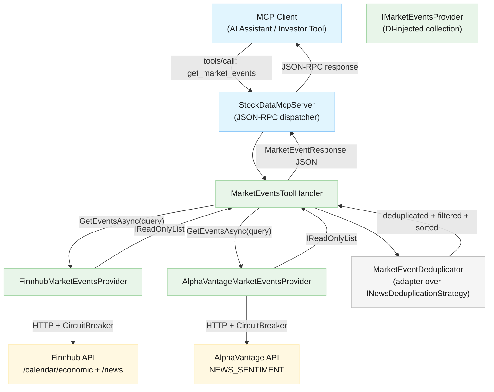
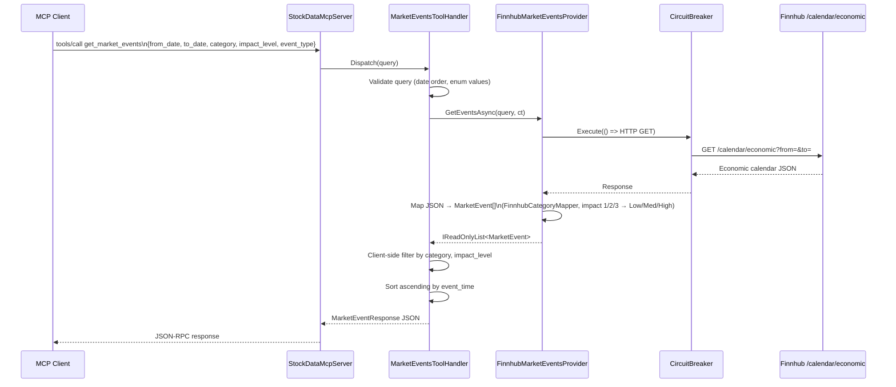
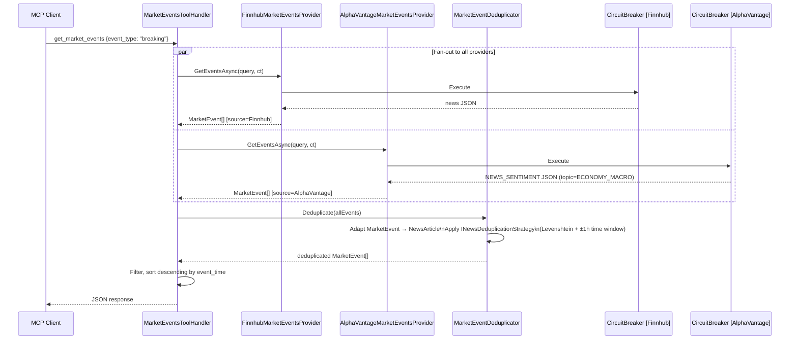
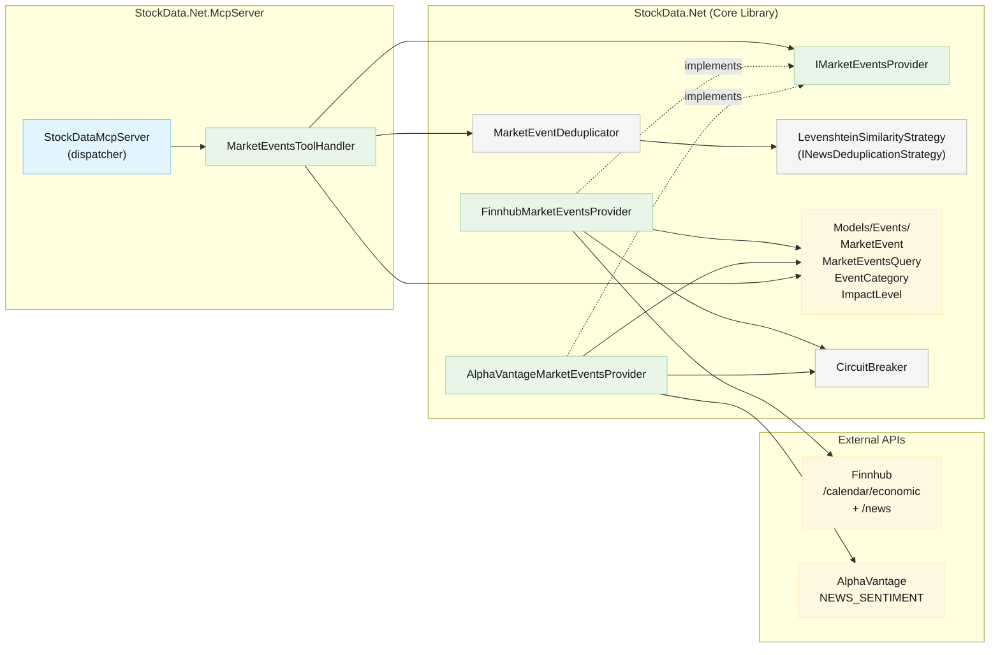

# Architecture Overview: Market-Moving Events Feed

<!--
  Template owner: Architecture Design Agent
  Output directory: docs/architecture/
  Filename convention: issue-26-market-moving-events-architecture.md
-->

## Document Info

- **Feature Spec**: [docs/features/issue-26-market-moving-events.md](../features/issue-26-market-moving-events.md)
- **Status**: Complete
- **Last Updated**: 2026-04-12

---

## System Overview

The Market-Moving Events Feed extends StockData.Net with a dedicated `get_market_events` MCP tool that surfaces both scheduled macro-economic events (e.g., FOMC rate decisions, Treasury auctions) and breaking high-impact announcements (e.g., geopolitical statements, regulatory actions). Both event kinds are sourced from providers already integrated into the server — Finnhub and AlphaVantage — so no new API keys or infrastructure are required.

The core design principle is **interface segregation**: market events are structurally different from stock price or news data and carry additional domain-specific fields (`event_type`, `category`, `impact_level`, `affected_markets`, `sentiment`). Mixing them into `IStockDataProvider` would violate the Single Responsibility Principle and force every existing provider to implement methods unrelated to their core capability. A dedicated `IMarketEventsProvider` interface keeps the contract narrow and allows future providers (e.g., a Bloomberg or Refinitiv adapter) to be added without modifying any existing class.

The deduplication, circuit-breaker, and resilience infrastructure that already exists for news aggregation is **reused and extended**, not duplicated. The `MarketEventDeduplicator` wraps the existing `INewsDeduplicationStrategy` via a lightweight adapter, preserving the Levenshtein similarity logic and time-proximity window (±1 hour) already proven in production.

### System Diagram



---

## Architectural Patterns

- **Interface Segregation (ISP)** — `IMarketEventsProvider` is a new narrow contract, completely separate from `IStockDataProvider`. Each event-capable provider implements only what it can supply.
- **Adapter Pattern** — `MarketEventDeduplicator` adapts `MarketEvent` objects into the existing `NewsArticle` intermediate model so that `INewsDeduplicationStrategy` (Levenshtein similarity) can be reused without modification.
- **DI Collection Pattern** — `MarketEventsToolHandler` depends on `IEnumerable<IMarketEventsProvider>`, meaning new providers are registered in DI and automatically included without touching the handler.
- **Category Mapping at Ingestion** — Provider-specific fields (Finnhub event text, AlphaVantage topic tags) are mapped to the canonical `EventCategory` enum at the boundary of each provider implementation, keeping the domain model clean.
- **Client-Side Filtering** — Finnhub's `/calendar/economic` endpoint does not support server-side category filtering; filtering is applied in the handler after all providers respond. AlphaVantage's `topic` parameter is set server-side as an optimisation to reduce data transfer on the free tier.

---

## Components

| Component | Responsibility | Location | Technology |
| --- | --- | --- | --- |
| `IMarketEventsProvider` | Contract for any market events source | `StockData.Net/Providers/` | C# interface |
| `MarketEvent` | Canonical domain model for a single market event | `StockData.Net/Models/Events/` | C# record |
| `MarketEventsQuery` | Filter parameters passed to providers | `StockData.Net/Models/Events/` | C# record |
| `EventCategory` | Enum: `Fed`, `Treasury`, `Geopolitical`, `Regulatory`, `CentralBank`, `Institutional`, `All` | `StockData.Net/Models/Events/` | C# enum |
| `ImpactLevel` | Enum: `Low`, `Medium`, `High`, `All` | `StockData.Net/Models/Events/` | C# enum |
| `FinnhubMarketEventsProvider` | Fetches scheduled events from `/calendar/economic` and breaking events from `/news?category=general` | `StockData.Net/Providers/` | C# + `IFinnhubClient` |
| `AlphaVantageMarketEventsProvider` | Fetches breaking events from `NEWS_SENTIMENT` with macro topic filter | `StockData.Net/Providers/` | C# + `IAlphaVantageClient` |
| `MarketEventDeduplicator` | Deduplicates merged results across providers using title similarity + ±1 h time window | `StockData.Net/Deduplication/` | C# (wraps `INewsDeduplicationStrategy`) |
| `FinnhubCategoryMapper` | Maps Finnhub economic calendar event text to `EventCategory` at ingestion | `StockData.Net/Providers/` (internal static) | C# |
| `MarketEventsToolHandler` | Validates query, fans out to providers, merges + deduplicates, applies filters, serialises response | `StockData.Net.McpServer/` | C# |

---

## Data Flow

### Scheduled Events (Finnhub economic calendar)



### Breaking Events (multi-provider fan-out with deduplication)



---

## Data Model

| Entity | Description | Location | Key Fields |
| --- | --- | --- | --- |
| `MarketEvent` | A single market-moving event from any provider | `StockData.Net/Models/Events/` | `EventId`, `Title`, `Description`, `EventType`, `Category`, `ImpactLevel`, `EventTime` (UTC), `Source`, `SourceUrl`, `AffectedMarkets`, `Sentiment` |
| `MarketEventsQuery` | Immutable filter applied to all providers | `StockData.Net/Models/Events/` | `Category`, `EventType`, `FromDate`, `ToDate`, `ImpactLevel` |
| `EventCategory` | Canonical category enum | `StockData.Net/Models/Events/` | `Fed`, `Treasury`, `Geopolitical`, `Regulatory`, `CentralBank`, `Institutional`, `All` |
| `ImpactLevel` | Impact severity enum | `StockData.Net/Models/Events/` | `Low`, `Medium`, `High`, `All` |
| `MarketEventResponse` (MCP layer) | Serialised response envelope | `StockData.Net.McpServer/Models/` | `events[]`, `message` (optional), `total_count` |

### MarketEvent Field Notes

- `event_id`: Stable, provider-scoped identifier (e.g., `"finnhub:{original_id}"`, `"alphavantage:{url_hash}"`). Used as the deduplication key seed alongside title and time.
- `event_type`: `"scheduled"` (Finnhub economic calendar) or `"breaking"` (news endpoints). Never inferred — determined by the endpoint that produced it.
- `sentiment`: Nullable. Populated from AlphaVantage `overall_sentiment_label` (`"Bullish"` / `"Bearish"` / `"Neutral"`). Finnhub economic calendar has no sentiment; news events may or may not carry it.
- `affected_markets`: Free-text array inferred from provider tags (e.g., `["equities", "rates", "fx"]`). Not guaranteed to be populated.

---

## Interfaces

### `IMarketEventsProvider`

- **Direction**: `MarketEventsToolHandler` → provider implementations
- **Protocol**: In-process async call
- **Key operations**:

```csharp
Task<IReadOnlyList<MarketEvent>> GetEventsAsync(
    MarketEventsQuery query,
    CancellationToken cancellationToken = default);
string ProviderId { get; }
string ProviderName { get; }
```

### `INewsDeduplicationStrategy` (reused, unmodified)

- **Direction**: `MarketEventDeduplicator` → `LevenshteinSimilarityStrategy`
- **Protocol**: In-process synchronous call
- **Reuse boundary**: `MarketEventDeduplicator` converts `MarketEvent` → `NewsArticle` (mapping `Title` → `Title`, `EventTime` → `PublishedAt`, `Source` → `ProviderId`) before invoking the strategy, then maps results back.

### MCP Tool: `get_market_events`

- **Direction**: MCP Client → `StockDataMcpServer` JSON-RPC dispatcher → `MarketEventsToolHandler`
- **Protocol**: JSON-RPC over stdio (existing MCP transport)
- **Parameters**:

```json
{
  "category":     "fed|treasury|geopolitical|regulatory|central_bank|institutional|all",
  "event_type":   "scheduled|breaking",
  "from_date":    "YYYY-MM-DD (ISO 8601, UTC date)",
  "to_date":      "YYYY-MM-DD (ISO 8601, UTC date)",
  "impact_level": "high|medium|low|all"
}
```

All parameters are optional; defaults are `event_type: all`, `category: all`, `impact_level: all`, `from_date: today`, `to_date: today + 7 days`.

---

## Technology Decisions

| Decision | Choice | Rationale |
| --- | --- | --- |
| New interface vs. extending `IStockDataProvider` | New `IMarketEventsProvider` | Market event data has distinct shape, lifecycle, and filter semantics. Adding `GetEventsAsync` to `IStockDataProvider` would force all 4 existing providers to implement a no-op stub, violating Interface Segregation. |
| Model location | `StockData.Net/Models/Events/` subfolder | Existing `Models/` folder contains only enum types. Creating a subfolder keeps the domain model grouped and prevents namespace pollution at the root level. |
| Deduplication approach | Adapt via `MarketEventDeduplicator`, not a separate strategy | The Levenshtein + time-window logic in `LevenshteinSimilarityStrategy` is provider-agnostic and already tuned. Creating a parallel deduplication stack for events would be duplication with no benefit. The adapter pattern preserves the existing strategy contract. |
| Filtering: Finnhub client-side, AlphaVantage server-side | Mixed | Finnhub `/calendar/economic` has no category query param; filtering must be client-side. AlphaVantage `NEWS_SENTIMENT` accepts `topics=ECONOMY_MACRO` which reduces data volume — preferred on the free tier (5 req/min). |
| Category inference for Finnhub | `FinnhubCategoryMapper` static class | Finnhub economic calendar events are identified by free-text event names. A keyword-based mapper (e.g., `"FOMC"` → `Fed`, `"ECB"` → `CentralBank`, `"Treasury"` → `Treasury`) cannot be expressed as a configuration file without an unacceptable maintenance cost. A static class co-located with `FinnhubMarketEventsProvider` provides a clear audit surface. |
| Impact level mapping | Enum at ingestion boundary | Finnhub uses `1`/`2`/`3` integers; AlphaVantage provides no impact numeric — only `sentiment_score`. Impact is mapped to `Low`/`Medium`/`High` (or `null`) at the provider boundary. AlphaVantage events where impact cannot be determined are marked `null`, consistent with Feature Spec §4.4. |
| AlphaVantage rate limiting | Single batched `topics=ECONOMY_MACRO` call | AlphaVantage free tier allows 5 requests/min. One call per tool invocation (not per category) prevents exhausting the limit during high-frequency MCP usage. Server-side topic filtering reduces noise without additional calls. |
| Sort order | By `event_type` post-merge | Scheduled events: ascending `EventTime` (aids planning). Breaking events: descending `EventTime` (most recent first). When mixed (`event_type: all`), each group is sorted independently and merged: scheduled ascending first, breaking descending appended. |
| Tool handler location | Dedicated `MarketEventsToolHandler` class | `StockDataMcpServer.cs` already contains 600+ lines. Adding `get_market_events` inline would further grow a class that should be a thin dispatcher. A handler class follows the emerging pattern and keeps the dispatcher's `switch` statement as the only routing concern. |
| DI registration | `IEnumerable<IMarketEventsProvider>` | Consistent with how the provider router resolves `IEnumerable<IStockDataProvider>`. Adding a third market events provider (e.g., Bloomberg) requires only a new DI registration — no handler or dispatcher changes. |
| Resilience | Reuse existing `CircuitBreaker` per provider | The existing circuit-breaker infrastructure (Closed/Open/Half-Open, configurable thresholds) already operates per `ProviderId`. `FinnhubMarketEventsProvider` and `AlphaVantageMarketEventsProvider` share the same `ProviderId` as their `IStockDataProvider` siblings, so the same circuit breaker governs both — protecting the provider-wide API key budget. |

---

## Cross-Cutting Concerns

- **Security**: Input parameters (`category`, `event_type`, `from_date`, `to_date`, `impact_level`) are validated against strict allowlists and date-range checks before any provider is called. External provider URLs follow existing `IFinnhubClient` / `IAlphaVantageClient` patterns — no dynamic URL construction from user input. See [docs/security/](../security/) for provider API key handling conventions.
- **Performance**: Fan-out to providers is parallel (`Task.WhenAll`). Each provider call is bounded by the existing `HttpClient` timeout configuration. Deduplication is bounded by a 500 ms timeout inherited from `NewsDeduplicator`. When only one provider is configured, the fan-out degrades to a single call and the deduplication step is skipped (consistent with Feature Spec §5.3).
- **Scalability**: The tool is stateless; no caching layer is introduced at MVP. If response times become a concern under load, a short-lived in-memory cache keyed on the serialised `MarketEventsQuery` can be added without architectural change.
- **Observability**: `MarketEventsToolHandler` emits structured log events at the same level as `StockDataMcpServer`: provider selection audit, result counts, deduplication outcomes. Circuit breaker state transitions are already logged by `CircuitBreaker`. No new telemetry infrastructure is required.
- **Error Handling**: Provider failures are surfaced via the existing `ProviderFailoverException` / `McpError` path. A provider returning zero events is not an error. A validation failure (invalid enum, inverted date range) returns a structured `McpError` before any provider is contacted (Feature Spec §1.4, §3.5, §4.5).

---

## Component Interaction Overview



---

## Interface and Model Sketch

> Code blocks in documentation are limited to signatures only. Full implementations reside in source files.

```csharp
// StockData.Net/Providers/IMarketEventsProvider.cs
public interface IMarketEventsProvider
{
    string ProviderId { get; }
    string ProviderName { get; }
    Task<IReadOnlyList<MarketEvent>> GetEventsAsync(
        MarketEventsQuery query, CancellationToken cancellationToken = default);
}

// StockData.Net/Models/Events/MarketEvent.cs
public record MarketEvent(
    string EventId, string Title, string? Description,
    string EventType, EventCategory Category, ImpactLevel? ImpactLevel,
    DateTimeOffset EventTime, string Source, string? SourceUrl,
    IReadOnlyList<string> AffectedMarkets, string? Sentiment);

// StockData.Net/Models/Events/MarketEventsQuery.cs
public record MarketEventsQuery(
    EventCategory Category, string? EventType,
    DateTimeOffset FromDate, DateTimeOffset ToDate,
    ImpactLevel? ImpactLevel);
```

---

## File Layout

New files introduced by this feature:

```text
StockData.Net/
  StockData.Net/
    Models/
      Events/
        MarketEvent.cs
        MarketEventsQuery.cs
        EventCategory.cs
        ImpactLevel.cs
    Providers/
      IMarketEventsProvider.cs
      FinnhubMarketEventsProvider.cs
      AlphaVantageMarketEventsProvider.cs
      FinnhubCategoryMapper.cs          ← internal static, co-located
    Deduplication/
      MarketEventDeduplicator.cs
  StockData.Net.McpServer/
    MarketEventsToolHandler.cs
    Models/
      MarketEventResponse.cs            ← MCP response envelope
```

Modified files:

```text
StockData.Net.McpServer/
  Program.cs                            ← register IMarketEventsProvider implementations + handler
  StockDataMcpServer.cs                 ← add "get_market_events" to tools/list +
                                           dispatch to MarketEventsToolHandler
```

---

## Related Documents

- Feature Specification: [docs/features/issue-26-market-moving-events.md](../features/issue-26-market-moving-events.md)
- Security Design: [docs/security/](../security/) *(to be created)*
- Test Strategy: [docs/testing/](../testing/) *(to be created)*
- Existing Provider Architecture: [docs/architecture/stock-data-aggregation-canonical-architecture.md](stock-data-aggregation-canonical-architecture.md)
- Deduplication source: [StockData.Net/Deduplication/NewsDeduplicator.cs](../../StockData.Net/StockData.Net/Deduplication/NewsDeduplicator.cs)
- Provider router source: [StockData.Net/Providers/StockDataProviderRouter.cs](../../StockData.Net/StockData.Net/Providers/StockDataProviderRouter.cs)
- MCP server entry point: [StockData.Net.McpServer/Program.cs](../../StockData.Net/StockData.Net.McpServer/Program.cs)
