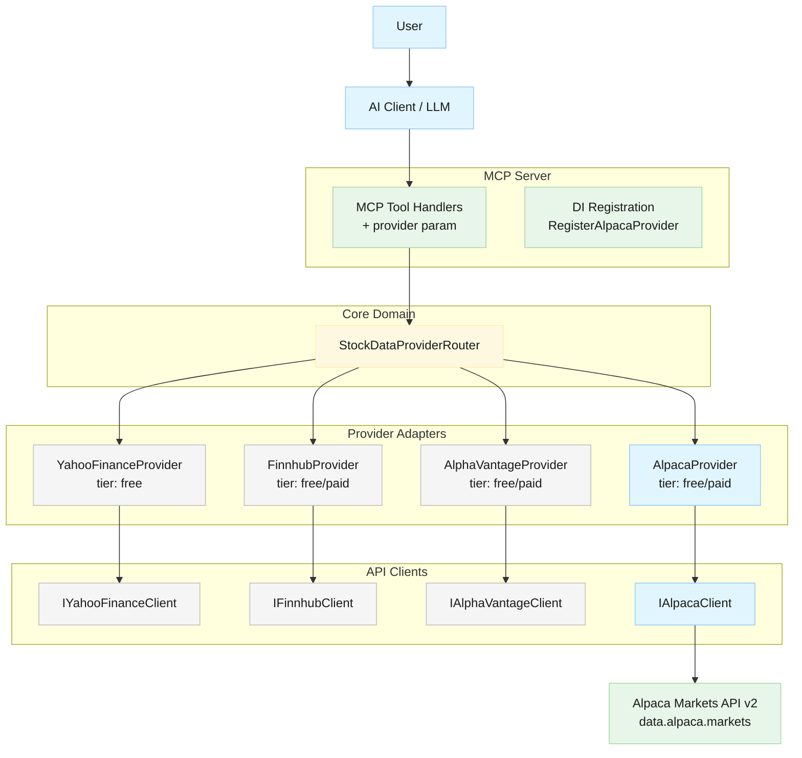
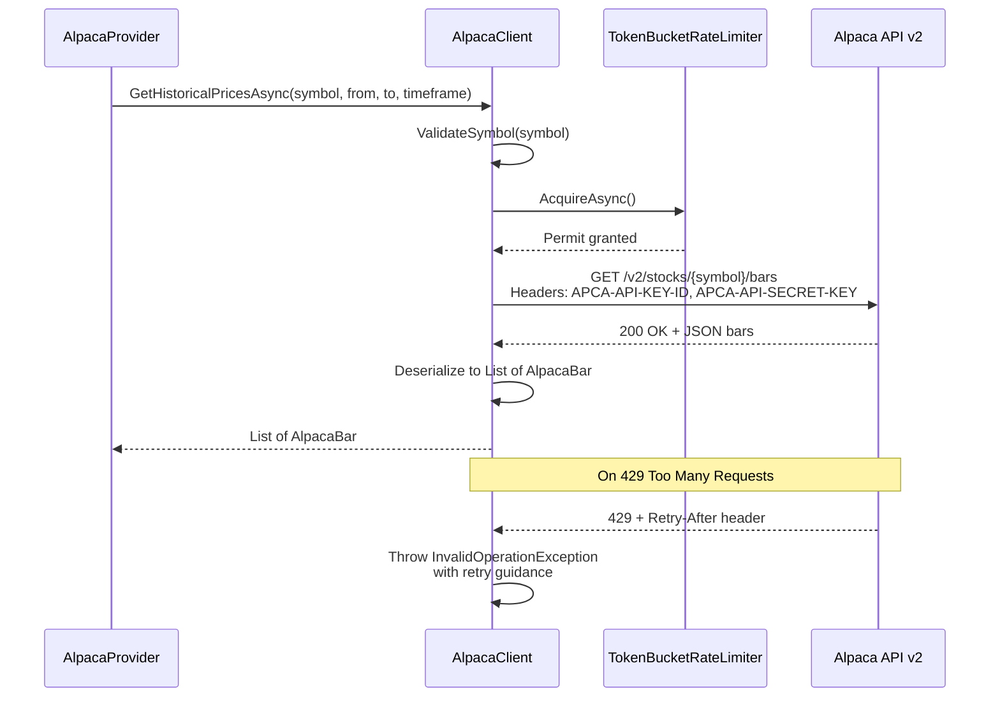
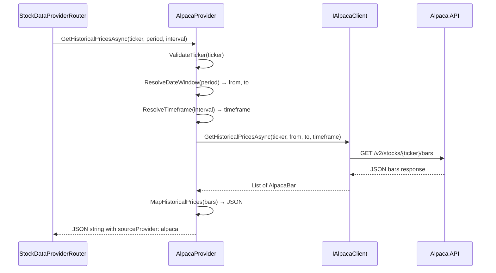
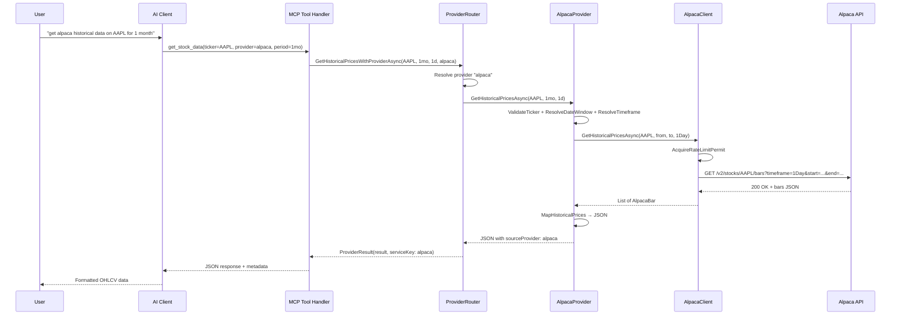
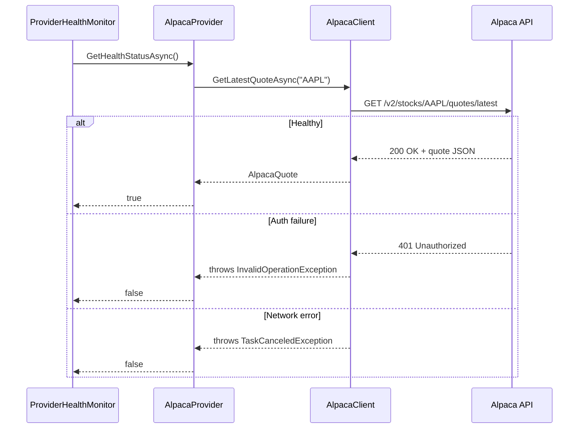
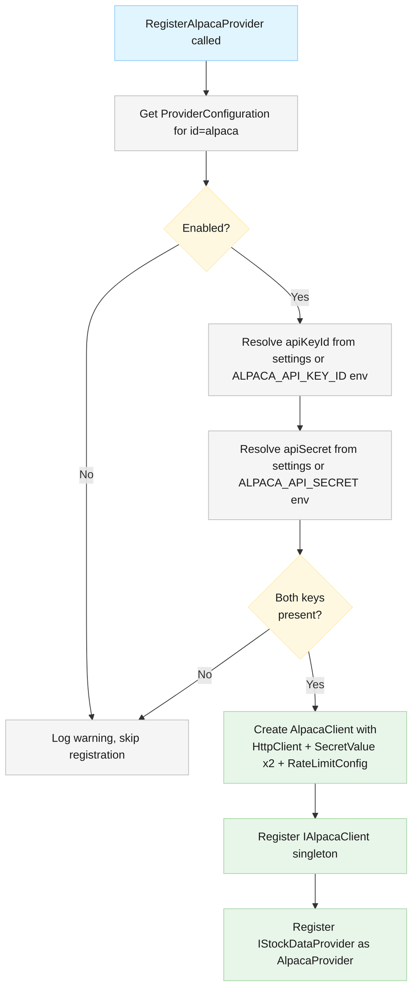

# Architecture: Alpaca Markets Provider (Issue #29)

## Document Info

- **Feature Spec**: [issue-29-finrl-provider.md](../features/issue-29-finrl-provider.md)
- **Canonical Architecture**: [stock-data-aggregation-canonical-architecture.md](stock-data-aggregation-canonical-architecture.md)
- **Provider Selection**: [provider-selection-architecture.md](provider-selection-architecture.md)
- **Status**: Draft

## System Overview

The Alpaca Markets provider adds a fourth data provider to the StockData.Net MCP server, following the established provider pattern used by Yahoo Finance, Alpha Vantage, and Finnhub. Alpaca Markets is a primary data source for the FinRL (Financial Reinforcement Learning) ecosystem and offers free and paid access to historical OHLCV bars, real-time quotes, and market news via a REST API.

The integration introduces three new artifacts — an `IAlpacaClient` / `AlpacaClient` pair in the Clients layer, an `AlpacaProvider` adapter in the Providers layer, and Alpaca-specific DTO models — all wired into the existing DI container and provider router. Because Alpaca authenticates with a key-ID + secret pair (rather than a single API key), the client constructor accepts two `SecretValue` parameters, but otherwise the registration and runtime flow are identical to existing providers.

### System Diagram



## Architectural Patterns

- **Adapter Pattern** — `AlpacaProvider` adapts the `IStockDataProvider` interface to the Alpaca-specific `IAlpacaClient`, exactly as `AlphaVantageProvider` adapts `IAlphaVantageClient` and `FinnhubProvider` adapts `IFinnhubClient`.
- **Strategy Pattern** — The `StockDataProviderRouter` selects among registered `IStockDataProvider` implementations at runtime based on configuration, health, and explicit user selection.
- **Tier-Aware Capability Reporting** — `GetSupportedDataTypes(tier)` returns a different capability set for `"free"` vs `"paid"` tiers, enabling the router and `list_providers` tool to expose accurate metadata.

## Components

| Component | Responsibility | Location |
| --- | --- | --- |
| `IAlpacaClient` | Contract for Alpaca REST API calls | `StockData.Net/Clients/Alpaca/IAlpacaClient.cs` |
| `AlpacaClient` | HTTP client with rate limiting, HTTPS enforcement, auth headers | `StockData.Net/Clients/Alpaca/AlpacaClient.cs` |
| `AlpacaModels` | DTOs for Alpaca API responses and domain records | `StockData.Net/Clients/Alpaca/AlpacaModels.cs` |
| `AlpacaProvider` | `IStockDataProvider` adapter with tier-aware capabilities | `StockData.Net/Providers/AlpacaProvider.cs` |
| `RegisterAlpacaProvider` | DI registration method | `StockData.Net.McpServer/Program.cs` |

### Architecture Decision: Health Check Implementation

Health checks use a lightweight quote call (`GetLatestQuoteAsync("AAPL")`) consistent with existing providers (YahooFinanceProvider, FinnhubProvider, AlphaVantageProvider all use simple market data calls), rather than the Alpaca account endpoint (`/v2/account`). This approach avoids requiring separate trading API permissions and maintains consistency with the established provider health check pattern across the codebase.

---

## Component Design: IAlpacaClient / AlpacaClient

### Purpose

Encapsulates all HTTP communication with the Alpaca Markets REST API v2. Handles authentication, rate limiting, HTTPS enforcement, request serialization, and response deserialization. Follows the same structure as `AlphaVantageClient` and `FinnhubClient`.

### Responsibilities

- Authenticate every request via `APCA-API-KEY-ID` and `APCA-API-SECRET-KEY` HTTP headers
- Enforce HTTPS-only base address (reject non-TLS URIs at construction time)
- Apply `TokenBucketRateLimiter` (200 requests/minute for free tier by default; configurable via `RateLimitConfiguration`)
- Serialize query parameters and deserialize JSON responses into Alpaca-specific DTOs
- Validate input symbols before making API calls
- Sanitize error messages using `SensitiveDataSanitizer` before re-throwing

### Non-Responsibilities

- Provider selection / failover logic — handled by `StockDataProviderRouter`
- Tier detection / capability reporting — handled by `AlpacaProvider`
- Health caching — handled by `ProviderHealthMonitor`

### Dependencies

| Depends On | Purpose | Interface Type |
| --- | --- | --- |
| `HttpClient` | HTTP transport to Alpaca API | Direct (injected) |
| `SecretValue` (x2) | API key ID and API secret storage | Direct (constructor) |
| `TokenBucketRateLimiter` | Rate limiting | Direct (internal) |
| `RateLimitConfiguration` | Rate limit settings | Direct (constructor) |
| `SensitiveDataSanitizer` | Error message sanitization | Static |

| Depended On By | Purpose |
| --- | --- |
| `AlpacaProvider` | Calls client methods for each `IStockDataProvider` operation |

### Public API / Operations

- **`GetHistoricalPricesAsync(symbol, from, to, timeframe, ct)`** — Calls `GET /v2/stocks/{symbol}/bars`; returns `List<AlpacaBar>`
- **`GetLatestQuoteAsync(symbol, ct)`** — Calls `GET /v2/stocks/{symbol}/quotes/latest`; returns `AlpacaQuote?` (also used for health checks)
- **`GetNewsAsync(symbol, from, to, ct)`** — Calls `GET /v1beta1/news?symbols={symbol}`; returns `List<AlpacaNewsArticle>`
- **`GetMarketNewsAsync(ct)`** — Calls `GET /v1beta1/news` (no symbol filter); returns `List<AlpacaNewsArticle>`

### Constructor Contract

```
AlpacaClient(
    HttpClient httpClient,
    SecretValue apiKeyId,
    SecretValue apiSecret,
    RateLimitConfiguration? rateLimit = null)
```

- Validates `httpClient.BaseAddress` uses HTTPS; throws `InvalidOperationException` otherwise
- Creates `TokenBucketRateLimiter` with `rateLimit.RequestsPerMinute` (default: 200)

### Authentication

Alpaca uses header-based authentication (no query-string API keys):

- `APCA-API-KEY-ID: <key_id>`
- `APCA-API-SECRET-KEY: <secret>`

Headers are set per-request (not on the shared `HttpClient.DefaultRequestHeaders`) to avoid cross-thread mutation issues.

### Interaction Diagram



### Error Handling

| Error Case | Handling Strategy | User Impact |
| --- | --- | --- |
| Invalid symbol format | `ArgumentException` thrown before HTTP call | Immediate error with validation message |
| HTTP 404 (symbol not found) | Return `null` or empty list | Provider translates to `ProviderException` with 404 |
| HTTP 401/403 (auth failure) | Throw `InvalidOperationException` with sanitized message | Health check marks provider unhealthy |
| HTTP 429 (rate limited) | Throw `InvalidOperationException` with `Retry-After` value if available | Caller receives rate-limit error with retry guidance |
| HTTP 5xx (server error) | Throw `InvalidOperationException` with sanitized message | Router can failover to next provider |
| Network timeout | `TaskCanceledException` propagates | Router can failover to next provider |
| Rate limiter queue full | Throw `InvalidOperationException` "Rate limit exceeded" | Caller receives rate-limit error |

---

## Component Design: AlpacaProvider

### Purpose

Adapts the `IStockDataProvider` interface to `IAlpacaClient`, mapping generic stock-data operations to Alpaca-specific API calls. Manages tier-aware capability reporting and translates Alpaca responses into the canonical JSON format expected by the MCP tool handlers.

### Responsibilities

- Implement all `IStockDataProvider` methods
- Map period strings (`"1mo"`, `"1y"`, etc.) to date ranges (start/end `DateTime`)
- Map interval strings (`"1m"`, `"5m"`, `"1d"`, etc.) to Alpaca timeframe values (`"1Min"`, `"5Min"`, `"1Day"`, etc.)
- Serialize responses to JSON with `sourceProvider: "alpaca"` metadata
- Report tier-aware capabilities via `GetSupportedDataTypes(tier)`
- Throw `TierAwareNotSupportedException` for unsupported methods
- Validate ticker symbols before delegating to client
- Wrap all client calls in `ExecuteSafelyAsync` for consistent error handling and logging

### Non-Responsibilities

- HTTP communication — delegated to `AlpacaClient`
- Rate limiting — handled inside `AlpacaClient`
- Provider routing / failover — handled by `StockDataProviderRouter`
- Circuit breaking — handled by `StockDataProviderRouter`

### Dependencies

| Depends On | Purpose | Interface Type |
| --- | --- | --- |
| `IAlpacaClient` | Alpaca API access | Interface (injected) |
| `ILogger<AlpacaProvider>` | Structured logging | Interface (injected) |

| Depended On By | Purpose |
| --- | --- |
| `StockDataProviderRouter` | Routes requests to this provider |
| MCP Tool Handlers | Via router — provider appears in `list_providers` |

### Provider Identity

| Property | Value |
| --- | --- |
| `ProviderId` | `"alpaca"` |
| `ProviderName` | `"Alpaca Markets"` |
| `Version` | `"1.0.0"` |

### Tier-Aware Capabilities

| Data Type | Free Tier | Paid Tier |
| --- | --- | --- |
| `historical_prices` | Supported (IEX data) | Supported (SIP data) |
| `stock_info` | Supported (IEX quotes) | Supported (SIP quotes) |
| `news` | Not available | Supported |
| `market_news` | Not available | Supported |
| `stock_actions` | Not supported | Not supported |
| `financial_statement` | Not supported | Not supported |
| `holder_info` | Not supported | Not supported |
| `option_expiration_dates` | Not supported | Not supported |
| `option_chain` | Not supported | Not supported |
| `recommendations` | Not supported | Not supported |

Implementation:

- `FreeCapabilities` — static `IReadOnlySet<string>`: `{ "historical_prices", "stock_info" }`
- `PaidCapabilities` — static `IReadOnlySet<string>`: `{ "historical_prices", "stock_info", "news", "market_news" }`
- `GetSupportedDataTypes(tier)` returns `PaidCapabilities` when `tier` equals `"paid"` (case-insensitive), otherwise `FreeCapabilities`

### IStockDataProvider Method Mapping

| Interface Method | Implementation | Alpaca API Endpoint |
| --- | --- | --- |
| `GetHistoricalPricesAsync` | Delegate to `IAlpacaClient.GetHistoricalPricesAsync` | `GET /v2/stocks/{symbol}/bars` |
| `GetStockInfoAsync` | Delegate to `IAlpacaClient.GetLatestQuoteAsync` | `GET /v2/stocks/{symbol}/quotes/latest` |
| `GetNewsAsync` | Delegate to `IAlpacaClient.GetNewsAsync` | `GET /v1beta1/news?symbols={symbol}` |
| `GetMarketNewsAsync` | Delegate to `IAlpacaClient.GetMarketNewsAsync` | `GET /v1beta1/news` |
| `GetHealthStatusAsync` | Delegate to `IAlpacaClient.GetLatestQuoteAsync("AAPL")` | `GET /v2/stocks/AAPL/quotes/latest` |
| `GetStockActionsAsync` | Throw `TierAwareNotSupportedException` | N/A |
| `GetFinancialStatementAsync` | Throw `TierAwareNotSupportedException` | N/A |
| `GetHolderInfoAsync` | Throw `TierAwareNotSupportedException` | N/A |
| `GetOptionExpirationDatesAsync` | Throw `TierAwareNotSupportedException` | N/A |
| `GetOptionChainAsync` | Throw `TierAwareNotSupportedException` | N/A |
| `GetRecommendationsAsync` | Throw `TierAwareNotSupportedException` | N/A |

### Interval Mapping

| MCP Interval | Alpaca Timeframe |
| --- | --- |
| `1m` | `1Min` |
| `5m` | `5Min` |
| `15m` | `15Min` |
| `1h` | `1Hour` |
| `1d` | `1Day` |

### Period-to-Date-Range Mapping

Follows the same `ResolveDateWindow(period)` pattern used by `AlphaVantageProvider` and `FinnhubProvider`:

| Period | Start Date Offset |
| --- | --- |
| `1d` | Now − 1 day |
| `5d` | Now − 5 days |
| `1mo` | Now − 1 month |
| `3mo` | Now − 3 months |
| `6mo` | Now − 6 months |
| `1y` | Now − 1 year |
| `2y` | Now − 2 years |
| `5y` | Now − 5 years |

### Interaction Diagram



### Error Handling

| Error Case | Handling Strategy | User Impact |
| --- | --- | --- |
| Invalid ticker format | `ArgumentException` from `ValidateTicker` | Immediate validation error |
| Quote unavailable (null from client) | Throw `InvalidOperationException` | "Alpaca quote is unavailable for '{ticker}'" |
| Unsupported method called | Throw `TierAwareNotSupportedException` | Clear message listing supported data types |
| Client throws `InvalidOperationException` | Caught by `ExecuteSafelyAsync`, logged, re-thrown with sanitized message | Provider-level error with sanitized details |
| `OperationCanceledException` | Re-thrown without wrapping | Request cancellation propagates cleanly |

---

## Component Design: Alpaca Models

### Purpose

Define Alpaca-specific DTOs for API response deserialization and domain records for passing data between `AlpacaClient` and `AlpacaProvider`.

### Domain Records

| Record | Fields | Purpose |
| --- | --- | --- |
| `AlpacaBar` | `Timestamp` (DateTime), `Open`, `High`, `Low`, `Close` (double), `Volume` (long), `TradeCount` (long), `VWAP` (double) | Historical OHLCV bar with Alpaca-specific fields for trade count and volume-weighted average price |
| `AlpacaQuote` | `BidPrice`, `AskPrice` (double), `BidSize`, `AskSize` (long), `Timestamp` (DateTime) | Latest quote |
| `AlpacaNewsArticle` | `Headline`, `Source`, `Url`, `Summary` (string), `CreatedAt` (DateTime), `Symbols` (List of string) | News article |

### API Response DTOs (internal)

| DTO | Maps To | Notes |
| --- | --- | --- |
| `AlpacaBarsResponse` | Wraps `bars` array and `next_page_token` | Paginated bars response |
| `AlpacaBarDto` | Single bar with `t`, `o`, `h`, `l`, `c`, `v` fields | JSON property names use single-letter keys |
| `AlpacaQuoteResponse` | Wraps `quote` object | Latest quote wrapper |
| `AlpacaQuoteDto` | Quote with `bp`, `ap`, `bs`, `as`, `t` fields | Bid/ask price and size |
| `AlpacaNewsResponse` | Wraps `news` array and `next_page_token` | Paginated news response |
| `AlpacaNewsDto` | Article with `headline`, `source`, `url`, `summary`, `created_at`, `symbols` | News article DTO |
| `AlpacaAccountDto` | Account with `account_blocked`, `trading_blocked`, `status` | Account status |

---

## Data Flow

### Historical Prices Request Flow



### Health Check Flow



---

## Configuration Model

### appsettings.json Provider Entry

The Alpaca provider follows the same `ProviderConfiguration` schema as existing providers. Configuration is added to the `providers` array:

| Field | Value | Description |
| --- | --- | --- |
| `id` | `"alpaca"` | Canonical provider ID |
| `type` | `"AlpacaProvider"` | Provider class name |
| `enabled` | `true` | Enable/disable toggle |
| `priority` | `4` | Lower than existing providers (Yahoo=1, Finnhub=2, AlphaVantage=3) |
| `tier` | `"free"` or `"paid"` | Commercial tier |
| `settings.apiKey` | `"${ALPACA_API_KEY}"` | Alpaca API key (env placeholder) |
| `settings.secretKey` | `"${ALPACA_SECRET_KEY}"` | Alpaca secret key (env placeholder) |
| `settings.baseUrl` | `"https://data.alpaca.markets"` | Market data API base URL (allowlist also includes `api.alpaca.markets` and `paper-api.alpaca.markets` for future extensibility) |
| `rateLimit.enabled` | `true` | Enable rate limiting |
| `rateLimit.requestsPerMinute` | `200` | Alpaca free-tier limit |
| `rateLimit.burstLimit` | `20` | Burst capacity |
| `healthCheck.enabled` | `true` | Enable health monitoring |
| `healthCheck.intervalSeconds` | `300` | 5-minute health check interval |
| `healthCheck.timeoutSeconds` | `10` | Health check timeout |

### Provider Selection Aliases

Add to `providerSelection.aliases`:

| Alias | Maps To |
| --- | --- |
| `"alpaca"` | `"alpaca"` |
| `"alpaca markets"` | `"alpaca"` |
| `"finrl"` | `"alpaca"` |

### Routing Configuration

Add `"alpaca"` to `fallbackProviderIds` arrays for `HistoricalPrices`, `StockInfo`, `News`, and `MarketNews` data types in `routing.dataTypeRouting`.

### Environment Variables

| Variable | Purpose |
| --- | --- |
| `ALPACA_API_KEY` | Alpaca API key |
| `ALPACA_SECRET_KEY` | Alpaca secret key |

---

## DI Registration: RegisterAlpacaProvider

### Purpose

Follows the exact pattern of `RegisterFinnhubProvider` and `RegisterAlphaVantageProvider` in `Program.cs`. Reads provider configuration, resolves API credentials, constructs client and provider, and registers them in the DI container.

### Registration Flow



### Key Differences from Existing Registrations

| Aspect | Existing (Finnhub, AlphaVantage) | Alpaca |
| --- | --- | --- |
| Credentials | Single `apiKey` → single `SecretValue` | `apiKey` + `secretKey` → two `SecretValue` instances |
| Env fallback | `FINNHUB_API_KEY` / `ALPHAVANTAGE_API_KEY` | `ALPACA_API_KEY` + `ALPACA_SECRET_KEY` |
| Base URL | Single URL for all operations | Single URL (`data.alpaca.markets`) with allowlist for future extensibility |
| Default rate limit | 60 rpm (Finnhub), 5 rpm (AlphaVantage) | 200 rpm |

### Base URL Configuration

The Alpaca provider uses a single base URL for all API calls, defaulting to `https://data.alpaca.markets` for market data operations (historical bars, quotes, news). Health checks also use this market data endpoint via a lightweight quote call, eliminating the need for a separate account API URL.

The implementation enforces a base URL allowlist that includes:
- `https://data.alpaca.markets` — Market data API (current implementation)
- `https://api.alpaca.markets` — Trading/account API (future extensibility)
- `https://paper-api.alpaca.markets` — Paper trading endpoint (future extensibility)

This single-host approach maintains consistency with existing providers and simplifies configuration while allowing for future expansion to trading features if needed.

---

## Security Considerations

| Concern | Approach |
| --- | --- |
| Credential storage | Both `apiKey` and `secretKey` wrapped in `SecretValue`; never exposed in logs or `ToString()` |
| Credential transmission | Auth via HTTP headers (not query string); headers set per-request, not on shared defaults |
| Transport security | HTTPS enforcement in constructor; reject non-TLS base addresses with `InvalidOperationException` |
| Error sanitization | All exception messages passed through `SensitiveDataSanitizer.Sanitize()` before logging or re-throwing |
| Log masking | `SecretValue.ToString()` returns `"[REDACTED]"`; API keys never appear in structured log properties |
| Input validation | Symbols validated and URI-escaped before inclusion in request paths |

---

## Technology Decisions

| Decision | Choice | Rationale |
| --- | --- | --- |
| HTTP client | `System.Net.Http.HttpClient` | Consistent with all existing clients; supports DI and connection pooling |
| Rate limiter | `System.Threading.RateLimiting.TokenBucketRateLimiter` | Same implementation used by `AlphaVantageClient` and `FinnhubClient` |
| JSON serialization | `System.Text.Json` | Project standard; avoids Newtonsoft dependency |
| Authentication | Per-request HTTP headers | Alpaca API requires `APCA-API-KEY-ID` and `APCA-API-SECRET-KEY` headers |
| Secret management | `SecretValue` wrapper | Project-standard secure credential handling |
| Unsupported methods | `TierAwareNotSupportedException` | Consistent with existing provider pattern for unsupported operations |

---

## Cross-Cutting Concerns

- **Security**: Coordinate with Security Architect. API key + secret pair handled via `SecretValue`. HTTPS enforced. See [Security Design](../security/security-summary.md).
- **Performance**: Historical price requests target completion within 2 seconds; quotes within 500ms. Rate limiter prevents API throttling. Connection pooling via shared `HttpClient`.
- **Scalability**: Provider is stateless beyond the rate limiter. Scales horizontally with additional server instances (each with its own rate limiter instance).
- **Observability**: All API calls logged with structured telemetry (operation, symbol, duration, HTTP status). Errors logged with full sanitized context. Health check results cached by `ProviderHealthMonitor` (5-minute interval).

---

## Testing Considerations

- Mock `IAlpacaClient` in `AlpacaProvider` unit tests to verify mapping, tier logic, error handling, and `TierAwareNotSupportedException` for unsupported methods
- Mock `HttpClient` (via `HttpMessageHandler`) in `AlpacaClient` unit tests to verify request construction, header injection, rate limiting, and error handling
- Integration tests in `StockData.Net.IntegrationTests/AlpacaIntegrationTests.cs` covering: valid symbol requests, invalid symbols, auth failures, rate limiting, and health checks
- Coordinate with Test Architect for detailed test strategy

---

## File Inventory

All new files required for this feature:

| File | Layer | Description |
| --- | --- | --- |
| `StockData.Net/Clients/Alpaca/IAlpacaClient.cs` | Client | Client interface |
| `StockData.Net/Clients/Alpaca/AlpacaClient.cs` | Client | Client implementation |
| `StockData.Net/Clients/Alpaca/AlpacaModels.cs` | Client | DTOs and domain records |
| `StockData.Net/Providers/AlpacaProvider.cs` | Provider | Provider adapter |

Files requiring modification:

| File | Change |
| --- | --- |
| `StockData.Net.McpServer/Program.cs` | Add `RegisterAlpacaProvider()` method and call it |
| `StockData.Net.McpServer/appsettings.json` | Add Alpaca provider config, aliases, and routing entries |

---

## Related Documents

- Feature Specification: [issue-29-finrl-provider.md](../features/issue-29-finrl-provider.md)
- Canonical Architecture: [stock-data-aggregation-canonical-architecture.md](stock-data-aggregation-canonical-architecture.md)
- Provider Selection: [provider-selection-architecture.md](provider-selection-architecture.md)
- Security Design: [security-summary.md](../security/security-summary.md)
- Testing Strategy: [testing-summary.md](../testing/testing-summary.md)
