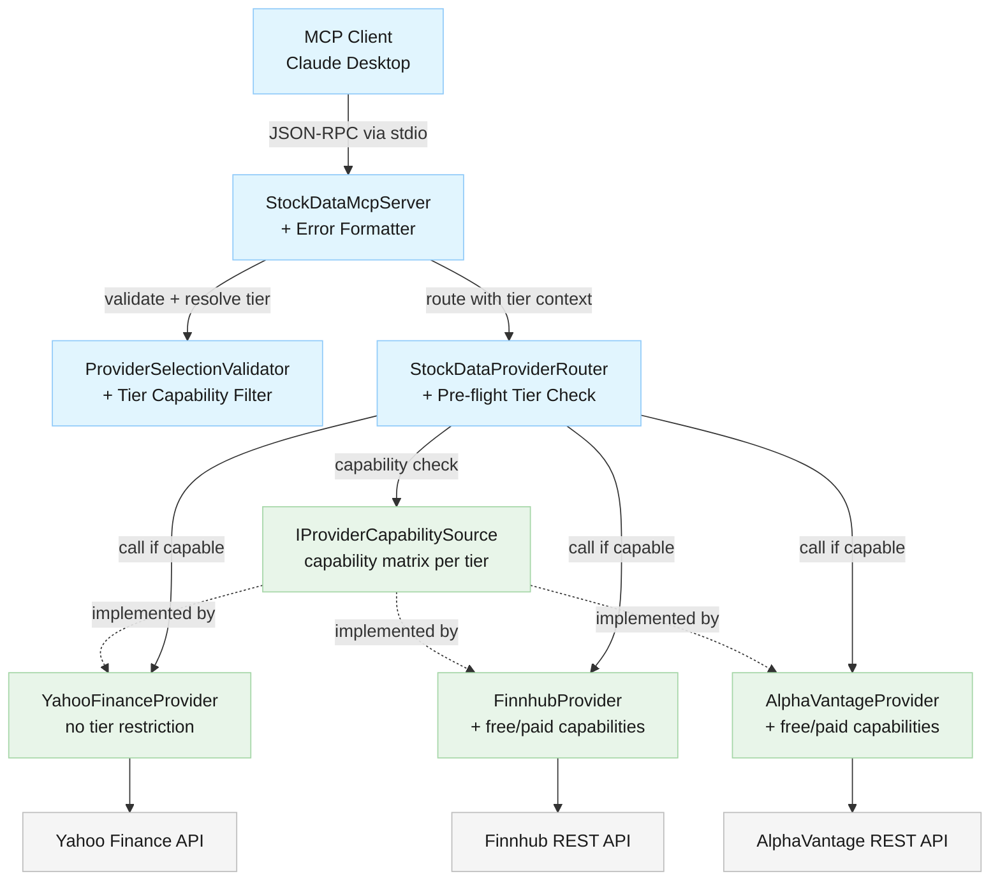
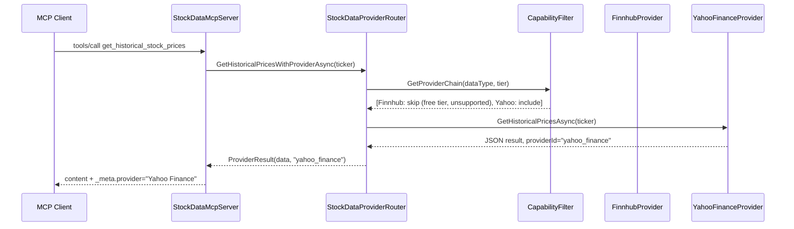
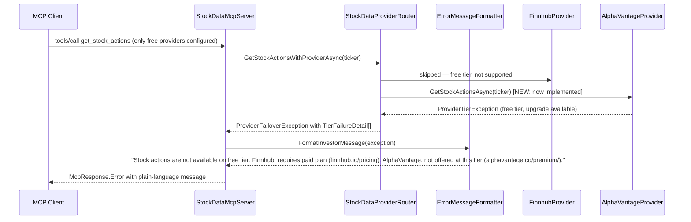

# Architecture Overview: Provider Free/Paid Tier Handling (Issue #32)

<!--
  Template owner: Architecture Design Agent
  Output directory: docs/architecture/
  Filename convention: issue-32-tier-handling-architecture.md
-->

## Document Info

- **Feature Spec**: [docs/features/issue-32-provider-free-paid-tier-handling.md](../features/issue-32-provider-free-paid-tier-handling.md)
- **Status**: Draft

---

## System Overview

This document covers two parallel tracks of work needed to make the StockData.Net MCP server correctly handle provider subscription tiers:

**Track A — Code Bug Fixes**: Six provider methods that should function on the free tier currently have no implementation or use premium API endpoints. They throw immediately or silently return empty data, which propagates as an unrecoverable error to the MCP client.

**Track B — Tier Handling**: The router's failover logic has a misclassification bug that treats `NotSupportedException` as a terminal _invalid request_ rather than a skippable capability gap. This prevents the failover chain from continuing to the next provider. A new pre-flight capability check and a richer error model are required to deliver transparent, provider-transparent fallback and investor-friendly error messages when all providers fail.

The configuration schema already supports `tier: "free"` | `"paid"` per provider. The work is entirely in the runtime logic: capability declaration, router filtering, error classification, and error message formatting.

### System Diagram

> **Note (REC-002):** `IProviderCapabilitySource` in the diagram above represents `IStockDataProvider.GetSupportedDataTypes(tier)` — it is **not** a separate interface. Each provider implements this capability method directly on `IStockDataProvider`. There is no standalone `IProviderCapabilitySource` interface; the box label is a logical annotation only.

---

## Null Error Root Cause Diagnosis

The reported error "Cannot read properties of null (reading 'task')" is a JavaScript TypeError from the MCP client runtime (TypeScript/Node.js). It occurs when the client's pending-request handler (the "task" tracking a tool call) is missing when a response or connection-close event arrives.

The root cause chain in the C# server is:

**Finding 1 — `InvalidRequest` misclassification kills the failover chain.** In `StockDataProviderRouter.ClassifyError()`, `NotSupportedException` (and its subclass `TierAwareNotSupportedException`) is mapped to `ProviderErrorType.InvalidRequest`. In `ExecuteWithFailoverResultAsync`, an `InvalidRequest` error causes an **immediate re-throw** (`throw;`) that aborts the entire failover loop — no remaining providers are tried. See [StockDataProviderRouter.cs](../../StockData.Net/StockData.Net/Providers/StockDataProviderRouter.cs) (the `catch (Exception ex)` branch in `ExecuteWithFailoverResultAsync`).

**Finding 2 — Category A client stubs have no implementations.** All six Category A endpoints throw stubs in the provider layer (`TierAwareNotSupportedException` or `NotSupportedException`) because the corresponding methods do not exist on `IFinnhubClient` or `IAlphaVantageClient`. The exception thrown synchronously becomes the only signal available when FinnhubProvider or AlphaVantageProvider is first in the failover chain. See [IFinnhubClient.cs](../../StockData.Net/StockData.Net/Clients/Finnhub/IFinnhubClient.cs) and [IAlphaVantageClient.cs](../../StockData.Net/StockData.Net/Clients/AlphaVantage/IAlphaVantageClient.cs).

**Finding 3 — AlphaVantage historical uses a premium endpoint on free tier.** `AlphaVantageClient.GetHistoricalPricesAsync` calls `TIME_SERIES_DAILY_ADJUSTED`, which AlphaVantage has moved to paid tier. For a free-tier API key, the API returns an `Information` field. The `ThrowIfRateLimited` guard only checks for "frequency" or "limit" in that string; if the premium restriction message uses different wording, `TimeSeriesDaily` is null and an empty result is silently returned without triggering failover. See [AlphaVantageClient.cs](../../StockData.Net/StockData.Net/Clients/AlphaVantage/AlphaVantageClient.cs).

**How the JavaScript null error surfaces:** When the `InvalidRequest` abort produces a terminal exception, `HandleRequestAsync` in `StockDataMcpServer` correctly serializes it as an `McpResponse.Error`. However, for some error payloads the MCP client's TypeScript SDK fails to correlate the response to the pending task (either the message is misrouted or the client has already cleaned up the task after a timeout), resulting in the null-access JavaScript crash. The fix is to prevent the malformed-flow exception entirely: correct the failover classification and add pre-flight capability skipping.

---

## Architectural Patterns

- **Pre-flight Capability Filtering** — The router checks each provider's declared capabilities before invoking it. Providers that cannot serve a request on their configured tier are skipped in `O(1)` without incurring an HTTP call, a circuit-breaker trip, or an exception.

- **Code-First Capability Matrix** — Each provider declares its own capabilities as static data in code (see [ADR-003](decisions/adr-issue-32-tier-config.md)). This co-locates tier knowledge with the implementation and is verified at compile time.

- **Error Type Stratification** — A new `ProviderErrorType.NotSupported` is distinguished from `ProviderErrorType.InvalidRequest`. `NotSupported` is failover-worthy (try next provider); `InvalidRequest` remains terminal (bad caller input, do not retry).

- **Investor-Friendly Error Formatting** — When all providers fail, a dedicated message formatter converts the per-provider failure map into plain-language explanations with upgrade guidance. This logic lives in the MCP server layer, not in the domain layer.

---

## Components

| Component | Responsibility | Location | Change Type |
| --- | --- | --- | --- |
| `FinnhubProvider` | Invoke Finnhub API; declare free/paid capabilities | `Providers/FinnhubProvider.cs` | Extend — add implementations and capability declarations |
| `AlphaVantageProvider` | Invoke AlphaVantage API; declare free/paid capabilities | `Providers/AlphaVantageProvider.cs` | Extend — add implementations and capability declarations; migrate all bare `NotSupportedException` throws to `TierAwareNotSupportedException` (required by BLK-2/SEC-32-2) to prevent tier-skip exceptions from advancing the circuit breaker failure counter |
| `YahooFinanceProvider` | Invoke Yahoo Finance API; no tier restrictions | `Providers/YahooFinanceProvider.cs` | Unchanged |
| `IFinnhubClient` | Interface for Finnhub HTTP operations | `Clients/Finnhub/IFinnhubClient.cs` | Extend — add `GetMarketNewsAsync`, `GetRecommendationTrendsAsync` |
| `FinnhubClient` | Finnhub HTTP implementation | `Clients/Finnhub/FinnhubClient.cs` | Extend — implement new interface methods |
| `IAlphaVantageClient` | Interface for AlphaVantage HTTP operations | `Clients/AlphaVantage/IAlphaVantageClient.cs` | Extend — add `GetMarketNewsAsync`, `GetStockActionsAsync` |
| `AlphaVantageClient` | AlphaVantage HTTP implementation | `Clients/AlphaVantage/AlphaVantageClient.cs` | Extend — implement new interface methods; switch historical to `TIME_SERIES_DAILY` |
| `IStockDataProvider` | Provider contract | `Providers/IStockDataProvider.cs` | Extend — add `GetSupportedDataTypes(tier)` |
| `StockDataProviderRouter` | Failover chain execution | `Providers/StockDataProviderRouter.cs` | Extend — pre-flight capability check; pass tier to filter |
| `ProviderErrorType` | Error classification enum | `Providers/ProviderErrorType.cs` | Extend — add `NotSupported` value |
| `ProviderFailoverException` | Aggregated failure information | `Providers/ProviderFailoverException.cs` | Extend — expose `TierFailureDetail` per provider |
| `ProviderSelectionValidator` | Validates and resolves provider selection | `McpServer/ProviderSelectionValidator.cs` | Extend — filter capability list by configured tier |
| `StockDataMcpServer` | MCP protocol handler; investor-friendly error formatter | `McpServer/StockDataMcpServer.cs` | Extend — add investor-friendly error message formatter; `FormatInvestorFriendlyMessage` MUST sanitize all exception strings via `SensitiveDataSanitizer.Sanitize()` before output (BLK-1/ST-32-1, ST-32-2) |
| `ConfigurationLoader` | Loads and validates `appsettings.json` provider configuration | `Configuration/ConfigurationLoader.cs` | Extend — add tier value validation: accept only `"free"` and `"paid"` (case-insensitive); unknown or legacy values (`"premium"`, `"enterprise"`) MUST cause server startup to fail with a descriptive error message; apply default `"free"` when tier is absent |

### Component Implementation Requirements

#### `StockDataMcpServer` — Error Formatter Security (BLK-1)

The `FormatInvestorFriendlyMessage` method **MUST** call `SensitiveDataSanitizer.Sanitize()` on all exception strings before including them in investor-facing output. Never use `exception.ToString()`, `.InnerException`, or `.StackTrace` in user-facing error messages. This prevents API keys, internal stack frames, and provider-internal details from leaking into the Claude Desktop response.

See [docs/security/issue-32-tier-handling-security.md](../security/issue-32-tier-handling-security.md) for test requirements ST-32-1 and ST-32-2.

#### `AlphaVantageProvider` — Exception Type Migration (BLK-2/SEC-32-2)

All bare `NotSupportedException` throws in `AlphaVantageProvider` must be replaced with `TierAwareNotSupportedException` (carrying the `availableOnPaidTier` flag). This ensures the router's `ClassifyError` method correctly maps them to `NotSupported` (failover-worthy) rather than `InvalidRequest` (terminal). See [docs/security/issue-32-tier-handling-security.md](../security/issue-32-tier-handling-security.md) for SEC-32-2.

---

## Data Flow

### Happy Path — Fall-through to next capable provider

### Error Path — All providers fail, investor-friendly message

---

## Data Model

### New / Extended Types

| Type | Description | Location |
| --- | --- | --- |
| `ProviderTierCapability` | Record: `DataType, IsSupported, RequiresPaidTier` | `Providers/ProviderTierCapability.cs` (new) |
| `TierFailureDetail` | Record: `ProviderId, ProviderName, Reason, IsTierLimitation, IsAvailableOnPaidTier, UpgradeUrl` | `Providers/TierFailureDetail.cs` (new) |
| `ProviderErrorType.NotSupported` | New enum member — failover-worthy, not terminal | `Providers/ProviderErrorType.cs` (extend) |
| `ProviderResult<T>` | Record: `T Data, string ProviderId, string ProviderDisplayName` — wraps returned data with provider attribution for the `_meta.provider` response field | `Providers/ProviderResult.cs` (new) |

**`_meta.provider` response field:** Each successful MCP tool response includes a `_meta.provider` field in the JSON payload containing a human-readable provider name (e.g., `"Yahoo Finance"`, `"Finnhub"`, `"Alpha Vantage"`). This is populated from `ProviderResult.ProviderDisplayName` in `StockDataMcpServer.HandleRequestAsync`.

### Capability Matrix — Finnhub

| Data Type | Free Tier | Paid Tier |
| --- | --- | --- |
| `StockInfo` | Supported | Supported |
| `News` (ticker) | Supported | Supported |
| `MarketNews` | Supported (to be fixed: Category A) | Supported |
| `Recommendations` | Supported (to be fixed: Category A) | Supported |
| `HistoricalPrices` | **Not supported** | Supported |
| `StockActions` | **Not supported** | Supported |
| `FinancialStatement` | **Not supported** | Supported |
| `HolderInfo` | **Not supported** | Supported |
| `OptionExpirationDates` | **Not supported** | **Not supported** |
| `OptionChain` | **Not supported** | **Not supported** |

### Capability Matrix — AlphaVantage

| Data Type | Free Tier | Paid Tier |
| --- | --- | --- |
| `StockInfo` | Supported | Supported |
| `News` (ticker) | Supported (to be fixed: Category A) | Supported |
| `HistoricalPrices` | Supported — limited to 100 points via `TIME_SERIES_DAILY` (to be fixed: Category A) | Full via `TIME_SERIES_DAILY_ADJUSTED` |
| `StockActions` | Supported via `DIVIDENDS` + `SPLITS` endpoints (to be fixed: Category A) | Supported |
| `MarketNews` | Supported via `NEWS_SENTIMENT` with no ticker (to be fixed: Category A) | Supported |
| `Recommendations` | **Not offered** (AlphaVantage has no recommendation endpoint) | **Not offered** |
| `FinancialStatement` | **Not offered** | **Not offered** |
| `HolderInfo` | **Not offered** | **Not offered** |
| `OptionExpirationDates` | **Not offered** | **Not offered** |
| `OptionChain` | **Not offered** | **Not offered** |

---

## Interfaces

### `IStockDataProvider` — new capability method

The interface gains one method that each provider implements as a static lookup:

- **Method**: `IReadOnlySet<string> GetSupportedDataTypes(string tier)`
- **Inputs**: `tier` — `"free"` or `"paid"` (defaults to `"free"`)
- **Outputs**: Set of data type strings (e.g., `"StockInfo"`, `"News"`) supported on that tier
- **Contract**: Returns the same or a superset for `"paid"` compared to `"free"`; must never throw

### `IFinnhubClient` — new methods

Two new methods for the Category A fixes:

- **`GetMarketNewsAsync(string category, CancellationToken)`** — calls Finnhub `/news?category=general`
- **`GetRecommendationTrendsAsync(string symbol, CancellationToken)`** — calls Finnhub `/stock/recommendation`

### `IAlphaVantageClient` — new methods

Two new methods for the Category A fixes:

- **`GetMarketNewsAsync(CancellationToken)`** — calls AlphaVantage `NEWS_SENTIMENT` without a ticker
- **`GetStockActionsAsync(string symbol, CancellationToken)`** — calls `DIVIDENDS` then `SPLITS` endpoints and merges results

### `StockDataProviderRouter` — tier filtering in failover

In `ExecuteWithFailoverResultAsync`, before calling each provider:

1. Look up `ProviderConfiguration.Tier` for the provider
2. Call `provider.GetSupportedDataTypes(tier)`
3. If `dataType` is not in the set, record a `TierFailureDetail` and `continue` (skip to next provider)
4. This replaces the current behavior of calling the provider and getting a `TierAwareNotSupportedException`

### `StockDataProviderRouter.ClassifyError` — updated classification

| Exception Type | Old Classification | New Classification |
| --- | --- | --- |
| `TierAwareNotSupportedException` | `InvalidRequest` (terminal) | `NotSupported` (failover) |
| `NotSupportedException` | `InvalidRequest` (terminal) | `NotSupported` (failover) |
| `ArgumentException` | `InvalidRequest` (terminal) | `InvalidRequest` (terminal — no change) |

### `ProviderFailoverException` — extended failure info

The exception gains a `IReadOnlyList<TierFailureDetail> TierFailures` property populated from the router's skip log and caught exceptions. `StockDataMcpServer.HandleRequestAsync` reads this list when formatting the final error message.

### `ProviderSelectionValidator` — tier-filtered capability reporting

`GetAvailableProviders()` is updated to:

1. Read the configured `Tier` for each provider from `McpConfiguration.Providers`
2. Call the provider's `GetSupportedDataTypes(tier)` to get the current-tier capability list
3. Return per-provider capability lists filtered to the configured tier, plus a tier annotation string

---

## Technology Decisions

| Decision | Choice | Rationale |
| --- | --- | --- |
| Capability declaration location | Code (provider class), not configuration | Provider API capabilities change only when code changes; static code is type-safe, co-located, and cannot go stale relative to the implementation. See [ADR-003](decisions/adr-issue-32-tier-config.md). |
| Historical prices — AlphaVantage | Switch from `TIME_SERIES_DAILY_ADJUSTED` to `TIME_SERIES_DAILY` on free tier | The `ADJUSTED` endpoint is premium on AlphaVantage. Free tier has `TIME_SERIES_DAILY` with up to 100 data points in compact mode. |
| Fallover classification for `NotSupportedException` | New `NotSupported` enum value (failover-worthy, not terminal) | Tier limitations are a capability gap, not an invalid request. The caller's input is valid; this provider simply cannot serve it. Failover to the next provider is the correct resolution. |
| Error message formatting | Dedicated `FormatInvestorFriendlyMessage` method in `StockDataMcpServer` | The domain layer (`ProviderFailoverException`) carries structured data; the presentation layer (MCP server) formats the user-facing string. This avoids investor-specific language in domain exceptions. |
| Upgrade URLs | Hardcoded constants in the capability registry | URLs are stable, well-known, provider-specific; no value in making them configurable. |

---

## Cross-Cutting Concerns

- **Security**: No new external inputs or authentication surfaces are introduced. The capability matrix is read-only and internal. See [docs/security/](../security/) for existing provider credential handling.
- **Performance**: Pre-flight capability filtering saves one HTTP call, one rate-limiter token, and one circuit-breaker state mutation per skipped provider. The capability lookup is `O(1)` (static hash set). Total latency impact is negative (faster on skip-heavy paths).
- **Scalability**: No change to throughput characteristics. Capability matrix is stateless and shared across all requests.
- **Observability**: The router should log each skipped provider with reason: `"Skipping {ProviderId}: dataType={DataType} not supported on {Tier} tier"`. `TierFailureDetail` instances should be logged at `Debug` level. Final investor-friendly message should not appear in server logs — only in the MCP response payload (it contains no sensitive data but no need to repeat it in structured logs).
- **Circuit Breaker and Tier Skips**: When a provider is skipped due to a tier limitation (pre-flight capability check), the skip **MUST NOT** be recorded as a failure in the circuit breaker. Only genuine API call failures (HTTP errors, timeouts, exceptions from live API calls) should advance the circuit breaker failure counter. Tier skips are expected behavior for free-tier users and are not provider health signals. This is enforced by the pre-flight design: the router records a `TierFailureDetail` and `continue`s without invoking the provider, so no circuit-breaker instrumentation code is reached.

---

## Related Documents

- Feature Specification: [docs/features/issue-32-provider-free-paid-tier-handling.md](../features/issue-32-provider-free-paid-tier-handling.md)
- ADR for Tier Config Approach: [docs/architecture/decisions/adr-issue-32-tier-config.md](decisions/adr-issue-32-tier-config.md)
- Error Handling Architecture (Issue #17): [docs/architecture/issue-17-error-handling-architecture.md](issue-17-error-handling-architecture.md)
- Security (Issue #32 Tier Handling): [docs/security/issue-32-tier-handling-security.md](../security/issue-32-tier-handling-security.md)
- Security (Provider Selection): [docs/security/provider-selection-security.md](../security/provider-selection-security.md)
- Provider Selection Architecture: [docs/architecture/provider-selection-architecture.md](provider-selection-architecture.md)
