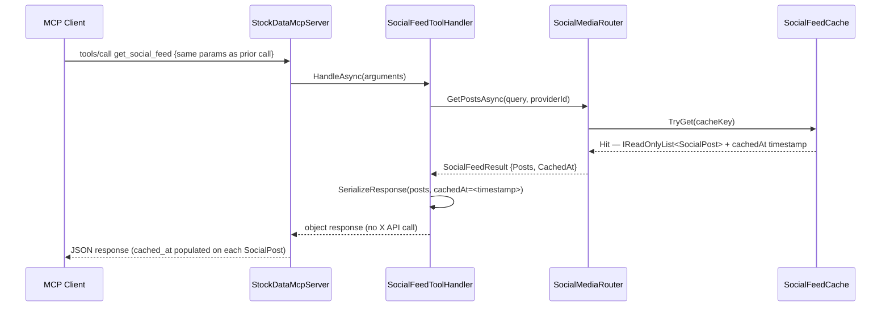
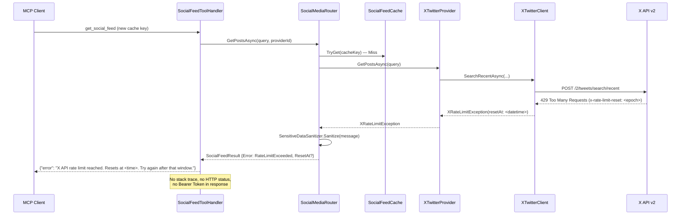

# Architecture Overview: Social Media Data Sources — X/Twitter Provider (Issue #51)

<!--
  Template owner: Architecture Design Agent
  Output directory: docs/architecture/
  Filename convention: issue-51-social-media-x-provider-architecture.md
  Related Issue: #51
-->

## Document Info

- **Feature Spec**: [docs/features/issue-51-social-media-x-provider.md](../features/issue-51-social-media-x-provider.md)
- **Canonical Architecture**: [Stock Data Aggregation](stock-data-aggregation-canonical-architecture.md)
- **Provider Selection**: [Provider Selection Architecture](provider-selection-architecture.md)
- **Tier Handling**: [Issue #32 Tier Handling Architecture](issue-32-tier-handling-architecture.md)
- **Status**: Draft
- **Last Updated**: 2026-04-12

---

## System Overview

This architecture introduces a **Social Media provider category** to StockData.Net, parallel to the existing `FinancialData` category. The `get_social_feed` MCP tool routes exclusively to `ISocialMediaProvider` implementations, keeping social media concerns entirely separate from the financial data pipeline.

The X/Twitter provider (`XTwitterProvider`) is the first concrete implementation. It authenticates with X API v2 using an OAuth 2.0 Bearer Token, maps tweet objects to a canonical `SocialPost` model, and applies a conservative in-process cache to absorb repeat calls within the X free-tier rate limit window (1 request / 15 min on search). Resilience wrapping (circuit breaker, retry) follows the same `StockDataProviderRouter` pattern already established for financial providers. Future social media providers (Reddit, Mastodon, etc.) implement `ISocialMediaProvider` and register via DI — no changes to the tool handler or routing core are required.

Secrets management, output sanitization, and rate-limit error formatting follow the patterns mandated by the [Security Design](../security/issue-32-tier-handling-security.md) for issue #32 — specifically: `SensitiveDataSanitizer.Sanitize()` on all outbound strings and no reflection of credential values in any log or response.

### System Diagram

```mermaid
flowchart TB
    Client[MCP Client\nClaude Desktop]:::blue

    subgraph McpServer[MCP Server Layer]
        SocialTool[SocialFeedToolHandler\nget_social_feed]:::green
        PV[ProviderSelectionValidator\n+ SocialMedia category]:::green
        SR[SocialMediaRouter]:::green
        Cache[SocialFeedCache\nin-process, sliding TTL]:::green
    end

    subgraph SocialProviders[Social Media Providers]
        ISM[ISocialMediaProvider]:::amber
        XProv[XTwitterProvider\nOAuth 2.0 Bearer Token]:::amber
    end

    subgraph Resilience[Resilience Infrastructure\n(existing)]
        CB[CircuitBreaker]:::gray
        Retry[RetryPolicy]:::gray
    end

    subgraph XApi[X API v2]
        Search[POST /2/tweets/search/recent]:::gray
        Timeline[GET /2/users/:id/tweets]:::gray
    end

    subgraph FinancialStack[Financial Data Stack\n(unchanged)]
        Router[StockDataProviderRouter]:::gray
        FP[IStockDataProvider\nYahoo / Finnhub / AV]:::gray
    end

    Client -->|tools/call get_social_feed| SocialTool
    SocialTool --> PV
    PV -->|valid| SR
    SR --> Cache
    Cache -->|miss| XProv
    XProv --> CB
    CB --> Retry
    Retry --> Search
    Retry --> Timeline
    XProv -.->|implements| ISM
    SR -->|routes to| ISM

    Client -->|tools/call get_stock_data\nget_market_events\nlist_providers| FinancialStack

    classDef blue fill:#e1f5fe,stroke:#90caf9,color:#1a1a1a
    classDef green fill:#e8f5e9,stroke:#a5d6a7,color:#1a1a1a
    classDef amber fill:#fff8e1,stroke:#ffecb3,color:#1a1a1a
    classDef gray fill:#f5f5f5,stroke:#bdbdbd,color:#1a1a1a
```

---

## Architectural Patterns

- **Category Segregation** — A new `ProviderCategory.SocialMedia` enum value cleanly separates social providers from `ProviderCategory.FinancialData`. The router, validator, and `list_providers` tool all filter by category, preventing category cross-contamination (financial providers are never invoked for social requests, and vice versa).

- **Strategy Pattern (extended)** — `ISocialMediaProvider` mirrors the shape of `IStockDataProvider` and `IMarketEventsProvider`: a single interface with `ProviderId`, `ProviderName`, capability declarations, and an async retrieval method. New platforms (Reddit, Mastodon) implement this interface without modifying any routing logic.

- **Dedicated Tool Handler** — `SocialFeedToolHandler` follows the `MarketEventsToolHandler` precedent: it owns parameter validation, provider dispatch, result mapping, and error formatting. It is injected into `StockDataMcpServer` and dispatched by method name, keeping the MCP server's `HandleRequestAsync` switch small.

- **In-Process Response Cache (Sliding TTL)** — A lightweight `SocialFeedCache` wraps provider calls. Cache keys are derived from a normalized `(handles_sorted, query, max_results, lookback_hours)` tuple. The TTL is set to the X API rate limit window (configurable, default 15 minutes). Cache hits bypass all HTTP calls and attach `cached_at` to the response. This prevents burst requests from exhausting free-tier quota.

- **Pre-flight Tier Capability Check (issue #32 pattern)** — `ISocialMediaProvider` exposes `GetSupportedCapabilities(tier)` returning a `SocialProviderCapabilities` record that declares `MaxResults`, `MaxLookbackHours`, and `SupportsHandleSearch` / `SupportsKeywordSearch`. `SocialMediaRouter` reads these declarations before dispatch; if the declared capability is below the requested parameter, the response includes a tier-limit advisory note — matching the issue #32 "tier transparency" non-functional requirement.

- **Circuit Breaker / Retry (existing infrastructure)** — `XTwitterProvider` wraps all X API calls in the existing `CircuitBreaker` class. Transient HTTP errors (429, 503) trigger retry with exponential back-off. A 429 specifically drives a structured rate-limit error (not a circuit-breaker trip) because repeated 429 responses are expected behaviour on the free tier, not infrastructure failure.

- **Sensitive Data Sanitization** — All exception messages and X API error bodies are passed through `SensitiveDataSanitizer.Sanitize()` before appearing in any user-facing response or log entry. The Bearer Token is consumed only at `XTwitterProvider` construction time and is never stored as an accessible field after the `HttpClient.DefaultRequestHeaders` are set.

---

## Components

| Component | Responsibility | Location | Change Type |
| --- | --- | --- | --- |
| `ISocialMediaProvider` | Abstraction for all social media providers; defines `GetPostsAsync` and `GetSupportedCapabilities` | `StockData.Net/Providers/ISocialMediaProvider.cs` | **New** |
| `SocialPost` | Canonical data model for a single social media post | `StockData.Net/Models/Social/SocialPost.cs` | **New** |
| `SocialFeedQuery` | Validated input model carrying handles, query, max_results, lookback_hours | `StockData.Net/Models/Social/SocialFeedQuery.cs` | **New** |
| `SocialProviderCapabilities` | Tier capability declaration record (MaxResults, MaxLookbackHours, etc.) | `StockData.Net/Models/Social/SocialProviderCapabilities.cs` | **New** |
| `XTwitterProvider` | X API v2 adapter; maps tweet objects to `SocialPost`; handles per-handle error isolation | `StockData.Net/Providers/Social/XTwitterProvider.cs` | **New** |
| `IXTwitterClient` | Abstraction over raw X API v2 HTTP calls (enables mocking in unit tests) | `StockData.Net/Clients/X/IXTwitterClient.cs` | **New** |
| `XTwitterClient` | HTTP client implementation; sets Bearer Token on `DefaultRequestHeaders` at construction | `StockData.Net/Clients/X/XTwitterClient.cs` | **New** |
| `SocialMediaRouter` | Dispatches `ISocialMediaProvider` calls; applies cache; formats tier advisories | `StockData.Net/Providers/Social/SocialMediaRouter.cs` | **New** |
| `SocialFeedCache` | In-process sliding-TTL cache keyed on normalized query parameters | `StockData.Net/Providers/Social/SocialFeedCache.cs` | **New** |
| `SocialFeedToolHandler` | MCP layer: validates `get_social_feed` parameters; dispatches to `SocialMediaRouter`; serializes response | `StockData.Net.McpServer/SocialFeedToolHandler.cs` | **New** |
| `StockDataMcpServer` | MCP protocol router; dispatch table | `StockData.Net.McpServer/StockDataMcpServer.cs` | **Modified** — adds `SocialFeedToolHandler` injection and `"get_social_feed"` dispatch case |
| `ProviderSelectionValidator` | Provider name validation and alias resolution | `StockData.Net.McpServer/ProviderSelectionValidator.cs` | **Modified** — adds `SocialMedia` category awareness; X provider alias `"x"` / `"twitter"` |
| `appsettings.json` | Provider configuration | `StockData.Net.McpServer/appsettings.json` | **Modified** — adds `socialMediaProviders` array; category field on each provider section |
| `Program.cs` | DI wiring and startup | `StockData.Net.McpServer/Program.cs` | **Modified** — registers `IXTwitterClient`, `XTwitterProvider`, `SocialMediaRouter`, `SocialFeedCache`, `SocialFeedToolHandler`; reads `X_BEARER_TOKEN` from environment |

---

## Interfaces

### `ISocialMediaProvider`

- **Direction**: `SocialMediaRouter` → provider implementation
- **Protocol**: In-process C# async

```csharp
public interface ISocialMediaProvider
{
    string ProviderId { get; }
    string ProviderName { get; }
    ProviderCategory Category => ProviderCategory.SocialMedia;
    SocialProviderCapabilities GetSupportedCapabilities(string tier);
    Task<IReadOnlyList<SocialPost>> GetPostsAsync(SocialFeedQuery query, CancellationToken cancellationToken = default);
}
```

### `IXTwitterClient`

- **Direction**: `XTwitterProvider` → `XTwitterClient` → X API v2
- **Protocol**: HTTPS REST (JSON)

```csharp
public interface IXTwitterClient
{
    Task<XSearchResponse> SearchRecentAsync(string query, int maxResults, DateTimeOffset startTime, CancellationToken cancellationToken = default);
    Task<XUserTimelineResponse> GetUserTimelineAsync(string userId, int maxResults, DateTimeOffset startTime, CancellationToken cancellationToken = default);
    Task<XUserLookupResponse> LookupUserByHandleAsync(string handle, CancellationToken cancellationToken = default);
}
```

### `SocialFeedToolHandler.HandleAsync`

- **Direction**: `StockDataMcpServer` → `SocialFeedToolHandler`
- **Protocol**: In-process C# async; input is `JsonElement arguments` (MCP tool arguments)

```csharp
public Task<object> HandleAsync(JsonElement arguments, CancellationToken cancellationToken = default);
```

### `SocialMediaRouter.GetPostsAsync`

- **Direction**: `SocialFeedToolHandler` → `SocialMediaRouter` → `ISocialMediaProvider`
- **Protocol**: In-process C# async

```csharp
public Task<SocialFeedResult> GetPostsAsync(SocialFeedQuery query, string? requestedProviderId, CancellationToken cancellationToken = default);
```

---

## Data Model

### `SocialPost`

| Field | Type | Nullable | Description |
| --- | --- | --- | --- |
| `PostId` | `string` | No | Platform-assigned unique identifier (X tweet ID) |
| `Source` | `string` | No | Source platform name (e.g., `"X"`) |
| `AuthorHandle` | `string` | No | Account handle without `@` prefix |
| `Content` | `string` | No | Full text content of the post |
| `PostedAt` | `DateTimeOffset` | No | UTC publish timestamp |
| `Url` | `string` | No | Canonical URL to the post on the source platform |
| `MatchedKeywords` | `IReadOnlyList<string>` | No | Keywords or cashtags matched by the query filter; empty list when no query filter applied |
| `CachedAt` | `DateTimeOffset?` | Yes | Set when the post was retrieved from the in-process cache; `null` for live responses |

### `SocialFeedQuery` (internal validated command)

| Field | Type | Nullable | Constraints |
| --- | --- | --- | --- |
| `Handles` | `IReadOnlyList<string>` | No | Normalized (leading `@` stripped); may be empty only when `Query` is non-null |
| `Query` | `string?` | Yes | Non-blank if present |
| `MaxResults` | `int` | No | 1–100 |
| `LookbackHours` | `int` | No | 1–168 |
| `RequestedProviderId` | `string?` | Yes | Null = auto-select default social provider |

### `SocialProviderCapabilities`

| Field | Type | Description |
| --- | --- | --- |
| `MaxResults` | `int` | Maximum posts returnable per call on this tier |
| `MaxLookbackHours` | `int` | Furthest history window accessible on this tier |
| `SupportsHandleSearch` | `bool` | Whether per-handle timeline retrieval is available |
| `SupportsKeywordSearch` | `bool` | Whether keyword/cashtag search is available |
| `RateLimitWindowSeconds` | `int` | Duration of the API rate limit window (used as cache TTL) |
| `RequestsPerWindow` | `int` | Allowed API calls per rate limit window |

### `appsettings.json` — Social Provider Configuration Shape

```json
"socialMediaProviders": [
  {
    "id": "x_twitter",
    "type": "XTwitterProvider",
    "enabled": true,
    "priority": 1,
    "tier": "free",
    "settings": {
      "bearerToken": "${X_BEARER_TOKEN}",
      "baseUrl": "https://api.twitter.com/2"
    },
    "rateLimit": {
      "enabled": true,
      "requestsPerWindow": 1,
      "windowSeconds": 900
    }
  }
]
```

---

## Data Flow

### `get_social_feed` — Cache Miss (Live X API Call)

```mermaid
sequenceDiagram
    participant Client as MCP Client
    participant MCP as StockDataMcpServer
    participant Handler as SocialFeedToolHandler
    participant PV as ProviderSelectionValidator
    participant Router as SocialMediaRouter
    participant Cache as SocialFeedCache
    participant XProv as XTwitterProvider
    participant XClient as XTwitterClient
    participant XAPI as X API v2

    Client->>MCP: tools/call get_social_feed {handles, query, max_results, lookback_hours}
    MCP->>Handler: HandleAsync(arguments)
    Handler->>Handler: ParseAndValidate(arguments)
    Note over Handler: Validates: at least one of handles/query non-empty,<br/>max_results 1–100, lookback_hours 1–168,<br/>strips leading @ from handles
    Handler->>PV: Validate(provider?) — SocialMedia category only
    PV-->>Handler: ValidatedProviderId = "x_twitter" (or error)
    Handler->>Router: GetPostsAsync(query, providerId)
    Router->>Cache: TryGet(cacheKey)
    Cache-->>Router: Miss
    Router->>XProv: GetPostsAsync(query)
    Note over XProv: Check GetSupportedCapabilities(tier);<br/>if requested params exceed capability,<br/>clamp and set tier advisory flag
    XProv->>XClient: LookupUserByHandleAsync(handle) [per handle]
    XClient->>XAPI: GET /2/users/by/username/:handle
    XAPI-->>XClient: XUserLookupResponse
    XProv->>XClient: GetUserTimelineAsync(userId, maxResults, startTime)
    XClient->>XAPI: GET /2/users/:id/tweets
    XAPI-->>XClient: XUserTimelineResponse
    XProv->>XProv: MapToSocialPost(tweet)
    XProv-->>Router: IReadOnlyList<SocialPost>
    Router->>Cache: Set(cacheKey, posts, TTL=windowSeconds)
    Router-->>Handler: SocialFeedResult {Posts, TierAdvisory?}
    Handler->>Handler: SerializeResponse(posts, cachedAt=null)
    Handler-->>MCP: object response
    MCP-->>Client: JSON response
```

### `get_social_feed` — Cache Hit



### Rate Limit Exhausted Path



---

## Provider Registration

Social media providers are registered separately from financial data providers in `Program.cs`:

```text
IXTwitterClient  ──registered as──►  XTwitterClient  (reads X_BEARER_TOKEN from IConfiguration)
XTwitterProvider ──registered as──►  ISocialMediaProvider
SocialFeedCache  ──singleton──►      SocialFeedCache
SocialMediaRouter──singleton──►      SocialMediaRouter (injected: IEnumerable<ISocialMediaProvider>, SocialFeedCache)
SocialFeedToolHandler──transient──►  SocialFeedToolHandler
```

The `StockDataMcpServer` constructor gains an optional `SocialFeedToolHandler? socialFeedToolHandler` parameter (defaulting to a no-op handler when X credentials are absent), consistent with how `MarketEventsToolHandler` is already injected.

`X_BEARER_TOKEN` is read at DI composition time via `IConfiguration` (environment variables source). The value is immediately placed into `HttpClient.DefaultRequestHeaders` and the original string reference is released. It is never stored as a property, logged, or returned in any response. `ConfigurationLoader` validation at startup emits a warning (not a fatal error) when the token is absent — this degrades the `get_social_feed` tool to a "provider not configured" error rather than crashing the server.

---

## Rate Limit Handling Strategy

X API free tier enforces a **1 request per 15 minutes** limit on `POST /2/tweets/search/recent`. The timeline endpoint has a separate limit. The strategy to respect these limits without over-engineering:

| Scenario | Handling |
| --- | --- |
| Request within cache TTL window | Cache hit; X API not called |
| Request after TTL expiry | Live call; cache refreshed |
| 429 response from X API | `XRateLimitException` thrown; `x-rate-limit-reset` header parsed into `ResetAt`; investor-friendly message returned; circuit breaker NOT tripped (expected behaviour) |
| 5xx from X API | Retry with exponential back-off (2 retries); if all fail, circuit breaker records failure; structured error message returned |
| X API unreachable (timeout) | Same as 5xx path |
| Handle not found (X returns 0 results or 404 for user lookup) | Per-handle `NotFoundError` aggregated; other handles in the same request continue; partial results returned with per-handle error map |

The cache TTL is driven by the `rateLimit.windowSeconds` value in `appsettings.json` for the `x_twitter` provider. This allows the TTL to be adjusted without code changes when upgrading from free to paid tier.

---

## Tier Handling (Issue #32 Pattern Applied to X API)

The issue #32 `GetSupportedCapabilities(tier)` mechanism applies directly to the X Twitter provider:

| Capability | Free Tier | Paid (Basic) Tier |
| --- | --- | --- |
| `MaxResults` | 10 | 100 |
| `MaxLookbackHours` | 24 | 168 (7 days) |
| `SupportsKeywordSearch` | Yes (1 req/15 min) | Yes (higher quota) |
| `SupportsHandleSearch` | Yes (via timeline endpoint) | Yes |
| `RateLimitWindowSeconds` | 900 (15 min) | 900 (varies) |
| `RequestsPerWindow` | 1 | 15 |

When the caller requests `max_results: 50` on the free tier, `SocialMediaRouter`:

1. Reads `XTwitterProvider.GetSupportedCapabilities("free").MaxResults` → 10
2. Clamps the request to 10
3. Sets `tierAdvisory: "max_results clamped to 10 (free tier limit). Upgrade to X Basic tier for up to 100 results."` in `SocialFeedResult`
4. Returns the advisory as a `note` field in the tool response — following the issue #32 "tier transparency" non-functional requirement

The tier value is read from the `x_twitter` provider's `"tier"` field in `appsettings.json` (the same schema field used by financial providers). `ConfigurationLoader` validates that `tier` is `"free"` or `"paid"`; unknown values cause a startup failure, consistent with issue #32.

---

## Cross-Cutting Concerns

### Security

- **Secret handling**: `X_BEARER_TOKEN` is read from environment at DI composition time, placed into `HttpClient.DefaultRequestHeaders.Authorization` (`Bearer` scheme), and never stored as a field, logged, or reflected in any response. The header is set on the shared `HttpClient` instance — `DefaultRequestHeaders` are not per-request mutable state, so there is no race risk.
- **Output sanitization**: All exception messages from `XTwitterClient` pass through `SensitiveDataSanitizer.Sanitize()` before reaching the tool response. Post content from X is treated as untrusted user-supplied data: it is returned as raw JSON string values — not parsed as markup, not executed, not reflected verbatim into log format strings (use structured logging parameters).
- **Input validation**: Handles are stripped of leading `@`; query strings are trimmed; both are validated against an allowlist pattern (alphanumeric, `$`, `_`, space, `#`, max 200 chars for query) before being interpolated into X API query parameters. This prevents injection into X API query syntax.
- **Facebook exclusion**: No `FacebookProvider` or any Facebook-scoped interface is introduced at any layer. `ISocialMediaProvider` carries no Facebook-specific surface.
- **Credential absence**: When `X_BEARER_TOKEN` is absent or empty, `XTwitterProvider` is registered but `SocialMediaRouter` returns a structured "X API credentials not configured" error immediately on first call — without calling the X API or exposing partial secret data.
- **Coordinate with**: [docs/security/issue-51-social-media-x-provider-security.md](../security/) (to be created by Security Architect)

### Performance

- **Target latency**: ≤ 5 seconds for live responses under normal network conditions (X API SLA dependent)
- **Cache hit latency**: ≤ 50 ms (in-process `ConcurrentDictionary`-backed cache)
- **Async throughout**: All X API calls use `HttpClient` async methods; no blocking calls on thread pool threads
- **Per-handle parallelism**: When multiple handles are requested, `XTwitterProvider` launches user lookup calls in parallel (`Task.WhenAll`) and collects results; timeline calls follow in parallel after user ID resolution

### Scalability

- The in-process `SocialFeedCache` is node-local. This is appropriate for the current single-process MCP server deployment model. If the server is scaled horizontally in future, extract to a distributed cache (Redis) behind the same `ISocialFeedCache` interface.
- Rate limit quota is shared across all concurrent MCP client sessions on the same server process. The cache absorbs duplicate requests within the window, but high concurrency with diverse query parameters can still exhaust free-tier quota. A request-coalescing queue (`SemaphoreSlim`) should be considered if concurrent session counts grow significantly.

### Observability

- `SocialFeedToolHandler` logs at `Information` level: provider selected, number of posts returned, whether cache was hit, lookback window applied
- `XTwitterProvider` logs at `Debug` level: X API endpoint called, response status, post count per handle
- Rate limit errors logged at `Warning` level with reset timestamp
- Circuit breaker state transitions logged at `Warning` level
- All log parameters use structured logging (Serilog/MEL message templates) — post content and handles are passed as template parameters, never interpolated into the format string, to avoid log injection

---

## Integration Points with Existing Provider Selection

### `ProviderSelectionValidator`

A new `ProviderCategory.SocialMedia` enum value is added. `ProviderSelectionValidator` gains a category-aware `Validate(string? provider, ProviderCategory category)` overload. When `get_social_feed` calls `Validate(providerParam, ProviderCategory.SocialMedia)`, only providers registered in the social media category are considered valid — requesting `provider: "yahoo"` from `get_social_feed` returns a structured error: `"yahoo_finance is a financial data provider and cannot be selected for get_social_feed"`.

### `list_providers` Tool

`list_providers` output is extended to include a `"category"` field per provider entry (`"FinancialData"` or `"SocialMedia"`). The `StockDataMcpServer` aggregates both `IStockDataProvider` registrations and `ISocialMediaProvider` registrations into the list response. No changes to the `list_providers` tool schema or parameter surface are required.

### Financial Provider Stack (No Regression)

The `StockDataProviderRouter`, `IStockDataProvider` implementations, `CircuitBreaker`, and all existing MCP tools (`get_stock_data`, `get_historical_prices`, `get_market_events`) are not modified by this feature. `SocialFeedToolHandler` and `SocialMediaRouter` are entirely independent of `StockDataProviderRouter`. The `CircuitBreaker` class is reused (not modified) with a separate instance keyed to `"x_twitter"`.

---

## Technology Decisions

| Decision | Choice | Rationale |
| --- | --- | --- |
| Social provider abstraction | New `ISocialMediaProvider` interface (parallel to `IMarketEventsProvider`) | Social media operations (handles, keyword search) do not overlap with financial operations; a separate interface prevents forcing financial semantics onto social methods and vice versa |
| X API authentication | OAuth 2.0 Bearer Token (App-only auth) | Sufficient for read-only public tweet access; no user-delegated OAuth 2.0 PKCE required; simpler secret management (single env var) |
| Rate limit mitigation | In-process sliding-TTL cache | Eliminates repeat API calls within the window; zero infrastructure dependency; consistent with existing architecture (single-process server) |
| Cache key strategy | Normalized `(sorted_handles, trimmed_query, max_results, lookback_hours)` tuple hash | Deterministic across call order; prevents trivially different calls from each burning a rate limit slot |
| 429 handling | Structured error (not circuit breaker trip) | 429 on free tier is anticipated steady-state behaviour, not a provider health failure. Tripping the circuit breaker would incorrectly block subsequent calls after the window resets. |
| Per-handle error isolation | Collect partial results; return successful handles' posts alongside per-handle error map | Consistent with feature spec US 1.4; prevents one invalid handle from silently discarding all other results |
| Facebook exclusion | No interface surface, no configuration, no code | Scope is explicitly X/Twitter now and open social platforms later. Facebook's Graph API requires user-delegated auth and has different regulatory considerations. Exclusion is by omission, not by active block. |
| Tier capability declarations | `GetSupportedCapabilities(string tier)` on `ISocialMediaProvider` | Reuses the issue #32 pattern already established in the codebase; keeps tier knowledge co-located with the provider implementation |

---

## Related Documents

- Feature Specification: [docs/features/issue-51-social-media-x-provider.md](../features/issue-51-social-media-x-provider.md)
- Security Design: [docs/security/issue-51-social-media-x-provider-security.md](../security/) *(to be created)*
- Test Strategy: [docs/testing/issue-51-social-media-x-provider-test-strategy.md](../testing/) *(to be created)*
- Tier Handling Architecture: [docs/architecture/issue-32-tier-handling-architecture.md](issue-32-tier-handling-architecture.md)
- Provider Selection Architecture: [docs/architecture/provider-selection-architecture.md](provider-selection-architecture.md)
- Canonical Architecture: [docs/architecture/stock-data-aggregation-canonical-architecture.md](stock-data-aggregation-canonical-architecture.md)
