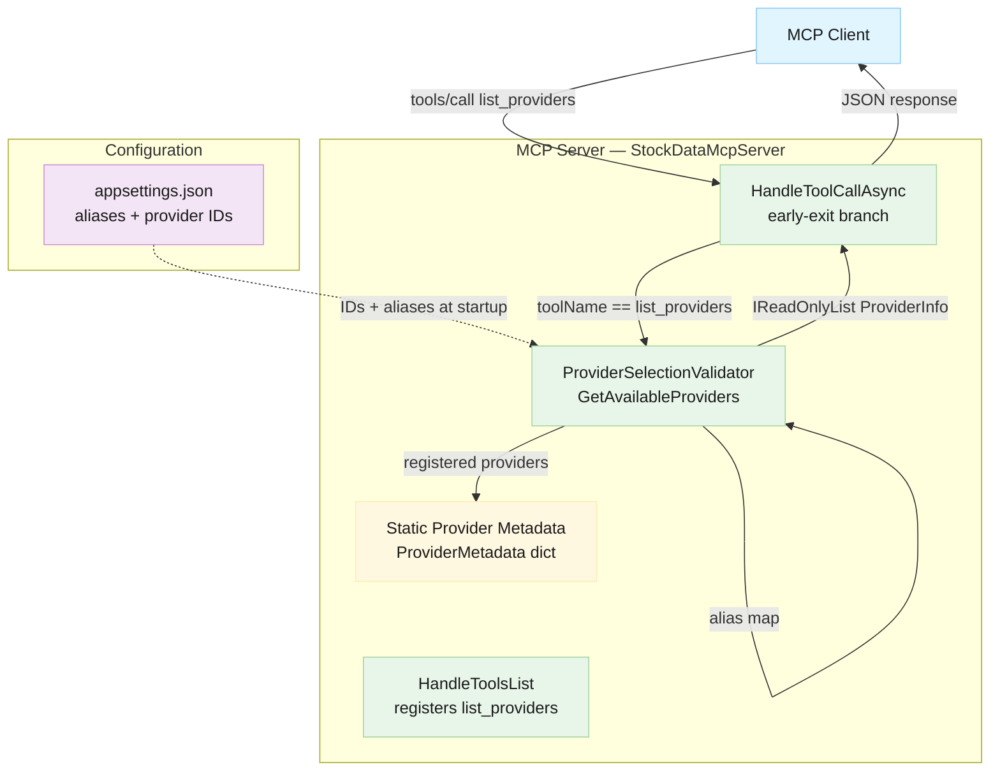
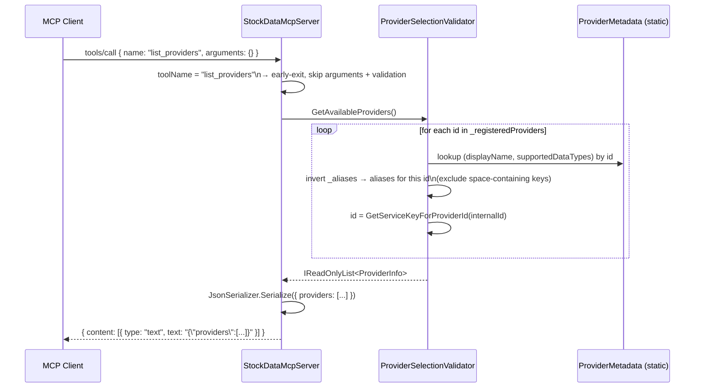

# Architecture Overview: list_providers MCP Tool

## Document Info

- **Feature Spec**: [docs/features/list-providers-tool.md](../features/list-providers-tool.md)
- **Status**: In Review
- **Issue**: #31

## System Overview

The `list_providers` tool adds a zero-argument MCP tool that returns the complete set of currently-registered and configured providers at runtime. When an MCP client invokes it, the server assembles provider metadata (id, displayName, aliases, supportedDataTypes) from two sources: the `ProviderSelectionValidator`'s runtime state (which providers are registered and what aliases are configured) and a new static per-provider capability map (which data types each provider supports). No external I/O is needed; the response is assembled entirely in-memory from state already held by the validator.

The design deliberately avoids a new abstraction layer. `ProviderSelectionValidator` already holds both the registered provider set (`_registeredProviders`) and the alias map (`_aliases`). Adding a `GetAvailableProviders()` method to this class is the minimal change that satisfies the feature requirements while keeping provider discovery co-located with provider validation logic.

Critically, `list_providers` is a **non-routing tool** — it has no `provider` parameter and does not invoke `StockDataProviderRouter`. The handler short-circuits before the provider-validation and routing blocks that all other tools go through, returning a structured JSON payload directly from the validator.

### System Diagram



## Architectural Patterns

- **Early-exit dispatch** — `list_providers` is detected immediately after `toolName` is resolved, before argument parsing or provider validation. This keeps the non-routing tool from passing through the routing pipeline that is only appropriate for data-fetch tools.
- **Static capability metadata co-located with validator** — Supported data types are declared as a static dictionary on `ProviderSelectionValidator`, keeping all provider-identity knowledge in one class. See [ADR-003](#adr-003-supported-data-types-as-static-metadata-in-providerselectionvalidator).
- **Alias map inversion at query time** — Rather than storing a reverse map at construction, `GetAvailableProviders()` inverts the existing `_aliases` dictionary on the fly to find all short-form aliases per provider. This avoids a second data structure in memory for data that changes very infrequently (only at startup).

## Components

| Component | Responsibility | Location |
| --- | --- | --- |
| `ProviderInfo` | Immutable response model for a single provider entry | `StockData.Net.McpServer/Models/McpModels.cs` |
| `ProviderSelectionValidator.GetAvailableProviders()` | Assembles `ProviderInfo` list for all registered providers | `StockData.Net.McpServer/ProviderSelectionValidator.cs` |
| `ProviderSelectionValidator.ProviderMetadata` | Static read-only dictionary mapping provider ID → display name + supported data types | `StockData.Net.McpServer/ProviderSelectionValidator.cs` |
| `StockDataMcpServer.HandleToolsList()` | Registers `list_providers` tool definition with empty input schema | `StockData.Net.McpServer/StockDataMcpServer.cs` |
| `StockDataMcpServer.HandleToolCallAsync()` | Early-exit branch for `list_providers` before provider validation | `StockData.Net.McpServer/StockDataMcpServer.cs` |

## Data Flow



### Early-Exit Position in `HandleToolCallAsync`

The early exit must occur **after** `toolName` is resolved but **before** `arguments` is accessed via `GetProperty("arguments")`. This ordering guarantees that a `list_providers` call with a missing or null `arguments` field never throws, satisfying the reliability non-functional requirement.

```text
1. Resolve toolName from params
2. Guard: throw if toolName is null/empty
3. ← list_providers early exit here →
4. Access arguments element
5. Provider validation flow (all other tools)
6. Tool switch dispatch
```

## Data Model

| Type | Description | Storage | Key Fields |
| --- | --- | --- | --- |
| `ProviderInfo` | Single provider's metadata for the `list_providers` response | In-memory (assembled per request) | `Id`, `DisplayName`, `Aliases`, `SupportedDataTypes` |
| `ProviderMetadata` (static) | Static capability map per known provider | Compiled constant (`static readonly Dictionary`) | Provider ID → `(DisplayName, SupportedDataTypes[])` |

### `ProviderInfo` — Field Definitions

| Field | Type | Source | Example |
| --- | --- | --- | --- |
| `id` | `string` | `GetServiceKeyForProviderId(internalId)` | `"yahoo"` |
| `displayName` | `string` | `ProviderMetadata[internalId].DisplayName` | `"Yahoo Finance"` |
| `aliases` | `string[]` | All `_aliases` keys (no spaces) mapping to `internalId` | `["yahoo", "yf"]` |
| `supportedDataTypes` | `string[]` | `ProviderMetadata[internalId].SupportedDataTypes` | `["historical_prices", "stock_info", ...]` |

> **Note on `id` vs `aliases`**: `id` is the preferred short-form name for the provider (the service key). It also appears in the `aliases` array. This redundancy is intentional — clients can use either field to obtain a valid `provider` parameter value, and the `id` field provides a canonical single selection.

### `ProviderMetadata` — Initial Entries

| Provider ID | displayName | supportedDataTypes |
| --- | --- | --- |
| `yahoo_finance` | `Yahoo Finance` | `historical_prices`, `stock_info`, `news`, `market_news`, `stock_actions`, `financial_statement`, `holder_info`, `option_expiration_dates`, `option_chain`, `recommendations` |
| `alphavantage` | `Alpha Vantage` | `historical_prices`, `stock_info`, `news` |
| `finnhub` | `Finnhub` | `historical_prices`, `stock_info`, `news`, `market_news` |

Providers not present in `ProviderMetadata` but present in `_registeredProviders` are included with `displayName` defaulting to the internal ID and `supportedDataTypes` defaulting to an empty array. This ensures the tool never silently drops a newly configured provider.

### Response Wire Format

```json
{
  "providers": [
    {
      "id": "yahoo",
      "displayName": "Yahoo Finance",
      "aliases": ["yahoo", "yf"],
      "supportedDataTypes": ["historical_prices", "stock_info", "news", "..."]
    }
    // ... additional providers
  ]
}
```

> **Aliases vs. feature spec**: The feature spec acceptance criteria specify `aliases: ["yahoo", "yfinance"]` for Yahoo Finance. Currently `appsettings.json` has `yf` rather than `yfinance`. The `GetAvailableProviders()` method reads aliases from config, so the implementation conformance requires updating `appsettings.json` to add `yfinance` and `alpha_vantage` as aliases for the acceptance criteria to pass. This is an implementation task, not an architectural constraint.

## Interfaces

### `ProviderSelectionValidator.GetAvailableProviders()`

- **Direction**: `StockDataMcpServer` → `ProviderSelectionValidator`
- **Protocol**: In-process method call
- **Signature**: `public IReadOnlyList<ProviderInfo> GetAvailableProviders()`
- **Guarantees**:
  - Never throws — if `_registeredProviders` is empty, returns empty list
  - Only includes providers present in `_registeredProviders` (runtime-configured set)
  - For providers absent from `ProviderMetadata`, returns sensible defaults rather than omitting or throwing
  - Aliases array contains only single-word aliases (space-containing natural-language aliases are excluded)

### Tool Registration Contract

- **Tool name**: `list_providers`
- **Input schema**: `{ "type": "object", "properties": {} }` — zero required or optional fields
- **Description**: `"Returns the list of stock data providers currently registered and available in the server. Use this tool to discover valid provider values for the provider parameter of other tools."`
- **Output**: Standard MCP content block — `{ "content": [{ "type": "text", "text": "<JSON string>" }] }`

### Impact on Existing Tool Descriptions

The `provider` parameter description on all data-fetch tools should be updated from:

> `"Optional provider override. Valid values: yahoo, alphavantage, finnhub."`

To:

> `"Optional provider override. Use the list_providers tool to discover available providers."`

This removes the hard-coded provider list from tool descriptions, satisfying requirement 9 and making tool descriptions self-maintaining when providers change.

## Technology Decisions

| Decision | Choice | Rationale |
| --- | --- | --- |
| `ProviderInfo` placement | `StockData.Net.McpServer.Models` (existing `McpModels.cs`) | Consistent with `McpRequest`, `McpResponse`, `Tool` — all MCP-layer models are in this file |
| `GetAvailableProviders()` placement | Existing `ProviderSelectionValidator` class | Class already owns all required data: `_registeredProviders`, `_aliases`, `_configuration`. No new abstraction needed. |
| Static metadata for `supportedDataTypes` | `static readonly Dictionary` in `ProviderSelectionValidator` | See ADR-003 below |
| Response shape | Plain `{ providers: [...] }` JSON in MCP `text` content block | Consistent with how all other tools return data; no special MCP protocol type needed |
| `id` field value | `GetServiceKeyForProviderId(internalId)` | Reuses existing method; produces the same short alias already documented throughout the codebase |

## Cross-Cutting Concerns

- **Security**: No user-supplied parameters are read for this tool, eliminating all injection risk. The response contains only server-side static and configuration data. No secrets are exposed — API keys are not part of `ProviderInfo`.
- **Performance**: Entirely in-memory. No external I/O, no database calls. Dictionary lookups and a single iteration over ≤10 providers. Response time target of <50ms is trivially met.
- **Reliability**: `GetAvailableProviders()` must not throw regardless of configuration state. Empty registered providers → empty array response. Missing metadata → default values. This is enforced by the method contract.
- **Maintainability**: Adding a new provider requires updating `ProviderMetadata` in `ProviderSelectionValidator`. This is an explicit, co-located change — no additional files need updating for the `list_providers` response to reflect the new provider.

---

## ADR-003: Supported Data Types as Static Metadata in `ProviderSelectionValidator`

### Status

Accepted

### Context

`list_providers` must return a `supportedDataTypes` array per provider (e.g., Yahoo Finance supports `option_chain`; Alpha Vantage does not). There is no existing mechanism to store or derive per-provider capability data. Three options were evaluated.

### Decision

Declare `supportedDataTypes` as a `static readonly Dictionary<string, (string DisplayName, string[] SupportedDataTypes)>` on `ProviderSelectionValidator`, keyed by canonical provider ID. Display names are co-located in the same dictionary, since they share the same characteristics (stable, provider-scoped, compile-time known).

### Rationale

`supportedDataTypes` represents **what data types the underlying external API can serve** — this is a capability of the external API, not a runtime state. Yahoo Finance's API will always support `option_chain`; Alpha Vantage's never will. This is stable, compile-time knowable information. Static constants are the correct representation for facts that don't change without a code deployment.

The alternative of inferring from registered tools would couple  data-fetch tool registration to capability discovery, creating an indirect dependency. The alternative of configuration-driven metadata would give operators the ability to misrepresent provider capabilities, creating misleading tool responses.

### Alternatives Considered

#### Infer from Registered MCP Tools

Map each registered MCP tool to a data type and use tool registration as the capability source.

- **Pros**: No additional code to maintain; automatically reflects available tools
- **Cons**: Conflates "the server has a tool registered" with "this provider supports this data type". A tool like `get_option_chain` is registered once; it doesn't mean all providers support it. Requires parsing `MapToolToDataType()` in reverse, which is fragile and couples tool names to capability lists.
- **Why rejected**: Wrong semantic model. Tool registration reflects server capability; `supportedDataTypes` reflects external API capability.

#### Configuration-Driven (`supportedDataTypes` in `appsettings.json`)

Add a `SupportedDataTypes` array to `ProviderConfiguration` in `appsettings.json`.

- **Pros**: Operators can customize without code changes; extensible to future providers without redeployment
- **Cons**: Creates an operational burden — every deployment must declare capability metadata that is already implied by which provider is configured. Risk of misconfiguration causing the tool to report incorrect capabilities. More complex schema with no practical benefit for an in-process data structure.
- **Why rejected**: Adds operational complexity without benefit. Providers don't change their API capabilities at runtime; this data doesn't belong in operational config.

### Consequences

- **Positive**: Simple, testable, co-located with other validator logic. Adding a provider requires one dict entry — explicit and reviewable in code review.
- **Negative**: Adding a new provider requires a code change to `ProviderSelectionValidator` in addition to the adapter implementation. This is acceptable since the adapter itself is always a code change.

### Related

- **Feature Spec**: [docs/features/list-providers-tool.md](../features/list-providers-tool.md)
- **Related ADRs**: [ADR-001](decisions/adr-001-consolidate-architecture-documentation.md)

---

## Related Documents

- Feature Specification: [docs/features/list-providers-tool.md](../features/list-providers-tool.md)
- Provider Selection Architecture: [docs/architecture/provider-selection-architecture.md](provider-selection-architecture.md)
- Source: [StockDataMcpServer.cs](../../StockData.Net/StockData.Net.McpServer/StockDataMcpServer.cs)
- Source: [ProviderSelectionValidator.cs](../../StockData.Net/StockData.Net.McpServer/ProviderSelectionValidator.cs)
- Source: [McpModels.cs](../../StockData.Net/StockData.Net.McpServer/Models/McpModels.cs)
