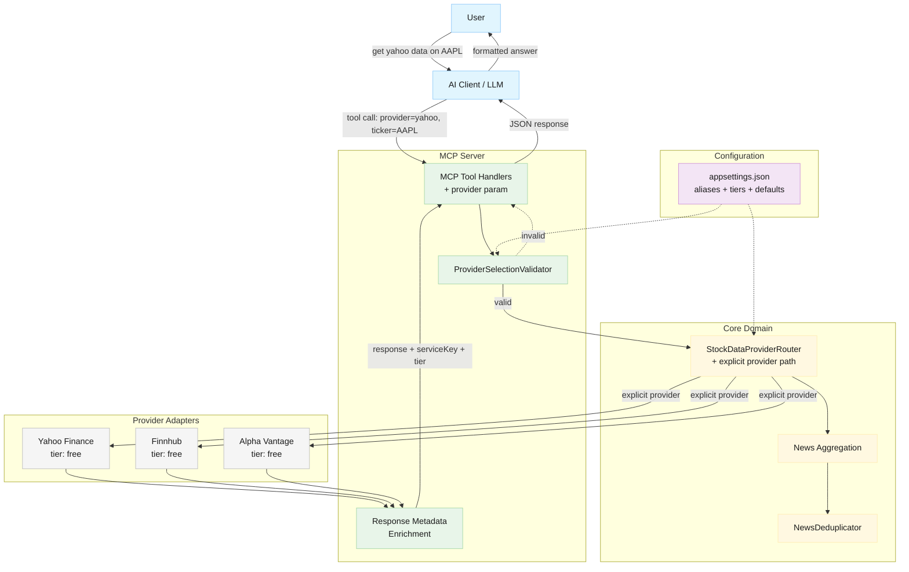
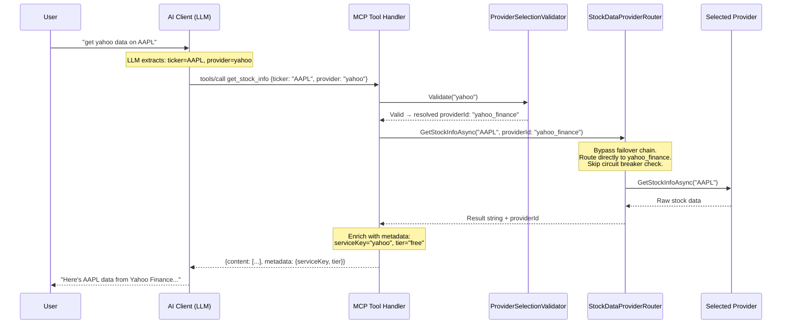
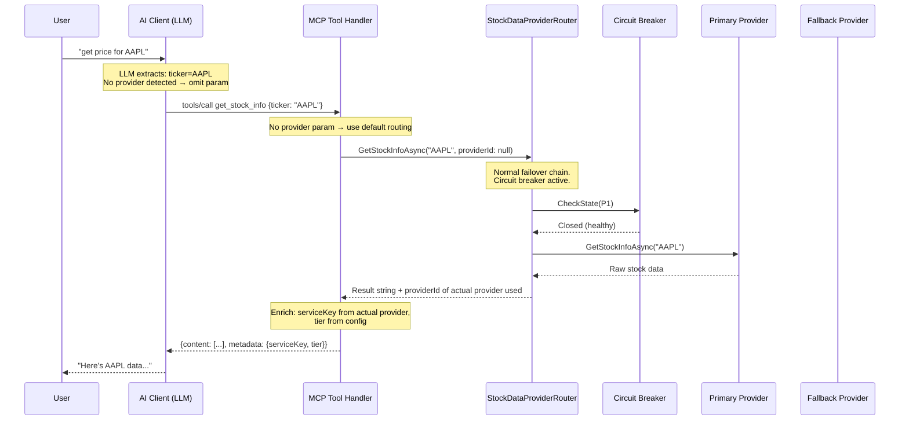
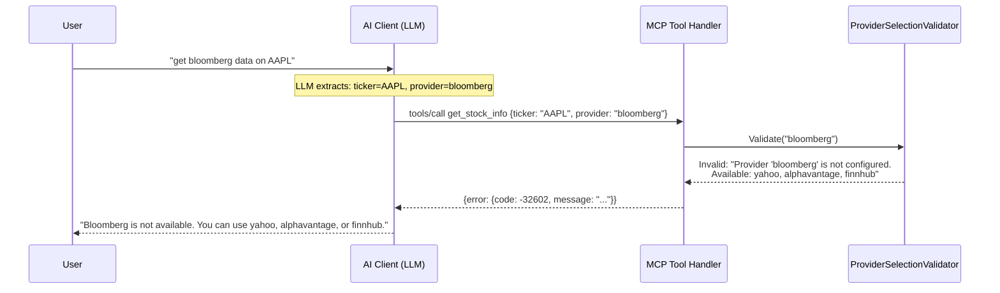

# Architecture Overview: Provider Selection via Natural Language

## Document Info

- **Feature Spec**: [Provider Selection](../features/provider-selection.md)
- **Canonical Architecture**: [Stock Data Aggregation](stock-data-aggregation-canonical-architecture.md)
- **Status**: Draft
- **Last Updated**: 2026-03-09

## System Overview

Provider Selection extends the existing stock data aggregation system to allow explicit provider targeting through the MCP tool interface. Rather than building custom NLP into the server, this architecture leverages the AI client's existing language understanding: each MCP tool gains an optional `provider` parameter that the AI populates when it detects provider intent in a user's natural language request (e.g., "get yahoo data on AAPL" → `provider: "yahoo"`). The MCP tool descriptions guide the AI to recognize and map provider names.

When a provider is explicitly selected, the router bypasses its normal failover chain and circuit breaker logic, routing directly to the requested provider. If no provider is specified, the existing default routing behavior is preserved. Every response is enriched with `serviceKey` and `tier` metadata so clients always know which provider fulfilled the request and its cost tier.

This design minimizes new code, avoids duplicating AI NLP capabilities, and keeps the provider selection concern cleanly separated from existing failover/aggregation logic.

### System Diagram



## Architectural Patterns

- **Strategy Pattern (existing)** — `IStockDataProvider` abstraction continues to define the pluggable provider contract. Provider selection adds a new dimension: choosing *which* strategy at the request level rather than only at configuration time.

- **Chain of Responsibility (extended)** — The router's failover chain is preserved for default routing. Explicit provider selection short-circuits the chain, routing directly to a single provider.

- **Parameter Injection via Tool Schema** — Instead of building NLP into the server, provider intent is captured through MCP tool parameter descriptions. The AI client's language model performs entity extraction and maps natural language to the `provider` parameter value. This is an emerging pattern in MCP/tool-use architectures.

- **Decorator / Enrichment** — Response metadata (`serviceKey`, `tier`) is attached at the MCP handler layer after the router returns raw provider data. This keeps the provider interface unchanged.

## Key Design Decision: NLP Lives in the AI Client

The most important architectural decision is where natural language provider parsing occurs.

| Option | Approach | Pros | Cons |
| --- | --- | --- | --- |
| **A: Server-side NLP** | Regex/keyword parser in MCP server | Full control, works with any client | Duplicates AI capability, maintenance burden, fragile |
| **B: AI client NLP (chosen)** | Optional `provider` param on MCP tools; AI fills it | Zero NLP code to maintain, leverages LLM strengths, extensible via descriptions | Depends on AI client capability, less deterministic |
| **C: Hybrid** | AI extracts, server validates | Best accuracy | Unnecessary complexity for this use case |

**Decision**: Option B. The AI client already parses natural language to extract tool parameters (ticker symbols, periods, etc.). Adding `provider` as another optional parameter follows the same pattern. The tool description includes the alias list so the AI knows which values are valid.

**Consequence**: No regex/keyword parsing code in the codebase. Provider name validation happens *after* the AI maps natural language to a provider key. If the AI maps incorrectly, the validator returns a clear error listing valid providers.

## Components

| Component | Status | Responsibility |
| --- | --- | --- |
| `StockDataMcpServer` | **Modified** | Add optional `provider` parameter to all tool definitions; enrich responses with metadata |
| `StockDataProviderRouter` | **Modified** | Accept optional `providerId` override; route directly when specified; bypass failover/circuit breaker |
| `ProviderSelectionValidator` | **New** | Validate provider name against configured providers; check availability and credentials |
| `McpConfiguration` | **Modified** | Add `providerAliases` mapping and `tier` per provider |
| `appsettings.json` | **Modified** | Add `providerSelection` configuration section |
| `IStockDataProvider` | **Unchanged** | No changes — `ProviderId` already exists and is sufficient |
| `ConfigurationLoader` | **Modified** | Validate new `providerSelection` config section at startup |

## Data Flow

### Explicit Provider Selection



### Default Provider (No Explicit Selection)



### Invalid Provider Error



## Interface Changes

### MCP Tool Definitions

Every MCP tool gains an optional `provider` parameter. The description guides the AI on valid values.

**New parameter on all tools:**

| Parameter | Type | Required | Description |
| --- | --- | --- | --- |
| `provider` | string | No | Data provider to use. Valid values: "yahoo", "alphavantage", "finnhub". If omitted, the system default is used. Aliases recognized: "alpha vantage" → "alphavantage", "yahoo finance" → "yahoo". |

**Example tool schema change** (get_stock_info):

Current `properties`:

- `ticker` (required)

New `properties`:

- `ticker` (required)
- `provider` (optional) — description includes available providers and aliases

### StockDataProviderRouter Interface

Every public data method gains an optional `providerId` parameter to override routing.

**Current signature pattern:**

```csharp
Task<string> GetStockInfoAsync(string ticker, CancellationToken ct)
```

**New signature pattern:**

```csharp
Task<string> GetStockInfoAsync(string ticker, CancellationToken ct, string? providerId = null)
```

When `providerId` is non-null, the router:

1. Skips `GetProviderChain()`
2. Looks up the provider directly in `_providers` dictionary
3. Skips circuit breaker and health monitor checks
4. Calls the provider directly
5. On failure, throws immediately (no failover)

When `providerId` is null, the router behaves exactly as it does today.

**Return type consideration:** The router currently returns `string` (raw provider data). To propagate which provider actually fulfilled the request, two options exist:

| Option | Approach | Trade-off |
| --- | --- | --- |
| A: Return tuple | `Task<(string Result, string ProviderId)>` | Clean but changes every call site |
| B: Out parameter pattern | Not applicable for async | — |
| C: Wrapper type | `Task<ProviderResult>` with Result + ProviderId fields | Clean, extensible, one-time refactor |

**Recommended:** Option C — introduce a `ProviderResult` record type. This is extensible for future metadata without further signature changes.

```csharp
record ProviderResult(string Result, string ProviderId);
```

The MCP handler maps `ProviderId` → `serviceKey` (using alias config) and looks up `tier` from provider configuration.

### Response Metadata Structure

MCP tool responses will include additional metadata alongside the existing `content` array. The MCP protocol supports a `_meta` field on tool results.

**Response structure:**

| Field | Type | Description |
| --- | --- | --- |
| `serviceKey` | string | Provider alias key (e.g., "yahoo", "alphavantage", "finnhub") |
| `tier` | string | Service tier (e.g., "free", "paid") |
| `rateLimitRemaining` | int? | Remaining rate limit quota, if exposed by the provider |

Metadata is serialized as a JSON object appended to the text content, separated by a delimiter, or included as a second content item of type `text` with role `metadata`. The recommended approach is to append a structured metadata JSON block at the end of the response text content, which preserves backward compatibility.

### ProviderSelectionValidator

**New component** in `StockData.Net.McpServer` project (co-located with the MCP handler layer that owns the provider parameter).

**Responsibilities:**

- Resolve alias to canonical provider ID (e.g., "yahoo" → "yahoo_finance", "alpha vantage" → "alphavantage")
- Validate provider ID exists in configuration
- Validate provider is enabled
- Validate provider has required credentials (API key present and non-empty)
- Return validation result with clear error messages listing available providers

**Inputs:** raw provider string from tool parameter, `McpConfiguration`  
**Outputs:** `ProviderValidationResult` — either a resolved provider ID or an error message

## Configuration Schema

### New `providerSelection` Section in appsettings.json

```json
{
  "providerSelection": {
    "aliases": {
      "yahoo": "yahoo_finance",
      "yahoo finance": "yahoo_finance",
      "yf": "yahoo_finance",
      "alphavantage": "alphavantage",
      "alpha vantage": "alphavantage",
      "av": "alphavantage",
      "finnhub": "finnhub",
      "fh": "finnhub"
    },
    "defaultProvider": {
      "HistoricalPrices": "yahoo_finance",
      "StockInfo": "yahoo_finance",
      "News": null,
      "MarketNews": null,
      "StockActions": "yahoo_finance",
      "FinancialStatement": "yahoo_finance",
      "HolderInfo": "yahoo_finance",
      "OptionExpirationDates": "yahoo_finance",
      "OptionChain": "yahoo_finance",
      "Recommendations": "yahoo_finance"
    }
  }
}
```

Note: `defaultProvider` per data type is additive to the existing `routing.dataTypeRouting[].primaryProviderId`. When `providerSelection.defaultProvider` is set for a data type, it is used as the explicit single provider (no failover). When null, existing routing behavior applies. This gives administrators two levels of default control.

### New `tier` Field on Provider Configuration

Each provider in the existing `providers[]` array gains a `tier` field:

```json
{
  "providers": [
    {
      "id": "yahoo_finance",
      "type": "YahooFinanceProvider",
      "enabled": true,
      "priority": 1,
      "tier": "free",
      ...
    },
    {
      "id": "finnhub",
      "type": "FinnhubProvider",
      "enabled": true,
      "priority": 2,
      "tier": "free",
      ...
    }
  ]
}
```

### Configuration Validation at Startup

`ConfigurationLoader` validates the new config:

- All alias values must reference a provider ID that exists in `providers[]`
- `tier` must be a non-empty string (valid values: "free", "paid" — see ADR-003)
- `defaultProvider` values (when non-null) must reference valid, enabled provider IDs
- Missing `providerSelection` section is acceptable (feature disabled gracefully)

## Component Modification Details

### 1. StockDataMcpServer (Modified)

**What changes:**

- `HandleToolsList()`: Each tool's `inputSchema.properties` gains a `provider` property with description listing valid providers
- `HandleToolCallAsync()`: Extract optional `provider` param from arguments, pass through validator, pass resolved provider ID to router
- Response construction: After receiving `ProviderResult` from router, attach `serviceKey` + `tier` metadata to the response content

**What stays the same:**

- Request/response serialization format (JSON-RPC 2.0)
- Tool names and existing parameters
- Error handling structure

### 2. StockDataProviderRouter (Modified)

**What changes:**

- All public methods gain an optional `string? providerId = null` parameter
- New private method `ExecuteWithExplicitProviderAsync()`: looks up provider directly, calls it, throws on failure (no failover)
- `ExecuteWithFailoverAsync()` and `ExecuteWithAggregationAsync()` remain unchanged
- Each public method checks: if `providerId != null` → call `ExecuteWithExplicitProviderAsync()`, else → existing behavior
- Return type changes from `Task<string>` to `Task<ProviderResult>`

**What stays the same:**

- `GetProviderChain()`, failover logic, aggregation logic, circuit breaker integration
- Health monitoring, error classification

### 3. McpConfiguration (Modified)

**What changes:**

- New `ProviderSelectionConfiguration` class added
- `ProviderConfiguration` gains `Tier` property (string, default "free")
- New `ProviderSelectionConfiguration` with `Aliases` (Dictionary<string, string>) and `DefaultProvider` (Dictionary<string, string?>)

### 4. ConfigurationLoader (Modified)

**What changes:**

- Validation logic for new `providerSelection` section
- Validate alias targets reference existing provider IDs
- Validate default provider references are valid

## Cross-Cutting Concerns

### Security

- Provider API credentials are never exposed in error messages (existing `SensitiveDataSanitizer` applies)
- The `provider` parameter is validated against a whitelist (configured aliases); no arbitrary values reach provider code
- Tier information is non-sensitive metadata safe to include in responses

### Performance

- Alias resolution is a dictionary lookup: O(1), well under the 10ms requirement
- Provider validation caches the alias map at startup; no per-request config parsing
- Explicit provider routing skips chain construction and health checks — faster than default routing
- No NLP processing on the server; the AI client handles language parsing

### Observability

- Log provider selection decisions at `Information` level: `"Provider selection: explicit={ProviderId}"` or `"Provider selection: default routing for {DataType}"`
- Log validation failures at `Warning` level with the attempted provider name
- Include `serviceKey` in structured log properties for request correlation

### Backward Compatibility

- The `provider` parameter is optional on all tools — omitting it preserves current behavior exactly
- Response metadata is appended, not replacing existing content
- Configuration changes are additive — missing `providerSelection` section means the feature is inactive
- `ProviderResult` return type is internal to the router; MCP handler adapts the interface

## Risks

| Risk | Impact | Likelihood | Mitigation |
| --- | --- | --- | --- |
| AI client doesn't populate `provider` param correctly | Medium — user must rephrase or specify manually | Low — LLMs are reliable at parameter extraction from descriptions | Clear tool descriptions with examples; validation returns helpful error with valid provider list |
| Provider alias mapping becomes stale when new providers are added | Low — configuration mismatch | Medium — human process gap | Startup validation cross-references aliases against registered providers; logs warnings for unmapped providers |
| Explicit provider bypass hides provider health issues from users | Medium — user repeatedly hits a degraded provider | Low — user chose explicitly | Include provider health hints in error messages when explicit provider fails |
| Return type change (`string` → `ProviderResult`) breaks existing tests | Low — compilation error, easily fixed | High — guaranteed to break | Planned migration: update all call sites and tests in one pass |
| `serviceKey`/`tier` metadata interpretation varies across AI clients | Low — cosmetic inconsistency | Medium — clients differ | Document metadata schema; use standard JSON structure |

## Dependencies

- **Internal**: Existing `IStockDataProvider` interface, `StockDataProviderRouter`, `McpConfiguration`, `ConfigurationLoader`
- **External**: AI client LLM capability to extract optional tool parameters from natural language
- **Blocked by**: Nothing — all prerequisite infrastructure exists
- **Blocks**: Future cost tracking features (depend on `serviceKey` + `tier` metadata)

## Related Documents

- Feature Specification: [Provider Selection](../features/provider-selection.md)
- Canonical Architecture: [Stock Data Aggregation](stock-data-aggregation-canonical-architecture.md)
- Security Design: [Security Summary](../security/security-summary.md)
- Test Strategy: [Testing Summary](../testing/testing-summary.md)
- Symbol Translation: [Symbol Translation Feature](../features/symbol-translation.md) — analogous pattern of transparent parameter mapping
