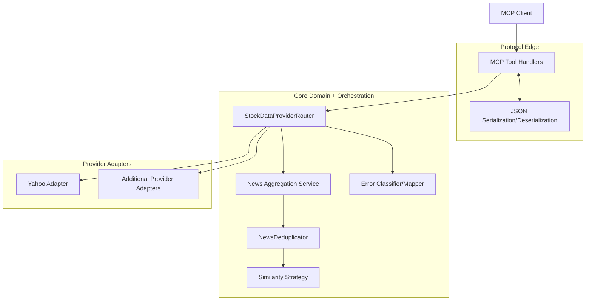
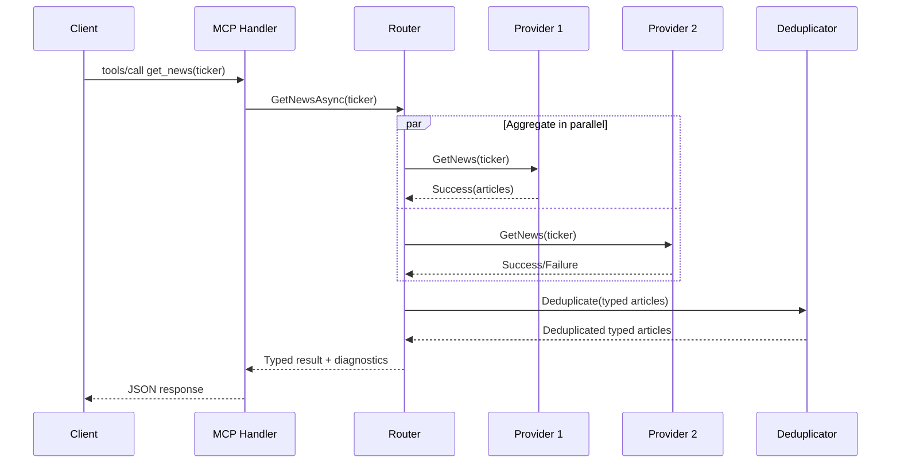
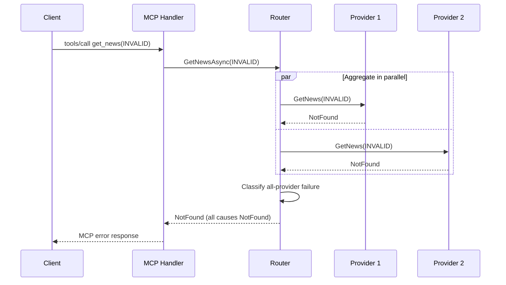

# Stock Data Aggregation Canonical Architecture

**Last Updated**: 2026-02-28  
**Status**: Final (Effective Date: 2026-02-28)

## 1) Scope, Status, and Final Decisions

### Scope

- Canonical architecture for multi-provider stock data aggregation in `FinanceMCP`.
- Consolidates and supersedes:
  - `docs/architecture/multi-source-stock-data-aggregation-architecture.md`
  - `docs/architecture/phase3-news-deduplication-architecture.md`
- Applies to routing, aggregation, deduplication, configuration, error handling, resilience, and operational behavior.

### Status

- Final
- Effective date: 2026-02-28

### Final decisions (authoritative)

1. **Deterministic startup policy**: startup is strict for invalid configuration; no runtime fallback from invalid config.
2. **Timestamp schema standardization**: dedup time window uses **hours only** (`timestampWindowHours`, integer).
3. **Default news behavior**: **aggregation + deduplication** is the default for `News` and `MarketNews`.
4. **Dedup boundary contract**: core uses typed domain models; JSON serialization/deserialization is only at the MCP protocol edge.
5. **NotFound and all-provider-failure semantics**: `NotFound` is terminal for single-source failover chains and classified distinctly in aggregate mode; all-provider-failure returns deterministic error mapping.
6. **Open questions resolved**:
   - News format is standardized to canonical domain model.
   - Caching is out of scope for this architecture release (reserved extension point only).
   - Health visibility is provided via MCP tool surface (no separate HTTP endpoint).
   - Second provider choice is implementation planning, not architecture blocking.

---

## 2) System Context and Architectural Goals

### Context

- The server exposes stock and news capabilities via MCP (JSON-RPC over stdio).
- Multiple providers are supported through a single abstraction and routing layer.
- News requires cross-provider aggregation and duplicate suppression.

### Architectural goals

- Keep compatibility with existing MCP tool contracts.
- Improve availability with provider failover and partial-result aggregation (news).
- Ensure deterministic, diagnosable startup behavior.
- Keep domain logic provider-agnostic.
- Bound latency and resource usage under predictable guardrails.

---

## 3) Logical Architecture



### Layer responsibilities

- **Protocol edge**: MCP transport, JSON parse/format, final error envelope mapping.
- **Core**: typed routing decisions, failover/aggregation, deduplication, taxonomy mapping.
- **Provider adapters**: translate external API schemas/errors into canonical domain + canonical error categories.

---

## 4) Provider Abstraction Contract

### Canonical contract principles

- Providers expose typed domain results in core (not raw JSON strings).
- Providers must map external errors to canonical categories.
- Providers must support cancellation and timeout propagation.

### Domain boundary

- Core news pipeline operates on typed `NewsArticle` and `ArticleSource` models.
- Deduplication input/output is typed collections.
- JSON serialization occurs only when building MCP response payloads at protocol edge.

### Canonical news domain shape

- `NewsArticle`: `Title`, `Url`, `Publisher`, `PublishedAt`, `Summary`, `RelatedTickers`, `Sources`, `IsMerged`, `MergedCount`.
- `ArticleSource`: `ProviderId`, `OriginalUrl`, `Publisher`.

---

## 5) Routing Modes and Selection Rules

### Modes

- **Failover mode** (default for non-news data types): sequential provider chain, stop on first success.
- **Aggregation mode** (default for `News` and `MarketNews`): execute providers in parallel, collect all successes, deduplicate, return unified output.

### Selection rules

1. Resolve configured provider chain for requested data type.
2. Filter disabled providers.
3. Apply circuit breaker readiness.
4. Execute according to mode:
   - Failover: primary → fallback(s).
   - Aggregation: parallel across chain; partial failures tolerated.
5. If zero successes:
   - classify all errors;
   - produce deterministic failure response (see section 8).

---

## 6) News Aggregation & Deduplication Architecture

### Default behavior (canonical)

- `News` and `MarketNews` use **aggregation + deduplication** by default.
- Aggregation executes concurrently across eligible providers.
- Deduplication runs after aggregation on typed domain objects.

### Dedup policy

- Strategy: Levenshtein title similarity by default.
- Threshold default: `0.85`.
- Timestamp window field: `timestampWindowHours` default `24`.
- Optional content comparison remains disabled by default (`compareContent=false`).
- Performance cap: `maxArticlesForComparison=200`.

### Merge policy

- Duplicates are clustered by similarity threshold and time-window eligibility.
- Earliest `PublishedAt` article is canonical representative.
- `Sources` contains full provider attribution.

---

## 7) Configuration Schema and Startup Validation Policy

### Deterministic startup policy (final)

- If configuration file is **absent**: load canonical built-in defaults and start.
- If configuration file is **present but invalid** (JSON/schema/env expansion/semantic references): startup **fails immediately**.
- No fallback-to-default is allowed when an explicit config file is invalid.

### Schema (canonical subset)

```json
{
  "version": "1.0",
  "providers": [
    {
      "id": "yahoo_finance",
      "type": "YahooFinanceProvider",
      "enabled": true,
      "priority": 1,
      "capabilities": ["Prices", "StockInfo", "News", "MarketNews", "Options", "Financials", "Holders", "Recommendations"]
    }
  ],
  "routing": {
    "defaultStrategy": "PrimaryWithFailover",
    "dataTypeRouting": {
      "News": {
        "aggregateResults": true,
        "primaryProviderId": "yahoo_finance",
        "fallbackProviderIds": [],
        "timeoutSeconds": 10
      },
      "MarketNews": {
        "aggregateResults": true,
        "primaryProviderId": "yahoo_finance",
        "fallbackProviderIds": [],
        "timeoutSeconds": 10
      }
    }
  },
  "newsDeduplication": {
    "enabled": true,
    "similarityThreshold": 0.85,
    "timestampWindowHours": 24,
    "compareContent": false,
    "maxArticlesForComparison": 200,
    "strategy": "Levenshtein"
  },
  "circuitBreaker": {
    "enabled": true,
    "failureThreshold": 5,
    "timeoutSeconds": 60,
    "halfOpenAfterSeconds": 30
  }
}
```

### Validation sequence

1. Load source (file or built-in defaults).
2. Expand environment variables.
3. Validate schema.
4. Validate semantic references (provider IDs, capabilities, routing links).
5. Build immutable runtime configuration snapshot.

---

## 8) Error Taxonomy and Routing Behavior Matrix

### Canonical error taxonomy

- `InvalidRequest`
- `AuthenticationError`
- `AuthorizationError`
- `RateLimitExceeded`
- `NetworkError`
- `Timeout`
- `ServerError`
- `DataParsingError`
- `ConfigurationError`
- `NotFound`
- `AllProvidersFailed` (router-level aggregate classification)

### NotFound semantics (final)

- **Failover mode**: `NotFound` from a provider is terminal for that request chain (do not continue to fallback providers for that same request).
- **Aggregation mode**:
  - provider-level `NotFound` is recorded as a failed provider result;
  - if at least one provider succeeds, return partial aggregated success;
  - if all providers return `NotFound`, return `NotFound` (not generic server error).

### All-provider-failure semantics (final)

- If no provider succeeds, router emits `AllProvidersFailed` context with per-provider categorized causes.
- Protocol edge maps to:
  - `NotFound` if all causes are `NotFound`;
  - `RateLimitExceeded` if all causes are rate-limit related;
  - otherwise `ServerError` with structured diagnostics payload.

### Routing behavior matrix

| Mode | Provider outcome mix | Result | Error classification |
| --- | --- | --- | --- |
| Failover | Primary success | Return success | N/A |
| Failover | Primary `NetworkError`, fallback success | Return success | N/A |
| Failover | Primary `NotFound` | Stop chain, return error | `NotFound` |
| Failover | All providers fail (mixed) | Return error | `AllProvidersFailed` mapped per rules |
| Aggregation | Some success + some failure | Return partial aggregated success | Include provider diagnostics |
| Aggregation | All `NotFound` | Return error | `NotFound` |
| Aggregation | All rate-limited | Return error | `RateLimitExceeded` |
| Aggregation | All fail (mixed/non-uniform) | Return error | `AllProvidersFailed` → `ServerError` |

---

## 9) Resilience Patterns

### Patterns

- Circuit breaker per provider adapter.
- Request timeout per data type.
- Failover chains for non-news operations.
- Parallel fan-out with partial-result tolerance for news operations.
- Structured retries only for transient network/timeouts (bounded attempts, jitter).
- Immutable runtime configuration snapshot to avoid drift.

---

## 10) Performance Budget and Guardrails

### Budgets

- News deduplication CPU processing target: `< 500ms` for 100 articles.
- End-to-end news request target (normal multi-provider case): `<= 1.5s` p95.

### Guardrails

- `maxArticlesForComparison` hard cap (`200` default).
- Per-provider request timeout (`10s` default for news routes).
- Skip expensive comparisons when timestamp window test fails.
- Optional content comparison remains off by default.

---

## 11) Security and Operational Observability

### Security

- Secrets must be environment-injected; never committed in config.
- Provider adapters sanitize external payloads before domain mapping.
- Error responses redact credentials/tokens.

### Observability

- Structured logs include: `requestId`, `dataType`, `providerId`, `mode`, `latencyMs`, `errorCategory`.
- Dedup metrics: `originalCount`, `deduplicatedCount`, `duplicatesRemoved`, `processingTimeMs`, `strategy`.
- MCP health visibility via dedicated health tool output (protocol-native; no extra HTTP endpoint).

---

## 12) Compatibility, Migration, and Rollout

### Compatibility

- MCP tool names and primary user-facing behavior remain compatible.
- Non-news routes preserve failover-first semantics.

### Migration rules

- Existing `timestampWindowMinutes` is **deprecated and invalid** in canonical schema.
- Canonical field is `timestampWindowHours` only.
- Existing deployments with explicit config must pass strict validation at startup.

### Rollout

1. Deploy with canonical defaults.
2. Enable additional providers progressively.
3. Monitor aggregation partial-failure rates and dedup metrics.
4. Tune thresholds/time windows only via config change control.

---

## 13) Testing Strategy and Acceptance Criteria

### Testing strategy

- Unit tests for routing mode resolution, error classification, and dedup clustering.
- Contract tests for provider adapters mapping external schemas/errors to canonical models/errors.
- Integration tests for:
  - failover success and failover termination on `NotFound`;
  - aggregation partial success;
  - all-provider-failure mapping cases.
- Performance tests for deduplication budget compliance.

### Acceptance criteria

1. Startup policy behaves deterministically as defined in section 7.
2. Configuration accepts `timestampWindowHours` and rejects `timestampWindowMinutes`.
3. Default news routes execute aggregation + deduplication.
4. Core dedup pipeline uses typed domain objects; protocol edge owns serialization.
5. Error matrix behavior (including `NotFound` and all-provider failure) matches section 8.
6. No unresolved architecture-level open questions remain.

---

## 14) Appendix: canonical JSON examples + sequence diagrams

### A. Canonical JSON example (default; partial override snippet)

This is a **partial override snippet** (not a full standalone config). It is merged with canonical defaults from section 7, where `yahoo_finance` is declared in `providers`.

```json
{
  "version": "1.0",
  "routing": {
    "defaultStrategy": "PrimaryWithFailover",
    "dataTypeRouting": {
      "News": { "aggregateResults": true, "primaryProviderId": "yahoo_finance", "fallbackProviderIds": [], "timeoutSeconds": 10 },
      "MarketNews": { "aggregateResults": true, "primaryProviderId": "yahoo_finance", "fallbackProviderIds": [], "timeoutSeconds": 10 }
    }
  },
  "newsDeduplication": {
    "enabled": true,
    "similarityThreshold": 0.85,
    "timestampWindowHours": 24,
    "compareContent": false,
    "maxArticlesForComparison": 200,
    "strategy": "Levenshtein"
  }
}
```

### B. Canonical JSON example (failover-only override for news)

```json
{
  "routing": {
    "dataTypeRouting": {
      "News": { "aggregateResults": false },
      "MarketNews": { "aggregateResults": false }
    }
  },
  "newsDeduplication": {
    "enabled": false
  }
}
```

### C. Sequence diagram: default news aggregation + dedup



### D. Sequence diagram: all providers fail in aggregation mode



---

## Related Documentation

- [Root README](../../README.md) - Project overview and quick start
- [Features Summary](../features/features-summary.md) - Feature overview and implementation status
- [Security Summary](../security/security-summary.md) - Security analysis and threat model
- [Testing Summary](../testing/testing-summary.md) - Test strategy and coverage metrics

---

**Document Status**: FINAL (Effective: 2026-02-28)  
**Approval**: Architecture baseline approved by architect review  
**Next Review**: Upon completion of Phase 3 implementation
