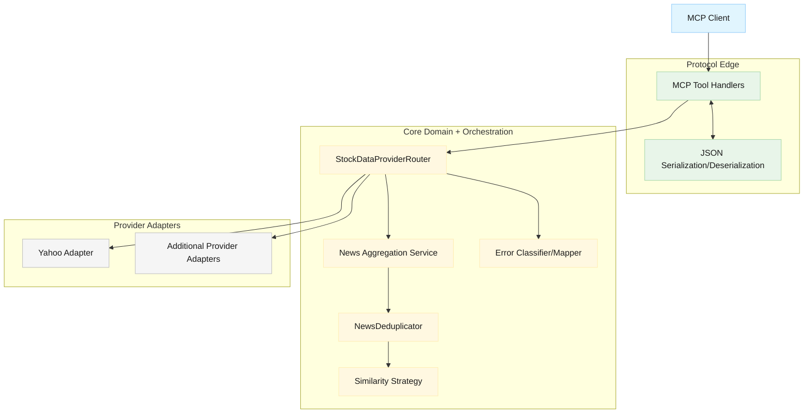
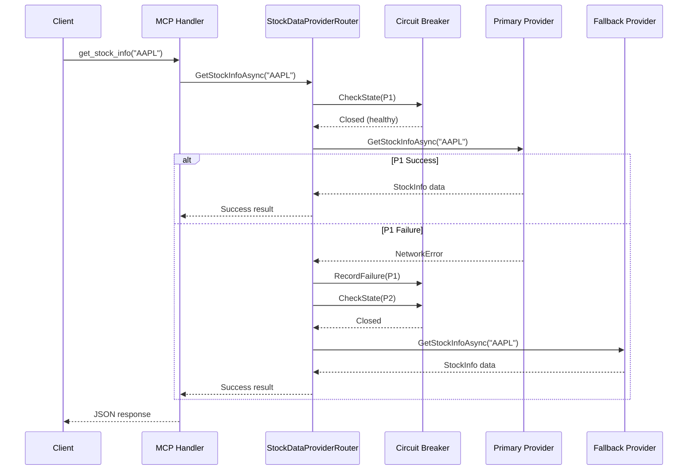
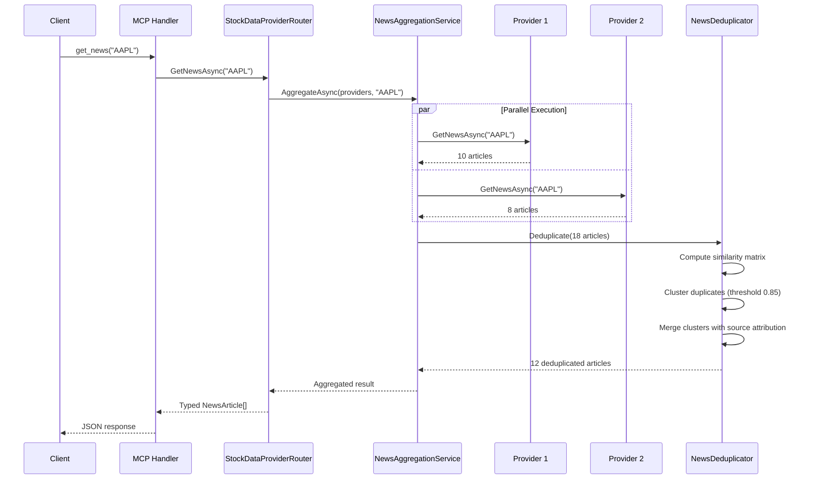
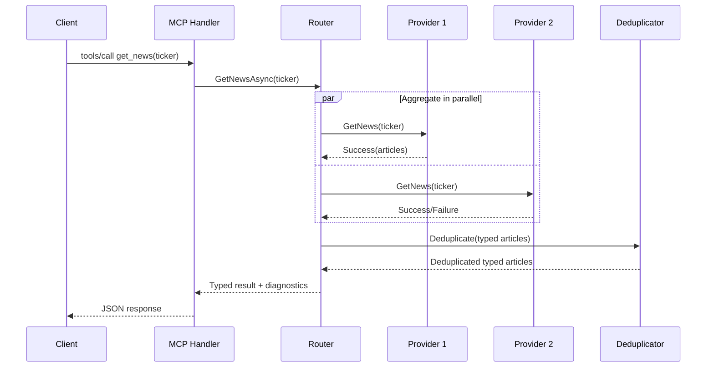
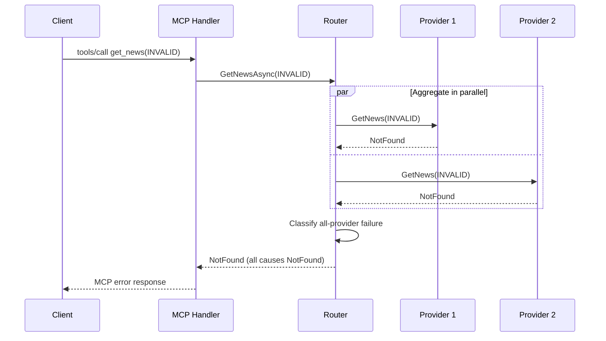

# Architecture Overview: Stock Data Aggregation

## Document Info

- **Feature Spec**: [Multi-Source Stock Data Aggregation](../features/features-summary.md)
- **Security Design**: [Security Summary](../security/security-summary.md)
- **Test Strategy**: [Testing Summary](../testing/testing-summary.md)
- **Status**: Approved (Effective Feb 28, 2026)
- **Last Updated**: 2026-02-28

## System Overview

The Stock Data Aggregation system provides a multi-provider architecture for accessing financial market data through the Model Context Protocol (MCP). The system aggregates stock prices, financial statements, news articles, and other market data from multiple providers (Yahoo Finance, Alpha Vantage, Finnhub, Polygon.io) with intelligent routing, automatic failover, and duplicate news suppression.

### Key Capabilities

- **Provider Abstraction**: Pluggable IStockDataProvider interface supporting 10 data operations
- **Intelligent Routing**: Configurable per-data-type provider selection with automatic failover
- **Resilience**: Circuit breaker pattern prevents cascading failures across providers
- **News Aggregation**: Parallel multi-provider retrieval with deduplication using Levenshtein similarity
- **Configuration-Driven**: JSON-based externalized configuration with environment variable expansion and strict startup validation

### Consolidation Notice

This architecture consolidates and supersedes:

- `docs/architecture/multi-source-stock-data-aggregation-architecture.md`
- `docs/architecture/phase3-news-deduplication-architecture.md`

### System Diagram


```mermaid
flowchart TB
    Client[MCP Client]:::blue

    subgraph Protocol[Protocol Edge]
        Handler[MCP Tool Handlers]:::green
        Serializer[JSON Serialization/Deserialization]:::green
    end

    subgraph Core[Core Domain + Orchestration]
        Router[StockDataProviderRouter]:::amber
        NewsSvc[News Aggregation Service]:::amber
        Dedup[NewsDeduplicator]:::amber
        Strategy[Similarity Strategy]:::amber
        Errors[Error Classifier/Mapper]:::amber
    end

    subgraph Providers[Provider Adapters]
        P1[Yahoo Adapter]:::gray
        P2[Additional Provider Adapters]:::gray
    end

    Client --> Handler
    Handler <--> Serializer
    Handler --> Router
    Router --> NewsSvc
    NewsSvc --> Dedup
    Dedup --> Strategy
    Router --> Errors
    Router --> P1
    Router --> P2

    classDef blue fill:#e1f5fe,stroke:#90caf9,color:#1a1a1a
    classDef green fill:#e8f5e9,stroke:#a5d6a7,color:#1a1a1a
    classDef amber fill:#fff8e1,stroke:#ffecb3,color:#1a1a1a
    classDef gray fill:#f5f5f5,stroke:#bdbdbd,color:#1a1a1a
```

## Architectural Patterns

- **Strategy Pattern**: IStockDataProvider abstraction allows pluggable provider implementations
- **Circuit Breaker**: Per-provider circuit breakers prevent cascading failures (Closed → Open → Half-Open state machine)
- **Chain of Responsibility**: Failover chains execute providers sequentially until one succeeds
- **Aggregator Pattern**: News aggregation executes providers in parallel and merges results
- **Template Method**: Routing logic delegates to mode-specific strategies (failover vs aggregation)
- **Facade**: StockDataProviderRouter simplifies multi-provider complexity for MCP handlers

## Components

> **Intentional Deviation**: Component specs are documented inline in this architecture overview rather than in separate `docs/architecture/components/` files. The system scope (single-process MCP server with ~10 components) does not warrant individual component design documents. See [ADR-001](decisions/adr-001-consolidate-architecture-documentation.md) for rationale.

| Component | Responsibility | Technology | Component Spec |
| --- | --- | --- | --- |
| IStockDataProvider | Provider abstraction defining 10 data operations | C# interface | Inline — [source](../../StockData.Net/StockData.Net/Providers/IStockDataProvider.cs) |
| StockDataProviderRouter | Central routing with failover and aggregation | C# class | Inline — [source](../../StockData.Net/StockData.Net/Providers/StockDataProviderRouter.cs) |
| YahooFinanceProvider | Yahoo Finance API adapter | C# class | Inline — [source](../../StockData.Net/StockData.Net/Providers/YahooFinanceProvider.cs) |
| CircuitBreaker | Per-provider failure prevention | C# class | Inline — [source](../../StockData.Net/StockData.Net/Resilience/CircuitBreaker.cs) |
| NewsAggregationService | Multi-provider news collection | C# class | Inline — aggregation logic in [StockDataProviderRouter](../../StockData.Net/StockData.Net/Providers/StockDataProviderRouter.cs) |
| NewsDeduplicator | Duplicate article detection and merging | C# class | Inline — [source](../../StockData.Net/StockData.Net/Deduplication/NewsDeduplicator.cs) |
| ConfigurationLoader | JSON configuration with validation | C# class | Inline — [source](../../StockData.Net/StockData.Net/Configuration/ConfigurationLoader.cs) |
| ErrorClassifier | Maps provider exceptions to canonical taxonomy | C# static class | Inline — [source](../../StockData.Net/StockData.Net/Providers/) |
| SymbolTranslator | Cross-provider symbol format conversion | C# class | Inline — [source](../../StockData.Net/StockData.Net/Providers/SymbolTranslator.cs) |
| ProviderHealthMonitor | Rolling health metrics per provider | C# class | Inline — [source](../../StockData.Net/StockData.Net/Providers/ProviderHealthMonitor.cs) |

### Component Interaction Patterns

**Request Flow (Failover Mode)**:

1. MCP Handler receives tool call
2. Router resolves provider chain for data type
3. Router executes providers sequentially until success
4. Circuit breaker checks health before each attempt
5. First successful result returns immediately

**Request Flow (Aggregation Mode)**:

1. MCP Handler receives news tool call
2. Router executes all providers in parallel
3. Aggregation Service collects all successful results
4. NewsDeduplicator processes typed article collection
5. Merged results with source attribution return

## Data Flow

### Failover Request Flow


```mermaid
sequenceDiagram
    participant Client
    participant MCP as MCP Handler
    participant Router as StockDataProviderRouter
    participant CB as Circuit Breaker
    participant P1 as Primary Provider
    participant P2 as Fallback Provider

    Client->>MCP: get_stock_info("AAPL")
    MCP->>Router: GetStockInfoAsync("AAPL")
    Router->>CB: CheckState(P1)
    CB-->>Router: Closed (healthy)
    Router->>P1: GetStockInfoAsync("AAPL")
    alt P1 Success
        P1-->>Router: StockInfo data
        Router-->>MCP: Success result
    else P1 Failure
        P1-->>Router: NetworkError
        Router->>CB: RecordFailure(P1)
        Router->>CB: CheckState(P2)
        CB-->>Router: Closed
        Router->>P2: GetStockInfoAsync("AAPL")
        P2-->>Router: StockInfo data
        Router-->>MCP: Success result
    end
    MCP-->>Client: JSON response
```

### News Aggregation and Deduplication Flow


```mermaid
sequenceDiagram
    participant Client
    participant MCP as MCP Handler
    participant Router as StockDataProviderRouter
    participant Agg as NewsAggregationService
    participant P1 as Provider 1
    participant P2 as Provider 2
    participant Dedup as NewsDeduplicator

    Client->>MCP: get_news("AAPL")
    MCP->>Router: GetNewsAsync("AAPL")
    Router->>Agg: AggregateAsync(providers, "AAPL")
    par Parallel Execution
        Agg->>P1: GetNewsAsync("AAPL")
        P1-->>Agg: 10 articles
    and
        Agg->>P2: GetNewsAsync("AAPL")
        P2-->>Agg: 8 articles
    end
    Agg->>Dedup: Deduplicate(18 articles)
    Dedup->>Dedup: Compute similarity matrix
    Dedup->>Dedup: Cluster duplicates (threshold 0.85)
    Dedup->>Dedup: Merge clusters with source attribution
    Dedup-->>Agg: 12 deduplicated articles
    Agg-->>Router: Aggregated result
    Router-->>MCP: Typed NewsArticle[]
    MCP-->>Client: JSON response
```

## Data Model

### Core Domain Entities

| Entity | Description | Key Fields | Storage |
| --- | --- | --- | --- |
| NewsArticle | Aggregated news with source attribution | Title, Url, Publisher, PublishedAt, Summary, Sources[], IsMerged | In-memory (transient) |
| ArticleSource | Provider attribution for merged articles | ProviderId, OriginalUrl, Publisher | In-memory (transient) |
| StockInfo | Stock quote and metrics | Symbol, Price, Volume, MarketCap | In-memory (transient) |
| ProviderConfig | Provider metadata and capabilities | Id, Type, Priority, Capabilities[], Enabled | In-memory (loaded at startup) |
| CircuitBreakerState | Per-provider health state | State (Closed/Open/Half-Open), FailureCount, LastFailureTime | In-memory (runtime) |
| HealthMetrics | Rolling health statistics | SuccessRate, AvgLatency, ConsecutiveFailures | In-memory (5-min window) |

### Canonical Error Taxonomy

| Error Type | Trigger Condition | Routing Behavior |
| --- | --- | --- |
| InvalidRequest | Validation failure, empty ticker | Terminal (no failover) |
| AuthenticationError | Missing/invalid API key | Terminal (config issue) |
| RateLimitExceeded | Provider throttles request | Continue failover |
| NetworkError | Connection failure, DNS error | Continue failover |
| Timeout | Request exceeds timeout threshold | Continue failover |
| NotFound | Ticker not found by provider | Terminal in failover; recorded in aggregation |
| ServerError | Provider internal error (5xx) | Continue failover |
| DataParsingError | Malformed provider response | Continue failover |
| ConfigurationError | Invalid configuration at startup | Fatal (fail startup) |
| AllProvidersFailed | All providers in chain failed | Maps to specific error based on causes |

## API / Interface Definitions

### IStockDataProvider Interface

**Direction**: Router → Provider Adapters  
**Protocol**: In-process C# interface  
**Key operations**:

- `GetStockInfoAsync(ticker, cancellationToken)` — Retrieve current quote and metrics
- `GetHistoricalPricesAsync(ticker, interval, startDate, endDate, cancellationToken)` — Retrieve OHLCV data
- `GetNewsAsync(ticker, count, cancellationToken)` — Retrieve company-specific news
- `GetMarketNewsAsync(category, count, cancellationToken)` — Retrieve market-wide news
- `GetOptionsAsync(ticker, date, cancellationToken)` — Retrieve options chain
- `GetFinancialsAsync(ticker, type, cancellationToken)` — Retrieve financial statements
- `GetHoldersAsync(ticker, type, cancellationToken)` — Retrieve institutional/insider holders
- `GetDividendsAsync(ticker, startDate, endDate, cancellationToken)` — Retrieve dividend history
- `GetStockActionsAsync(ticker, startDate, endDate, cancellationToken)` — Retrieve splits and dividends
- `GetHealthAsync(cancellationToken)` — Provider health check

**Error handling**: All methods throw typed ProviderException with canonical error categories. Router catches and classifies exceptions using ErrorClassifier.

### MCP Tool Surface

**Direction**: Client → MCP Server  
**Protocol**: JSON-RPC over stdio  
**Key tools**:

- `get_stock_info` — Maps to IStockDataProvider.GetStockInfoAsync
- `get_historical_prices` — Maps to IStockDataProvider.GetHistoricalPricesAsync
- `get_news` — Maps to aggregation + deduplication pipeline
- `get_market_news` — Maps to aggregation + deduplication pipeline
- `get_options` — Maps to IStockDataProvider.GetOptionsAsync
- `get_financials` — Maps to IStockDataProvider.GetFinancialsAsync
- `get_holders` — Maps to IStockDataProvider.GetHoldersAsync
- `get_dividends` — Maps to IStockDataProvider.GetDividendsAsync
- `get_stock_actions` — Maps to IStockDataProvider.GetStockActionsAsync
- `get_health` — Returns provider health metrics

## Technology Decisions

| Decision | Choice | Rationale | Alternatives Considered |
| --- | --- | --- | --- |
| Provider abstraction | C# interface (IStockDataProvider) | Compile-time type safety, testability with mocks, async/await support | Plugin architecture (runtime loading) — rejected for complexity |
| Configuration format | JSON with JSON Schema validation | Industry standard, environment variable support, schema validation | YAML (less strict), TOML (less common) |
| Deduplication algorithm | Levenshtein distance on titles | Simple, effective for text similarity, deterministic | MinHash/LSH (more complex), ML-based (overkill) |
| Circuit breaker state | Per-provider in-memory | Isolates failures, no shared state, fast state checks | Shared state (adds complexity), persistent state (not needed) |
| Configuration loading | Fail-fast at startup | Prevents runtime surprises, forces correct configuration | Runtime fallback (hides config errors) |
| News aggregation | Parallel async execution | Minimizes latency, provider failures isolated | Sequential (slower), reactive streams (overkill) |
| Symbol translation | Compile-time dictionary | O(1) lookups, no external dependencies, type-safe | Configuration file (slower), database (overkill) |
| Error taxonomy | 10 canonical categories + router-level aggregate | Provider-agnostic, supports intelligent routing decisions | HTTP status codes (too coarse), provider-specific (leaky) |

## Cross-Cutting Concerns

### Security

- **Secrets Management**: API keys loaded from environment variables; never committed to configuration files
- **TLS Enforcement**: All external API calls use TLS 1.2+ with strict certificate validation
- **Input Validation**: Ticker symbols validated (1-5 alphanumeric characters) before provider calls
- **Error Redaction**: Credentials and tokens redacted from all error messages and logs
- **Provider Sanitization**: External payloads sanitized before domain model mapping

**Coordination**: See [Security Summary](../security/security-summary.md) for comprehensive threat model and security requirements.

### Performance

- **Targets**: News deduplication < 500ms for 100 articles; failover < 5 seconds; circuit breaker overhead < 1ms
- **Optimization**: Levenshtein algorithm with early termination; parallel provider execution; lazy configuration loading
- **Guardrails**: `maxArticlesForComparison=200` hard cap; per-provider timeouts; optional content comparison disabled by default

### Scalability

- **Horizontal**: Stateless design allows multiple MCP server instances
- **Vertical**: In-memory state only; no persistent storage

- **Bottlenecks**: Deduplication O(n²) complexity for high article counts; single-process stdio limits
- **Limits**: News deduplication capped at 200 articles; no persistent state across requests

### Observability

- **Logging**: Structured JSON logs with `requestId`, `dataType`, `providerId`, `mode`, `latencyMs`, `errorCategory`
- **Metrics**: Deduplication metrics (`originalCount`, `deduplicatedCount`, `processingTimeMs`); circuit breaker state transitions; provider health statistics
- **Health Visibility**: MCP `get_health` tool provides provider status, success rates, average latency, circuit breaker states
- **Diagnostics**: All routing decisions logged; error aggregation includes per-provider details

## Deployment Architecture

### Deployment Model

- **Target Environment**: Local single-user Windows process (stdio-based MCP server)
- **Infrastructure**: Self-contained executable (.NET 8.0 self-contained publish)
- **Configuration Source**: JSON file at `C:\Tools\StockData.Net\appsettings.json` or environment variables
- **Scaling**: Stateless; multiple instances supported (each serves one user session)

### Configuration Management

**Startup Validation Policy** (Deterministic):

- If configuration file is **absent**: Load built-in defaults and start
- If configuration file is **present but invalid**: Fail startup immediately (no fallback to defaults)
- Validation sequence: Load source → Expand env vars → Validate schema → Validate semantic refs → Build immutable config snapshot

**Configuration Schema** (Concise — see [appsettings.json](../../StockData.Net/StockData.Net.McpServer/appsettings.json) for full reference):

```json
{
  "version": "1.0",
  "providers": [{ "id": "yahoo_finance", "type": "YahooFinanceProvider", "enabled": true }],
  "routing": { "defaultStrategy": "PrimaryWithFailover" },
  "newsDeduplication": { "enabled": true, "similarityThreshold": 0.85 },
  "circuitBreaker": { "enabled": true, "failureThreshold": 5, "timeoutSeconds": 60 }
}
```

**Migration Rules**:

- `timestampWindowMinutes` is **deprecated and invalid** (canonical field is `timestampWindowHours` only)
- Existing deployments with explicit config must pass strict validation at startup

### Environments

| Environment | Purpose | Configuration | Notes |
| --- | --- | --- | --- |
| Development | Local developer testing | Minimal config, Yahoo only | Uses built-in defaults |
| Production (End User) | User's local machine | User-provided appsettings.json | C:\Tools\StockData.Net\ |

## Constraints and Assumptions

### Constraints

- **Platform**: Windows 10+ only (current release; Linux/macOS require separate builds)
- **Process Model**: Single stdio-based process per user session (no shared state)
- **Provider Integration**: Compile-time provider implementations (no runtime plugin loading)
- **State Management**: In-memory only; no persistent storage across requests
- **Configuration Changes**: Require process restart to take effect
- **API Rate Limits**: Subject to provider free-tier limits (Yahoo: ~2000/hour, Alpha Vantage: 5/min)

### Assumptions

- **Network Availability**: Internet connection required for all provider calls
- **Provider Stability**: Yahoo Finance remains free and accessible without API key
- **Configuration Correctness**: Users provide valid API keys for optional providers
- **Single User**: MCP server serves one user at a time (no multi-tenancy)
- **News Freshness**: 24-hour deduplication window sufficient for news queries
- **Article Count**: News queries typically return < 100 articles per provider

## Risks

| Risk | Impact | Likelihood | Mitigation |
| --- | --- | --- | --- |
| Yahoo Finance API changes/deprecation | HIGH (primary provider loss) | MEDIUM | Multi-provider architecture allows fallback; document alternative providers |
| Provider rate limiting impacts user experience | MEDIUM (degraded availability) | MEDIUM | Circuit breaker prevents cascade; clear error messages; rate limit monitoring |
| Deduplication false positives merge unrelated articles | LOW (incorrect data) | LOW | Configurable threshold (default 0.85); ticker symbol consistency checks; user feedback mechanism |
| News aggregation latency exceeds user expectations | MEDIUM (poor UX) | LOW | Parallel execution; 10s timeout per provider; performance monitoring |
| Configuration errors prevent startup | HIGH (server won't start) | LOW | Fail-fast validation; clear error messages; example configurations provided |
| Circuit breaker stuck open prevents provider recovery | MEDIUM (availability loss) | LOW | 60s half-open retry; health check monitoring; manual reset capability |

## Related Documents

- Feature Specification: [Multi-Source Stock Data Aggregation](../features/features-summary.md)
- Security Design: [Security Summary](../security/security-summary.md)
- Test Strategy: [Testing Summary](../testing/testing-summary.md)
- DevOps Guide: [Deployment Guide](../deployment/DEPLOYMENT_GUIDE.md)
- Root README: [Project Overview](../../README.md)
- Architecture Decision Records: [ADR-001 Consolidate Architecture Documentation](decisions/adr-001-consolidate-architecture-documentation.md)

## Appendix: Configuration Examples and Flow Diagrams

### Example 1: Partial Configuration Override (News Aggregation + Deduplication)

This partial override merges with built-in defaults where `yahoo_finance` provider is declared:

```json
{
  "version": "1.0",
  "routing": {
    "dataTypeRouting": {
      "News": { "aggregateResults": true, "primaryProviderId": "yahoo_finance", "timeoutSeconds": 10 }
    }
  },
  "newsDeduplication": { "enabled": true, "similarityThreshold": 0.85, "timestampWindowHours": 24 }
}
```

### Example 2: Failover-Only Configuration (Deduplication Disabled)

```json
{
  "routing": { "dataTypeRouting": { "News": { "aggregateResults": false } } },
  "newsDeduplication": { "enabled": false }
}
```

### Sequence Diagram: Default News Aggregation + Deduplication


```mermaid
sequenceDiagram
    participant C as Client
    participant H as MCP Handler
    participant R as Router
    participant P1 as Provider 1
    participant P2 as Provider 2
    participant D as Deduplicator

    C->>H: tools/call get_news(ticker)
    H->>R: GetNewsAsync(ticker)
    par Aggregate in parallel
        R->>P1: GetNews(ticker)
        P1-->>R: Success(articles)
    and
        R->>P2: GetNews(ticker)
        P2-->>R: Success/Failure
    end
    R->>D: Deduplicate(typed articles)
    D-->>R: Deduplicated typed articles
    R-->>H: Typed result + diagnostics
    H-->>C: JSON response
```

### Sequence Diagram: All Providers Fail in Aggregation Mode


```mermaid
sequenceDiagram
    participant C as Client
    participant H as MCP Handler
    participant R as Router
    participant P1 as Provider 1
    participant P2 as Provider 2

    C->>H: tools/call get_news(INVALID)
    H->>R: GetNewsAsync(INVALID)
    par Aggregate in parallel
        R->>P1: GetNews(INVALID)
        P1-->>R: NotFound
    and
        R->>P2: GetNews(INVALID)
        P2-->>R: NotFound
    end
    R->>R: Classify all-provider failure
    R-->>H: NotFound (all causes NotFound)
    H-->>C: MCP error response
```

---

**Document Status**: Approved (Effective February 28, 2026)  
**Approval**: Architecture baseline approved by architect review  
**Next Review**: Upon implementation of additional provider integrations
