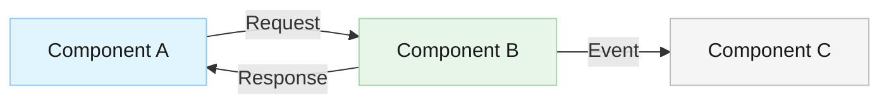

# Documentation Content Policy

This document defines the content standards for all project documentation. Every agent that creates or reviews documentation must follow these rules.

## Core Rule: WHAT and WHY, Not HOW

**Documentation describes WHAT and WHY, not HOW.** Do not include implementation code in documentation files.

- Describe components, decisions, requirements, and behavior in prose
- Use Mermaid diagrams, tables, and bullet points — not code blocks
- Reference source code files instead of duplicating code into documentation
- Limit code blocks to small essential snippets only: CLI commands, configuration examples, or brief API signatures (under 10 lines)
- **Never** include full class implementations, method bodies, training scripts, or large code samples in documentation
- If a reader needs implementation details, point them to the relevant source file

Implementation code belongs in source files — not in docs.

## Mermaid Diagram Styling

Use a clean, readable color palette for all Mermaid diagrams. Avoid bright or saturated colors.

- **Node fill colors**: Soft, muted tones — light blues (`#e1f5fe`, `#bbdefb`), light greens (`#e8f5e9`, `#c8e6c9`), light grays (`#f5f5f5`, `#e0e0e0`), light amber (`#fff8e1`, `#ffecb3`)
- **Text colors**: Always use dark text (`#1a1a1a` or `#333333`) for readability
- **Border/stroke colors**: Use medium-toned borders slightly darker than the fill (`#90caf9`, `#a5d6a7`, `#bdbdbd`)
- **Contrast**: Ensure sufficient contrast between text and background in every node
- **Consistency**: Use the same color for nodes of the same type across all diagrams

Example with proper styling:

Avoid bright or saturated colors (red, orange, hot pink) that reduce readability.
