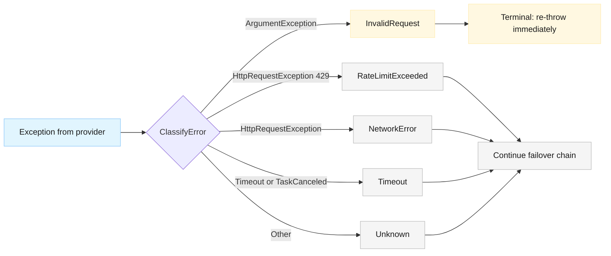
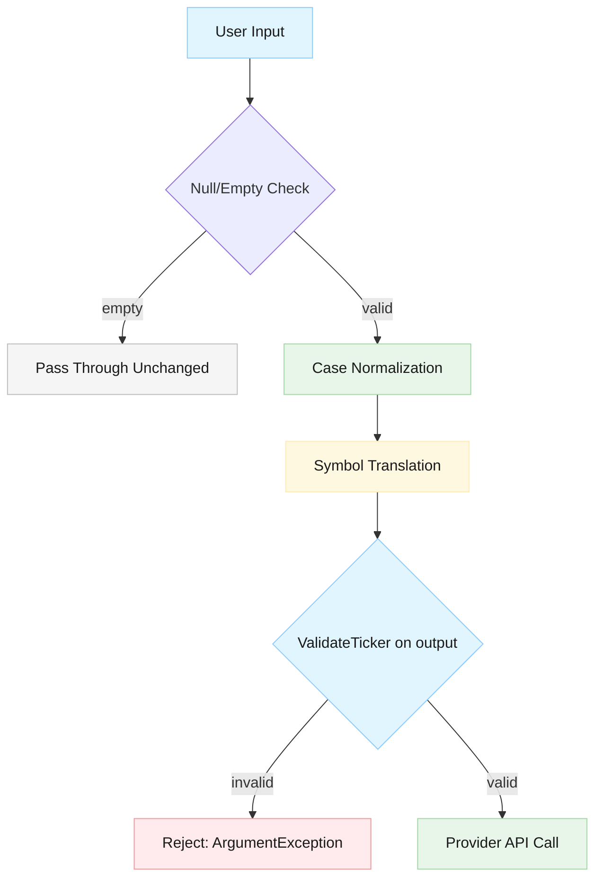

# Smart Symbol Translation

**Status**: Implemented
**Version**: 1.0
**Last Updated**: 2026-03-06

## Overview

The Smart Symbol Translation feature provides provider-aware symbol format conversion that automatically translates market symbols (particularly indices) between different provider formats. Users can query using any recognized format (canonical names, Yahoo ^-prefixed, FinViz @-prefixed) and the system automatically translates to the target provider's native format before API calls.

## Problem Statement

Financial data providers use different symbol formats for the same security (e.g., VIX vs ^VIX vs @VX). Users must currently know the exact provider format, limiting usability and multi-provider support. The symbol translator solves this by accepting symbols in any recognized format and automatically translating to the provider's expected format before API calls.

## User Stories

### User Story 1: Query market indices using canonical names (VIX, GSPC) without provider-specific format knowledge

**Scenarios**: Canonical names (VIX, GSPC, DJI) translate to Yahoo format (^VIX, ^GSPC, ^DJI); regular stocks (AAPL) pass through unchanged.

### User Story 2: Use provider-specific formats (^VIX) for backward compatibility

**Scenarios**: Yahoo format symbols (^VIX, ^GSPC) pass through unchanged; both canonical and Yahoo formats retrieve identical data.

### User Story 3: Automatic provider-aware translation without routing logic changes

**Scenarios**: Translation occurs after provider selection; cross-provider formats convert correctly (@VX → ^VIX when Yahoo selected); unmapped symbols pass through unchanged.

### User Story 4: Clear error messages for invalid symbols

**Scenarios**: Invalid format (!!!INVALID) returns clear validation error; non-existent symbols return appropriate not-found messages.

### User Story 5: Comprehensive index coverage for commonly used benchmarks

**Scenarios**: Mappings include major US indices, international indices, and sector-specific indices covering 28 category entries (27 unique indices) across US market, international, sector/commodity, volatility, and bond categories.

### User Story 6: Extensible mapping system for new providers and symbols

**Scenarios**: Adding new providers or symbols requires only updating the C# mapping dictionary; no configuration files or database changes.

## Requirements

### Functional Requirements

1. The system shall accept market symbols in any recognized format (canonical, Yahoo format, or alternative provider formats)

2. The system shall maintain a comprehensive mapping of symbol formats for each supported provider, stored as C# constants/dictionary

3. The system shall translate input symbols to the correct format for the target provider before making API calls

4. The system shall support the following translation scenarios:
   - Canonical name → Provider-specific format
   - Provider-specific format → Same provider format (pass-through)
   - Alternative provider format → Target provider format

5. The system shall include comprehensive index mappings across US market, international, sector/commodity, volatility, and bond categories (28 category entries covering 27 unique indices):
   - **US Market**: VIX, GSPC, DJI, IXIC, RUT, NDX, NYA, OEX, MID (9 symbols)
   - **International**: FTSE, GDAXI, N225, HSI, SSEC, AXJO, KS11, BSESN (8 symbols)
   - **Sector/Commodity**: SOX, XOI, HUI, XAU (4 symbols)
   - **Volatility**: VIX, VXN, RVX (3 symbols, VIX shared with US Market)
   - **Bond**: TNX, TYX, FVX, IRX (4 symbols)

6. The system shall pass through unrecognized symbols unchanged to the provider (allow provider to handle validation)

7. The system shall maintain backward compatibility with existing queries that use Yahoo-specific format (e.g., "^VIX")

8. The system shall provide a structure that supports multiple provider formats simultaneously (Yahoo, FinViz, and future providers)

9. The system shall NOT change routing logic—translation happens after the router selects the provider

### Non-Functional Requirements

- **Performance**: Symbol translation shall add no more than 1ms overhead per query (dictionary lookup)
- **Maintainability**: Adding a new symbol mapping shall require only a single new entry in the mapping dictionary
- **Extensibility**: Adding a new provider shall require only adding that provider's format key to existing symbol mappings
- **Memory**: The symbol mapping dictionary shall consume less than 100KB of memory
- **Reliability**: Translation logic shall have 100% test coverage with unit tests for all supported symbols
- **Backward Compatibility**: All existing queries using Yahoo format (^SYMBOL) shall continue to work without modification

## Acceptance Criteria

### Critical (Blocking)

- [ ] **AC1**: Canonical names translate to Yahoo format; Yahoo format passes through unchanged
- [ ] **AC2**: All 28 required indices present in mapping dictionary
- [ ] **AC3**: Cross-provider translation works (e.g., @VX to ^VIX for Yahoo)
- [ ] **AC4**: Unmapped symbols pass through unchanged
- [ ] **AC5**: Translation occurs after provider selection in router
- [ ] **AC6**: Backward compatibility - existing Yahoo format queries continue to work
- [ ] **AC7**: Validation errors (ArgumentException) classified as InvalidRequest and do not trigger failover

### Important (Non-Blocking)

- [ ] **AC8**: All index categories covered (international, sector/commodity, bond, volatility)
- [ ] **AC9**: Translation performance overhead < 1ms per query
- [ ] **AC10**: Comprehensive test coverage with 90%+ line coverage

### Design Requirements

- [ ] **AC11**: C# dictionary implementation (no config files); supports multiple providers per symbol
- [ ] **AC12**: Extensible design - new providers require only mapping updates
- [ ] **AC13**: Security requirements satisfied: input validation, no injection vulnerabilities, proper error handling

## Out of Scope

The following items are explicitly NOT included in this feature:

- **Non-Yahoo provider implementations**: Only Yahoo Finance format translations are required; FinViz and other providers are design considerations only
- **Real-time symbol validation**: The translator does not verify if symbols exist or are valid; that is the provider's responsibility
- **Symbol search/suggestion**: No autocomplete or "did you mean?" functionality
- **User-defined symbol mappings**: Users cannot add custom symbol translations
- **Configuration UI**: No admin interface for managing symbol mappings
- **Symbol aliases beyond provider formats**: No support for user-created nicknames (e.g., "SPX" as alias for "GSPC")
- **Historical symbol mappings**: No support for symbols that have changed over time (e.g., company name changes)
- **Sector/exchange routing**: Translation does not route based on symbol type or exchange
- **Database storage**: All mappings are in-memory C# code, no persistence layer
- **Dynamic symbol loading**: Mappings are compile-time, not loaded from external sources

## Dependencies

### Internal Dependencies
- **Stock Data Router**: The symbol translator receives the selected provider from the router; translation happens after routing decision
- **Yahoo Finance Provider**: The translated symbols are passed to the Yahoo provider implementation
- **MCP Server Interface**: Symbol translation must occur before MCP tools call underlying providers

### External Dependencies
- None (all functionality is internal)

### Blocks
- This feature blocks future multi-provider support (Google Finance, FinViz, etc.) as it provides the translation infrastructure

## Technical Considerations

### Data Structure Design
- Use a two-level dictionary: `Dictionary<string, Dictionary<ProviderType, string>>`
  - First level: Canonical symbol name (key)
  - Second level: Provider → Provider-specific format
  - Example: `["VIX"]["Yahoo"] = "^VIX"`, `["VIX"]["FinViz"] = "@VX"`
- This structure allows O(1) lookup performance and easy extensibility

### Provider Enumeration
- Define a `ProviderType` enum (e.g., `Yahoo`, `FinViz`, `GoogleFinance`)
- Use enum as dictionary key for type safety and compile-time checking

### Translation Algorithm
1. Identify input symbol format (canonical, Yahoo, or alternative)
2. Look up canonical name in mapping dictionary
3. Retrieve the target provider's format from the nested dictionary
4. Return translated symbol

### Reverse Mapping Support
- Some inputs may already be in provider-specific format (e.g., "^VIX")
- Need reverse lookup to find canonical name, then forward lookup to target provider
- Consider creating a secondary reverse-lookup dictionary for performance

### Regular Stock Symbol Handling
- Symbols not in the mapping dictionary are passed through unchanged
- This handles regular stocks (AAPL, MSFT), ETFs (SPY, QQQ), and other securities

### Error Handling Philosophy
- Translator is permissive: unknown symbols pass through unchanged
- Provider handles validation and returns appropriate errors
- Only truly malformed input (null, empty string) should throw exceptions in the translator

### Memory and Performance
- Entire mapping dictionary loaded at startup (lazy initialization acceptable)
- Dictionary size estimated at ~100 symbols × 3 providers × 10 bytes = ~3KB
- Lookup performance: O(1) for both forward and reverse translation

### Testing Strategy
- Unit tests for each symbol in the mapping (canonical → Yahoo)
- Unit tests for pass-through scenarios (Yahoo → Yahoo)
- Unit tests for cross-provider scenarios (FinViz → Yahoo)
- Integration tests with actual router and provider
- Performance benchmarks to ensure < 1ms overhead

## Architecture

### Component Overview

The `SymbolTranslator` component provides provider-aware symbol format conversion through:

- **Two-level dictionary structure**: `Dictionary<string, Dictionary<string, string>>` maps canonical symbols to provider-specific formats
- **Reverse index**: Auto-generated at construction for fast lookups from any format to canonical name
- **O(1) lookup performance**: Pure in-memory dictionary operations
- **Thread-safe**: Immutable dictionaries after construction
- **Case-insensitive**: Uses `StringComparer.OrdinalIgnoreCase`

### Integration with Router

Translation occurs **after** provider selection in `StockDataProviderRouter`:

```mermaid
sequenceDiagram
    participant MCP as MCP Tool Handler
    participant Router as StockDataProviderRouter
    participant Translator as ISymbolTranslator
    participant Provider as IStockDataProvider

    MCP->>Router: GetStockInfoAsync("VIX")
    Router->>Router: ExecuteWithFailoverAsync()
    loop For each provider in chain
        Router->>Translator: Translate("VIX", provider.ProviderId)
        Translator-->>Router: "^VIX"
        Router->>Provider: GetStockInfoAsync("^VIX")
        Provider-->>Router: result
    end
    Router-->>MCP: result

    classDef blue fill:#e1f5fe,stroke:#90caf9,color:#1a1a1a
    classDef green fill:#e8f5e9,stroke:#a5d6a7,color:#1a1a1a
    classDef gray fill:#f5f5f5,stroke:#bdbdbd,color:#1a1a1a
```

### Translation Algorithm

1. Look up input symbol in reverse index to find canonical name (or return null)
2. If found, look up canonical name in forward mappings to get provider-specific format
3. If either lookup fails, return original symbol unchanged

### Symbol Mappings

All mappings stored as compile-time C# constants in `SymbolTranslator`:

| Category | Count | Symbols | Yahoo Format |
|---|---|---|---|
| US Market | 9 | VIX, GSPC, DJI, IXIC, RUT, NDX, NYA, OEX, MID | ^prefix |
| International | 8 | FTSE, GDAXI, N225, HSI, SSEC, AXJO, KS11, BSESN | ^prefix |
| Sector/Commodity | 4 | SOX, XOI, HUI, XAU | ^prefix |
| Volatility | 3 | VIX, VXN, RVX | ^prefix |
| Bond | 4 | TNX, TYX, FVX, IRX | ^prefix |
| **Total Unique** | **27** | | |

## Error Handling

### Validation Errors as Terminal Errors

The system treats validation errors differently from infrastructure failures:

**Decision**: `ArgumentException` from ticker validation is classified as `InvalidRequest` (terminal error) and does not trigger failover.

**Rationale**:
- Validation errors are caller mistakes, not provider failures
- Attempting failover with invalid input wastes API calls and pollutes health metrics
- Circuit breakers should not trip on user input errors

### Error Classification



### Implementation Changes

1. Added `InvalidRequest` to `ProviderErrorType` enum
2. Updated `ClassifyError` to map `ArgumentException` to `InvalidRequest`
3. Modified `ExecuteWithFailoverAsync` to re-throw immediately on `InvalidRequest` without recording health failure

### Error Flow After Translation

| Input Type | Handled By | Result |
|---|---|---|
| "VIX" (canonical) | Symbol Translator | Translated to "^VIX" |
| "^VIX" (correct format) | Symbol Translator | Passed through unchanged |
| "@VX" (wrong provider) | Symbol Translator | Translated to "^VIX" |
| "AAPL" (regular stock) | Pass-through | Passed to provider unchanged |
| "" (empty) | Provider validation | Terminal InvalidRequest error |
| "!!!BAD" (invalid chars) | Provider validation | Terminal InvalidRequest error |
| "XYZNOTREAL" (doesn't exist) | Provider | Provider returns not found |

## Security

### Risk Assessment

**Overall Security Assessment**: **LOW-MEDIUM RISK**

Primary risks are input validation gaps and URI-encoding interactions. All identified risks are mitigable with existing and straightforward controls.

### Threat Catalog

| Threat | Likelihood | Impact | Risk | Mitigation |
|---|---|---|---|---|
| Injection via symbol input | LOW | MEDIUM | **LOW** | ValidateTicker blocks non-alphanumeric; Uri.EscapeDataString encodes |
| Dictionary manipulation | NEGLIGIBLE | HIGH | **NEGLIGIBLE** | Compile-time constants, code review |
| Translator bypasses validation | LOW | MEDIUM | **LOW** | ValidateTicker runs after translation |
| Information disclosure in errors | MEDIUM | LOW | **LOW** | Reference original symbol only |
| DoS via case permutation | LOW | LOW | **LOW** | Case normalization, O(1) lookups |

### Security Design Principles

**Validation Strategy**: Validate **AFTER** translation



**Rationale**: The translator accepts input characters (e.g., @ in @VX) that may not be valid for the target provider, but the translated output (^VIX) is valid. Pre-translation validation would reject valid cross-provider inputs.

### Security Requirements

**Critical (Must implement)**:
- Normalize input case using `ToUpperInvariant()`
- Pass through null/empty unchanged (no exception in translator)
- `ValidateTicker()` executes AFTER translation
- Mapping dictionary declared read-only
- Unrecognized symbols pass through unchanged
- Client errors reference original input symbol

**Important (Should implement)**:
- Startup validation for duplicate provider formats
- Startup validation that all values pass `ValidateTicker()`
- Reverse dictionary generated from forward dictionary
- Pure function (no side effects or I/O)
- Use `StringComparer.OrdinalIgnoreCase`

## Testing

### Test Coverage Goals

| Component | Line Coverage | Branch Coverage |
|---|---|---|
| SymbolTranslator | 95%+ | 90%+ |
| Router (translation paths) | 90%+ | 80%+ |
| Error classification | 100% | 100% |
| Overall project | 90%+ | 65%+ |

### Test Organization

```
StockData.Net.Tests/
  Providers/
    SymbolTranslatorTests.cs              # Core translation logic
    SymbolTranslatorMappingTests.cs       # Mapping integrity
    SymbolTranslatorSecurityTests.cs      # Input validation, injection tests
  StockDataProviderRouterTests.cs         # Router + translator integration
```

### Test Categories

**Unit Tests - Core Logic** (70-90 tests):
- Canonical to Yahoo translation (VIX to ^VIX, GSPC to ^GSPC, etc.)
- Yahoo to Yahoo pass-through (^VIX stays ^VIX)
- Cross-provider translation (@VX to ^VIX for Yahoo)
- Case normalization (vix, ViX, VIX all translate to ^VIX)
- Unknown symbols pass through unchanged
- All 28 required indices translate correctly

**Unit Tests - Mapping Integrity**:
- All required index categories present
- No duplicate provider formats
- All translated values pass ValidateTicker rules
- Reverse lookup consistency
- Dictionary immutability

**Security Tests**:
- Null/empty/whitespace handling
- Injection attempts (SQL, path traversal, CRLF, XSS)
- Oversized input (11+ chars, 100+ chars)
- Unicode edge cases
- Error messages don't leak provider formats
- DoS resistance (1000+ case permutations, 10000+ unmapped symbols)

**Integration Tests** (15-20 tests):
- Router receives canonical, provider receives translated format
- Both canonical and Yahoo formats produce identical provider calls
- Null translator backward compatibility
- Translation per-provider in failover chain
- All router methods translate (GetStockInfo, GetHistoricalPrices, GetNews)
- Invalid symbols produce ArgumentException without failover
- Health metrics not polluted by validation errors

**Performance Tests** (3-5 tests):
- Single translation < 1ms
- P99 latency < 1ms over 10,000 iterations
- Dictionary memory < 100KB

### Backward Compatibility Verification

- Existing ^VIX, ^GSPC queries work unchanged
- Null translator injection backward compatible
- Existing 208+ tests remain green
- ValidateTicker logic unchanged

## Implementation Status

All phases complete and implemented:

- [x] **Phase 1: MVP** - Core translation for Yahoo Finance with US market indices
- [x] **Phase 2: Extended Coverage** - International, sector, bond, and volatility indices
- [x] **Phase 3: Multi-Provider Infrastructure** - Cross-provider translation support

### Success Metrics

**Functional Success**:
- Translation Accuracy: 100% of mapped symbols translate correctly
- Backward Compatibility: 0 breaking changes to existing queries
- Symbol Coverage: 27 unique indices across 5 categories

**Performance Success**:
- Translation Overhead: < 1ms per symbol translation
- Memory Footprint: < 100KB for complete mapping dictionary
- Lookup Speed: O(1) constant-time dictionary lookups

**User Experience Success**:
- Format Flexibility: Users can query with canonical or provider formats interchangeably
- Error Clarity: Invalid symbols produce clear error messages

**Technical Success**:
- Test Coverage: 95%+ for translation logic
- Extensibility: New providers require only mapping updates
- Maintainability: New symbols require exactly 1 dictionary entry
