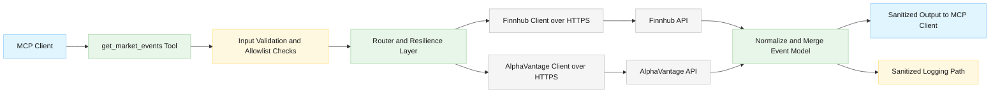

# Security Design: Market-Moving Events Feed (Issue #26)

## Document Info

- **Feature Spec**: [docs/features/issue-26-market-moving-events.md](../features/issue-26-market-moving-events.md)
- **Architecture**: [docs/architecture/stock-data-aggregation-canonical-architecture.md](../architecture/stock-data-aggregation-canonical-architecture.md)
- **Related Security Docs**: [docs/security/security-summary.md](security-summary.md), [docs/security/provider-selection-security.md](provider-selection-security.md), [docs/security/issue-32-tier-handling-security.md](issue-32-tier-handling-security.md)
- **Status**: Draft
- **Last Updated**: 2026-04-12

## Security Overview

This document defines the security requirements and risk controls for the new MCP tool `get_market_events`, which aggregates scheduled and breaking market-moving events from Finnhub and AlphaVantage.

The feature introduces a new externally sourced data path with user-controlled filtering parameters (`category`, `event_type`, `from_date`, `to_date`, `impact_level`) and untrusted provider output fields (`title`, `description`, `source_url`).

**Security posture**: Medium risk with clear, bounded controls.

Primary risks:

- Input abuse leading to malformed provider requests or expensive broad queries
- API key leakage through errors or logs
- SSRF-like misuse if `source_url` is dereferenced server-side
- Output/log injection from untrusted provider text
- Provider quota exhaustion and latency degradation through abusive call volume
- Information disclosure through unsanitized provider exceptions

### Security Data Flow

## Threat Model

### Assets

| Asset | Classification | Owner |
| --- | --- | --- |
| Finnhub API key | Confidential | DevOps / Runtime configuration |
| AlphaVantage API key | Confidential | DevOps / Runtime configuration |
| Provider request URLs and query parameters | Internal | MCP server runtime |
| Market event payload (`title`, `description`, `source_url`) | Untrusted external content | Provider APIs |
| Provider attribution and routing metadata | Internal | MCP server runtime |
| Error and operational logs | Internal / Sensitive | Operations |

### Attack Surface

| Surface | Exposure | Threats |
| --- | --- | --- |
| `get_market_events` tool arguments | External (MCP caller) | Input tampering, malformed dates, oversized strings, filter bypass attempts |
| Outbound provider calls (Finnhub, AlphaVantage) | External network | API abuse, rate-limit exhaustion, provider-side error injection |
| `source_url` field in response payload | External content passthrough | SSRF risk if server later dereferences URL, unsafe client rendering |
| Error response and logs | External (response) + internal (logs) | Information disclosure of secrets, stack traces, provider internals |

### STRIDE Analysis

| STRIDE | Threat in `get_market_events` scope | Mitigation |
| --- | --- | --- |
| Spoofing | Caller claims trusted intent to bypass filters | Strict schema validation and allowlist enums; no trust in caller-provided category/type values |
| Tampering | Caller supplies malformed dates/strings to alter outbound requests | ISO 8601 validation, max-length checks, enum allowlists, date range cap, reject invalid input before provider call |
| Repudiation | Abuse calls without traceability | Audit logs for tool invocation metadata (without sensitive payloads or secrets) |
| Information Disclosure | API keys or stack traces leak via errors/logs | Apply `SensitiveDataSanitizer` to all user-facing and logged provider errors; do not expose raw exceptions |
| Denial of Service | High-frequency calls and broad date windows exhaust quotas/resources | Existing client token-bucket limits, router circuit breaker/failover, required date window cap, recommendation for server-level caller throttling |
| Elevation of Privilege | Untrusted URLs trigger internal fetch path | Enforce passthrough-only `source_url`; MCP layer must never auto-fetch provider URLs |

## Authentication

- **Mechanism**: Provider API keys for Finnhub and AlphaVantage
- **Identity source**: Environment-backed runtime configuration (`${FINNHUB_API_KEY}`, `${ALPHAVANTAGE_API_KEY}` placeholders resolved from environment)
- **Session management**: Not applicable for MCP caller sessions in this feature; request/response is stateless

## Authorization

- **Model**: Tool-level access based on MCP client permissions external to this feature
- **Enforcement point**: MCP server tool exposure and host integration boundary
- **Default policy**: Keep least privilege by exposing only required fields and no internal provider credentials/URLs

## Data Security

- **Encryption in transit**: Existing provider clients enforce HTTPS base addresses and reject non-TLS endpoints
- **Encryption at rest**: API keys not persisted by this feature; handled through existing runtime configuration and environment process model
- **PII handling**: Expected event data is market/public information; still treated as untrusted external content
- **Untrusted content handling**: `title`, `description`, `source_url` are external strings and must be sanitized before logging and treated as plain text only in MCP responses

## Secret Management

- **Storage**: Environment variables via placeholder resolution in MCP server startup configuration
- **Runtime handling**: Existing `SecretValue` wrapper and sanitizer-based message redaction patterns
- **No hardcoded secrets**: Required for all issue #26 implementation artifacts
- **Rotation model**: Existing process restart/reload flow for refreshed environment values

## Input Validation

### Required Validation Controls

1. `category` must be an allowlist enum: `fed`, `treasury`, `geopolitical`, `regulatory`, `central_bank`, `institutional`, `all`.
2. `event_type` must be an allowlist enum: `scheduled`, `breaking`, `all`.
3. `impact_level` must be an allowlist enum: `high`, `medium`, `low`, `all`.
4. `from_date` and `to_date` must be strict ISO 8601 date strings.
5. `from_date <= to_date` must be enforced before provider calls.
6. Date range (`to_date - from_date`) must be capped to 30 days maximum.
7. All string parameters must have upper length bounds to prevent payload abuse.

### Validation Rationale

These controls prevent malformed user input from being propagated into outbound provider query strings, reduce injection and parser ambiguity risks, and constrain expensive query windows that can degrade service or drain provider quotas.

### Current State and Gap

Current MCP tool argument handling patterns in [StockData.Net/StockData.Net.McpServer/StockDataMcpServer.cs](../../StockData.Net/StockData.Net.McpServer/StockDataMcpServer.cs) are generic (`GetRequiredString`, `GetOptionalString`) and do not yet include issue-specific allowlist/date-range guards for `get_market_events`.

**Required for Issue #26**: Add explicit validation for all event parameters before routing provider calls.

## SSRF and URL Handling

`source_url` from providers is **passthrough data only**.

Required controls:

- MCP server must not fetch, preview, validate-by-request, or transform `source_url` by making outbound network calls.
- No server-side enrichment against returned URLs.
- Logs must sanitize URL fields before writing.
- Any future URL processing must go through a separate security review.

This prevents the tool from becoming an SSRF pivot when providers or upstream data include internal or malicious URLs.

## Output Sanitization

External provider fields (`title`, `description`, `source_url`) must be treated as untrusted text.

Required controls:

- Return as plain text data only, without HTML interpretation in MCP layer.
- Sanitize these values before including them in warnings/errors/log records.
- Keep provider attribution while avoiding leakage of internal request details.

Existing pattern reference: [StockData.Net/StockData.Net/Security/SensitiveDataSanitizer.cs](../../StockData.Net/StockData.Net/Security/SensitiveDataSanitizer.cs)

## Rate Limit Abuse and Availability

### Existing Protections

- Provider clients already apply per-provider token-bucket rate limiting:
  - Finnhub client configured around 60 requests/minute
  - AlphaVantage client configured around 5 requests/minute
- Router-level circuit breaker and failover mechanisms reduce cascading provider failures.

References:

- [StockData.Net/StockData.Net/Clients/Finnhub/FinnhubClient.cs](../../StockData.Net/StockData.Net/Clients/Finnhub/FinnhubClient.cs)
- [StockData.Net/StockData.Net/Clients/AlphaVantage/AlphaVantageClient.cs](../../StockData.Net/StockData.Net/Clients/AlphaVantage/AlphaVantageClient.cs)
- [StockData.Net/StockData.Net/Providers/StockDataProviderRouter.cs](../../StockData.Net/StockData.Net/Providers/StockDataProviderRouter.cs)

### Gaps and Required Controls for Issue #26

- Client-side provider throttles alone do not prevent a single MCP caller from repeatedly invoking `get_market_events` and consuming shared quotas.
- No caller identity-based quota exists at MCP tool boundary.

Required additions:

1. Enforce strict date window cap (30 days) to limit expensive requests.
2. Add server-side per-caller or per-session request throttling at MCP tool boundary when identity context is available.
3. Record metrics/alerts for repeated rate-limit exceedance and fallback frequency.

## Error Handling and Information Disclosure

Provider failures must never expose:

- API keys or token query values
- Stack traces
- Internal endpoint details beyond safe provider attribution

Existing sanitization and friendly-error patterns to reuse:

- [StockData.Net/StockData.Net/Security/SensitiveDataSanitizer.cs](../../StockData.Net/StockData.Net/Security/SensitiveDataSanitizer.cs)
- [StockData.Net/StockData.Net.McpServer/StockDataMcpServer.cs](../../StockData.Net/StockData.Net.McpServer/StockDataMcpServer.cs)

Required for issue #26 implementation:

- All `get_market_events` provider exceptions must pass through sanitization before logging and before user-visible response composition.
- Preserve investor-friendly wording while removing sensitive/internal details.

## OWASP Top 10 Mapping

| OWASP 2021 Category | Relevance to Issue #26 | Mitigation |
| --- | --- | --- |
| A01 Broken Access Control | Medium (tool misuse/abuse by callers) | MCP host authorization boundary, least-privilege tool exposure, optional caller-level throttling |
| A03 Injection | High (user input into provider query composition) | Strict enum allowlists, ISO date validation, max-length checks, reject invalid input pre-call |
| A04 Insecure Design | High (new external feed aggregation path) | Explicit SSRF passthrough rule, date range cap, threat modeling and bounded behavior |
| A05 Security Misconfiguration | Medium (API key/base URL config) | Environment-based key loading, HTTPS-only provider clients, no hardcoded secrets |
| A06 Vulnerable and Outdated Components | Low/Medium | Continue dependency governance for HTTP/JSON/runtime libs |
| A07 Identification and Authentication Failures | Medium (provider auth secrets) | Secrets from environment only, secret redaction, never return/log keys |
| A09 Security Logging and Monitoring Failures | Medium | Sanitized security logging, rate-limit abuse telemetry, provider failure monitoring |
| A10 SSRF | High (`source_url` untrusted URL field) | Never auto-fetch `source_url`; treat as inert passthrough data |

## Security Requirements

| ID | Requirement | Priority |
| --- | --- | --- |
| SEC-26-001 | Validate `category`, `event_type`, `impact_level` against strict allowlists before provider invocation | Critical |
| SEC-26-002 | Validate `from_date` and `to_date` as ISO 8601, enforce `from_date <= to_date`, reject invalid ranges before provider invocation | Critical |
| SEC-26-003 | Enforce maximum 30-day query window | Critical |
| SEC-26-004 | Apply max length constraints to all string inputs | High |
| SEC-26-005 | Load provider API keys from environment-backed configuration only; never return or log keys | Critical |
| SEC-26-006 | Treat `source_url` as passthrough only; do not auto-fetch or server-side dereference | Critical |
| SEC-26-007 | Sanitize provider-derived text fields before logging (`title`, `description`, `source_url`) | High |
| SEC-26-008 | Apply `SensitiveDataSanitizer` on all issue #26 error paths and user-facing messages | Critical |
| SEC-26-009 | Retain provider client throttling and router circuit breaker/failover behavior for events calls | High |
| SEC-26-010 | Add MCP-boundary abuse monitoring and, where possible, caller-level throttling | Medium |

## Security Test Cases

| Test ID | Scenario | Expected Result |
| --- | --- | --- |
| ST-26-01 | `category=earnings` | Validation error with allowed values; no provider call |
| ST-26-02 | `impact_level=critical` | Validation error with allowed values; no provider call |
| ST-26-03 | Invalid date format in `from_date` | Validation error; no provider call |
| ST-26-04 | `from_date > to_date` | Validation error; no provider call |
| ST-26-05 | Date window > 30 days | Validation error; no provider call |
| ST-26-06 | Oversized input strings | Validation error; no provider call |
| ST-26-07 | Provider returns error containing token-like fragments | Error/log output is sanitized and does not leak secrets |
| ST-26-08 | Event contains malicious or internal-looking `source_url` | URL is returned as inert data only; no server fetch |
| ST-26-09 | Rapid repeated tool calls | Requests throttle/fail safely; no unhandled exceptions; provider quotas protected by existing limiter behavior |
| ST-26-10 | Provider fallback path with one provider failing | User receives safe aggregated/fallback response with sanitized failure messaging |

## Compliance Considerations

- **Secrets management**: Meets baseline requirement when environment-only key sourcing is enforced.
- **Transport security**: Existing HTTPS-only provider clients support TLS transport requirements.
- **Data minimization**: Feature should return only required event fields and provider attribution.
- **Operational logging**: Must ensure logs remain sanitized and avoid storing sensitive configuration values.

## Design Decisions and Rationale

1. Reuse existing sanitizer and provider resilience patterns rather than introducing a separate issue-specific framework.
2. Treat all provider event content as untrusted text to prevent downstream injection or rendering assumptions.
3. Make `source_url` inert/pass-through to eliminate SSRF expansion risk in MCP layer.
4. Enforce narrow parameter contracts (allowlists + date window cap) because this tool accepts direct user-controlled filters that influence provider calls.

## Related Documents

- Feature Specification: [docs/features/issue-26-market-moving-events.md](../features/issue-26-market-moving-events.md)
- Security Summary: [docs/security/security-summary.md](security-summary.md)
- Tier Handling Security: [docs/security/issue-32-tier-handling-security.md](issue-32-tier-handling-security.md)
- Provider Selection Security: [docs/security/provider-selection-security.md](provider-selection-security.md)
