# Security Design: Alpaca Markets Provider (FinRL Data Source)

<!--
  Template owner: Security Architect
  Output directory: docs/security/
  Filename convention: issue-29-finrl-alpaca-provider-security.md
  GitHub Issue: #29
-->

## Document Info

- **Feature Spec**: [docs/features/issue-29-finrl-provider.md](../features/issue-29-finrl-provider.md)
- **Architecture**: [docs/architecture/stock-data-aggregation-canonical-architecture.md](../architecture/stock-data-aggregation-canonical-architecture.md)
- **Baseline Security**: [docs/security/security-summary.md](security-summary.md)
- **Prior Art**: [docs/security/provider-selection-security.md](provider-selection-security.md), [docs/security/issue-32-tier-handling-security.md](issue-32-tier-handling-security.md)
- **Status**: Draft
- **Last Updated**: 2026-03-22

---

## Security Overview

This document defines the security architecture and controls for adding Alpaca Markets as a new data provider in the StockData.Net MCP server. Alpaca is a REST-based financial data API that requires **dual-key authentication** (API Key ID + API Secret Key), distinguishing it from existing providers that use a single API key.

**Risk Assessment**: **MEDIUM**

The feature introduces:

- A new dual-key credential management pattern (two secrets per provider vs. one)
- A new external API attack surface (Alpaca Markets REST API v2 and v1beta1)
- Authentication headers (`APCA-API-KEY-ID`, `APCA-API-SECRET-KEY`) that must never leak into logs or error messages
- Configurable base URLs for paper trading vs. live endpoints, which must be allowlisted
- Tier detection via the `/v2/account` endpoint, which returns sensitive account metadata that must not be exposed

**Deployment Model**: Single-user local process (stdio-based JSON-RPC, MCP server on localhost)

**Key findings**:

| # | Finding | Severity | Blocking |
| --- | --- | --- | --- |
| SEC-29-1 | Dual API key pattern doubles the credential exposure surface | **HIGH** | **Yes** |
| SEC-29-2 | Alpaca authentication headers may appear in HTTP client error messages | **HIGH** | **Yes** |
| SEC-29-3 | Configurable base URL (paper vs. live) may be tampered to point to attacker endpoint | **MEDIUM** | **Yes** |
| SEC-29-4 | `/v2/account` response contains sensitive account metadata (buying power, equity, account number) | **MEDIUM** | No |
| SEC-29-5 | Alpaca `X-RateLimit-*` headers may contain account-identifying information | **LOW** | No |
| SEC-29-6 | News endpoint (`/v1beta1/news`) returns external URLs that could contain tracking or malicious payloads | **LOW** | No |
| SEC-29-7 | Tier detection caching must not serve stale credentials-valid state after key rotation | **LOW** | No |

---

## Threat Model

### Assets

| Asset | Classification | Owner |
| --- | --- | --- |
| Alpaca API Key ID (`APCA-API-KEY-ID`) | Confidential | DevOps/Security Team |
| Alpaca API Secret Key (`APCA-API-SECRET-KEY`) | Confidential | DevOps/Security Team |
| Alpaca account metadata (account number, buying power, equity) | Confidential | System Runtime |
| Alpaca tier/subscription status | Internal | System Runtime |
| Ticker symbols in API requests | Internal | End Users |
| Historical price data (OHLCV) | Public | System |
| News article content and URLs | Public | System |
| Provider health check cached state | Internal | System Runtime |
| Rate limit quota state | Internal | System Runtime |

### Threat Actors

| Actor | Capability | Motivation |
| --- | --- | --- |
| Malicious MCP Client | Sends crafted JSON-RPC requests | Extract API credentials from error messages; exhaust rate limits; enumerate account details |
| Malicious External API (Alpaca) | Returns crafted response payloads | Inject content into error messages or news data; poison financial data |
| Local System Attacker | Reads/modifies config files, environment variables | Extract dual API keys; redirect traffic via base URL tampering |
| Network Attacker | Man-in-the-middle on outbound HTTPS | Intercept API Key ID and Secret Key from authentication headers |

### Attack Surface

| Surface | Exposure | Threats |
| --- | --- | --- |
| Alpaca REST API v2 (HTTPS) | External | MITM, credential interception, data integrity, rate limiting, DoS |
| Alpaca News API v1beta1 (HTTPS) | External | Content injection via news articles, URL-based attacks |
| `APCA-API-KEY-ID` header | External (per request) | Credential disclosure in logs, error messages, or debug output |
| `APCA-API-SECRET-KEY` header | External (per request) | Credential disclosure in logs, error messages, or debug output |
| `appsettings.json` / environment variables | Local (file system) | Dual key extraction, base URL tampering |
| `/v2/account` health check response | Internal | Account metadata disclosure |
| Configurable base URL (paper/live) | Local (config) | SSRF via URL manipulation |
| `list_providers` MCP tool output | Local (stdio) | Tier and capability disclosure |

### STRIDE Analysis

| Component | Spoofing | Tampering | Repudiation | Info Disclosure | DoS | Elevation |
| --- | --- | --- | --- | --- | --- | --- |
| AlpacaClient (HTTP) | TLS 1.2+ prevents | TLS prevents | Audit logging mitigates | Dual-key header leakage **(SEC-29-1, SEC-29-2)** | Rate limiting mitigates | N/A (local) |
| Base URL config | N/A | URL allowlist mitigates **(SEC-29-3)** | N/A | N/A | N/A | N/A (local) |
| Health check (/v2/account) | N/A | N/A | N/A | Account metadata **(SEC-29-4)** | Health check caching mitigates | N/A (local) |
| Credential storage | N/A | SecretValue immutability | N/A | ToString() redaction mitigates | N/A | N/A (local) |
| News endpoint | N/A | URL validation mitigates | N/A | External URL tracking **(SEC-29-6)** | Rate limiting mitigates | N/A (local) |
| Error messages | N/A | N/A | N/A | Header values in exceptions **(SEC-29-2)** | N/A | N/A (local) |

---

## Detailed Threat Scenarios

### SEC-29-1 (HIGH — BLOCKING): Dual API Key Credential Exposure

**Description**: Alpaca requires two credentials per provider instance: API Key and Secret Key. This doubles the credential surface compared to existing providers (Finnhub, Alpha Vantage) that use a single key. Both values are sent as HTTP headers on every request (`APCA-API-KEY-ID`, `APCA-API-SECRET-KEY`). If either value leaks via logging, error messages, serialization, or debugger inspection, the attacker gains full API access.

**Impact**: Full compromise of Alpaca API access. Attacker can read market data, and if live trading credentials are used, potentially access account information.

**Mitigations**:

1. **Both keys wrapped in `SecretValue`**: The `apiKey` and `secretKey` configuration values must each be wrapped in a `SecretValue` instance. `SecretValue.ToString()` returns `[REDACTED]`, preventing accidental disclosure in logs, debugger views, and serialization
2. **Header injection via `ExposeSecret()` only**: Authentication headers must be set by calling `SecretValue.ExposeSecret()` at the point of HTTP request construction only — never stored in intermediate string variables, interpolated strings, or log parameters
3. **No dual-key concatenation**: The two keys must never be concatenated, hashed together, or combined into a single value. Each is managed independently
4. **Disposal on shutdown**: Both `SecretValue` instances must be disposed when the provider is removed from the DI container, zeroing the underlying character arrays

**Residual Risk**: **LOW** (after mitigations applied)

### SEC-29-2 (HIGH — BLOCKING): Authentication Headers in HTTP Error Messages

**Description**: When an `HttpClient` request fails (e.g., `HttpRequestException`, `TaskCanceledException`), the default .NET exception message may include the full request URI and headers. Since Alpaca authentication uses custom headers (`APCA-API-KEY-ID`, `APCA-API-SECRET-KEY`), these header values could appear in exception messages that propagate to logs or user-facing error responses.

**Impact**: API credentials disclosed in error messages visible to MCP clients or written to log files.

**Mitigations**:

1. **Wrap all `HttpClient` calls in try/catch**: The `AlpacaClient` must catch `HttpRequestException` and `TaskCanceledException` at the client boundary, re-throwing as `ProviderException` with a sanitized message
2. **Pass all error messages through `SensitiveDataSanitizer.Sanitize()`**: Before any exception message is included in a `ProviderException`, log entry, or user-facing response, it must be sanitized
3. **Register Alpaca header names with sanitizer awareness**: The `SensitiveDataSanitizer` token pattern already catches alphanumeric strings of 8+ characters. Additionally, any string matching `APCA-API-KEY-ID=...` or `APCA-API-SECRET-KEY=...` patterns should be caught. Verify coverage with test cases
4. **Never log request headers**: Structured logging for Alpaca API calls must include operation type, symbol, latency, and HTTP status — never request or response headers

**Residual Risk**: **LOW** (after mitigations applied)

### SEC-29-3 (MEDIUM — BLOCKING): Base URL Tampering for SSRF

**Description**: Alpaca supports two base URL endpoints — paper trading (`https://paper-api.alpaca.markets/`) and live (`https://api.alpaca.markets/`). The base URL is configurable in `appsettings.json` via the `baseUrl` setting. A local attacker with file system access could modify this to point to an attacker-controlled endpoint, causing the client to send API credentials (both Key ID and Secret Key) to the attacker's server.

**Impact**: Full credential exfiltration via SSRF-like configuration tampering.

**Mitigations**:

1. **Base URL allowlist**: The `AlpacaClient` constructor must validate the base URL against a hardcoded allowlist of known Alpaca domains:
   - `https://api.alpaca.markets/`
   - `https://paper-api.alpaca.markets/`
   - `https://data.alpaca.markets/`
2. **HTTPS scheme enforcement**: The client constructor must reject any base URL that does not use the `https://` scheme, following the existing pattern in `FinnhubClient` and `AlphaVantageClient`
3. **No user-input URL construction**: The base URL must come from static configuration only — never from MCP request parameters or user input
4. **Startup validation**: Base URL validation must occur at DI registration time (in `Program.cs`), failing fast with a clear error if the URL is not in the allowlist

**Residual Risk**: **LOW** (after mitigations applied)

### SEC-29-4 (MEDIUM): Account Metadata Disclosure via Health Check

**Description**: The Alpaca `/v2/account` endpoint returns detailed account metadata including account number, buying power, equity, portfolio value, and trading status. This endpoint is used for health checks and tier detection. If the full response is logged or included in health status messages, sensitive financial information is disclosed.

**Impact**: Disclosure of account financial details (buying power, equity) in logs or health status responses.

**Mitigations**:

1. **Extract only required fields**: The health check logic must parse the `/v2/account` response and extract only: `status` (for health), and `account_type` or equivalent (for tier detection). All other fields must be discarded immediately
2. **Never log raw account response**: Structured logging for health checks must include only: health status (healthy/unhealthy), reason category (if unhealthy), and latency. Never log the raw JSON response body
3. **Health status response sanitization**: The `GetHealthStatusAsync` return value must contain only generic status information — never account numbers, balances, or financial details
4. **Cache parsed results only**: The 5-minute health check cache must store only the derived health status and tier, not the raw API response

**Residual Risk**: **LOW** (after mitigations applied)

### SEC-29-5 (LOW): Rate Limit Header Information Leakage

**Description**: Alpaca returns `X-RateLimit-Limit`, `X-RateLimit-Remaining`, and `X-RateLimit-Reset` headers. While useful for proactive throttling, these headers could reveal account-level rate limit configuration that differs between free and paid tiers.

**Impact**: Minor information disclosure about subscription tier via rate limit values.

**Mitigations**:

1. **Rate limit values used internally only**: Parse rate limit headers for client-side throttling decisions but do not expose raw values in MCP responses or logs
2. **Generic rate limit errors**: When rate-limited, return "Alpaca rate limit exceeded. Retry after [X] seconds" without disclosing the total limit or subscription-specific quota

**Residual Risk**: **LOW**

### SEC-29-6 (LOW): Malicious Content in News Responses

**Description**: The Alpaca news endpoint (`/v1beta1/news`) returns article headlines, summaries, and source URLs from external news providers. These could contain XSS payloads, malicious URLs, or tracking parameters.

**Impact**: Content injection if news data is rendered in a web context; tracking via embedded URL parameters.

**Mitigations**:

1. **Follow existing content sanitization patterns**: Apply the same HTML tag stripping and URL protocol validation (`http://` and `https://` only) used by other providers for news content
2. **Truncate field lengths**: Article titles (max 500 characters), summaries (max 2000 characters) to prevent oversized payloads
3. **URL validation**: Source URLs must use `http` or `https` schemes only. Reject `javascript:`, `data:`, `file:`, and other schemes

**Residual Risk**: **LOW**

### SEC-29-7 (LOW): Stale Health Check Cache After Key Rotation

**Description**: Health check results are cached for 5 minutes. If API credentials are rotated during this window, the cache may report "healthy" while the old credentials are invalid, or "unhealthy" while new valid credentials have been applied.

**Impact**: Brief window of incorrect health status reporting after credential rotation.

**Mitigations**:

1. **Acceptable risk for local deployment**: Credential rotation in a local process requires restart, which clears the cache
2. **Document restart requirement**: Configuration documentation must state that credential changes require server restart

**Residual Risk**: **LOW**

---

## Security Requirements

### REQ-ALP-001: Dual-Key SecretValue Wrapping (CRITICAL)

Both Alpaca API credentials must be wrapped in `SecretValue` instances:

- `apiKey` → `SecretValue` for the API Key
- `secretKey` → `SecretValue` for the Secret Key

Both instances must:

- Be created at DI registration time in `Program.cs`
- Be injected into `AlpacaClient` via constructor
- Return `[REDACTED]` from `ToString()` (inherited from `SecretValue`)
- Be disposed when the provider is removed from the container

Neither value may be stored in a plain `string` field, property, or local variable beyond the immediate scope of `ExposeSecret()` calls.

### REQ-ALP-002: Authentication Header Isolation (CRITICAL)

The `APCA-API-KEY-ID` and `APCA-API-SECRET-KEY` HTTP headers must be set using `SecretValue.ExposeSecret()` at the point of `HttpRequestMessage` construction only. Implementation must ensure:

- Headers are set per-request, not on `HttpClient.DefaultRequestHeaders` (prevents header persistence across redirects or connection reuse)
- No intermediate string variables hold the exposed secret beyond the request scope
- Request headers are never included in structured log entries

### REQ-ALP-003: HTTPS Enforcement (CRITICAL)

The `AlpacaClient` constructor must validate that the `HttpClient.BaseAddress` uses the `https://` scheme, following the pattern established by `FinnhubClient` and `AlphaVantageClient`:

```
if (_httpClient.BaseAddress is not null && _httpClient.BaseAddress.Scheme != Uri.UriSchemeHttps)
{
    throw new InvalidOperationException(
        "Alpaca client requires HTTPS base address to enforce TLS transport.");
}
```

TLS 1.2 or higher is enforced by the .NET runtime defaults.

### REQ-ALP-004: Base URL Allowlist (HIGH)

The Alpaca base URL must be validated against a hardcoded allowlist at startup:

| Allowed URL | Purpose |
| --- | --- |
| `https://api.alpaca.markets/` | Live trading/data API |
| `https://paper-api.alpaca.markets/` | Paper trading (sandbox) API |
| `https://data.alpaca.markets/` | Market data API |

Any base URL not matching this allowlist must be rejected at startup with a clear error message. The allowlist must be defined as a static readonly collection, not loaded from configuration.

### REQ-ALP-005: Error Message Sanitization (HIGH)

All error messages originating from `AlpacaClient` or `AlpacaProvider` must pass through `SensitiveDataSanitizer.Sanitize()` before reaching:

- MCP client responses
- Log entries
- Health status messages
- `ProviderException` messages

Error message rules specific to Alpaca:

| Scenario | Allowed Message | Prohibited Content |
| --- | --- | --- |
| Authentication failure (401/403) | "Alpaca authentication failed. Verify API credentials." | API Key ID, Secret Key, header values, account details |
| Symbol not found (404) | "Symbol '[SYMBOL]' not found" | Internal endpoint URLs, request headers |
| Subscription restriction (422) | "This data requires a paid Alpaca subscription" | Account type, subscription ID, pricing details |
| Rate limit exceeded (429) | "Alpaca rate limit exceeded. Retry after [X] seconds" | Total quota, account-specific limits |
| Server error (5xx) | "Alpaca service temporarily unavailable" | Raw response body, internal error codes, stack traces |
| Network timeout | "Alpaca request timed out" | Internal timeout configuration, endpoint URLs |

### REQ-ALP-006: Rate Limiting (HIGH)

The Alpaca provider must enforce client-side rate limiting using the existing `TokenBucketRateLimiter` pattern:

- Free tier default: 200 requests per minute
- Rate limiter must be configurable via `appsettings.json` (`rateLimit` section)
- Rate limiting must be enforced regardless of whether the provider was explicitly selected or chosen by the router
- Rate limit checks must occur before the HTTP request is sent

### REQ-ALP-007: Input Validation (HIGH)

Ticker symbol validation for Alpaca requests must follow the existing provider pattern:

- Character restriction: alphanumeric characters only (allow `.` for class shares like `BRK.B`)
- Length restriction: 1–10 characters
- Case normalization: uppercase
- Reject null, empty, or whitespace-only symbols

Period and interval parameters must be validated against known Alpaca-supported values before constructing API requests. Invalid values must be rejected with a clear error, not forwarded to the Alpaca API.

### REQ-ALP-008: Account Metadata Protection (MEDIUM)

The `/v2/account` response must be handled with care:

- Parse only `status` and subscription/tier indicators
- Discard all financial fields (buying power, equity, portfolio value, account number) immediately after parsing
- Never log the raw `/v2/account` response body
- Cache only derived values (health status, tier string), not raw response data

### REQ-ALP-009: Credential Absence Handling (MEDIUM)

When Alpaca credentials are missing from configuration:

- The provider must not be registered in the DI container
- A warning must be logged: "Alpaca provider not configured — missing API credentials"
- The warning message must not indicate which specific credential is missing (prevents enumeration of configuration state)
- The system must continue to function with other providers

### REQ-ALP-010: Configuration Placeholder Support (MEDIUM)

Alpaca configuration must support environment variable placeholders following the existing pattern:

- `${ALPACA_API_KEY}` → resolves to the `ALPACA_API_KEY` environment variable
- `${ALPACA_SECRET_KEY}` → resolves to the `ALPACA_SECRET_KEY` environment variable

Placeholder resolution must occur at startup. Unresolved placeholders must be treated as missing credentials (REQ-ALP-009).

### REQ-ALP-011: Audit Logging (MEDIUM)

All Alpaca API interactions must be logged with structured telemetry:

| Event | Log Level | Fields | Prohibited Fields |
| --- | --- | --- | --- |
| API request sent | Debug | timestamp, operation, symbol, endpoint category | Full URL, headers, API keys |
| API response received | Debug | timestamp, operation, symbol, httpStatus, latencyMs | Response body, headers |
| API request failed | Warning | timestamp, operation, symbol, errorCategory, latencyMs | Raw exception message (must sanitize), headers, API keys |
| Health check result | Info | timestamp, healthStatus, reason (if unhealthy), latencyMs | Account details, raw response |
| Rate limit approaching | Warning | timestamp, remainingRequests (generic) | Account-specific quota, subscription details |
| Provider initialized | Info | timestamp, tier, baseUrlDomain | API keys, full base URL, account details |

### REQ-ALP-012: News Content Sanitization (LOW)

News data from Alpaca's `/v1beta1/news` endpoint must be sanitized:

- Strip HTML tags from article titles and summaries
- Validate source URLs against `http`/`https` scheme allowlist
- Truncate title to 500 characters, summary to 2000 characters
- Encode special characters for safe output

---

## Authentication

- **Mechanism**: Dual API key authentication via HTTP headers
  - `APCA-API-KEY-ID`: Identifies the Alpaca account
  - `APCA-API-SECRET-KEY`: Authenticates the request
- **Identity provider**: Alpaca Markets (external, user-managed)
- **Session management**: Stateless — credentials sent per-request via headers (no session tokens, cookies, or OAuth flows)
- **Credential lifecycle**: User creates keys in Alpaca dashboard; keys are long-lived until manually rotated or revoked; server restart required after rotation

**Comparison with existing providers**:

| Provider | Auth Mechanism | Keys Required | Header/Query |
| --- | --- | --- | --- |
| Finnhub | Single API key | 1 | Query parameter (`token=`) |
| Alpha Vantage | Single API key | 1 | Query parameter (`apikey=`) |
| Yahoo Finance | Cookie/crumb | 0 (automated) | Cookie header |
| **Alpaca** | **Dual API key** | **2** | **Custom headers** |

The dual-key pattern is unique among current providers and requires additional care:

- Both keys must be valid for any request to succeed (partial credential failure is possible)
- Key ID is semi-public (identifies the account) while Secret Key is fully confidential
- Both must be treated as equally sensitive in the implementation (both `SecretValue`-wrapped)

## Authorization

- **Model**: Tier-based capability restriction (extension of Issue #32 tier handling)
- **Enforcement point**: `AlpacaProvider` checks tier before forwarding requests that require paid access
- **Default policy**: Deny requests that exceed the detected tier's capabilities

| Tier | Historical Prices | Quotes | News | Data Source |
| --- | --- | --- | --- | --- |
| Free | IEX bars (limited history) | IEX real-time | Full access | Single exchange |
| Paid | SIP bars (full history) | SIP consolidated | Full access | Multi-exchange |

## Data Security

- **Encryption at rest**: API credentials stored in `appsettings.local.json` or environment variables. File system permissions are the user's responsibility (local deployment model). `SecretValue` provides in-memory protection
- **Encryption in transit**: All Alpaca API communication over HTTPS with TLS 1.2+ enforced by client constructor validation and .NET runtime defaults
- **PII handling**: Alpaca account metadata (account number, buying power) is classified as confidential. These fields are never persisted, logged, or returned to MCP clients. Only derived values (health status, tier) are retained
- **Data retention**: No Alpaca data is persisted to disk. Health check cache is in-memory with 5-minute TTL. All data is ephemeral to the process lifetime

### Data Flow

```mermaid
flowchart LR
    subgraph Config["Configuration"]
      style Config fill:#fff8e1,stroke:#ffcc02,color:#1a1a1a
      A["appsettings.json<br/>or env vars<br/>apiKey<br/>secretKey"]
    end

    subgraph Init["Startup Validation"]
      style Init fill:#e8f5e9,stroke:#a5d6a7,color:#1a1a1a
      B["SecretValue wrapping<br/>HTTPS enforcement<br/>Base URL allowlist check"]
    end

    subgraph Client["AlpacaClient"]
      style Client fill:#e1f5fe,stroke:#90caf9,color:#1a1a1a
      C["Per-request header injection<br/>via ExposeSecret<br/>Rate limit check"]
    end

    subgraph API["Alpaca API"]
      style API fill:#f5f5f5,stroke:#bdbdbd,color:#1a1a1a
      D["HTTPS TLS 1.2+<br/>api.alpaca.markets<br/>data.alpaca.markets"]
    end

    subgraph Response["Response Handling"]
      style Response fill:#e1f5fe,stroke:#90caf9,color:#1a1a1a
      E["Error sanitization<br/>Account metadata filtering<br/>Content sanitization"]
    end

    subgraph MCP["MCP Client"]
      style MCP fill:#e8f5e9,stroke:#a5d6a7,color:#1a1a1a
      F["Sanitized data only<br/>serviceKey: alpaca<br/>tier: free or paid"]
    end

    A --> B --> C --> D --> E --> F
```



## Secret Management

- **Storage**: `SecretValue`-wrapped credentials loaded from `appsettings.local.json` with environment variable placeholder support (`${ALPACA_API_KEY}`, `${ALPACA_SECRET_KEY}`)
- **Rotation policy**: Manual — user rotates keys in Alpaca dashboard, updates configuration, and restarts the server. No automated rotation
- **No hardcoded secrets**: Enforced by code review and the `SecretValue` pattern. API keys must never appear in source code, configuration templates, documentation, or test fixtures
- **Dual-key considerations**:
  - Both keys must be rotated together (Alpaca generates paired keys)
  - Partial rotation (changing one key but not the other) results in authentication failure — the health check will detect this and mark the provider as unhealthy
  - Configuration template must include placeholder entries for both keys with clear documentation

## Input Validation

- **Validation strategy**: Allowlist-based input validation at the provider boundary

### Ticker Symbol Validation

Follow existing provider pattern:

| Rule | Implementation |
| --- | --- |
| Non-null, non-empty | Reject with `ArgumentException` |
| Character set: `[A-Z0-9.]` | Reject disallowed characters |
| Length: 1–10 characters | Reject oversized symbols |
| Case: Uppercase normalization | `ToUpperInvariant()` before use |

### Period/Interval Parameter Validation

| Parameter | Allowed Values | Rejection Behavior |
| --- | --- | --- |
| Period | `1d`, `5d`, `1mo`, `3mo`, `6mo`, `1y`, `2y`, `5y` | `ArgumentException` with allowed values listed |
| Interval | `1m`, `5m`, `15m`, `1h`, `1d` | `ArgumentException` with allowed values listed |

Parameters must be validated locally before constructing Alpaca API requests. Invalid values must never be forwarded to the external API.

### Base URL Validation

See REQ-ALP-004. Validated at startup against hardcoded allowlist.

## Audit and Logging

- **Security events logged**: Authentication failures, rate limit events, health check status changes, provider initialization, configuration warnings
- **Log protection**: All log messages pass through `SensitiveDataSanitizer.Sanitize()`. API keys, headers, account details, and raw responses are never logged
- **Alerting**: Not applicable for local deployment model. Health check status changes are logged at Info level for user visibility

### Alpaca-Specific Logging Events

| Event | Log Level | Security Relevance |
| --- | --- | --- |
| Provider initialized with tier | Info | Confirms secure startup |
| Authentication failure (401/403) | Warning | Potential credential compromise or misconfiguration |
| Rate limit exceeded (429) | Warning | Potential abuse or misconfiguration |
| Health check status change | Info | Availability monitoring |
| Base URL validation failure | Error | Potential configuration tampering |
| Missing credentials at startup | Warning | Configuration issue |
| Unsupported method called | Debug | Informational |

## Compliance

| Standard | Requirement | Implementation |
| --- | --- | --- |
| OWASP A02:2021 (Cryptographic Failures) | Protect API credentials in transit and at rest | TLS 1.2+ enforcement, `SecretValue` wrapping, no plaintext storage |
| OWASP A03:2021 (Injection) | Prevent injection via user input | Ticker symbol allowlist validation, parameter allowlist validation |
| OWASP A04:2021 (Insecure Design) | Fail-safe credential handling | Missing credentials → provider excluded; invalid credentials → unhealthy status |
| OWASP A05:2021 (Security Misconfiguration) | Validate configuration at startup | Base URL allowlist, HTTPS enforcement, credential presence check |
| OWASP A07:2021 (Identification and Authentication Failures) | Secure credential management | Dual-key `SecretValue` wrapping, per-request header injection, no default credentials |
| OWASP A09:2021 (Security Logging and Monitoring Failures) | Comprehensive audit trail | Structured logging for all API interactions with sanitization |
| OWASP A10:2021 (Server-Side Request Forgery) | Prevent SSRF via base URL tampering | Hardcoded domain allowlist, startup validation |
| CWE-200 (Information Exposure) | Control error message content | `SensitiveDataSanitizer` on all error paths, account metadata filtering |
| CWE-522 (Insufficiently Protected Credentials) | Protect dual API keys | `SecretValue` class, header isolation, no logging of credentials |
| CWE-918 (Server-Side Request Forgery) | Base URL validation | Domain allowlist enforcement at startup |

---

## Security Test Cases

### TC-ALP-SEC-01: Dual-Key SecretValue Protection

- **Setup**: Initialize `AlpacaClient` with both API Key ID and Secret Key wrapped in `SecretValue`
- **Verify**: `ToString()` on both `SecretValue` instances returns `[REDACTED]`. Neither key value appears in any log output during normal operation (success and failure paths)

### TC-ALP-SEC-02: Authentication Header Non-Disclosure in Errors

- **Setup**: Configure `AlpacaClient` with invalid credentials. Trigger an authentication failure (HTTP 401)
- **Verify**: The resulting `ProviderException` message contains "Alpaca authentication failed" but does not contain the API Key ID, Secret Key, or header names (`APCA-API-KEY-ID`, `APCA-API-SECRET-KEY`). Verify `SensitiveDataSanitizer` is applied

### TC-ALP-SEC-03: HTTPS Enforcement

- **Setup**: Attempt to construct `AlpacaClient` with an HTTP (non-HTTPS) base URL
- **Verify**: Constructor throws `InvalidOperationException` with message containing "HTTPS". Client is never created

### TC-ALP-SEC-04: Base URL Allowlist Enforcement

- **Setup**: Attempt to configure Alpaca with base URLs: `https://evil.example.com/`, `http://api.alpaca.markets/`, `https://api.alpaca.markets.evil.com/`
- **Verify**: All are rejected at startup. Only `https://api.alpaca.markets/`, `https://paper-api.alpaca.markets/`, and `https://data.alpaca.markets/` are accepted

### TC-ALP-SEC-05: Account Metadata Non-Disclosure

- **Setup**: Perform a health check that calls `/v2/account`
- **Verify**: Health status response contains only "healthy"/"unhealthy" and optional reason category. Account number, buying power, equity, and other financial fields are not present in the response, logs, or cached data

### TC-ALP-SEC-06: Rate Limit Enforcement

- **Setup**: Configure rate limiter for 5 requests per minute. Send 10 rapid requests
- **Verify**: First 5 succeed. Requests 6–10 are rejected immediately with "Alpaca rate limit exceeded" error without making HTTP calls to Alpaca

### TC-ALP-SEC-07: Input Validation — Ticker Symbols

- **Setup**: Send requests with invalid symbols: `""`, `null`, `"AAPL; DROP TABLE"`, `"../../etc/passwd"`, `"A".Repeat(100)`, `"AAPL\x00MSFT"`
- **Verify**: All rejected by input validation. None reach the Alpaca API. Error messages do not echo back injection payloads

### TC-ALP-SEC-08: Error Message Sanitization

- **Setup**: Trigger various Alpaca API failure modes (401, 404, 422, 429, 500, network timeout)
- **Verify**: All error messages returned to MCP client match the allowed messages in REQ-ALP-005. No raw HTTP responses, endpoint URLs, headers, or stack traces appear

### TC-ALP-SEC-09: Missing Credentials Graceful Handling

- **Setup**: Start server without `AlpacaApiKeyId` or `AlpacaApiSecret` in configuration
- **Verify**: Server starts successfully. Warning logged (without specifying which key is missing). Alpaca does not appear in `list_providers` output. Other providers function normally

### TC-ALP-SEC-10: News Content Sanitization

- **Setup**: Simulate Alpaca news response containing HTML tags (`<script>alert('xss')</script>`), `javascript:` URLs, and oversized fields
- **Verify**: HTML tags are stripped, malicious URLs are rejected, fields are truncated to maximum lengths

### TC-ALP-SEC-11: Per-Request Header Injection (Not DefaultRequestHeaders)

- **Setup**: Inspect `AlpacaClient` implementation
- **Verify**: Authentication headers are set on individual `HttpRequestMessage` instances, not on `HttpClient.DefaultRequestHeaders`. This prevents credential leakage via redirect following or connection reuse

### TC-ALP-SEC-12: Credential Disposal

- **Setup**: Create and dispose `AlpacaClient`/`AlpacaProvider`
- **Verify**: Both `SecretValue` instances are disposed. Accessing `ExposeSecret()` after disposal throws `ObjectDisposedException`. Underlying character arrays are zeroed

---

## Security Requirements Checklist

- [ ] Dual-key `SecretValue` wrapping implemented (REQ-ALP-001)
- [ ] Per-request authentication header injection, not `DefaultRequestHeaders` (REQ-ALP-002)
- [ ] HTTPS enforcement in `AlpacaClient` constructor (REQ-ALP-003)
- [ ] Base URL allowlist validation at startup (REQ-ALP-004)
- [ ] All error messages pass through `SensitiveDataSanitizer.Sanitize()` (REQ-ALP-005)
- [ ] Rate limiting enforced via `TokenBucketRateLimiter` (REQ-ALP-006)
- [ ] Ticker symbol and parameter input validation (REQ-ALP-007)
- [ ] Account metadata filtered from health check responses and logs (REQ-ALP-008)
- [ ] Missing credentials handled gracefully without information leakage (REQ-ALP-009)
- [ ] Environment variable placeholder support for credentials (REQ-ALP-010)
- [ ] Structured audit logging with sanitization (REQ-ALP-011)
- [ ] News content sanitized (REQ-ALP-012)
- [ ] Security test cases (TC-ALP-SEC-01 through TC-ALP-SEC-12) defined
- [ ] No hardcoded secrets in Alpaca provider or client code
- [ ] No API keys in configuration templates, documentation, or test fixtures

## Related Documents

- Feature Specification: [issue-29-finrl-provider.md](../features/issue-29-finrl-provider.md)
- Architecture Overview: [stock-data-aggregation-canonical-architecture.md](../architecture/stock-data-aggregation-canonical-architecture.md)
- Baseline Security: [security-summary.md](security-summary.md)
- Provider Selection Security: [provider-selection-security.md](provider-selection-security.md)
- Tier Handling Security: [issue-32-tier-handling-security.md](issue-32-tier-handling-security.md)
- Test Strategy: [testing-summary.md](../testing/testing-summary.md)
