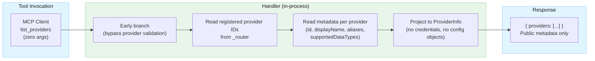

# Security Design: `list_providers` MCP Tool

## Document Info

- **Feature Spec**: [list-providers-tool.md](../features/list-providers-tool.md)
- **Architecture**: [stock-data-aggregation-canonical-architecture.md](../architecture/stock-data-aggregation-canonical-architecture.md)
- **Baseline Security**: [security-summary.md](security-summary.md) · [provider-selection-security.md](provider-selection-security.md)
- **Status**: Draft
- **Last Updated**: 2026-03-19

---

## Security Overview

The `list_providers` tool is a zero-argument MCP tool that returns the set of currently registered stock data providers and their public metadata (`id`, `displayName`, `aliases`, `supportedDataTypes`). All data originates from in-memory configuration assembled at startup; no external I/O occurs during tool execution.

**Risk Assessment:** LOW

The tool takes no user input, performs no external calls, and returns no credentials. The primary risk is **intentional information disclosure**: the response explicitly reveals which providers are currently active (i.e., which API keys are configured). In the current deployment model — single-user local stdio process — this is an intended, benign behavior. The risk escalates to **MEDIUM** if the server is ever adapted for network transport.

**Deployment Model**: Single-user local process (stdio-based JSON-RPC, MCP server on localhost) — unchanged from project baseline.

---

## Threat Model

### Assets

| Asset | Classification | Owner |
| --- | --- | --- |
| Provider public metadata (id, displayName, aliases, supportedDataTypes) | Public | Configuration |
| Provider registry (which providers are currently active) | Internal | Configuration |
| Provider API keys (Finnhub, Alpha Vantage, Yahoo Finance) | Confidential | DevOps/Security Team |
| Provider configuration (endpoints, tier, priority) | Internal | DevOps/Security Team |

### Attack Surface

| Surface | Exposure | Threats |
| --- | --- | --- |
| `list_providers` tool invocation (stdio) | Local | Information disclosure, fingerprinting |
| Provider metadata assembly (in-memory) | Internal | Accidental credential serialization, content injection from tampered config |
| MCP arguments element | Local | Exception if absent/null (reliability/DoS) |

### STRIDE Analysis

| Component | Spoofing | Tampering | Repudiation | Info Disclosure | DoS | Elevation |
| --- | --- | --- | --- | --- | --- | --- |
| `list_providers` handler | N/A — no auth change | Tampered `appsettings.json` → startup schema validation mitigates | Audit logging mitigates | Active provider set revealed → LOW in local model; MEDIUM if network-exposed | Negligible — pure in-memory read | N/A (local) |
| Metadata assembly (projection) | N/A | Config injection into display names/aliases → startup allowlist + length limits mitigate | N/A | Accidental credential field in response → explicit projection (REQ-LP-001) mitigates | N/A | N/A |
| Arguments parsing | N/A | N/A | N/A | N/A | Missing args element → unhandled exception → REQ-LP-003 mitigates | N/A |

---

## Threat Scenarios and Mitigations

### THREAT-LP-1: Provider Availability Fingerprinting

- **Attack**: An attacker (or curious caller) invokes `list_providers` to confirm which provider API subscriptions are active, then targets specific provider accounts for quota exhaustion or rate-limit abuse.
- **Impact**: Reveals which commercial API subscriptions are configured. In the local single-user model, the operator *is* the user — this is acceptable and intentional. If the server is network-exposed, this becomes a meaningful reconnaissance endpoint.
- **Mitigations**:
  1. **Deployment model boundary**: Current transport is stdio; network callers cannot reach this endpoint without architectural change.
  2. **Caveat documented** (REQ-LP-007): Any future network exposure of the MCP server must gate `list_providers` behind authentication.
  3. **No sensitive detail in response**: The response confirms which providers are active but reveals no credentials, no endpoint URLs, no tier details, no rate-limit state.
- **Residual Risk**: **LOW** (local) / **MEDIUM** (if network-exposed in the future)

### THREAT-LP-2: Accidental Credential Exposure in Response

- **Attack**: The implementation serializes a provider configuration object (e.g., `ProviderConfig`, `McpConfiguration`) rather than a narrow projection, inadvertently including API key values, base URLs, or internal identifiers in the JSON response.
- **Impact**: API key disclosure → financial loss, quota theft, service disruption.
- **Mitigations**:
  1. **Explicit projection** (REQ-LP-001): The response must be constructed from a purpose-built projection type (e.g., `ProviderInfo`) containing only `id`, `displayName`, `aliases`, and `supportedDataTypes`. No configuration object may be directly serialized.
  2. **Response field allowlist test** (TC-LP-SEC-05): Automated test validates zero unexpected properties appear in the response.
- **Residual Risk**: **LOW** — controlled by explicit projection requirement

### THREAT-LP-3: Content Injection via Malicious Configuration

- **Attack**: A local attacker modifies `appsettings.json` to inject adversarial content into provider `DisplayName`, alias strings, or `SupportedDataTypes` values (e.g., markup, script fragments, control characters). These values flow into the `list_providers` response and are consumed by MCP clients, which may render them unsafely.
- **Impact**: Content injection in MCP client display. Impact is bounded by the MCP client's rendering model; most clients treat tool results as plain text.
- **Mitigations**:
  1. **Static source preference** (REQ-LP-002): `displayName` and `supportedDataTypes` must be sourced from hardcoded constants in provider implementations — not from `appsettings.json`. Aliases come from configuration but are already validated at startup by `ProviderSelectionValidator`.
  2. **Startup validation**: Configuration schema validation at startup (existing control from Phase 1) catches malformed or out-of-bounds config values before they reach the tool handler.
  3. **Field length limits** (REQ-LP-002): Each string field is bounded at the configuration validation layer.
- **Residual Risk**: **LOW**

### THREAT-LP-4: Missing or Null Arguments Causing Unhandled Exception

- **Attack**: A compliant MCP client invokes `list_providers` without an `arguments` element (correct behavior for a zero-argument tool per MCP spec). The existing `HandleToolCallAsync` code calls `paramsElement.Value.GetProperty("arguments")`, which throws `KeyNotFoundException` if the property is absent.
- **Impact**: Unhandled exception surfaced as a JSON-RPC error. The MCP server continues operating (exception is caught by the outer handler), but the tool call fails for correctly-behaving clients. This is a reliability flaw that also creates a minor DoS vector (repeatedly crashing tool invocations).
- **Mitigations**:
  1. **Graceful missing-arguments handling** (REQ-LP-003): The `list_providers` handler must be structured to bypass or short-circuit the arguments-parsing block, since it requires no arguments.
  2. The handler should be placed as a dedicated branch *before* the common argument-extraction logic in `HandleToolCallAsync`, or the common block must guard for missing `arguments` with `TryGetProperty`.
- **Residual Risk**: **LOW** — with required control in place

### THREAT-LP-5: Common Provider Validation Block Applied to Zero-Argument Tool

- **Attack**: The existing `HandleToolCallAsync` prepend-validates a `provider` argument for all tools. For `list_providers`, there is no `provider` argument; `GetOptionalString` returns an empty string, `_providerValidator.Validate("")` returns `NoSelection()` (valid). This is silent and benign today, but creates a latent risk: if validation semantics change (e.g., empty-string behavior is tightened), `list_providers` could silently gain incorrect validation behavior.
- **Impact**: Low — currently safe, but fragile coupling between zero-argument tool and common validation logic.
- **Mitigations**:
  1. **Explicit bypass** (REQ-LP-004): The `list_providers` case must be handled before the common provider validation block, making the zero-argument contract explicit and immune to downstream changes in validation semantics.
- **Residual Risk**: **NEGLIGIBLE** — with explicit bypass in place

---

## Security Requirements

### REQ-LP-001: Narrow Response Projection (CRITICAL)

The `list_providers` response must be constructed from a purpose-built projection type containing **only** these fields per provider entry:

| Field | Type | Source |
| --- | --- | --- |
| `id` | `string` | `IStockDataProvider.ProviderId` (startup-registered) |
| `displayName` | `string` | Hardcoded constant per provider implementation |
| `aliases` | `string[]` | `ProviderSelectionValidator` alias map |
| `supportedDataTypes` | `string[]` | Hardcoded constant per provider implementation |

The following **must never** appear in the response:

- API keys or key fragments
- Provider API base URLs, endpoint paths, or authentication URLs
- `tier` values (separate concern; these belong in individual tool responses via `serviceKey`/`tier` metadata)
- Rate limit quotas, circuit breaker state, or priority weights
- `Enabled` flags or other configuration state
- Internal identifiers, configuration file paths, or `Type` discriminators
- Any property of `ProviderConfig`, `McpConfiguration`, or their child objects

The provider configuration objects must **not** be directly serialized — always project to the intermediate type.

### REQ-LP-002: Controlled Vocabulary for All Response Values (HIGH)

All string values in the response must originate from trusted, startup-validated sources:

- **`id`**: values from `_router.GetRegisteredProviderIds()` — already filtered to active providers
- **`displayName`**: hardcoded string constants in each `IStockDataProvider` implementation (not from `appsettings.json`). If sourced from configuration, must match a bounded allowlist validated at server startup.
- **`aliases`**: sourced from `ProviderSelectionValidator`'s internal alias map — already validated at startup against `AllowedProviderPattern` (`^[a-zA-Z0-9_ ]{1,50}$`)
- **`supportedDataTypes`**: hardcoded string constants (or string representations of a `DataType` enum) per provider — not user-configurable

Maximum field lengths enforced:

| Field | Max Length |
| --- | --- |
| `id` | 50 characters |
| `displayName` | 100 characters |
| Each alias | 50 characters (inherited from REQ-PS-002) |
| Each supportedDataType | 50 characters |

### REQ-LP-003: Graceful Handling of Absent or Empty Arguments (HIGH)

The `list_providers` handler must tolerate all of these invocation patterns without throwing an exception:

- `"arguments": {}` — empty arguments object
- `"arguments": null` — explicit null
- Arguments property absent from `params` entirely

The handler must short-circuit or branch **before** any call to `GetProperty("arguments")` that would throw on a missing key. The tool schema declares zero required parameters; the handler must honor this contract.

### REQ-LP-004: Explicit Bypass of Common Provider Validation Block (MEDIUM)

The `list_providers` tool must be handled by a dedicated branch that executes **before** the common provider argument extraction and `_providerValidator.Validate()` call in `HandleToolCallAsync`. The tool returns provider metadata — it does not route to any provider and must not participate in provider selection validation.

### REQ-LP-005: Audit Logging (MEDIUM)

All invocations of `list_providers` must be logged. Required log fields:

| Event | Level | Fields |
| --- | --- | --- |
| Tool invoked | Debug | `timestamp`, `toolName=list_providers`, `providerCount` |
| Tool returns empty list | Info | `timestamp`, `toolName=list_providers`, `providerCount=0` |
| Tool call fails (exception) | Warning | `timestamp`, `toolName=list_providers`, `errorCategory` |

Log entries must not capture raw request or response bodies. All log strings must pass through `SensitiveDataSanitizer.Sanitize()`.

### REQ-LP-006: Empty-Array Behavior Is Not an Error (HIGH)

If no providers are registered — all API keys absent or all providers disabled — the tool must return:

```json
{"providers": []}
```

This is a valid non-error response. The tool must **not** throw an exception, return a JSON-RPC error, or surface any message distinguishing "no providers" from other states. An empty list simply means no providers are currently configured.

### REQ-LP-007: Network Exposure Caveat (INFORMATIONAL)

This requirement does not block current implementation but must be tracked.

If the MCP server is ever adapted to accept connections over a network transport (TCP, HTTP, WebSocket), the `list_providers` endpoint must be restricted to authenticated and authorized callers before deployment. Unauthenticated access to `list_providers` over a network would allow any caller to enumerate the operator's active API subscriptions.

---

## Authentication

**No change from project baseline.**

- Mechanism: stdio local process boundary (same as all MCP tools)
- `list_providers` does not introduce new authentication surfaces
- No credential lookup occurs during tool execution

## Authorization

**No change from project baseline.**

- `list_providers` requires no additional authorization checks beyond the existing local process boundary
- All registered providers are returned; there is no per-caller provider filtering (single-user model)
- If multi-user or role-based access is introduced in future, consider restricting provider list visibility per user role

## Data Security

### Response Content Classification

| Field | Classification | Content Constraints | Risk |
| --- | --- | --- | --- |
| `id` | Public | Controlled vocabulary (registered provider IDs only) | None |
| `displayName` | Public | Hardcoded constant; max 100 chars | None |
| `aliases` | Public | From alias map; `[a-zA-Z0-9_ ]`, max 50 chars each | None |
| `supportedDataTypes` | Public | Hardcoded enum constants; max 50 chars each | None |

### Fields Explicitly Excluded from Response

| Field | Reason |
| --- | --- |
| API keys | Confidential — must never appear in any client-visible output |
| Base URL / endpoint | Internal topology — not needed by clients |
| `tier` | Separate concern for individual tool responses; not needed in provider discovery |
| `Enabled` / `Priority` | Internal routing detail |
| Circuit breaker state | Internal runtime state |
| Rate limit counters | Internal runtime state |

### Data Flow



## Secret Management

**No change from project baseline.**

- `list_providers` performs no credential lookup at request time
- API keys remain in environment variables / `appsettings.json` with `${VAR_NAME}` substitution
- REQ-LP-001 (narrow projection) ensures API keys cannot reach the response even if a programming error is made in the handler

## Input Validation

- **Zero arguments**: No user-supplied input is processed. No injection surface.
- **MCP arguments element**: May be absent, null, or empty — this is a valid invocation for a zero-argument tool. The handler must not call `GetProperty("arguments")` without guarding. (REQ-LP-003)
- **No whitelist validation required**: There is no user-provided provider hint to sanitize. The tool does not use `_providerValidator.Validate()`. (REQ-LP-004)

## Audit and Logging

| Event | Level | Fields | Sensitive Data |
| --- | --- | --- | --- |
| `list_providers` invoked | Debug | `timestamp`, `toolName`, `providerCount` | None |
| `list_providers` returns empty list | Info | `timestamp`, `toolName`, `providerCount=0` | None |
| `list_providers` exception | Warning | `timestamp`, `toolName`, `errorCategory` | Never log raw exception or config |

Logs pass through `SensitiveDataSanitizer.Sanitize()` per project baseline.

## Compliance

| Standard | Requirement | How Met |
| --- | --- | --- |
| OWASP A03:2021 (Injection) | No injection via user input | Zero-argument tool; no user input enters the handler |
| OWASP A02:2021 (Cryptographic Failures) | No credentials in client-visible output | REQ-LP-001 — explicit projection excludes all credential fields |
| OWASP A01:2021 (Broken Access Control) | Access limited to authorized callers | Local stdio boundary unchanged; caveat for future network exposure (REQ-LP-007) |
| OWASP A04:2021 (Insecure Design) | Fail-safe defaults | REQ-LP-006 — empty array on no providers; REQ-LP-003 — no crash on missing args |
| OWASP A09:2021 (Security Logging) | Audit all tool invocations | REQ-LP-005 — structured logging |
| CWE-200 (Information Exposure) | Control response content | REQ-LP-001 (narrow projection), REQ-LP-002 (controlled vocabulary) |

---

## Security Test Cases

### TC-LP-SEC-01: No Credentials in Response

- **Setup**: Configure all three providers with valid API credentials.
- **Action**: Invoke `list_providers`.
- **Expected**: Response contains `providers` array. Each entry contains exactly `id`, `displayName`, `aliases`, `supportedDataTypes`. No API key substrings, no URL strings, no `tier` values, no `enabled` flags, no extra properties.
- **Automation**: JSON-schema assertion on response object in unit tests.

### TC-LP-SEC-02: Unconfigured Provider Excluded Without Leakage

- **Setup**: Configure Yahoo Finance and Alpha Vantage only (remove Finnhub credentials).
- **Action**: Invoke `list_providers`.
- **Expected**: Response contains exactly 2 provider entries. Finnhub is absent. No field in the response indicates *why* Finnhub is absent (no "disabled", "missing_key", "unconfigured").

### TC-LP-SEC-03: Empty Response When No Providers Configured

- **Setup**: Remove all API credentials — server starts with no registered providers.
- **Action**: Invoke `list_providers`.
- **Expected**: Response is `{"providers": []}`. No JSON-RPC error. No exception. HTTP 200 (or equivalent success result).

### TC-LP-SEC-04: Missing Arguments Handled Gracefully

- **Action**: Invoke `list_providers` in three variants:
  1. `"params": {"name": "list_providers", "arguments": {}}`
  2. `"params": {"name": "list_providers", "arguments": null}`
  3. `"params": {"name": "list_providers"}` (arguments property absent)
- **Expected**: All three return a valid provider list result. No unhandled exception. No JSON-RPC error response in any variant.

### TC-LP-SEC-05: Response Field Allowlist Enforcement

- **Setup**: All providers configured.
- **Action**: Invoke `list_providers` and inspect each property of each provider entry using JSON reflection.
- **Expected**: Every provider entry contains exactly the fields `id`, `displayName`, `aliases`, `supportedDataTypes` — nothing more. Test fails if any additional property is present.

### TC-LP-SEC-06: Content Injection via Config

- **Setup**: Set a provider `DisplayName` in `appsettings.json` to `"<script>alert(1)</script>"`.
- **Action**: Start server and invoke `list_providers`.
- **Expected (preferred)**: Server rejects the configuration at startup and logs a validation error. Provider is excluded or server fails fast.
- **Expected (minimum acceptable)**: If display name comes from config and is not validated at startup, the value is returned as-is but bounded within field length limits. Client is responsible for safe rendering. Document that display names are untrusted if sourced from config.

### TC-LP-SEC-07: No Provider Selection Validation Applied

- **Setup**: Invoke `list_providers` with a malicious `"provider"` key injected into the arguments (e.g., `"arguments": {"provider": "../../etc/passwd"}`).
- **Expected**: The `list_providers` handler ignores any extra argument properties and returns the normal provider list. The malicious `provider` value is never passed to `_providerValidator.Validate()` or any other processor.

---

## Implementation Constraints Summary

For the developer implementing this feature, the following constraints from this document are blocking:

| Requirement | Constraint |
| --- | --- |
| REQ-LP-001 | Never serialize `ProviderConfig` or `McpConfiguration` — use a dedicated `ProviderInfo` projection type |
| REQ-LP-002 | `displayName` and `supportedDataTypes` must be hardcoded per provider (not from `appsettings.json`) |
| REQ-LP-003 | Handler must not call `GetProperty("arguments")` without guarding — zero-argument tool, args may be absent |
| REQ-LP-004 | Place `list_providers` branch before the common `_providerValidator.Validate()` call |
| REQ-LP-006 | Return `{"providers": []}` — never throw — if no providers are registered |

## Related Documents

- Feature Specification: [list-providers-tool.md](../features/list-providers-tool.md)
- Baseline Security: [security-summary.md](security-summary.md)
- Provider Selection Security: [provider-selection-security.md](provider-selection-security.md)
- Architecture: [stock-data-aggregation-canonical-architecture.md](../architecture/stock-data-aggregation-canonical-architecture.md)
