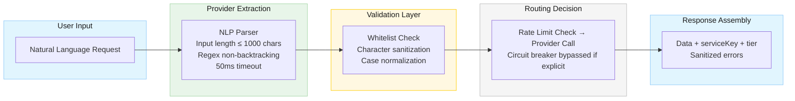

# Security Design: Provider Selection via Natural Language

## Document Info

- **Feature Spec**: [provider-selection.md](../features/provider-selection.md)
- **Architecture**: [stock-data-aggregation-canonical-architecture.md](../architecture/stock-data-aggregation-canonical-architecture.md)
- **Baseline Security**: [security-summary.md](security-summary.md)
- **Status**: In Review
- **Last Updated**: 2026-03-09

## Security Overview

This document defines the security architecture and controls for enabling explicit provider selection through natural language requests. The feature introduces new input surface (provider names parsed from user text), new response metadata (`serviceKey`, `tier`), and modified routing behavior (bypass of failover chains).

**Risk Assessment**: **MEDIUM**. While the system remains a single-user local stdio process, this feature introduces:

- A new input parsing surface that must resist injection and bypass attacks
- Response metadata that could disclose system topology and commercial tier information
- Modified control flow (circuit breaker bypass) that changes the failure-mode security posture

**Deployment Model**: Single-user local process (stdio-based JSON-RPC, MCP server on localhost)

---

## Threat Model

### Assets

| Asset | Classification | Owner |
| --- | --- | --- |
| Provider API Keys (Finnhub, Alpha Vantage, Yahoo) | Confidential | DevOps/Security Team |
| Provider whitelist / registry | Internal | Configuration |
| Provider routing decisions | Internal | System Runtime |
| `serviceKey` metadata in responses | Internal | System Runtime |
| `tier` metadata in responses | Internal | System Runtime |
| User natural language requests | Internal | End Users |
| Provider configuration (enabled/disabled, priority) | Internal | DevOps Team |
| Rate limit quotas per provider | Internal | System Runtime |

### Threat Actors

- **Malicious MCP Client**: Capability to send crafted JSON-RPC requests with adversarial provider names or injection payloads; motivation to bypass controls, discover system topology, or exhaust rate limits on specific providers
- **Malicious External API Provider**: Capability to return crafted payloads; motivation to disrupt service or poison data attributed to a specific `serviceKey`
- **Local System Attacker**: Capability to read configuration files or environment variables; motivation to extract API keys or modify provider whitelist

### Attack Surface

| Surface | Exposure | Threats |
| --- | --- | --- |
| Provider name in user request (NLP input) | Local (stdio) | Injection, bypass, enumeration |
| `serviceKey` / `tier` in response | Local (stdio) | Information disclosure |
| Provider routing configuration | Local (file system) | Configuration tampering |
| Provider validation logic | Internal | Logic bypass, DoS via invalid providers |
| Circuit breaker bypass path | Internal | Targeted DoS against specific provider |

### STRIDE Analysis

| Component | Spoofing | Tampering | Repudiation | Info Disclosure | DoS | Elevation |
| --- | --- | --- | --- | --- | --- | --- |
| NLP Provider Parser | Craft input to impersonate provider → Whitelist validation mitigates | N/A | Audit logging mitigates | N/A | Regex complexity → bounded patterns mitigate | N/A (local) |
| Provider Whitelist | N/A | Config file modification → schema validation mitigates | N/A | List of providers disclosed → acceptable (see F-2) | N/A | N/A (local) |
| Provider Router (explicit mode) | N/A | N/A | Logging mitigates | `serviceKey` reveals which provider → acceptable (see F-3) | Circuit breaker bypass enables targeted provider exhaustion → rate limits mitigate | N/A (local) |
| Response Metadata | N/A | N/A | N/A | `tier` reveals commercial relationship → acceptable (see F-3) | N/A | N/A (local) |
| Error Messages | N/A | N/A | N/A | Provider availability disclosed → controlled (see F-4) | N/A | N/A (local) |

---

## Threat Scenarios and Mitigations

### THREAT-PS-1: Provider Name Injection

- **Attack**: Attacker sends crafted provider name containing SQL fragments, path traversal, command injection, or control characters (e.g., `"../../../etc/passwd"`, `"yahoo; rm -rf"`, `"yahoo\x00finance"`)
- **Impact**: If provider name is passed unsanitized to file operations, shell commands, or logging systems, could enable injection attacks
- **Mitigations**:
  1. **Strict whitelist validation**: Provider names are validated against a compile-time or configuration-time set of known provider identifiers. Any name not in the whitelist is rejected before further processing
  2. **Character set restriction**: Provider names must match `^[a-zA-Z][a-zA-Z0-9_]{0,49}$` — alphanumeric and underscore only, starting with a letter, maximum 50 characters
  3. **Case-insensitive normalization**: All provider names are lowercased and normalized before comparison (reusing existing `NormalizeProviderId` pattern)
  4. **No dynamic construction**: Provider names are never used to construct file paths, shell commands, SQL queries, or dynamic code
- **Residual Risk**: **LOW**

### THREAT-PS-2: NLP Parser Exploitation (ReDoS / Adversarial Input)

- **Attack**: Attacker sends extremely long input strings or pathological patterns designed to cause catastrophic backtracking in regex-based provider name extraction
- **Impact**: CPU exhaustion, request timeout, denial of service
- **Mitigations**:
  1. **Input length limit**: User request text is truncated to 1,000 characters before NLP parsing
  2. **Bounded regex patterns**: Provider intent patterns use non-backtracking constructs. Avoid nested quantifiers. Use possessive quantifiers or atomic groups where supported. Prefer keyword matching over complex regex
  3. **Parsing timeout**: Provider name extraction must complete within 50ms (per non-functional requirement). Use `CancellationToken` with timeout
  4. **Fail-safe default**: If parsing fails or times out, the system falls back to default provider (no explicit selection), logged as a parse failure
- **Residual Risk**: **LOW**

### THREAT-PS-3: Targeted Provider Exhaustion via Circuit Breaker Bypass

- **Attack**: Attacker explicitly selects a specific provider repeatedly, knowing that circuit breaker and fallback logic are bypassed. This exhausts the selected provider's rate limit quota without triggering automatic failover protection
- **Impact**: Rate limit exhaustion on a specific provider, potential API key suspension
- **Mitigations**:
  1. **Per-provider rate limiting enforced regardless of selection mode**: The existing sliding-window rate limiter applies to all requests, whether the provider was explicitly selected or chosen by default. Rate limiting is NOT bypassed when circuit breaker is bypassed
  2. **Rate limit errors returned immediately**: When a provider's rate limit is exhausted, return a clear error — do not silently queue or retry
  3. **Audit logging**: All explicit provider selections are logged with timestamps, enabling post-hoc detection of abuse patterns
- **Residual Risk**: **LOW-MEDIUM** (rate limiting mitigates, but a determined local attacker could still exhaust daily quotas)

### THREAT-PS-4: Provider Enumeration via Error Messages

- **Attack**: Attacker sends requests with various provider names to enumerate which providers are configured, which have valid credentials, and which are enabled
- **Impact**: Information disclosure about system configuration and active subscriptions
- **Mitigations**:
  1. **Uniform error format for invalid providers**: Error messages list all *supported* provider names regardless of configuration state. The message "Provider 'X' is not configured. Available providers: yahoo, alphavantage, finnhub" reveals only the supported set (which is public knowledge from documentation), not which are actually enabled or have credentials
  2. **Credential availability not disclosed**: A provider that is supported but lacks credentials returns a generic "Provider 'X' is not currently available" message — not a message distinguishing "missing credentials" from "disabled" or "rate limited"
  3. **No configuration detail in errors**: Error messages never include API key fragments, endpoint URLs, configuration file paths, or provider priority ordering
- **Residual Risk**: **LOW** (provider names are public; availability status carries minimal exploitation value in a local process)

### THREAT-PS-5: Metadata-Based System Topology Disclosure

- **Attack**: By analyzing `serviceKey` and `tier` across multiple requests, an attacker maps which providers handle which data types, their commercial tier, and potentially infers the routing priority configuration
- **Impact**: Information disclosure about system architecture and commercial relationships
- **Mitigations**:
  1. **Acceptable disclosure for local deployment**: In the current single-user local process model, the user *is* the system operator. Disclosing `serviceKey` and `tier` is an intended feature for transparency and cost tracking — not a vulnerability
  2. **No internal identifiers in `serviceKey`**: The `serviceKey` value must be a stable, user-facing label (e.g., `"yahoo"`, `"alphavantage"`, `"finnhub"`) — never an internal identifier, database key, or configuration path
  3. **`tier` values are generic**: Tier values are limited to a controlled vocabulary (`"free"`, `"paid"`). No commercial pricing, contract terms, or account identifiers are included
  4. **Network deployment caveat**: If the MCP server is ever exposed over a network transport, `serviceKey` and `tier` disclosure should be reviewed — consider making metadata opt-in or redactable
- **Residual Risk**: **LOW** (intentional disclosure in current deployment model)

### THREAT-PS-6: Configuration Tampering to Add Malicious Provider

- **Attack**: Local attacker modifies `appsettings.json` to add a rogue provider entry pointing to an attacker-controlled API endpoint
- **Impact**: Data exfiltration (ticker symbols sent to attacker), response poisoning (fabricated financial data)
- **Mitigations**:
  1. **Existing control**: Configuration schema validation at startup (from Phase 1 security)
  2. **Provider type validation**: Only recognized `Type` values (e.g., `"YahooFinanceProvider"`, `"FinnhubProvider"`, `"AlphaVantageProvider"`) are accepted. Unknown types are rejected at startup
  3. **Base URL validation**: If providers allow configurable base URLs, validate against known allowlists per provider type (e.g., Finnhub must use `https://finnhub.io/api/v1`)
  4. **TLS enforcement**: All provider HTTP clients enforce TLS 1.2+ regardless of configuration
- **Residual Risk**: **LOW** (local attacker with file system access has broader attack capability regardless)

---

## Security Requirements

### REQ-PS-001: Provider Name Whitelist Validation (CRITICAL)

Provider names extracted from user input must be validated against a whitelist of recognized provider identifiers before any routing decision. The whitelist must be:

- Derived from the set of `IStockDataProvider.ProviderId` values registered at startup
- Stored in-memory (never read from user input or untrusted configuration at request time)
- Compared using case-insensitive ordinal comparison after normalization

Unrecognized provider names must be rejected with an error before any downstream processing.

### REQ-PS-002: Provider Name Input Sanitization (CRITICAL)

User-supplied provider name candidates must be sanitized before processing:

- Maximum length: 50 characters
- Allowed character set: `[a-zA-Z0-9_ ]` (alphanumeric, underscore, space)
- Null bytes, control characters, and special characters must be stripped or rejected
- Provider names must never be used in string interpolation for file paths, commands, or queries

### REQ-PS-003: NLP Input Boundaries (HIGH)

Natural language parsing for provider intent must enforce:

- Maximum input length of 1,000 characters for the provider extraction phase
- Regex patterns must use non-backtracking constructs to prevent ReDoS
- Parsing must complete within 50ms or fall back to default provider
- Parse failure must not cause request failure — it defaults to no explicit provider selection

### REQ-PS-004: Rate Limiting Independence from Circuit Breaker Bypass (HIGH)

When explicit provider selection bypasses circuit breaker and fallback logic, per-provider rate limiting must still be enforced. The rate limiter must be checked *before* the provider call, not after.

### REQ-PS-005: Error Message Information Control (HIGH)

Error messages for provider selection failures must follow these rules:

| Scenario | Allowed Message Content | Prohibited Content |
| --- | --- | --- |
| Invalid provider name | "Provider 'X' is not available. Supported providers: yahoo, alphavantage, finnhub" | Configuration details, file paths, stack traces |
| Provider unavailable (credentials/disabled) | "Provider 'X' is not currently available." | Reason for unavailability (missing key, disabled, rate limited) |
| Provider API failure | "Request to [provider] failed: [generic category]" (e.g., "rate limit exceeded", "timeout", "service error") | Raw HTTP status codes, internal URLs, response bodies, API keys |
| NLP parse failure | (silent — fall back to default provider) | No error surfaced to user |

All error messages must pass through `SensitiveDataSanitizer.Sanitize()` before reaching the MCP client.

### REQ-PS-006: `serviceKey` Value Constraints (MEDIUM)

The `serviceKey` field in responses must:

- Contain only values from the recognized provider set (`"yahoo"`, `"alphavantage"`, `"finnhub"`)
- Never contain internal identifiers, database keys, or configuration paths
- Be a static mapping — not derived from user input or dynamic construction

### REQ-PS-007: `tier` Value Constraints (MEDIUM)

The `tier` field in responses must:

- Contain only values from a controlled vocabulary: `"free"`, `"paid"`
- Never contain pricing information, account identifiers, or contract terms
- Be derived from a static configuration mapping per provider — not from the external API response

### REQ-PS-008: Audit Logging for Provider Selection (MEDIUM)

All provider selection decisions must be logged with:

- Timestamp
- Selection method (`explicit` or `default`)
- Requested provider name (sanitized)
- Resolved provider ID
- Whether the request succeeded or failed
- Correlation ID for end-to-end tracing

Logs must redact any sensitive data per existing `SensitiveDataSanitizer` patterns.

### REQ-PS-009: Credential Isolation (MEDIUM)

Provider selection must not expose credential state:

- Selecting a provider must not reveal whether it has valid API credentials
- API keys must never appear in response metadata, error messages, or client-visible logs
- The choice of provider must not cause different API keys to be visible in any observable channel

### REQ-PS-010: Default Provider Fail-Safe (MEDIUM)

If the default provider configuration in `appsettings.json` is missing or references an unknown provider:

- The system must fall back to a hardcoded safe default (Yahoo Finance, which requires no API key)
- A configuration warning must be logged at startup
- The system must not crash, hang, or enter an undefined state

---

## Authentication

**No changes to existing authentication model.**

- **Mechanism**: Cookie/Crumb (Yahoo Finance), API Keys (others) — unchanged
- **Provider selection does not introduce new authentication flows**: The feature selects *which* pre-authenticated provider to use, it does not create new authentication paths
- **API key isolation**: Each provider's credentials are loaded at startup and bound to the provider instance. Explicit selection routes to a pre-authenticated provider — it does not trigger credential lookup at request time

## Authorization

**Model**: Provider availability checking (extension of existing model)

| Check | Enforcement Point | Behavior |
| --- | --- | --- |
| Provider name is recognized | NLP parser / router input validation | Reject with "not available" error |
| Provider is enabled in configuration | `GetProviderChain` / explicit selection validator | Reject with "not currently available" error |
| Provider rate limit not exceeded | Rate limiter (pre-call check) | Reject with "rate limit exceeded" error |

**Default policy**: Deny requests to unrecognized providers. Allow requests to recognized, enabled providers within rate limits.

**Per-user authorization**: Not applicable in current single-user model. If multi-user support is added, consider per-user provider access lists.

## Data Security

### Response Metadata

| Data Field | Classification | Content Constraints | Disclosure Risk |
| --- | --- | --- | --- |
| `serviceKey` | Internal | Controlled vocabulary from provider whitelist | Low — public provider brand names |
| `tier` | Internal | Controlled vocabulary: free, paid | Low — general tier, no commercial detail |
| `rateLimitRemaining` | Internal | Integer count only | Low — reveals remaining quota |

### Data Flow

## Secret Management

**No changes to existing secret management model.**

- API keys remain in environment variables or `appsettings.json` with `${VAR_NAME}` template substitution
- Provider selection does not introduce new credential storage or retrieval patterns
- **Credential rotation**: Existing manual rotation (env var update + restart) applies. No provider-selection-specific rotation concerns

**Recommendation for future enhancement**: If provider selection introduces per-user preference storage, ensure user preference data never contains or references API keys.

## Input Validation and Sanitization

### Provider Name Validation Rules

| Rule | Implementation | Example |
| --- | --- | --- |
| Max length 50 characters | Truncate before processing | `"abcdef...xyz"` → truncated |
| Allowed characters: `[a-zA-Z0-9_ ]` | Strip disallowed characters | `"yahoo;rm -rf"` → `"yahoorm rf"` → no match |
| Null byte rejection | Strip `\0` characters | `"yahoo\0"` → `"yahoo"` |
| Case normalization | `ToLowerInvariant()` | `"YAHOO"` → `"yahoo"` |
| Alias resolution | Static map (e.g., `"alpha vantage"` → `"alphavantage"`) | Extends existing `NormalizeProviderId` |
| Whitelist comparison | `HashSet<string>.Contains()` on normalized value | Only exact matches pass |

### Ticker Symbol Validation

Unchanged from baseline security — allow-list regex `^[A-Z]{1,5}$` (1-5 uppercase alphanumeric characters).

## API Security

### Rate Limiting (Provider Selection Context)

| Provider | Rate Limit | Enforcement |
| --- | --- | --- |
| Yahoo Finance | ~2000/hour (unofficial) | Sliding window, enforced even with explicit selection |
| Alpha Vantage | 5/min, 500/day | Sliding window + daily quota, enforced even with explicit selection |
| Finnhub | 60/min | Sliding window, enforced even with explicit selection |

**Key control**: Rate limiting is NOT bypassed when the user explicitly selects a provider. Only the circuit breaker and fallback chain are bypassed.

## Audit and Logging

### Provider Selection Events

| Event | Log Level | Fields | Sensitive Data |
| --- | --- | --- | --- |
| Provider extracted from NLP | Info | timestamp, correlationId, requestedProvider, selectionMethod=explicit | None |
| No provider specified (default used) | Debug | timestamp, correlationId, defaultProvider, selectionMethod=default | None |
| Provider validation succeeded | Debug | timestamp, correlationId, resolvedProviderId | None |
| Provider validation failed (unknown) | Warning | timestamp, correlationId, requestedProvider (sanitized), availableProviders | None (provider name sanitized) |
| Provider unavailable | Warning | timestamp, correlationId, providerId, reason=generic_category | Never log credentials or config details |
| Explicit provider request succeeded | Info | timestamp, correlationId, providerId, durationMs | None |
| Explicit provider request failed | Warning | timestamp, correlationId, providerId, errorCategory | Never log raw exception with stack trace |
| NLP parse timeout/failure | Warning | timestamp, correlationId, inputLengthChars, durationMs | Never log raw user input (may contain PII) |

All log messages pass through `SensitiveDataSanitizer.Sanitize()`.

## Compliance Requirements

| Standard | Requirement | Implementation |
| --- | --- | --- |
| OWASP A03:2021 (Injection) | Prevent injection via user input | Whitelist validation, character sanitization, no dynamic construction |
| OWASP A01:2021 (Broken Access Control) | Enforce provider access boundaries | Whitelist-only routing, rate limiting independent of bypass |
| OWASP A04:2021 (Insecure Design) | Fail-safe defaults | Unknown provider → reject; parse failure → default provider; missing config → hardcoded fallback |
| OWASP A09:2021 (Security Logging) | Audit provider selection decisions | Structured logging with sanitization |
| CWE-20 (Improper Input Validation) | Validate all external inputs | Provider name sanitization and whitelist check |
| CWE-200 (Information Exposure) | Control error message content | Uniform error messages, no credential/topology disclosure |
| CWE-1333 (ReDoS) | Prevent regex-based DoS | Non-backtracking patterns, parsing timeout |

## Vulnerability Management

No new tooling required. Existing controls apply:

- **Dependency scanning**: Provider selection does not introduce new NuGet dependencies
- **SAST coverage**: Provider name validation logic should be included in static analysis scope
- **Test coverage**: Security test cases defined below

---

## Security Test Cases

### TC-PS-SEC-01: Provider Name Injection Resistance

- **Input**: Provider names containing SQL fragments (`"yahoo' OR 1=1--"`), path traversal (`"../../etc/passwd"`), command injection (`"yahoo; rm -rf /"`), null bytes (`"yahoo\x00admin"`)
- **Expected**: All rejected by whitelist validation. None reach provider routing layer. Error message is generic "Provider 'X' is not available."

### TC-PS-SEC-02: ReDoS Resistance

- **Input**: Pathologically long strings (10,000+ characters), strings designed to trigger backtracking (e.g., `"aaaaaaaaa...from "` repeated patterns)
- **Expected**: NLP parser completes within 50ms or times out gracefully. System falls back to default provider. No CPU exhaustion

### TC-PS-SEC-03: Provider Enumeration Resistance

- **Input**: Requests with provider names `"bloomberg"`, `"reuters"`, `"morningstar"`, `"fmp"`, empty string, whitespace-only
- **Expected**: All return identical error format with the same list of supported providers. No information distinguishes "unknown" from "known but disabled"

### TC-PS-SEC-04: Credential Non-Disclosure

- **Input**: Select a provider that is configured but has an invalid/expired API key
- **Expected**: Error message is "Provider 'X' is not currently available." — no mention of credentials, API key status, or configuration details

### TC-PS-SEC-05: Rate Limit Enforcement Under Explicit Selection

- **Input**: Rapidly send 100+ explicit requests to Alpha Vantage (5/min limit)
- **Expected**: After the rate limit is hit, subsequent requests return rate limit error immediately. The rate limiter is not bypassed by explicit selection

### TC-PS-SEC-06: `serviceKey` and `tier` Value Integrity

- **Input**: Successful requests to each provider
- **Expected**: `serviceKey` contains only `"yahoo"`, `"alphavantage"`, or `"finnhub"`. `tier` contains only `"free"` or `"paid"`. No other values appear

### TC-PS-SEC-07: Error Message Sanitization

- **Input**: Force provider failures that produce exceptions containing API key fragments or internal paths
- **Expected**: All error messages pass through `SensitiveDataSanitizer.Sanitize()`. No API keys, file paths, or stack traces appear in client-facing responses

### TC-PS-SEC-08: Default Provider Fail-Safe

- **Input**: Remove or corrupt the default provider configuration in `appsettings.json`
- **Expected**: System starts successfully with hardcoded Yahoo Finance default. Warning logged. No crash or undefined behavior

---

## Security Requirements Checklist

- [ ] Provider name whitelist validation implemented (REQ-PS-001)
- [ ] Provider name input sanitization implemented (REQ-PS-002)
- [ ] NLP input boundaries enforced (REQ-PS-003)
- [ ] Rate limiting independent of circuit breaker bypass (REQ-PS-004)
- [ ] Error messages follow information control rules (REQ-PS-005)
- [ ] `serviceKey` uses controlled vocabulary only (REQ-PS-006)
- [ ] `tier` uses controlled vocabulary only (REQ-PS-007)
- [ ] Audit logging for all provider selection decisions (REQ-PS-008)
- [ ] Credential state not exposed via provider selection (REQ-PS-009)
- [ ] Default provider fail-safe validated (REQ-PS-010)
- [ ] All error paths pass through `SensitiveDataSanitizer.Sanitize()`
- [ ] No hardcoded secrets in provider selection code
- [ ] Security test cases (TC-PS-SEC-01 through TC-PS-SEC-08) passing

## Related Documents

- Feature Specification: [provider-selection.md](../features/provider-selection.md)
- Architecture Overview: [stock-data-aggregation-canonical-architecture.md](../architecture/stock-data-aggregation-canonical-architecture.md)
- Baseline Security: [security-summary.md](security-summary.md)
- Error Handling Architecture: [issue-17-error-handling-architecture.md](../architecture/issue-17-error-handling-architecture.md)
- Test Strategy: [testing-summary.md](../testing/testing-summary.md)
