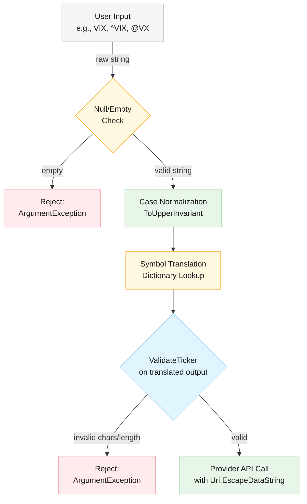

# Security Analysis: Smart Symbol Translation

**Version**: 1.0
**Date**: 2026-03-06
**Feature Spec**: [docs/features/symbol-translation.md](../features/symbol-translation.md)
**Status**: Post-Implementation Verified
**Risk Level**: LOW-MEDIUM

---

## 1. Executive Summary

The Smart Symbol Translation feature introduces a new input transformation layer between MCP tool invocation and provider API calls. While the feature itself is low-complexity (in-memory dictionary lookups), it creates a new trust boundary where user-controlled input is transformed before reaching validated provider code.

**Overall Security Assessment**: **LOW-MEDIUM RISK**

The translation layer is a thin, read-only lookup with no external I/O, no persistence, and no elevated privileges. The primary risks are input validation gaps during the translation handoff and subtle interactions with existing URI-encoding logic. All identified risks are mitigable with straightforward controls.

---

## 2. Threat Model

### 2.1 System Context

```mermaid
graph LR
    subgraph Trust Boundary: MCP Client
        A[MCP Client<br>User Input]
    end

    subgraph Trust Boundary: MCP Server Process
        B[StockDataMcpServer<br>JSON-RPC Handler]
        C[Symbol Translator<br>NEW COMPONENT]
        D[StockDataProviderRouter<br>Failover Chain]
        E[YahooFinanceProvider<br>ValidateTicker]
    end

    subgraph Trust Boundary: External API
        F[Yahoo Finance API<br>HTTPS]
    end

    A -->|ticker string| B
    B -->|raw ticker| C
    C -->|translated ticker| D
    D -->|validated ticker| E
    E -->|URI-encoded ticker| F

    style C fill:#fff8e1,stroke:#f9a825,color:#1a1a1a
    style B fill:#e1f5fe,stroke:#90caf9,color:#1a1a1a
    style D fill:#e1f5fe,stroke:#90caf9,color:#1a1a1a
    style E fill:#e1f5fe,stroke:#90caf9,color:#1a1a1a
    style A fill:#f5f5f5,stroke:#bdbdbd,color:#1a1a1a
    style F fill:#f5f5f5,stroke:#bdbdbd,color:#1a1a1a
```

### 2.2 Attack Surface Analysis

The symbol translator expands the input surface:

| Input Point | Before Translation | After Translation |
|---|---|---|
| Accepted ticker formats | `^VIX`, `AAPL` (provider-native) | `VIX`, `^VIX`, `@VX`, `AAPL` (any recognized alias) |
| Character set | Alphanumeric + `^` + `.` + `-` | Same (no new characters introduced) |
| Input processing layers | 1 (provider validation) | 2 (translation + provider validation) |

### 2.3 Threat Catalog

#### THREAT-ST-1: Injection via Symbol Input

- **Description**: Attacker crafts a symbol string containing special characters (e.g., `../`, `%0d%0a`, SQL fragments) that passes through translation unchanged (no mapping found) and reaches the URI construction in `YahooFinanceClient`
- **Attack Vector**: MCP tool call with malicious `ticker` parameter
- **Likelihood**: LOW — Existing `ValidateTicker()` rejects non-alphanumeric characters (except `^`, `.`, `-`), and `Uri.EscapeDataString()` encodes any special characters before URI construction
- **Impact**: MEDIUM — Could cause SSRF or header injection if validation bypassed
- **Risk**: LOW (L:LOW x I:MEDIUM)
- **Existing Mitigations**:
  1. `ValidateTicker()` allowlist: `char.IsLetterOrDigit(c) || c == '.' || c == '-'` with `^` prefix handling
  2. Max length check: 10 characters
  3. `Uri.EscapeDataString()` on every ticker before URL construction
- **Residual Risk**: LOW — Defense-in-depth with validation + encoding is adequate

#### THREAT-ST-2: Dictionary Mapping Manipulation

- **Description**: Attacker attempts to influence the symbol mapping dictionary to redirect queries to unintended provider endpoints
- **Attack Vector**: N/A for compile-time dictionaries; would require source code modification
- **Likelihood**: NEGLIGIBLE — Mappings are compile-time C# constants, not loaded from external config, database, or user input
- **Impact**: HIGH — Could redirect financial queries to wrong instruments
- **Risk**: NEGLIGIBLE (L:NEGLIGIBLE x I:HIGH)
- **Mitigations**: Code review, immutable dictionary (`IReadOnlyDictionary`), no runtime modification API
- **Residual Risk**: NEGLIGIBLE

#### THREAT-ST-3: Translator Output Bypasses Provider Validation

- **Description**: Translation produces a symbol that passes `ValidateTicker()` but is semantically incorrect or causes unexpected behavior at the Yahoo Finance API
- **Attack Vector**: Malformed mapping entry produces a symbol like `^` (caret only), `^.`, or an empty string after translation
- **Likelihood**: LOW — Mappings are developer-authored constants reviewed in code review
- **Impact**: MEDIUM — Could cause confusing error responses or retrieve wrong data
- **Risk**: LOW (L:LOW x I:MEDIUM)
- **Mitigations**:
  1. `ValidateTicker()` runs AFTER translation (catches empty/malformed output)
  2. Unit tests for every mapping entry
  3. Startup validation of all mapping entries (recommended)
- **Residual Risk**: LOW

#### THREAT-ST-4: Information Disclosure via Error Messages

- **Description**: Error messages from the translation layer reveal internal provider format details (e.g., "Symbol '@VX' was translated to '^VIX' for Yahoo Finance provider")
- **Attack Vector**: User sends invalid symbol, observes error message revealing provider internals
- **Likelihood**: MEDIUM — Developers may add verbose logging/error messages during implementation
- **Impact**: LOW — Provider format knowledge is semi-public (Yahoo uses `^` prefix for indices), and this is a single-user local MCP server
- **Risk**: LOW (L:MEDIUM x I:LOW)
- **Mitigations**:
  1. Error messages should reference the user's original input symbol, not the translated form
  2. Internal translation details logged at DEBUG level only
  3. Client-facing errors use generic phrasing: "Symbol not found" rather than "Translation of X to Y failed"
- **Residual Risk**: LOW

#### THREAT-ST-5: Denial of Service via Case Permutation Flooding

- **Description**: Attacker sends many case variations of the same symbol (`vix`, `VIX`, `ViX`, `vIx`, etc.) to bypass caching or cause excessive dictionary lookups
- **Attack Vector**: Rapid MCP tool calls with case-permuted symbols
- **Likelihood**: LOW — Dictionary lookups are O(1), case normalization adds negligible overhead (<1ms), and this is a single-user local process
- **Impact**: LOW — No meaningful resource exhaustion possible from dictionary lookups
- **Risk**: LOW (L:LOW x I:LOW)
- **Mitigations**:
  1. Normalize input to uppercase before dictionary lookup (`OrdinalIgnoreCase` comparer or `ToUpperInvariant()`)
  2. Existing per-provider rate limiting (2000 req/hour for Yahoo) applies after translation
  3. Circuit breaker prevents cascading failures
- **Residual Risk**: NEGLIGIBLE

#### THREAT-ST-6: Interaction Between Translation and URI Encoding

- **Description**: The `^` character in Yahoo format symbols (`^VIX`) is URL-encoded by `Uri.EscapeDataString()` to `%5EVIX`, which Yahoo Finance accepts. If translation introduces new prefix characters (e.g., `@` for FinViz), these could interact unexpectedly with URI encoding
- **Attack Vector**: Cross-provider format containing characters that URI-encode to unexpected byte sequences
- **Likelihood**: LOW — Translation output always targets the selected provider's expected format; Yahoo format uses only `^` which is already handled
- **Impact**: LOW — Would result in API errors, not security breaches
- **Risk**: LOW (L:LOW x I:LOW)
- **Mitigations**:
  1. Translation output must only contain characters permitted by `ValidateTicker()`
  2. Each provider format must be validated against that provider's character allowlist
  3. `Uri.EscapeDataString()` provides defense-in-depth regardless
- **Residual Risk**: NEGLIGIBLE

#### THREAT-ST-7: Reverse Lookup Ambiguity

- **Description**: Multiple canonical symbols could theoretically map to the same provider format, or the reverse lookup from a provider-specific format could resolve to the wrong canonical symbol, leading to incorrect data retrieval
- **Attack Vector**: Developer error in mapping dictionary introduces ambiguous entries
- **Likelihood**: LOW — Unit tests and startup validation catch ambiguity
- **Impact**: MEDIUM — User receives data for wrong instrument without clear indication
- **Risk**: LOW (L:LOW x I:MEDIUM)
- **Mitigations**:
  1. Startup validation: assert no duplicate values in provider-specific format columns
  2. Unit tests verify bidirectional mapping consistency
  3. Reverse lookup dictionary built programmatically from forward dictionary (single source of truth)
- **Residual Risk**: NEGLIGIBLE

### 2.4 Risk Summary Matrix

| Threat ID | Threat | Likelihood | Impact | Risk | Status |
|---|---|---|---|---|---|
| ST-1 | Injection via symbol input | LOW | MEDIUM | **LOW** | Mitigated by existing controls |
| ST-2 | Dictionary mapping manipulation | NEGLIGIBLE | HIGH | **NEGLIGIBLE** | Compile-time constants |
| ST-3 | Translator bypasses validation | LOW | MEDIUM | **LOW** | Requires post-translation validation |
| ST-4 | Information disclosure in errors | MEDIUM | LOW | **LOW** | Requires error message discipline |
| ST-5 | DoS via case permutations | LOW | LOW | **LOW** | Case normalization + rate limits |
| ST-6 | URI encoding interaction | LOW | LOW | **LOW** | Existing encoding is adequate |
| ST-7 | Reverse lookup ambiguity | LOW | MEDIUM | **LOW** | Startup validation required |

---

## 3. Secure Design Recommendations

### 3.1 Input Validation Strategy: Validate AFTER Translation

**Rationale for post-translation validation**:

- The translator may accept input characters (e.g., `@` in `@VX`) that are not valid in the target provider's format — but the translated output (`^VIX`) is valid
- Pre-translation validation would need to know all possible input formats across all providers, which defeats the purpose of centralized mapping
- Post-translation validation ensures the final symbol sent to the provider always meets that provider's rules
- `ValidateTicker()` already exists in `YahooFinanceProvider` and runs on every call — this remains the security gate

**Recommended validation sequence**:

1. **Translator entry**: Null/empty check only (reject obviously invalid input early)
2. **Case normalization**: `ToUpperInvariant()` before lookup
3. **Dictionary lookup**: Translate or pass through unchanged
4. **Provider validation**: `ValidateTicker()` on translated output (existing behavior, unchanged)
5. **URI encoding**: `Uri.EscapeDataString()` on validated output (existing behavior, unchanged)

### 3.2 Case Handling: Normalize to Uppercase

- Apply `string.ToUpperInvariant()` on input before dictionary lookup
- Use `StringComparer.OrdinalIgnoreCase` for the dictionary to handle any edge cases
- This eliminates the entire class of case-permutation attacks and simplifies mapping
- All canonical names and provider formats are conventionally uppercase

### 3.3 Symbol Mapping Verification

The mapping dictionary must be protected against developer error:

- **Immutability**: Declare as `IReadOnlyDictionary` or `FrozenDictionary` (.NET 8+) to prevent runtime modification
- **Startup validation**: On application startup (or in a static constructor), verify:
  - No duplicate provider-format values within the same provider column
  - All mapped values pass the target provider's `ValidateTicker()` rules
  - No null or empty values in any mapping entry
  - Reverse lookup produces unique canonical names (no ambiguity)
- **Single source of truth**: The reverse lookup dictionary must be generated from the forward dictionary, never maintained separately

### 3.4 Error Handling — No Provider Detail Leakage

**Client-facing error messages must**:

- Reference the user's original input symbol, not the translated form
- Use generic language: "Symbol 'VIX' not found" (not "'^VIX' returned 404 from Yahoo Finance API")
- Never reveal which provider was selected, attempted, or failed
- Never reveal the translation mapping or provider-specific format

**Internal logging may**:

- Log translation details at DEBUG level for troubleshooting
- Include provider identity and translated symbol in structured log fields
- Always apply existing secrets redaction filter to log output

### 3.5 Translation Layer Boundaries

- The translator must be a **pure function**: input string → output string, with no side effects, no I/O, no state mutation
- The translator must **not** make provider API calls, access network resources, or read configuration files at translation time
- The translator must **not** cache results (dictionary lookup is already O(1); caching adds complexity for no benefit)
- The translator must be **deterministic**: same input always produces same output

### 3.6 `@` Prefix Handling for Future Providers

The existing `ValidateTicker()` allowlist in `YahooFinanceProvider` permits: `^`, alphanumeric, `.`, `-`. The `@` character (FinViz format) is NOT in this allowlist.

**This is correct behavior**: The translator converts `@VX` → `^VIX` before the Yahoo provider's `ValidateTicker()` runs. The `@` prefix never reaches Yahoo's validation. When a FinViz provider is added, it will have its own `ValidateTicker()` that permits `@`.

**Security implication**: Each provider must maintain its own character allowlist. The translator is format-aware but validation is provider-specific. This is the intended design.

---

## 4. Review of Existing Security Controls

### 4.1 `YahooFinanceProvider.ValidateTicker()` — ADEQUATE

Current implementation (source: `StockData.Net/Providers/YahooFinanceProvider.cs`):

- Rejects null, empty, whitespace
- Enforces max length of 10 characters
- Allowlist: alphanumeric, `.`, `-`, with `^` prefix permitted
- This validation runs on every provider method call

**Assessment**: Sufficient for post-translation validation. The `^` prefix handling correctly supports Yahoo's index symbol format. No changes needed for symbol translation.

**One observation**: The 10-character limit is tight for some international indices (e.g., `.BSESN` is 6 characters with prefix = 7). All currently planned mappings fit within 10 characters. Future mappings should be tested against this limit.

### 4.2 URI Encoding in `YahooFinanceClient` — ADEQUATE

Every method in `YahooFinanceClient` applies `Uri.EscapeDataString(ticker)` before URL interpolation:

- `^VIX` → `%5EVIX` in the URL path
- This prevents path traversal, CRLF injection, and query parameter pollution
- Yahoo Finance API correctly interprets `%5E` as `^`

**Assessment**: No changes needed. The encoding layer is independent of translation and continues to provide defense-in-depth.

### 4.3 Input Flow: MCP Server → Router → Provider — NO REGRESSION RISK

The current input flow is:

1. `StockDataMcpServer.GetRequiredString()` extracts ticker from JSON-RPC params
2. Ticker passed as-is to `StockDataProviderRouter` methods
3. Router delegates to `YahooFinanceProvider` via failover chain
4. `YahooFinanceProvider.ValidateTicker()` validates before each API call
5. `YahooFinanceClient` URI-encodes before HTTP request

**With translation**, the flow becomes:

1. Steps 1-2 unchanged
2. **NEW**: Router (or integration point) calls translator before provider delegation
3. Steps 3-5 unchanged, but with translated ticker

**Regression risk**: NONE — The translator is inserted as an additional processing step. All downstream validation and encoding remains unchanged. The translator cannot remove security controls, only transform the value before they run.

---

## 5. Security Requirements for Implementation

### 5.1 Critical Requirements (Must implement)

| ID | Requirement | Rationale |
|---|---|---|
| **SR-ST-001** | Translator must normalize input case using `ToUpperInvariant()` before dictionary lookup | Prevents case-permutation bypass and ensures deterministic behavior |
| **SR-ST-002** | Translator must reject null and empty string inputs with `ArgumentException` | Fail-fast on obviously invalid input before dictionary lookup |
| **SR-ST-003** | `ValidateTicker()` must execute AFTER translation, not before | Ensures translated output meets provider's character/length rules |
| **SR-ST-004** | Symbol mapping dictionary must be declared as read-only (`IReadOnlyDictionary` or equivalent) | Prevents runtime modification of trusted mapping data |
| **SR-ST-005** | Unrecognized symbols must pass through to provider unchanged | Maintains backward compatibility; provider handles unknown symbol errors |
| **SR-ST-006** | Client-facing error messages must reference original input symbol, not translated form | Prevents information disclosure of internal provider formats |

### 5.2 Important Requirements (Should implement)

| ID | Requirement | Rationale |
|---|---|---|
| **SR-ST-010** | Startup validation must verify no duplicate provider-format values in mapping | Prevents ambiguous reverse lookups |
| **SR-ST-011** | Startup validation must verify all mapped values pass target provider's `ValidateTicker()` | Catches developer errors in mapping definitions at startup |
| **SR-ST-012** | Reverse lookup dictionary must be generated from forward dictionary | Single source of truth eliminates maintenance divergence |
| **SR-ST-013** | Translation logic must be a pure function with no side effects or I/O | Limits attack surface; ensures testability and determinism |
| **SR-ST-014** | Use `StringComparer.OrdinalIgnoreCase` for dictionary construction | Defense-in-depth for case handling alongside `ToUpperInvariant()` |

### 5.3 Recommended Requirements (Nice to have)

| ID | Requirement | Rationale |
|---|---|---|
| **SR-ST-020** | Log translation events at DEBUG level with original and translated symbol | Supports troubleshooting without leaking info at default log level |
| **SR-ST-021** | Consider `FrozenDictionary` (.NET 8+) for optimal lookup performance | Compile-time optimized dictionary; marginal performance benefit |

---

## 6. Security Test Scenarios

### 6.1 Input Validation Tests

| Test Case | Input | Expected Behavior |
|---|---|---|
| Null input | `null` | `ArgumentException` thrown before dictionary lookup |
| Empty string | `""` | `ArgumentException` thrown before dictionary lookup |
| Whitespace | `"   "` | `ArgumentException` thrown before dictionary lookup |
| SQL injection attempt | `"'; DROP TABLE--"` | Passes through translator unchanged; rejected by `ValidateTicker()` (invalid chars) |
| Path traversal | `"../../../etc"` | Rejected by `ValidateTicker()` (contains `/`) |
| CRLF injection | `"VIX\r\nHeader: inject"` | Rejected by `ValidateTicker()` (contains control chars) |
| XSS payload | `""` | Rejected by `ValidateTicker()` (contains `<>`) |
| Oversized input | 11+ character string | Rejected by `ValidateTicker()` (exceeds 10-char limit) |
| Unicode characters | `"VÎX"` or `"ＶＩＸ"` (fullwidth) | Rejected by `ValidateTicker()` (non-ASCII letters may pass `IsLetterOrDigit` — see note below) |

**Note on Unicode**: `char.IsLetterOrDigit()` returns `true` for non-ASCII letters (e.g., accented characters, fullwidth characters). This is an existing behavior in `ValidateTicker()`, not introduced by translation. The risk is LOW because Yahoo Finance API will simply return "symbol not found" for non-existent Unicode tickers. However, if stricter validation is desired, consider restricting to ASCII: `(c >= 'A' && c <= 'Z') || (c >= '0' && c <= '9')`.

### 6.2 Translation Logic Tests

| Test Case | Input | Expected Output |
|---|---|---|
| Canonical → Yahoo | `"VIX"` | `"^VIX"` |
| Yahoo → Yahoo (passthrough) | `"^VIX"` | `"^VIX"` |
| FinViz → Yahoo (cross-provider) | `"@VX"` | `"^VIX"` |
| Case insensitive | `"vix"` | `"^VIX"` |
| Mixed case | `"ViX"` | `"^VIX"` |
| Unknown symbol (passthrough) | `"AAPL"` | `"AAPL"` |
| No double-translation | `"^VIX"` through translator twice | `"^VIX"` (not `"^^VIX"`) |
| All mapped symbols | Every entry in dictionary | Correct provider format, passes `ValidateTicker()` |

### 6.3 Mapping Integrity Tests

| Test Case | Verification |
|---|---|
| No duplicate provider formats | Assert no two canonical names map to the same Yahoo format |
| All values pass validation | For every mapping entry, `ValidateTicker(translatedValue)` does not throw |
| All values within length limit | Every translated value is ≤ 10 characters |
| Reverse lookup consistency | For every `(canonical, providerFormat)` pair, reverse lookup of `providerFormat` returns `canonical` |
| Dictionary immutability | Attempting to add/remove entries at runtime causes compile error or exception |

### 6.4 Error Handling Tests

| Test Case | Verification |
|---|---|
| Translation failure does not leak provider format | Error message for `"@VX"` does not contain `"^VIX"` or `"Yahoo"` |
| Provider error does not leak translated symbol | If Yahoo returns error for `"^INVALID"`, client sees original input |
| Debug logging contains translation details | At DEBUG level, log includes `"Translated @VX → ^VIX for provider yahoo_finance"` |
| Non-debug logging excludes translation | At INFO level and above, no translation details appear |

### 6.5 DoS / Performance Tests

| Test Case | Verification |
|---|---|
| Translation overhead < 1ms | Benchmark 10,000 translations; p99 < 1ms |
| Case-permutation flood | 1,000 case variants of `"VIX"` all resolve identically in < 1s total |
| Large unknown symbol volume | 10,000 unmapped symbols pass through without error |
| Dictionary memory footprint | Measure dictionary size; verify < 100KB |

---

## 7. Security Decision Record

### SDR-ST-001: Validate After Translation, Not Before

**Decision**: Input validation (`ValidateTicker()`) runs after the symbol translator transforms the input, not before.

**Context**: The translator accepts input formats that may not be valid for the target provider (e.g., `@VX` contains `@` which Yahoo's validator rejects). The translator converts these to valid provider formats before validation runs.

**Alternatives Considered**:
- *Validate before translation*: Would reject valid cross-provider inputs (`@VX`) prematurely. Would require a separate "translator-aware" validator that knows all input formats — duplicating validation logic.
- *Validate both before and after*: Over-engineering. Pre-translation validation would need to be permissive enough to accept all formats, making it nearly useless.
- *No validation change*: Current `ValidateTicker()` in `YahooFinanceProvider` already runs after any code that calls it. Translation is inserted before the provider call, so validation naturally runs post-translation.

**Rationale**: The existing architecture already validates at the provider level. Translation is inserted upstream. No validation code changes are needed — the existing `ValidateTicker()` becomes the post-translation gate automatically.

**Risk**: If a translation mapping produces output that bypasses `ValidateTicker()` (e.g., via a bug), the invalid symbol reaches the Yahoo API. Mitigated by startup validation of all mapping entries and comprehensive unit tests.

### SDR-ST-002: Case Normalization at Translation Entry Point

**Decision**: Normalize all input to uppercase using `ToUpperInvariant()` at the translator's entry point, and use case-insensitive dictionary comparison.

**Context**: Financial symbols are conventionally uppercase. Users may type any case. Without normalization, `vix`, `VIX`, and `Vix` would require separate dictionary entries or fail to match.

**Rationale**: `ToUpperInvariant()` is culture-invariant, deterministic, and aligns with financial convention. Combined with `StringComparer.OrdinalIgnoreCase` on the dictionary, this provides belt-and-suspenders case handling.

---

## 8. Compliance and Regulatory Notes

- **No PII involved**: Symbol translation handles financial instrument identifiers only. No personal data is processed, stored, or transmitted.
- **No financial advice**: Translation maps symbols to provider formats; it does not interpret, recommend, or alter financial data.
- **Data integrity**: Translation must be transparent — the user should receive data for the instrument they requested, regardless of the format they used to request it.

---

## 9. Integration Checklist

Before the symbol translation feature is merged to main:

- [ ] All mapping values pass `ValidateTicker()` for their target provider (startup validation or unit test)
- [ ] No duplicate provider-specific format values in any provider column
- [ ] Reverse lookup dictionary generated from forward dictionary (not manually maintained)
- [ ] Dictionary declared as `IReadOnlyDictionary` or immutable equivalent
- [ ] Input normalized to uppercase before lookup
- [ ] Error messages reference original user input, not translated symbol
- [ ] Translation details logged at DEBUG level only
- [ ] Unit tests cover: all mapped symbols, passthrough, cross-provider, case variations, invalid input
- [ ] No new characters added to `ValidateTicker()` allowlist without security review
- [ ] Performance benchmark confirms < 1ms translation overhead
- [ ] Existing integration tests for `^VIX`, `^GSPC` still pass (backward compatibility)
- [ ] Unicode edge case documented (`char.IsLetterOrDigit` accepts non-ASCII)
