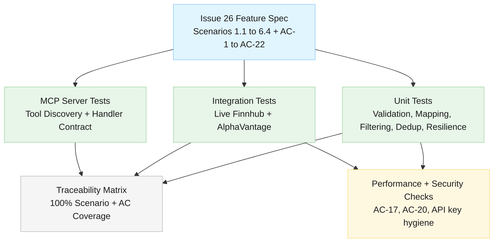

# Test Strategy: Market-Moving Events Feed

<!--
  Template owner: Test Architect
  Output directory: docs/testing/
  Filename convention: issue-26-market-moving-events-test-strategy.md
  Related Issue: #26
-->

## Document Info

- **Feature Spec**: [docs/features/issue-26-market-moving-events.md](../features/issue-26-market-moving-events.md)
- **Architecture**: [Stock Data Aggregation Canonical Architecture](../architecture/stock-data-aggregation-canonical-architecture.md)
- **Security**: [Security Summary](../security/security-summary.md)
- **Status**: Complete
- **Last Updated**: 2026-04-12

---

## Test Strategy Overview

Issue #26 introduces a new MCP tool, `get_market_events`, that merges scheduled macro events and breaking market-moving events from Finnhub and AlphaVantage into a single normalized `MarketEvent` model with validation, filtering, deduplication, and provider fallback.

The strategy prioritizes the testing pyramid:

- Unit-first coverage for validation, defaults, provider mapping, filtering, deduplication, and resilience behavior
- Integration coverage for live provider contracts and UTC/time-format guarantees
- MCP server integration coverage for tool registration/discovery and request/response contracts
- Focused performance and security checks for AC-17, AC-20, and NFR controls

---

## Scope

### In Scope

- `get_market_events` parameter validation and defaulting behavior
- Finnhub economic calendar mapping to `MarketEvent` (`event_type: "scheduled"`)
- AlphaVantage NEWS_SENTIMENT mapping to `MarketEvent` (`event_type: "breaking"`)
- Category and impact-level filtering (including combined AND logic)
- Deduplication correctness and deduplication latency budget checks
- Provider failure handling, fallback behavior, and all-providers-failed error shaping
- Interface extensibility contract via `IMarketEventsProvider`
- Tool discovery and MCP handler-level behavior for `get_market_events`

### Out of Scope

- Real-time push delivery (websocket/streaming)
- Historical archive beyond provider-native windows
- New external provider onboarding in this issue
- UI automation in external MCP clients (manual UAT only)

---

## Test Levels

### Unit Tests

- **Coverage goal**: 100% of blocking ACs; >=90% line coverage for new market-events domain logic
- **Framework**: MSTest v2 (`Microsoft.VisualStudio.TestTools.UnitTesting`)
- **Mocking strategy**: Moq and NSubstitute aligned with existing repository patterns
- **Primary projects**: `StockData.Net.Tests`

### Integration Tests (Live API)

- **Coverage goal**: Validate live provider contract assumptions for scheduled and breaking events
- **Framework**: MSTest v2 with `[TestCategory("Integration")]` + `[TestCategory("LiveAPI")]`
- **Environment gating**:
  - `FINNHUB_API_KEY` required for Finnhub market-events live tests
  - `ALPHAVANTAGE_API_KEY` required for AlphaVantage market-events live tests
  - Missing/invalid keys produce `Assert.Inconclusive` (consistent with existing integration suites)
- **Primary projects**: `StockData.Net.IntegrationTests`

### MCP Server Integration Tests

- **Coverage goal**: Tool registration, discovery visibility, and schema/handler behavior
- **Framework**: MSTest v2 with mocked providers
- **Primary projects**: `StockData.Net.McpServer.Tests`

### Performance Tests

- **Tools**: `System.Diagnostics.Stopwatch` benchmark-style assertions in MSTest
- **Criteria**:
  - Deduplication for <=100 events completes in <=200ms (AC-17)
  - End-to-end tool response budget remains aligned with <=3s NFR under normal conditions

### Security Tests

- **Focus**:
  - No API keys in messages, logs, or returned payloads
  - Investor-friendly failures do not leak stack traces or raw upstream internals
  - Provider credentials are configuration/environment sourced only

### User Acceptance / Manual Verification

- Tool discoverability in MCP client (`tools/list`)
- Real-call user readability of empty-results message and all-providers-failed message
- Spot-check provider attribution and event sort order in client-facing output

---

## Given/When/Then Scenario Coverage

| Spec Scenario | Description | Test Class | Test Method | Test Level | Status |
| --- | --- | --- | --- | --- | --- |
| 1.1 | Fetch 7-day scheduled events with required fields, ascending order | `FinnhubMarketEventsProviderTests` | `GivenFinnhubCalendarData_WhenMappingScheduledEvents_ThenReturnsUtcEventsWithRequiredFieldsSortedAscending` | Unit | Planned |
| 1.2 | Fetch 30-day scheduled events sourced from Finnhub | `MarketEventsIntegrationTests` | `GivenFinnhubApiKey_WhenRequestingThirtyDayScheduledWindow_ThenReturnsFinnhubScheduledEvents` | Integration (LiveAPI) | Planned |
| 1.3 | No events returns empty list with message | `MarketEventsAggregationServiceTests` | `GivenNoProviderEvents_WhenGettingMarketEvents_ThenReturnsEmptyListWithNoEventsMessage` | Unit | Planned |
| 1.4 | Invalid date range returns validation error and no provider call | `MarketEventsQueryValidatorTests` | `GivenFromDateAfterToDate_WhenValidatingQuery_ThenReturnsValidationErrorAndSkipsProviders` | Unit | Planned |
| 2.1 | Breaking events returned from Finnhub/AlphaVantage sorted descending | `MarketEventsAggregationServiceTests` | `GivenBreakingEventsFromProviders_WhenAggregating_ThenReturnsBreakingEventsSortedDescending` | Unit | Planned |
| 2.2 | Same event from two providers appears once with priority source | `MarketEventsDeduplicationTests` | `GivenDuplicateBreakingEventsAcrossProviders_WhenDeduplicating_ThenReturnsSingleEventUsingProviderPriority` | Unit | Planned |
| 2.3 | Missing sentiment remains null | `AlphaVantageMarketEventsProviderTests` | `GivenEventWithoutSentiment_WhenMappingBreakingEvent_ThenSentimentIsExplicitlyNull` | Unit | Planned |
| 2.4 | Finnhub fails and AlphaVantage fallback succeeds | `MarketEventsResilienceTests` | `GivenFinnhubFails_WhenRequestingBreakingEvents_ThenFallsBackToAlphaVantageWithoutUserFacingFailureLeak` | Unit | Planned |
| 3.1 | Category filter `fed` returns only fed events | `MarketEventsFilteringTests` | `GivenMixedCategories_WhenFilteringByFed_ThenReturnsOnlyFedEvents` | Unit | Planned |
| 3.2 | Category `central_bank` excludes fed events | `MarketEventsFilteringTests` | `GivenCentralBankAndFedEvents_WhenFilteringByCentralBank_ThenExcludesFedEvents` | Unit | Planned |
| 3.3 | Omitted category defaults to `all` | `MarketEventsDefaultingTests` | `GivenCategoryOmitted_WhenBuildingQuery_ThenDefaultsCategoryToAll` | Unit | Planned |
| 3.4 | Category filter no match returns empty list and message | `MarketEventsAggregationServiceTests` | `GivenNoEventsMatchCategory_WhenGettingMarketEvents_ThenReturnsEmptyListWithFilterMessage` | Unit | Planned |
| 3.5 | Invalid category returns descriptive validation error | `MarketEventsQueryValidatorTests` | `GivenInvalidCategory_WhenValidatingQuery_ThenReturnsAllowedCategoryValuesError` | Unit | Planned |
| 4.1 | Impact level `high` returns only high | `MarketEventsFilteringTests` | `GivenMixedImpactLevels_WhenFilteringByHigh_ThenReturnsOnlyHighImpactEvents` | Unit | Planned |
| 4.2 | Combined category + impact uses AND logic | `MarketEventsFilteringTests` | `GivenFedAndImpactMix_WhenFilteringByFedAndHigh_ThenReturnsOnlyFedHighEvents` | Unit | Planned |
| 4.3 | Omitted impact_level defaults to `all` | `MarketEventsDefaultingTests` | `GivenImpactLevelOmitted_WhenBuildingQuery_ThenDefaultsImpactLevelToAll` | Unit | Planned |
| 4.4 | Null impact excluded for `high`, included for `all` with null | `MarketEventsFilteringTests` | `GivenEventWithoutImpact_WhenFilteringByHighThenAll_ThenExcludesThenIncludesWithNullImpact` | Unit | Planned |
| 4.5 | Invalid impact_level returns descriptive validation error | `MarketEventsQueryValidatorTests` | `GivenInvalidImpactLevel_WhenValidatingQuery_ThenReturnsAllowedImpactValuesError` | Unit | Planned |
| 5.1 | Duplicate event merged to one result | `MarketEventsDeduplicationTests` | `GivenEquivalentEventsWithinOneHour_WhenDeduplicating_ThenReturnsSingleMergedResult` | Unit | Planned |
| 5.2 | Similar but distinct events are not merged | `MarketEventsDeduplicationTests` | `GivenDistinctTitlesOnSameDate_WhenDeduplicating_ThenKeepsBothEvents` | Unit | Planned |
| 5.3 | Single provider path avoids dedup overhead and returns as-is | `MarketEventsAggregationServiceTests` | `GivenSingleProviderConfigured_WhenAggregating_ThenReturnsProviderEventsWithoutCrossProviderDedup` | Unit | Planned |
| 5.4 | Multi-provider duplicates collapse to one within performance budget | `MarketEventsPerformanceTests` | `GivenThreeProvidersWithDuplicates_WhenDeduplicatingHundredEvents_ThenCompletesUnderTwoHundredMillisecondsAndReturnsSingleCopy` | Unit (Performance) | Planned |
| 6.1 | Finnhub implements `IMarketEventsProvider` mapping contract | `FinnhubMarketEventsProviderTests` | `GivenFinnhubProvider_WhenCheckedAgainstContract_ThenImplementsIMarketEventsProviderAndMapsScheduledFields` | Unit | Planned |
| 6.2 | AlphaVantage implements `IMarketEventsProvider` and breaking mapping | `AlphaVantageMarketEventsProviderTests` | `GivenAlphaVantageProvider_WhenCheckedAgainstContract_ThenImplementsIMarketEventsProviderAndMapsBreakingFields` | Unit | Planned |
| 6.3 | New provider registration via DI/appsettings requires no tool handler change | `MarketEventsMcpServerTests` | `GivenAdditionalMarketEventsProviderRegistered_WhenCallingGetMarketEvents_ThenHandlerAggregatesWithoutCoreModification` | MCP Server Integration | Planned |
| 6.4 | Primary provider timeout does not block secondary provider results | `MarketEventsResilienceTests` | `GivenPrimaryProviderTimeout_WhenAggregating_ThenCircuitBreakerAllowsSecondaryProviderResults` | Unit | Planned |

---

## Acceptance Criteria Coverage (AC-1 to AC-22)

| Acceptance Criteria | Test Class | Test Method | Test Level |
| --- | --- | --- | --- |
| AC-1 | `MarketEventsMcpServerTests` | `GivenServerToolsList_WhenDiscoveringTools_ThenGetMarketEventsIsRegisteredAndCallable` | MCP Server Integration |
| AC-2 | `MarketEventsQueryValidatorTests` | `GivenInvalidCategory_WhenValidatingQuery_ThenReturnsAllowedCategoryValuesError` | Unit |
| AC-3 | `MarketEventsQueryValidatorTests` | `GivenInvalidImpactLevel_WhenValidatingQuery_ThenReturnsAllowedImpactValuesError` | Unit |
| AC-4 | `MarketEventsQueryValidatorTests` | `GivenFromDateAfterToDate_WhenValidatingQuery_ThenReturnsValidationErrorAndSkipsProviders` | Unit |
| AC-5 | `MarketEventsDefaultingTests` | `GivenNoParameters_WhenBuildingQuery_ThenDefaultsToAllAllAndSevenDayUtcWindow` | Unit |
| AC-6 | `MarketEventsIntegrationTests` | `GivenFinnhubApiKey_WhenRequestingScheduledEvents_ThenIncludesScheduledEventTypeFromFinnhub` | Integration (LiveAPI) |
| AC-7 | `FinnhubMarketEventsProviderTests` | `GivenFinnhubCalendarData_WhenMappingScheduledEvents_ThenAllNonNullableMarketEventFieldsArePresent` | Unit |
| AC-8 | `FinnhubMarketEventsProviderTests` | `GivenFinnhubLocalDateAndTime_WhenMappingEvent_ThenNormalizesEventTimeToUtcIso8601WithZ` | Unit |
| AC-9 | `MarketEventsIntegrationTests` | `GivenAlphaVantageApiKey_WhenRequestingBreakingEvents_ThenIncludesBreakingEventTypeFromAlphaVantage` | Integration (LiveAPI) |
| AC-10 | `AlphaVantageMarketEventsProviderTests` | `GivenSentimentScoreRanges_WhenMappingBreakingEvents_ThenMapsToPositiveNegativeNeutral` | Unit |
| AC-11 | `AlphaVantageMarketEventsProviderTests` | `GivenEventWithoutSentiment_WhenMappingBreakingEvent_ThenSentimentIsExplicitlyNull` | Unit |
| AC-12 | `MarketEventsFilteringTests` | `GivenMixedCategories_WhenFilteringByFed_ThenReturnsOnlyFedEvents` | Unit |
| AC-13 | `MarketEventsFilteringTests` | `GivenMixedImpactLevels_WhenFilteringByHigh_ThenReturnsOnlyHighImpactEvents` | Unit |
| AC-14 | `MarketEventsFilteringTests` | `GivenFedAndImpactMix_WhenFilteringByFedAndHigh_ThenReturnsOnlyFedHighEvents` | Unit |
| AC-15 | `MarketEventsDeduplicationTests` | `GivenDuplicateBreakingEventsAcrossProviders_WhenDeduplicating_ThenReturnsSingleEventUsingProviderPriority` | Unit |
| AC-16 | `MarketEventsDeduplicationTests` | `GivenDistinctTitlesOnSameDate_WhenDeduplicating_ThenKeepsBothEvents` | Unit |
| AC-17 | `MarketEventsPerformanceTests` | `GivenThreeProvidersWithDuplicates_WhenDeduplicatingHundredEvents_ThenCompletesUnderTwoHundredMillisecondsAndReturnsSingleCopy` | Unit (Performance) |
| AC-18 | `MarketEventsResilienceTests` | `GivenFinnhubFails_WhenRequestingBreakingEvents_ThenFallsBackToAlphaVantageWithoutUserFacingFailureLeak` | Unit |
| AC-19 | `MarketEventsResilienceTests` | `GivenAllProvidersFail_WhenAggregating_ThenReturnsStructuredInvestorFriendlyErrorPerProvider` | Unit |
| AC-20 | `MarketEventsResilienceTests` | `GivenMarketEventsRequest_WhenCallingProviders_ThenUsesConfiguredResiliencePipelineAndCircuitBreaker` | Unit + Code Review Gate |
| AC-21 | `MarketEventsProviderContractTests` | `GivenMarketEventsProviders_WhenEvaluatingContracts_ThenFinnhubAndAlphaVantageImplementIMarketEventsProvider` | Unit |
| AC-22 | `MarketEventsMcpServerTests` | `GivenProviderAddedViaDI_WhenCallingGetMarketEvents_ThenProviderParticipatesWithoutHandlerCodeChange` | MCP Server Integration |

---

## Test Case Catalog

### Unit Test Suite (`StockData.Net.Tests/`)

#### Query and Defaults

- **Class**: `MarketEventsQueryValidatorTests`
- **Methods**:
  - `GivenInvalidCategory_WhenValidatingQuery_ThenReturnsAllowedCategoryValuesError`
  - `GivenInvalidImpactLevel_WhenValidatingQuery_ThenReturnsAllowedImpactValuesError`
  - `GivenFromDateAfterToDate_WhenValidatingQuery_ThenReturnsValidationErrorAndSkipsProviders`

- **Class**: `MarketEventsDefaultingTests`
- **Methods**:
  - `GivenNoParameters_WhenBuildingQuery_ThenDefaultsToAllAllAndSevenDayUtcWindow`
  - `GivenCategoryOmitted_WhenBuildingQuery_ThenDefaultsCategoryToAll`
  - `GivenImpactLevelOmitted_WhenBuildingQuery_ThenDefaultsImpactLevelToAll`

#### Provider Mapping

- **Class**: `FinnhubMarketEventsProviderTests`
- **Methods**:
  - `GivenFinnhubCalendarData_WhenMappingScheduledEvents_ThenReturnsUtcEventsWithRequiredFieldsSortedAscending`
  - `GivenFinnhubCalendarData_WhenMappingScheduledEvents_ThenAllNonNullableMarketEventFieldsArePresent`
  - `GivenFinnhubImpactValues1To3_WhenMapping_ThenMapsToLowMediumHigh`
  - `GivenFinnhubTitleKeywords_WhenInferringCategory_ThenMapsFedTreasuryGeopoliticalRegulatoryCentralBankInstitutional`
  - `GivenFinnhubLocalDateAndTime_WhenMappingEvent_ThenNormalizesEventTimeToUtcIso8601WithZ`
  - `GivenFinnhubProvider_WhenCheckedAgainstContract_ThenImplementsIMarketEventsProviderAndMapsScheduledFields`

- **Class**: `AlphaVantageMarketEventsProviderTests`
- **Methods**:
  - `GivenAlphaVantageNewsSentimentPayload_WhenMapping_ThenReturnsBreakingEventsWithSourceAlphaVantage`
  - `GivenSentimentScoreRanges_WhenMappingBreakingEvents_ThenMapsToPositiveNegativeNeutral`
  - `GivenEventWithoutSentiment_WhenMappingBreakingEvent_ThenSentimentIsExplicitlyNull`
  - `GivenAlphaVantageProvider_WhenCheckedAgainstContract_ThenImplementsIMarketEventsProviderAndMapsBreakingFields`

#### Filtering, Deduplication, and Resilience

- **Class**: `MarketEventsFilteringTests`
- **Methods**:
  - `GivenMixedCategories_WhenFilteringByFed_ThenReturnsOnlyFedEvents`
  - `GivenCentralBankAndFedEvents_WhenFilteringByCentralBank_ThenExcludesFedEvents`
  - `GivenNoEventsMatchCategory_WhenFiltering_ThenReturnsEmptySet`
  - `GivenMixedImpactLevels_WhenFilteringByHigh_ThenReturnsOnlyHighImpactEvents`
  - `GivenFedAndImpactMix_WhenFilteringByFedAndHigh_ThenReturnsOnlyFedHighEvents`
  - `GivenEventWithoutImpact_WhenFilteringByHighThenAll_ThenExcludesThenIncludesWithNullImpact`

- **Class**: `MarketEventsDeduplicationTests`
- **Methods**:
  - `GivenDuplicateBreakingEventsAcrossProviders_WhenDeduplicating_ThenReturnsSingleEventUsingProviderPriority`
  - `GivenEquivalentEventsWithinOneHour_WhenDeduplicating_ThenReturnsSingleMergedResult`
  - `GivenDistinctTitlesOnSameDate_WhenDeduplicating_ThenKeepsBothEvents`

- **Class**: `MarketEventsResilienceTests`
- **Methods**:
  - `GivenFinnhubFails_WhenRequestingBreakingEvents_ThenFallsBackToAlphaVantageWithoutUserFacingFailureLeak`
  - `GivenAllProvidersFail_WhenAggregating_ThenReturnsStructuredInvestorFriendlyErrorPerProvider`
  - `GivenPrimaryProviderTimeout_WhenAggregating_ThenCircuitBreakerAllowsSecondaryProviderResults`
  - `GivenMarketEventsRequest_WhenCallingProviders_ThenUsesConfiguredResiliencePipelineAndCircuitBreaker`

- **Class**: `MarketEventsAggregationServiceTests`
- **Methods**:
  - `GivenBreakingEventsFromProviders_WhenAggregating_ThenReturnsBreakingEventsSortedDescending`
  - `GivenNoProviderEvents_WhenGettingMarketEvents_ThenReturnsEmptyListWithNoEventsMessage`
  - `GivenNoEventsMatchCategory_WhenGettingMarketEvents_ThenReturnsEmptyListWithFilterMessage`
  - `GivenSingleProviderConfigured_WhenAggregating_ThenReturnsProviderEventsWithoutCrossProviderDedup`

- **Class**: `MarketEventsPerformanceTests`
- **Methods**:
  - `GivenThreeProvidersWithDuplicates_WhenDeduplicatingHundredEvents_ThenCompletesUnderTwoHundredMillisecondsAndReturnsSingleCopy`

- **Class**: `MarketEventsProviderContractTests`
- **Methods**:
  - `GivenMarketEventsProviders_WhenEvaluatingContracts_ThenFinnhubAndAlphaVantageImplementIMarketEventsProvider`

### MCP Server Tests (`StockData.Net.McpServer.Tests/`)

- **Class**: `MarketEventsMcpServerTests`
- **Methods**:
  - `GivenServerToolsList_WhenDiscoveringTools_ThenGetMarketEventsIsRegisteredAndCallable`
  - `GivenAdditionalMarketEventsProviderRegistered_WhenCallingGetMarketEvents_ThenHandlerAggregatesWithoutCoreModification`
  - `GivenProviderAddedViaDI_WhenCallingGetMarketEvents_ThenProviderParticipatesWithoutHandlerCodeChange`

### Integration Tests (`StockData.Net.IntegrationTests/`)

- **Class**: `MarketEventsIntegrationTests`
- **Methods**:
  - `GivenFinnhubApiKey_WhenRequestingScheduledEvents_ThenIncludesScheduledEventTypeFromFinnhub`
  - `GivenFinnhubApiKey_WhenRequestingScheduledEvents_ThenEventTimeUsesUtcIso8601WithZ`
  - `GivenFinnhubApiKey_WhenRequestingScheduledEvents_ThenScheduledEventsHaveRequiredNonNullableFields`
  - `GivenAlphaVantageApiKey_WhenRequestingBreakingEvents_ThenIncludesBreakingEventTypeFromAlphaVantage`
  - `GivenFinnhubAndAlphaVantageKeys_WhenRequestingRecentBreakingWindow_ThenReturnsMostRecentEventsSortedDescending`
  - `GivenFinnhubApiKey_WhenRequestingThirtyDayScheduledWindow_ThenReturnsFinnhubScheduledEvents`

---

## Test Data

- **Unit fixtures**:
  - Deterministic JSON payloads for Finnhub `/calendar/economic` and AlphaVantage `NEWS_SENTIMENT`
  - Synthetic mixed-category/mixed-impact event collections for filtering tests
  - Controlled duplicate/non-duplicate title+time combinations for dedup tests
- **Integration fixtures**:
  - Live provider responses gated behind environment variable checks
  - Date windows selected to maximize probability of scheduled-event presence
- **Isolation and cleanup**:
  - No shared mutable state between tests
  - No persistent external writes; all tests are read-only against provider APIs

---

## CI/CD Integration

- **PR pipeline**:
  - Run all unit and MCP server tests on every PR
  - Enforce scenario/AC traceability review as part of test plan sign-off
- **Credentialed integration stage**:
  - Run LiveAPI category tests when `FINNHUB_API_KEY` and/or `ALPHAVANTAGE_API_KEY` are present
  - Skip with `Assert.Inconclusive` when credentials are unavailable
- **Release gate**:
  - Blocking ACs (AC-1, AC-2, AC-3, AC-4, AC-6, AC-7, AC-8, AC-9, AC-10, AC-12, AC-13, AC-14, AC-15, AC-16, AC-18, AC-19, AC-21) must pass
  - AC-17 and AC-20 require explicit evidence attachment (benchmark output + resilience wiring review)

---

## Coverage Targets

| Metric | Target |
| --- | --- |
| Unit line coverage (new market-events logic) | >= 90% |
| GWT scenario coverage (1.1-6.4) | 100% |
| Acceptance criteria coverage (AC-1 to AC-22) | 100% |
| Blocking AC pass rate | 100% before merge |
| Deduplication performance (<=100 events) | <= 200ms |

---

## Risks and Mitigations

| Risk | Impact | Mitigation |
| --- | --- | --- |
| Live API variability (sparse events, rate limits) | False negatives/flaky integrations | Use `Assert.Inconclusive` gating, bounded windows, and unit test determinism for core assertions |
| Category inference drift from provider wording changes | Misclassification | Keyword mapping unit tests with representative vocabulary sets and regression updates |
| Dedup false positives | Legitimate events dropped | Explicit non-merge tests for similar-but-distinct titles and strict time-window assertions |
| Resilience wiring regressions | Partial outage becomes full outage | Contract tests verifying fallback and all-providers-failed behavior per AC-18/AC-19/AC-20 |

---

## Related Documents

- Feature Specification: [docs/features/issue-26-market-moving-events.md](../features/issue-26-market-moving-events.md)
- Architecture Overview: [docs/architecture/stock-data-aggregation-canonical-architecture.md](../architecture/stock-data-aggregation-canonical-architecture.md)
- Security Design Summary: [docs/security/security-summary.md](../security/security-summary.md)
- Existing Test Strategy References:
  - [docs/testing/issue-32-tier-handling-test-strategy.md](./issue-32-tier-handling-test-strategy.md)
  - [docs/testing/issue-29-finrl-alpaca-provider-test-strategy.md](./issue-29-finrl-alpaca-provider-test-strategy.md)
  - [docs/testing/list-providers-tool-test-strategy.md](./list-providers-tool-test-strategy.md)
