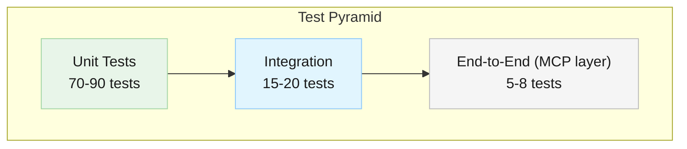
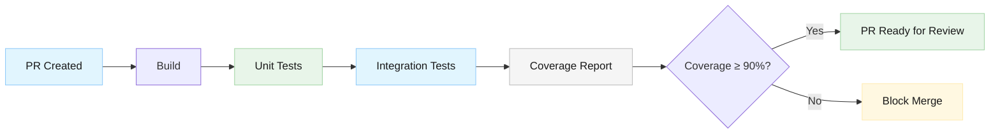

# Test Strategy: Smart Symbol Translation

**Version**: 1.0
**Date**: 2026-03-06
**Status**: Proposed
**Feature Spec**: [docs/features/symbol-translation.md](../features/symbol-translation.md)
**Architecture**: [docs/architecture/components/symbol-translator.md](../architecture/components/symbol-translator.md)
**Security Analysis**: [docs/security/symbol-translation-security.md](../security/symbol-translation-security.md)
**ADR-002**: [docs/architecture/decisions/adr-002-validation-errors-terminal.md](../architecture/decisions/adr-002-validation-errors-terminal.md)

---

## 1. Test Strategy Overview

### 1.1 Scope

This test strategy covers the Smart Symbol Translation feature, which introduces:

- **SymbolTranslator** — a new component that translates market symbols between provider formats
- **Router integration** — translation injected into `StockDataProviderRouter` after provider selection
- **ADR-002 error handling** — `InvalidRequest` terminal error classification for validation failures
- **Security hardening** — input validation, injection prevention, DoS resistance

### 1.2 Test Levels



| Level | Estimated Count | Target Execution Time | Focus |
|---|---|---|---|
| Unit | 70–90 | < 3 seconds | SymbolTranslator logic, mapping integrity, error classification |
| Integration | 15–20 | < 10 seconds | Router + Translator interaction, failover behavior with translation |
| E2E / MCP | 5–8 | < 30 seconds | Full pipeline from MCP tool call through translation to provider |
| Performance | 3–5 | < 5 seconds | Translation latency benchmarks |
| **Total** | **93–123** | **< 48 seconds** | |

### 1.3 Coverage Goals

| Component | Line Coverage Target | Branch Coverage Target |
|---|---|---|
| `SymbolTranslator` | ≥ 95% | ≥ 90% |
| `StockDataProviderRouter` (translation paths) | ≥ 90% | ≥ 80% |
| Error classification (`ClassifyError` changes) | 100% | 100% |
| Overall project | ≥ 90% (maintain existing) | ≥ 65% (improve from 60.3%) |

### 1.4 Tools and Frameworks

| Tool | Purpose |
|---|---|
| MSTest v2 | Test framework (existing project standard) |
| Moq | Mocking `IStockDataProvider`, `ISymbolTranslator`, `IYahooFinanceClient` |
| BenchmarkDotNet or Stopwatch | Performance benchmarks for translation latency |
| `dotnet test --collect:"XPlat Code Coverage"` | Code coverage collection |
| ReportGenerator | Coverage report visualization |

---

## 2. Given/When/Then Traceability Matrix

Every numbered scenario from the feature spec is mapped to one or more test cases below. The **Scenario ID** column references the feature spec numbering (e.g., 1.1 = User Story 1, scenario 1).

### 2.1 User Story 1 — Canonical Name Translation (5 scenarios)

| Scenario | Given/When/Then | Test Case ID | Test Class | Test Method |
|---|---|---|---|---|
| **1.1** | Given Yahoo provider, when "VIX", then translates to "^VIX" | TC-UT-001 | `SymbolTranslatorTests` | `Translate_CanonicalVIX_ToYahoo_ReturnsCaretVIX` |
| **1.2** | Given Yahoo provider, when "GSPC", then translates to "^GSPC" | TC-UT-002 | `SymbolTranslatorTests` | `Translate_CanonicalGSPC_ToYahoo_ReturnsCaretGSPC` |
| **1.3** | Given Yahoo provider, when "DJI", then translates to "^DJI" | TC-UT-003 | `SymbolTranslatorTests` | `Translate_CanonicalDJI_ToYahoo_ReturnsCaretDJI` |
| **1.4** | Given Yahoo provider, when "AAPL" (stock), then passes unchanged | TC-UT-004 | `SymbolTranslatorTests` | `Translate_RegularStock_ToYahoo_PassesThrough` |
| **1.1–1.3** | All canonical names translate and retrieve data (integration) | TC-INT-001 | `RouterTranslationIntegrationTests` | `Router_CanonicalIndexName_TranslatesAndCallsProvider` |

### 2.2 User Story 2 — Provider Format Pass-Through (3 scenarios)

| Scenario | Given/When/Then | Test Case ID | Test Class | Test Method |
|---|---|---|---|---|
| **2.1** | Given Yahoo provider, when "^VIX", then passes unchanged | TC-UT-010 | `SymbolTranslatorTests` | `Translate_YahooFormatVIX_ToYahoo_PassesThroughUnchanged` |
| **2.2** | Given Yahoo provider, when "^GSPC", then passes unchanged | TC-UT-011 | `SymbolTranslatorTests` | `Translate_YahooFormatGSPC_ToYahoo_PassesThroughUnchanged` |
| **2.3** | Given both "VIX" and "^VIX", then both return identical data | TC-INT-002 | `RouterTranslationIntegrationTests` | `Router_CanonicalAndYahooFormat_ProduceIdenticalProviderCalls` |

### 2.3 User Story 3 — Transparent Provider Translation (4 scenarios)

| Scenario | Given/When/Then | Test Case ID | Test Class | Test Method |
|---|---|---|---|---|
| **3.1** | Given Yahoo selected, when any symbol, then converted to Yahoo format | TC-UT-020 | `SymbolTranslatorTests` | `Translate_AnyMappedSymbol_ToYahoo_ReturnsYahooFormat` |
| **3.2** | Given FinViz selected, when "VIX", then converted to "@VX" | TC-UT-021 | `SymbolTranslatorTests` | `Translate_CanonicalVIX_ToFinViz_ReturnsAtVX` |
| **3.3** | Given Yahoo selected, when "@VX" (FinViz), then converted to "^VIX" | TC-UT-022 | `SymbolTranslatorTests` | `Translate_FinVizFormat_ToYahoo_ReturnsYahooFormat` |
| **3.4** | Given no mapping exists for symbol, then passes unchanged | TC-UT-023 | `SymbolTranslatorTests` | `Translate_UnmappedSymbol_ToYahoo_PassesThroughUnchanged` |

### 2.4 User Story 4 — Error Handling (2 scenarios)

| Scenario | Given/When/Then | Test Case ID | Test Class | Test Method |
|---|---|---|---|---|
| **4.1** | Given invalid symbol "!!!INVALID", when provider errors, then clear message | TC-INT-010 | `RouterTranslationIntegrationTests` | `Router_InvalidSymbol_ReturnsArgumentException_NotFailover` |
| **4.2** | Given non-existent symbol, when lookup fails, then "symbol not found" | TC-INT-011 | `RouterTranslationIntegrationTests` | `Router_NonExistentSymbol_ProviderReturnsError` |

### 2.5 User Story 5 — Comprehensive Index Coverage (3 scenarios)

| Scenario | Given/When/Then | Test Case ID | Test Class | Test Method |
|---|---|---|---|---|
| **5.1** | Given deployed, then all major US indices are mapped | TC-UT-030 | `SymbolTranslatorTests` | `Mappings_ContainAllMajorUSIndices` |
| **5.2** | Given deployed, then international indices are mapped | TC-UT-031 | `SymbolTranslatorTests` | `Mappings_ContainAllInternationalIndices` |
| **5.3** | Given deployed, then sector-specific indices are mapped | TC-UT-032 | `SymbolTranslatorTests` | `Mappings_ContainAllSectorIndices` |

### 2.6 User Story 6 — Extensibility (3 scenarios)

| Scenario | Given/When/Then | Test Case ID | Test Class | Test Method |
|---|---|---|---|---|
| **6.1** | Given new provider added, then translator handles it | TC-UT-040 | `SymbolTranslatorTests` | `Translate_NewProviderFormats_AutomaticallyResolved` |
| **6.2** | Given new index added, then translator recognizes it | TC-UT-041 | `SymbolTranslatorTests` | `Translate_NewSymbolEntry_ImmediatelyRecognized` |
| **6.3** | Given C# dictionary, then no config file changes needed | TC-UT-042 | `SymbolTranslatorTests` | `Mappings_AreCompileTimeConstants_NoExternalConfig` |

### 2.7 Traceability Summary

| User Story | Scenario Count | Unit Tests | Integration Tests | Total Coverage |
|---|---|---|---|---|
| US-1: Canonical translation | 4 | 4 | 1 | 5 |
| US-2: Pass-through | 3 | 2 | 1 | 3 |
| US-3: Cross-provider | 4 | 4 | 0 | 4 |
| US-4: Error handling | 2 | 0 | 2 | 2 |
| US-5: Index coverage | 3 | 3 | 0 | 3 |
| US-6: Extensibility | 3 | 3 | 0 | 3 |
| **Total** | **19** | **16** | **4** | **20** |

All 19 Given/When/Then scenarios (18 from user stories + scenario 2.3 which is the 19th scenario in the spec) are covered. No scenario is missing test coverage.

---

## 3. Test Organization

### 3.1 File Structure

```
StockData.Net/
├── StockData.Net.Tests/
│   ├── Providers/
│   │   ├── SymbolTranslatorTests.cs          # Core translation unit tests
│   │   ├── SymbolTranslatorMappingTests.cs   # Mapping integrity & coverage tests
│   │   ├── SymbolTranslatorSecurityTests.cs  # Input validation & injection tests
│   │   └── FailoverTests.cs                  # (existing)
│   ├── StockDataProviderRouterTests.cs       # (existing — add translation tests)
│   └── ...
├── StockData.Net.IntegrationTests/
│   ├── RouterTranslationIntegrationTests.cs  # Router + Translator integration
│   └── ...
```

### 3.2 Test Class Responsibilities

| Class | File | Responsibility |
|---|---|---|
| `SymbolTranslatorTests` | `Providers/SymbolTranslatorTests.cs` | Core translation logic: canonical→Yahoo, passthrough, cross-provider, case normalization, unknown symbols |
| `SymbolTranslatorMappingTests` | `Providers/SymbolTranslatorMappingTests.cs` | Mapping dictionary integrity: all indices present, no duplicates, reverse lookup consistency, all values pass validation |
| `SymbolTranslatorSecurityTests` | `Providers/SymbolTranslatorSecurityTests.cs` | Security attack vectors: null/empty, injection attempts, oversized inputs, Unicode edge cases |
| `StockDataProviderRouterTests` | `StockDataProviderRouterTests.cs` | (existing file, new test group) Router calls translator, null translator backward compat, translated symbol passed to provider |
| `RouterTranslationIntegrationTests` | Integration tests project | End-to-end: MCP-level symbol → translator → router → mock provider |

### 3.3 Naming Conventions

Follow the existing project convention: `MethodUnderTest_Scenario_ExpectedBehavior`

Examples:
- `Translate_CanonicalVIX_ToYahoo_ReturnsCaretVIX`
- `Translate_NullInput_ThrowsArgumentException`
- `ExecuteWithFailoverAsync_InvalidRequest_DoesNotContinueFailover`

---

## 4. Detailed Test Cases by Category

### 4.1 Unit Tests — SymbolTranslator Core Logic

#### 4.1.1 Canonical → Yahoo Translation

| ID | Test Method | Input | Provider | Expected Output | Scenario |
|---|---|---|---|---|---|
| TC-UT-001 | `Translate_CanonicalVIX_ToYahoo_ReturnsCaretVIX` | `"VIX"` | `"yahoo_finance"` | `"^VIX"` | 1.1 |
| TC-UT-002 | `Translate_CanonicalGSPC_ToYahoo_ReturnsCaretGSPC` | `"GSPC"` | `"yahoo_finance"` | `"^GSPC"` | 1.2 |
| TC-UT-003 | `Translate_CanonicalDJI_ToYahoo_ReturnsCaretDJI` | `"DJI"` | `"yahoo_finance"` | `"^DJI"` | 1.3 |
| TC-UT-004 | `Translate_RegularStock_ToYahoo_PassesThrough` | `"AAPL"` | `"yahoo_finance"` | `"AAPL"` | 1.4 |
| TC-UT-005 | `Translate_AllUSMarketIndices_ToYahoo_TranslateCorrectly` | Each of VIX, GSPC, DJI, IXIC, RUT, NDX, NYA, OEX, MID | `"yahoo_finance"` | Corresponding `^` prefix | 1.1–1.3, 5.1 |

#### 4.1.2 Yahoo → Yahoo Pass-Through

| ID | Test Method | Input | Provider | Expected Output | Scenario |
|---|---|---|---|---|---|
| TC-UT-010 | `Translate_YahooFormatVIX_ToYahoo_PassesThroughUnchanged` | `"^VIX"` | `"yahoo_finance"` | `"^VIX"` | 2.1 |
| TC-UT-011 | `Translate_YahooFormatGSPC_ToYahoo_PassesThroughUnchanged` | `"^GSPC"` | `"yahoo_finance"` | `"^GSPC"` | 2.2 |
| TC-UT-012 | `Translate_NoDoubleTranslation` | `"^VIX"` twice | `"yahoo_finance"` | `"^VIX"` (not `"^^VIX"`) | 2.1 |

#### 4.1.3 Cross-Provider Translation

| ID | Test Method | Input | Provider | Expected Output | Scenario |
|---|---|---|---|---|---|
| TC-UT-020 | `Translate_AnyMappedSymbol_ToYahoo_ReturnsYahooFormat` | Various canonical names | `"yahoo_finance"` | Yahoo format | 3.1 |
| TC-UT-021 | `Translate_CanonicalVIX_ToFinViz_ReturnsAtVX` | `"VIX"` | `"finviz"` | `"@VX"` | 3.2 |
| TC-UT-022 | `Translate_FinVizFormat_ToYahoo_ReturnsYahooFormat` | `"@VX"` | `"yahoo_finance"` | `"^VIX"` | 3.3 |
| TC-UT-023 | `Translate_UnmappedSymbol_ToYahoo_PassesThroughUnchanged` | `"AAPL"` | `"yahoo_finance"` | `"AAPL"` | 3.4 |
| TC-UT-024 | `Translate_UnmappedSymbol_ToFinViz_PassesThroughUnchanged` | `"MSFT"` | `"finviz"` | `"MSFT"` | 3.4 |

#### 4.1.4 Case Normalization

| ID | Test Method | Input | Provider | Expected Output | Scenario |
|---|---|---|---|---|---|
| TC-UT-025 | `Translate_LowercaseVIX_ToYahoo_ReturnsCaretVIX` | `"vix"` | `"yahoo_finance"` | `"^VIX"` | Implicit (NFR) |
| TC-UT-026 | `Translate_MixedCaseVIX_ToYahoo_ReturnsCaretVIX` | `"ViX"` | `"yahoo_finance"` | `"^VIX"` | Implicit (NFR) |
| TC-UT-027 | `Translate_LowercaseYahooFormat_ToYahoo_ReturnsCaretVIX` | `"^vix"` | `"yahoo_finance"` | `"^VIX"` | Implicit (NFR) |

#### 4.1.5 Unknown Provider Handling

| ID | Test Method | Input | Provider | Expected Output |
|---|---|---|---|---|
| TC-UT-028 | `Translate_KnownSymbol_UnknownProvider_PassesThroughUnchanged` | `"VIX"` | `"unknown_provider"` | `"VIX"` |

### 4.2 Unit Tests — Mapping Integrity

| ID | Test Method | Verification | Scenario |
|---|---|---|---|
| TC-UT-030 | `Mappings_ContainAllMajorUSIndices` | VIX, GSPC, DJI, IXIC, RUT, NDX, NYA, OEX, MID all present | 5.1 |
| TC-UT-031 | `Mappings_ContainAllInternationalIndices` | FTSE, GDAXI, N225, HSI, SSEC, AXJO, KS11, BSESN all present | 5.2 |
| TC-UT-032 | `Mappings_ContainAllSectorIndices` | SOX, XOI, HUI, XAU all present | 5.3 |
| TC-UT-033 | `Mappings_ContainAllVolatilityIndices` | VIX, VXN, RVX all present | 5.3 |
| TC-UT-034 | `Mappings_ContainAllBondIndices` | TNX, TYX, FVX, IRX all present | 5.3 |
| TC-UT-035 | `Mappings_NoDuplicateProviderFormats` | No two canonical names map to the same Yahoo format value | SR-ST-010 |
| TC-UT-036 | `Mappings_AllValuesWithinLengthLimit` | Every translated value ≤ 10 characters | Security 4.1 |
| TC-UT-037 | `Mappings_ReverseLookupConsistency` | For every `(canonical, format)` pair, reverse lookup of `format` returns `canonical` | SR-ST-012 |
| TC-UT-038 | `Mappings_AllYahooValuesPassValidation` | Every Yahoo format value passes `ValidateTicker()` character/length rules | SR-ST-011 |
| TC-UT-039 | `Mappings_DictionaryIsImmutable` | Mapping cannot be modified at runtime | SR-ST-004 |

### 4.3 Unit Tests — Extensibility

| ID | Test Method | Verification | Scenario |
|---|---|---|---|
| TC-UT-040 | `Translate_NewProviderFormats_AutomaticallyResolved` | Adding a provider format entry makes it resolvable via reverse lookup | 6.1 |
| TC-UT-041 | `Translate_NewSymbolEntry_ImmediatelyRecognized` | Adding a new canonical entry makes it translatable | 6.2 |
| TC-UT-042 | `Mappings_AreCompileTimeConstants_NoExternalConfig` | Assert no file I/O, no config reads in translator constructor | 6.3 |

### 4.4 Unit Tests — Security & Input Validation

Derived from security doc §6.1–6.4, covering all 30+ security scenarios from the security analysis.

#### 4.4.1 Invalid Input Handling

| ID | Test Method | Input | Expected | Security Ref |
|---|---|---|---|---|
| TC-SEC-001 | `Translate_NullInput_ThrowsArgumentException` | `null` | `ArgumentException` | THREAT-ST-1, SR-ST-002 |
| TC-SEC-002 | `Translate_EmptyString_ThrowsArgumentException` | `""` | `ArgumentException` | SR-ST-002 |
| TC-SEC-003 | `Translate_Whitespace_ThrowsArgumentException` | `"   "` | `ArgumentException` | SR-ST-002 |

#### 4.4.2 Injection Attempts (pass through translator, blocked by ValidateTicker)

| ID | Test Method | Input | Expected Translator Output | Expected Final | Security Ref |
|---|---|---|---|---|---|
| TC-SEC-010 | `Translate_SqlInjection_PassesThroughUnchanged` | `"'; DROP TABLE--"` | Same (unmapped) | Rejected by provider validation | THREAT-ST-1 |
| TC-SEC-011 | `Translate_PathTraversal_PassesThroughUnchanged` | `"../../../etc"` | Same (unmapped) | Rejected by provider validation | THREAT-ST-1 |
| TC-SEC-012 | `Translate_CRLFInjection_PassesThroughUnchanged` | `"VIX\r\nHeader: inject"` | Same (unmapped) | Rejected by provider validation | THREAT-ST-1 |
| TC-SEC-013 | `Translate_XSSPayload_PassesThroughUnchanged` | `"<script>alert(1)</script>"` | Same (unmapped) | Rejected by provider validation | THREAT-ST-1 |
| TC-SEC-014 | `Translate_OversizedInput_PassesThroughUnchanged` | 11+ char string | Same (unmapped) | Rejected by provider length check | Security 6.1 |
| TC-SEC-015 | `Translate_UnicodeInput_PassesThroughUnchanged` | `"VÎX"` or fullwidth | Same (unmapped) | Provider returns "not found" | Security 6.1 |

#### 4.4.3 Mapping Integrity — Security

| ID | Test Method | Verification | Security Ref |
|---|---|---|---|
| TC-SEC-020 | `Mappings_NoDuplicateProviderFormats_PreventAmbiguity` | Duplicate values detected and prevented | THREAT-ST-7 |
| TC-SEC-021 | `Mappings_AllTranslatedValues_PassProviderValidation` | Every output passes `ValidateTicker()` rules | THREAT-ST-3 |
| TC-SEC-022 | `Mappings_ImmutableDictionary_CannotBeModifiedAtRuntime` | Runtime modification attempts fail | THREAT-ST-2 |

#### 4.4.4 Error Message Security

| ID | Test Method | Verification | Security Ref |
|---|---|---|---|
| TC-SEC-030 | `ErrorMessages_DoNotLeakProviderFormat` | Error for `"@VX"` does not reveal `"^VIX"` or `"Yahoo"` | THREAT-ST-4 |
| TC-SEC-031 | `ErrorMessages_ReferenceOriginalInput` | Error message contains the user's original symbol | SR-ST-006 |

#### 4.4.5 DoS Resistance

| ID | Test Method | Verification | Security Ref |
|---|---|---|---|
| TC-SEC-040 | `Translate_CasePermutationFlood_AllResolveIdentically` | 1,000 case variants of "VIX" all return "^VIX" | THREAT-ST-5 |
| TC-SEC-041 | `Translate_LargeUnknownSymbolVolume_PassesThroughWithoutError` | 10,000 unmapped symbols processed without exception | THREAT-ST-5 |

### 4.5 Unit Tests — ADR-002: InvalidRequest Terminal Error

| ID | Test Method | Verification | ADR Ref |
|---|---|---|---|
| TC-ADR-001 | `ClassifyError_ArgumentException_ReturnsInvalidRequest` | `ClassifyError(ArgumentException)` = `ProviderErrorType.InvalidRequest` | ADR-002 §Change 2 |
| TC-ADR-002 | `ExecuteWithFailoverAsync_InvalidRequest_DoesNotContinueFailover` | Failover loop stops after first `InvalidRequest`, does not call next provider | ADR-002 §Change 3 |
| TC-ADR-003 | `ExecuteWithFailoverAsync_InvalidRequest_DoesNotRecordHealthFailure` | `ProviderHealthMonitor.RecordFailure` not called for `InvalidRequest` | ADR-002 §Change 3 |
| TC-ADR-004 | `ExecuteWithFailoverAsync_InvalidRequest_RethrowsOriginalException` | Original `ArgumentException` is re-thrown with clear message | ADR-002 §Change 3 |
| TC-ADR-005 | `ExecuteWithAggregationAsync_InvalidRequest_IsTerminal` | Aggregation treats `InvalidRequest` as terminal, not partial failure | ADR-002 §Change 4 |
| TC-ADR-006 | `ClassifyError_HttpRequestException_StillReturnsNetworkError` | Existing classification unchanged for non-argument exceptions | Regression |
| TC-ADR-007 | `ExecuteWithFailoverAsync_NetworkError_StillContinuesFailover` | Non-terminal errors still trigger failover (regression) | Regression |

### 4.6 Integration Tests — Router + Translator

| ID | Test Method | Verification | Scenario |
|---|---|---|---|
| TC-INT-001 | `Router_CanonicalIndexName_TranslatesAndCallsProvider` | Router receives "VIX", provider receives "^VIX" | 1.1–1.3 |
| TC-INT-002 | `Router_CanonicalAndYahooFormat_ProduceIdenticalProviderCalls` | Both "VIX" and "^VIX" result in provider called with "^VIX" | 2.3 |
| TC-INT-003 | `Router_NullTranslator_PassesThroughUnchanged` | With `ISymbolTranslator = null`, ticker unchanged (backward compat) | AC7 |
| TC-INT-004 | `Router_TranslationHappensAfterProviderSelection` | Each provider in failover chain gets its own translated format | 3.1, AC6 |
| TC-INT-005 | `Router_AllMethodsTranslate_GetStockInfo` | `GetStockInfoAsync("VIX")` → provider called with `"^VIX"` | AC1 |
| TC-INT-006 | `Router_AllMethodsTranslate_GetHistoricalPrices` | `GetHistoricalPricesAsync("VIX", ...)` → provider called with `"^VIX"` | AC1 |
| TC-INT-007 | `Router_AllMethodsTranslate_GetNews` | `GetNewsAsync("VIX")` → provider called with `"^VIX"` | AC1 |
| TC-INT-010 | `Router_InvalidSymbol_ReturnsArgumentException_NotFailover` | Invalid symbol → `ArgumentException`, no failover attempt | 4.1, ADR-002 |
| TC-INT-011 | `Router_NonExistentSymbol_ProviderReturnsError` | Unknown symbol passes through, provider returns error | 4.2 |
| TC-INT-012 | `Router_InvalidSymbol_HealthMetricsNotPolluted` | After invalid symbol error, provider health status shows no failure | ADR-002 |

### 4.7 Performance Tests

| ID | Test Method | Verification | NFR |
|---|---|---|---|
| TC-PERF-001 | `Translation_SingleLookup_Under1ms` | Single translation < 1ms | NFR: Performance |
| TC-PERF-002 | `Translation_10000Iterations_P99Under1ms` | p99 latency < 1ms over 10,000 iterations | AC12 |
| TC-PERF-003 | `Translation_MemoryFootprint_Under100KB` | Dictionary memory < 100KB | NFR: Memory |

---

## 5. Test Data Strategy

### 5.1 Symbol Coverage Matrix

Tests must cover the full set of 28 indices across all categories:

| Category | Symbols | Count |
|---|---|---|
| US Market | VIX, GSPC, DJI, IXIC, RUT, NDX, NYA, OEX, MID | 9 |
| International | FTSE, GDAXI, N225, HSI, SSEC, AXJO, KS11, BSESN | 8 |
| Sector/Commodity | SOX, XOI, HUI, XAU | 4 |
| Volatility | VIX, VXN, RVX | 3 (VIX shared with US Market) |
| Bond | TNX, TYX, FVX, IRX | 4 |
| **Unique total** | | **28** |

### 5.2 Edge Case Data

| Category | Test Values |
|---|---|
| Case variations | `"vix"`, `"ViX"`, `"VIX"`, `"^vix"`, `"^ViX"` |
| Regular stocks (passthrough) | `"AAPL"`, `"MSFT"`, `"GOOGL"`, `"SPY"`, `"QQQ"` |
| Known Yahoo format (passthrough) | `"^VIX"`, `"^GSPC"`, `"^DJI"` |
| Cross-provider | `"@VX"` (FinViz → Yahoo) |
| Unknown symbols | `"XYZZY"`, `"FAKE123"` |
| Null/empty/whitespace | `null`, `""`, `"  "`, `" \t\n "` |

### 5.3 Security Attack Vector Data

| Category | Test Values |
|---|---|
| SQL injection | `"'; DROP TABLE--"`, `"1 OR 1=1"`, `"UNION SELECT"` |
| Path traversal | `"../../../etc/passwd"`, `"..\\..\\windows"` |
| CRLF injection | `"VIX\r\nX-Injected: true"` |
| XSS | `"<script>alert(1)</script>"`, `""` |
| Oversized | 11-char string, 100-char string, 1000-char string |
| Unicode | `"VÎX"`, `"ＶＩＸ"` (fullwidth), `"\u0000VIX"` (null byte) |

### 5.4 Test Data Approach

- **Parameterized tests**: Use `[DataRow]` attributes for all symbol-to-translation pairs to avoid test method explosion
- **Bulk mapping validation**: Single test iterates entire mapping dictionary rather than one test per symbol
- **Shared constants**: Define test symbol lists as constants to avoid duplication across test classes

---

## 6. ADR-002 Test Verification Plan

ADR-002 introduces `InvalidRequest` as a terminal error type. The following verifications ensure correct behavior:

### 6.1 Error Classification

| Input | Exception Type | Expected Classification | Failover? | Health Recorded? |
|---|---|---|---|---|
| `""` (empty) | `ArgumentException` | `InvalidRequest` | No — terminal | No |
| `"!!!BAD"` | `ArgumentException` | `InvalidRequest` | No — terminal | No |
| Network timeout | `TaskCanceledException` | `Timeout` | Yes — continue | Yes |
| HTTP 429 | `HttpRequestException` | `RateLimitExceeded` | Yes — continue | Yes |
| HTTP 500 | `HttpRequestException` | `ServiceError` | Yes — continue | Yes |

### 6.2 Behavioral Verification

- **With 3 providers configured**: Invalid symbol produces exactly 1 provider call (not 3) — proves failover is stopped
- **Health monitor assertions**: After invalid symbol error, all provider health statuses remain clean
- **Exception type**: Caller receives `ArgumentException` (not `ProviderFailoverException`)
- **Error message**: Contains original user symbol, is actionable

---

## 7. Backward Compatibility Verification

These tests ensure zero breaking changes to existing consumers:

| Test | Verification |
|---|---|
| Existing `^VIX` queries work | Router + translator with `"^VIX"` produces correct provider call |
| Existing `^GSPC` queries work | Same for S&P 500 |
| Null translator injection | `StockDataProviderRouter(config, providers)` still works (no translator) |
| Existing test suite passes | All 208+ existing tests remain green after changes |
| `ValidateTicker()` unchanged | No modification to existing validation logic |

---

## 8. Test Execution Strategy

### 8.1 CI/CD Integration



### 8.2 Execution Order

1. **Unit tests** run first (fastest feedback, ~3s)
2. **Integration tests** run second (~10s)
3. **Performance benchmarks** run last (not blocking, informational)
4. **Coverage report** generated after all tests complete

### 8.3 Test Commands

```
dotnet test StockData.Net/StockData.Net.Tests/ --filter "ClassName~SymbolTranslator"
dotnet test StockData.Net/StockData.Net.IntegrationTests/ --filter "ClassName~RouterTranslation"
dotnet test --collect:"XPlat Code Coverage"
```

---

## 9. Risk Assessment for Test Gaps

| Risk | Mitigation |
|---|---|
| Mapping dictionary grows beyond tests | `Mappings_AllYahooValuesPassValidation` test iterates entire dictionary dynamically — new entries are auto-covered |
| Future provider formats untested | Test structure supports parameterized provider IDs — add `[DataRow("new_provider")]` |
| Integration test flakiness (timing) | All integration tests use mocked providers — no real HTTP calls, deterministic |
| Performance test environment variance | Use relative benchmarks (assert < 1ms), not absolute timing; run on CI with consistent hardware |

---

## 10. Acceptance Criteria Cross-Reference

| AC | Description | Test Cases Covering It |
|---|---|---|
| AC1 | Canonical names → Yahoo format | TC-UT-001–005, TC-INT-001 |
| AC2 | Yahoo format pass-through | TC-UT-010–012, TC-INT-002 |
| AC3 | All major US indices mapped | TC-UT-030 |
| AC4 | Cross-provider translation | TC-UT-020–024 |
| AC5 | Unrecognized symbols pass-through | TC-UT-004, TC-UT-023–024 |
| AC6 | Translation after provider selection | TC-INT-004 |
| AC7 | Backward compatibility | TC-INT-003, §7 backward compat suite |
| AC8 | International indices | TC-UT-031 |
| AC9 | Sector/commodity indices | TC-UT-032 |
| AC10 | Bond indices | TC-UT-034 |
| AC11 | Documentation examples | Out of test scope (doc review) |
| AC12 | Performance < 1ms | TC-PERF-001–002 |
| AC13 | C# dictionary, not config file | TC-UT-042 |
| AC14 | Multi-provider format support | TC-UT-021, TC-UT-040 |
| AC15 | Extensible for new providers | TC-UT-040–041 |
